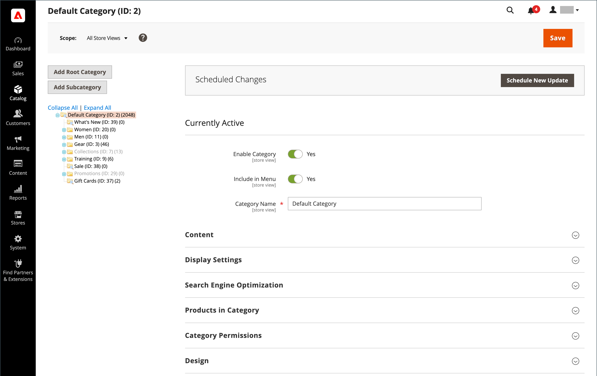

# Menu [!UICONTROL Catalog]

Le menu [!UICONTROL Catalog] permet d’accéder facilement aux outils de création de produits, de catégories et de gestion des stocks, ainsi qu’aux catalogues partagés pour la tarification personnalisée dans les [magasins B2B](https://experienceleague.adobe.com/docs/commerce-admin/b2b/introduction.html).

{width="300" zoomable="yes"}

Dans la barre latérale _Admin_, cliquez sur **[!UICONTROL Catalog]**.

## [!UICONTROL Products]

Créez [products](products-list.md) de chaque type et gérez votre inventaire.

{width="700" zoomable="yes"}

## [!UICONTROL Categories]

Créez la structure [category](categories.md) qui est la base de la navigation de votre magasin.

{width="700" zoomable="yes"}

## [!UICONTROL Shared Catalogs]

Pour les magasins avec Adobe Commerce B2B installé et activé, les [catalogues partagés](https://experienceleague.adobe.com/docs/commerce-admin/b2b/shared-catalogs/catalog-shared.html) vous permettent de proposer des prix personnalisés à différentes entreprises.

{width="700" zoomable="yes"}
