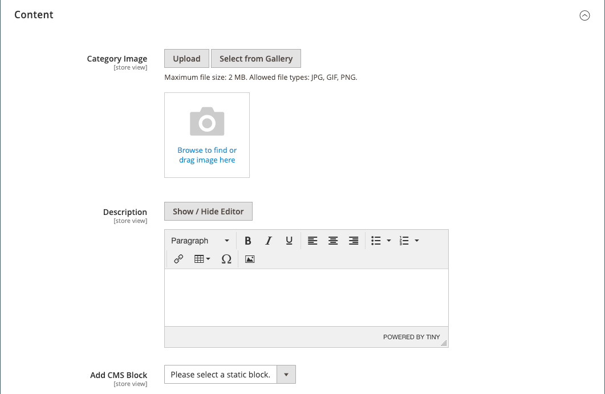

# Catégories - Paramètres Contenu

Les paramètres _[!UICONTROL Content]_&#x200B;déterminent tout contenu supplémentaire qui s’affiche sur la page de catégorie. Outre la liste des produits de catégorie, la page peut inclure une image, une description et un bloc CMS. Vous pouvez utiliser les outils de contenu [[!DNL Page Builder]](../page-builder/introduction.md) pour définir la description de la catégorie.

## Ajoutez la description de la catégorie dans [!DNL Page Builder].

1. Ouvrez la catégorie en mode d’édition.

1. Faites défiler l’écran vers le bas et développez la section  sur **[!UICONTROL Content]** .

   {width="600" zoomable="yes"}

1. En haut à droite de la zone **[!UICONTROL Description]**, cliquez sur **[!UICONTROL Edit with Page Builder]**.

1. Utilisez les outils de contenu [[!DNL Page Builder]](../page-builder/introduction.md) pour [&#x200B; modifier le texte existant &#x200B;](../page-builder/text.md) et ajouter d’autres contenus (si nécessaire).

## [!DNL Page Builder] preview

Lorsque vous développez la section _Contenu_ pour une catégorie existante dans laquelle du contenu est créé avec [!DNL Page Builder], elle affiche un aperçu du contenu **[!UICONTROL Description]** tel qu’il apparaîtra dans la page de catégorie. Cliquez sur la zone de contenu pour ouvrir l’espace de travail [!DNL Page Builder], où vous pouvez effectuer les mises à jour nécessaires.

{width="500" zoomable="yes"}

Par défaut, cet aperçu du contenu est activé pour les formulaires de produit et de catégorie. Si les performances souffrent du chargement de l’aperçu, vous pouvez désactiver l’aperçu dans les paramètres [Configuration de la gestion de contenu](../configuration-reference/general/content-management.md#advanced-content-tools).

## Ajoutez la description de la catégorie dans l’éditeur.

Entrez uniquement des caractères ASCII simples dans la zone de texte. Si vous collez du texte à partir d’un traitement de texte, enregistrez-le d’abord en tant que fichier .TXT simple pour supprimer tous les caractères de contrôle invisibles.

Pour plus d’informations, voir [Éditeur WYSIWYG](../content-design/editor.md).

1. Ouvrez la catégorie en mode d’édition.

1. Faites défiler l’écran vers le bas et développez la section  sur **[!UICONTROL Content]** .

   {width="500" zoomable="yes"}

1. Saisissez la catégorie **[!UICONTROL Description]** et utilisez la [barre d&#39;outils de l&#39;éditeur](../content-design/editor.md) pour la mettre en forme selon vos besoins.

   Vous pouvez faire glisser le coin inférieur droit pour modifier la hauteur de la zone de texte.

## Ajouter un bloc CMS à la page de catégorie

1. Sur la barre latérale _Admin_, accédez à **[!UICONTROL Catalog]** > **[!UICONTROL Categories]**.

1. Dans l&#39;arborescence des catégories, sélectionnez la catégorie à modifier.

1. Développez la section  sur **[!UICONTROL Content]** .

1. Pour **[!UICONTROL Add the CMS block]**, sélectionnez un bloc à ajouter.

1. Développez la section  sur **[!UICONTROL Display Settings]** .

1. Définissez le **[!UICONTROL Display Mode]** sur l’une des options suivantes :

   - `Static block only`
   - `Static block and products`

1. Une fois l’opération terminée, cliquez sur **[!UICONTROL Save]** et passez en revue l’affichage des blocs sur le storefront (nécessite une actualisation du cache).

## Référence des paramètres de contenu

| Paramètre | [Portée](../getting-started/websites-stores-views.md#scope-settings) | Description |
|--- |--- |--- |
| [!UICONTROL Category Image] | Affichage en magasin | Indique une image pour le haut de la page de catégorie. Méthodes :   **[!UICONTROL Upload]**- Télécharge un fichier image de votre ordinateur local vers la galerie et l’utilise comme image de catégorie.  **[!UICONTROL Select from Gallery]** - Vous invite à choisir une image existante dans la galerie.    - Faites glisser un fichier image vers la mosaïque de l’appareil photo ou accédez à l’image et sélectionnez-la dans votre système de fichiers local. |
| [!UICONTROL Description] | Affichage en magasin | Indique une description qui s’affiche sur la page de catégorie.   **[!UICONTROL Edit with Page Builder]**- Ouvre l’ [[!DNL Page Builder] espace de travail](../page-builder/workspace.md) où vous pouvez modifier la description.  **[!UICONTROL Show / Hide Editor]** - Active/désactive l’affichage entre l’éditeur WYSIWYG et les modes HTML. |
| [!UICONTROL Add CMS Block] | Affichage en magasin | Ajoute un [bloc CMS](../content-design/blocks.md) existant à la page de catégorie. |

{style="table-layout:auto"}
