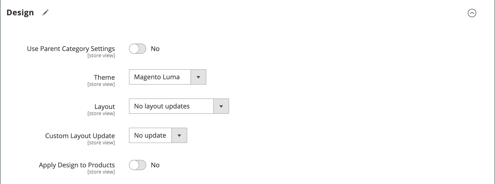

# Catégories - Paramètres de conception

La section _[!UICONTROL Design]_&#x200B;vous permet de contrôler l’aspect d’une catégorie, toutes les pages de produits associées et la mise en page. Vous pouvez personnaliser une page de catégorie et ses produits associés pour une promotion ou pour différencier la catégorie. Par exemple, vous pouvez développer une conception distinctive pour une marque ou une gamme spéciale de produits, ou appliquer une mise à jour pendant une période spécifique.

{width="600" zoomable="yes"}

>[!NOTE]
>
>Lorsqu’un même produit est affecté à plusieurs catégories avec des paramètres de conception différents pour chaque catégorie, il est recommandé de définir **Utiliser le chemin d’accès aux catégories pour les URL de produit** = `Yes` dans les [options de configuration de l’optimisation du moteur de recherche](../configuration-reference/catalog/catalog.md#search-engine-optimization). Pour accéder à ce paramètre, accédez à **[!UICONTROL Stores]** > _[!UICONTROL Settings]_>**[!UICONTROL Configuration]**, développez **[!UICONTROL Catalog]**&#x200B;et choisissez **Catalogue**&#x200B;sous dans le panneau de gauche, puis développez la section **Optimisation du moteur de recherche**&#x200B;sur la page.

| Champ | Description |
|--- |--- |
| [!UICONTROL Use Parent Category Settings] | Permet à la catégorie actuelle d&#39;hériter des paramètres de conception de la catégorie parent. Si vous utilisez cette option, tous les autres champs de la section Conception ne sont plus disponibles. Options : `Yes` / ` No` |
| [!UICONTROL Theme] | Applique un thème personnalisé à la catégorie. |
| [!UICONTROL Layout] | Applique une disposition différente à la page de catégorie. Options :  **[!UICONTROL No layout updates]**- Par défaut, les mises à jour de disposition ne sont pas disponibles pour les pages de catégorie. **[!UICONTROL Empty]** - Utilisez pour définir votre propre mise en page. (Nécessite une compréhension du langage XML.)  **[!UICONTROL 1 column]**- Applique une disposition d’une colonne à la page de catégorie. **[!UICONTROL 2 columns with left bar]** - Applique une disposition à deux colonnes avec une barre latérale gauche à la page de catégorie.  **[!UICONTROL 2 columns with right bar]**- Applique une disposition à deux colonnes avec une barre latérale droite à la page de catégorie. **[!UICONTROL 3 columns]** - Applique une disposition à trois colonnes à la page de catégorie. **[!UICONTROL Page -- Full Width]**- (Nécessite [&#x200B; Page Builder](../page-builder/introduction.md)) Applique la mise en page pleine largeur pour les pages CMS à la page de catégorie. **[!UICONTROL Category -- Full Width]** - (Nécessite Page Builder) Applique la mise en page pleine largeur pour les pages de catégorie à la page de catégorie.  **[!UICONTROL Product -- Full Width]**- (Nécessite Page Builder) Applique la disposition pleine largeur des pages de produits à la page de catégorie. |
| [!UICONTROL Custom Layout Update] | Répertorie les fichiers de mise à jour de disposition personnalisés disponibles sur le serveur. Choisissez la mise à jour de disposition personnalisée que vous souhaitez appliquer à la catégorie. |
| [!UICONTROL Apply Design to Products] | Lorsque cette option est sélectionnée, les paramètres personnalisés s’appliquent à tous les produits de la catégorie. |

{style="table-layout:auto"}

## [!UICONTROL Scheduled Design Update]

{{ce-feature}}

La section _[!UICONTROL Scheduled Design Update]_&#x200B;détermine la plage de dates à laquelle une conception personnalisée est appliquée aux pages de catégorie.

| Champ | Description |
|--- |--- |
| [!UICONTROL Schedule Update From/To] | Détermine la plage de dates lorsqu’une mise en page personnalisée est appliquée à la catégorie. |

{width="600" zoomable="yes"}
