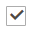

# Affectations de produits de catégorie

Pour une catégorie, utilisez la méthode _[!UICONTROL Products in Category]_pour examiner les produits actuellement affectés à la catégorie. Les filtres de recherche situés en haut de chaque colonne sont utilisés pour ajouter et supprimer des produits de la catégorie. Vous pouvez également utiliser [règles de catégorie](../merchandising-promotions/category-product-rules.md) (  Adobe Commerce uniquement) pour modifier dynamiquement la sélection de produits lorsqu’un ensemble de conditions est satisfait. Pour en savoir plus, voir [Marchandisage visuel](../merchandising-promotions/visual-merchandiser.md)).

>[!TIP]
>
>Lors de la configuration des règles de catégorie, les produits sont _triés_, _correspond à_, _affecté_, et _non attribué_ selon cette règle **_only_** lorsque cette catégorie est enregistrée. Pour vous assurer qu’un nouveau produit est attribué en fonction de la règle lorsque vous l’ajoutez au catalogue, vous **doit réinitialiser chaque catégorie** qui est défini pour correspondre aux produits par règle. En outre, si l’état d’un stock de produits est modifié en `In Stock` ou `Out of Stock` et les produits de la catégorie sont _triés_ en fonction de la variable **Tri automatique** règle, cliquez sur **[!UICONTROL Save Category]**.

{width="600" zoomable="yes"}

>[!NOTE]
>
>Sur les pages de catégorie, `Out of stock` les produits sont toujours affichés. **_after_** `In Stock` produits figurant sur la liste de produits avec tous les types de tri.

>[!NOTE]
>
>La variable _Stock_ La colonne affiche la quantité de produit vendable pour _**plage de catégories sélectionnée**_ uniquement. Lorsque plusieurs stocks sont gérés pour les produits, vous devez basculer entre les portées correspondantes pour afficher d’autres stocks. _Stock_ valeurs de colonne dans la variable _Produits de catégorie_ grid.

## Appliquer une règle de catégorie

{{ee-feature}}

1. Définir **[!UICONTROL Match products by rule]** to `Yes`.

   Les options de tri et de condition automatiques s’affichent.

   {width="600" zoomable="yes"}

1. Définissez la variable **[!UICONTROL Automatic Sorting]** commande.

   Ce tri automatique est basé sur les conditions actuelles.

   - `Stock level` - Déplacer vers le haut ou le bas.
   - `Special price` - Déplacer vers le haut ou le bas.
   - `New Products` - Listez d’abord les produits les plus récents.
   - `Color` - Triez par ordre alphabétique par couleur.
   - `Name` - Tri par ordre croissant ou décroissant selon le nom.
   - `SKU` - Tri par ordre croissant ou décroissant selon le SKU
   - `Price` - Tri par ordre croissant ou décroissant selon le prix.

1. Cliquez sur **[!UICONTROL Add Condition]** et procédez comme suit :

   - Choisissez la **[!UICONTROL Attribute]** c&#39;est la base de la condition.
   - Choisissez la **[!UICONTROL Operator]** obligatoire pour former l’expression.
   - Saisissez le **[!UICONTROL Value]** qui doit correspondre.

   {width="600" zoomable="yes"}

   Répétez cette procédure pour chaque attribut à utiliser pour décrire les conditions à remplir. Par exemple, pour faire correspondre les produits créés il y a 7 à 30 jours, procédez comme suit :

   - Définir **[!UICONTROL Date Created]** to `Less than 30`.
   - Définir **[!UICONTROL Logic]** to `AND`.
   - Définir **[!UICONTROL Date Modified]** to `Greater than 7`.

1. Lorsque vous avez terminé, cliquez sur **[!UICONTROL Save Category]**.

### Options de page

| Option | Description |
|--- |--- |
| [!UICONTROL Match products by rule] | Détermine si la liste des produits de la catégorie est générée dynamiquement par une règle de catégorie. Options : `Yes` / `No` |
| [!UICONTROL Automatic Sorting] | Applique automatiquement un ordre de tri à la liste des produits de la catégorie. Options :  `None` `Move low stock to top` `Move low stock to bottom` `Special price to top` `Special price to bottom` `Newest products first` `Sort by color` `Name: A - Z` `Name: Z - A` `SKU: Ascending` `SKU: Descending` `Price: High to Low` `Price: Low to High` |
| [!UICONTROL Add Condition] | Ajoute une autre condition à la règle. |

{style="table-layout:auto"}

### Conditions de page

| Option | Description |
|--- |--- |
| [!UICONTROL Attribute] | Détermine l’attribut utilisé comme base de la condition. Options :  **[!UICONTROL Clone Category ID(s)]**- Cloner dynamiquement les produits, sans leur tri ni leur ordre, à partir de plusieurs catégories en fonction de l’ID de catégorie. **[!UICONTROL Color]** - Inclut des produits en fonction de leur couleur.  **[!UICONTROL Date Created (days ago)]**- Inclut les produits en fonction du nombre de jours depuis l’ajout des produits au catalogue. **[!UICONTROL Date Modified (days ago)]** - Inclut les produits en fonction du nombre de jours depuis la dernière modification des produits.  **[!UICONTROL Name]**- Inclut des produits en fonction du nom du produit. **[!UICONTROL Price]** - Inclut les produits en fonction du prix.  **[!UICONTROL Quantity]**- Inclut les produits selon la quantité en stock. ** SKU **- Inclut des produits basés sur le SKU. |
| [!UICONTROL Operator] | Indique l’opérateur appliqué à la valeur d’attribut pour remplir la condition. Sauf si un opérateur est spécifié, `Equal` est utilisée par défaut. Options : `Equal` / `Not equal` / `Greater than` / `Greater than or equal to` / `Less than` / `Less than or equal to` / `Contains` |
| [!UICONTROL Value] | Indique la valeur que l’attribut doit avoir pour remplir la condition. |
| [!UICONTROL Logic] | Utilisé pour définir plusieurs conditions et apparaît uniquement lorsqu’une autre condition est ajoutée. Options : `OR` / `AND` |

{style="table-layout:auto"}

>[!NOTE]
>
>La quantité d’un produit configurable avec des options enfants est calculée en combinant toutes les quantités de produit enfant vendables. Prenons un exemple de produit configurable _Char de condition physique de l’endurance_ avec des options de couleur violette, rouge et jaune et différentes quantités de chacune. Dans ce scénario, la quantité du produit parent est la quantité vendue combinée des produits enfants de couleur violet, rouge et jaune.

## Contrôles

## Contrôles de page

{{ee-feature}}

| Contrôle | Description |
|----------|--------------|
|  | Afficher sous forme de liste |
|  | Afficher comme mosaïques |
|  | Correspondance par règle - Non |
|  | Correspondance par règle - Oui |
|  | La commande glisser-déposer permet de saisir un produit et de le déplacer vers une autre position sur la page active de la grille. Pour en savoir plus, voir [Marchandisage visuel](../merchandising-promotions/visual-merchandiser.md). |
|  | Détermine la position du produit dans la liste. |

{style="table-layout:auto"}

## Contrôles de page

{{ce-feature}}

| Contrôle | Description |
|----------|--------------|
|  | Cochez la case dans l’en-tête de la première colonne pour sélectionner tous les produits ou effacer toutes les sélections. Le contrôle de la première ligne détermine le type de recherche et peut être défini pour inclure n’importe quel enregistrement ou n’inclure que les enregistrements attribués ou non à la catégorie. La case à cocher située dans la première colonne de chaque ligne identifie les produits à ajouter à la catégorie. Options : `Yes` / `No` / `Any` |
| [!UICONTROL Search Filters] | Les contrôles de filtre en haut de chaque colonne peuvent être utilisés pour saisir des valeurs spécifiques que vous souhaitez inclure ou omettre dans la liste, selon le paramètre Tout sélectionner . |
| [!UICONTROL Reset Filter] | Efface tous les filtres de recherche. |
| [!UICONTROL Search] | Recherche le catalogue en fonction des critères de filtrage et affiche le résultat. |

{style="table-layout:auto"}
