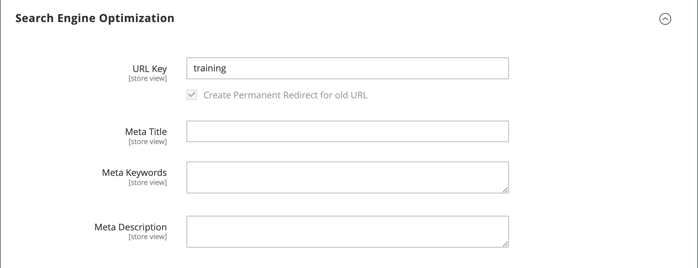

# Catégories - Paramètres d’optimisation du moteur de recherche

La section _[!UICONTROL Search Engine Optimization]_spécifie les champs [Clé URL](catalog-urls.md) et [métadonnées](../merchandising-promotions/meta-data.md) utilisés par les moteurs de recherche pour indexer la catégorie. Bien que certains moteurs de recherche ignorent les méta-mots-clés, d’autres continuent de les utiliser. La bonne pratique actuelle d’optimisation du moteur de recherche consiste à incorporer des mots-clés à forte valeur ajoutée au méta-titre et à la méta-description.

{width="600" zoomable="yes"}

| Champ | [Portée](../getting-started/websites-stores-views.md#scope-settings) | Description |
|--- |--- |----------------------------------------------------|
| [!UICONTROL URL Key] | Affichage de la boutique | Détermine l’adresse en ligne de la page de catégorie. La clé URL est ajoutée à l’URL de base du magasin et apparaît dans la barre d’adresse d’un navigateur. Dans la configuration, vous pouvez inclure ou exclure la clé d’URL de catégorie dans l’URL du produit. La clé de l’URL doit comporter uniquement des caractères minuscules, avec des tirets sans fin entre ces caractères au lieu d’espaces. N’incluez pas de suffixe tel que .html, car il est géré dans la configuration. |
| [!UICONTROL Meta Title] | Affichage de la boutique | Le titre apparaît dans la barre de titre et dans l’onglet de votre navigateur, et est également le titre sur une page de résultats de moteur de recherche (SERP). Le méta-titre doit être propre à la page et doit être long. |
| [!UICONTROL Meta Keywords] | Affichage de la boutique | Mots-clés pertinents pour la catégorie. Pensez à utiliser les mots-clés que les clients peuvent utiliser pour trouver des produits dans la catégorie. |
| [!UICONTROL Meta Description] | Affichage de la boutique | La méta-description fournit un bref aperçu de la page pour les listes de résultats de recherche. La longueur idéale est comprise entre 150 et 160 caractères, avec un maximum de 255 caractères. Bien que cela ne soit pas visible par le client, certains moteurs de recherche incluent la méta-description sur la page des résultats de recherche. |

{style="table-layout:auto"}
