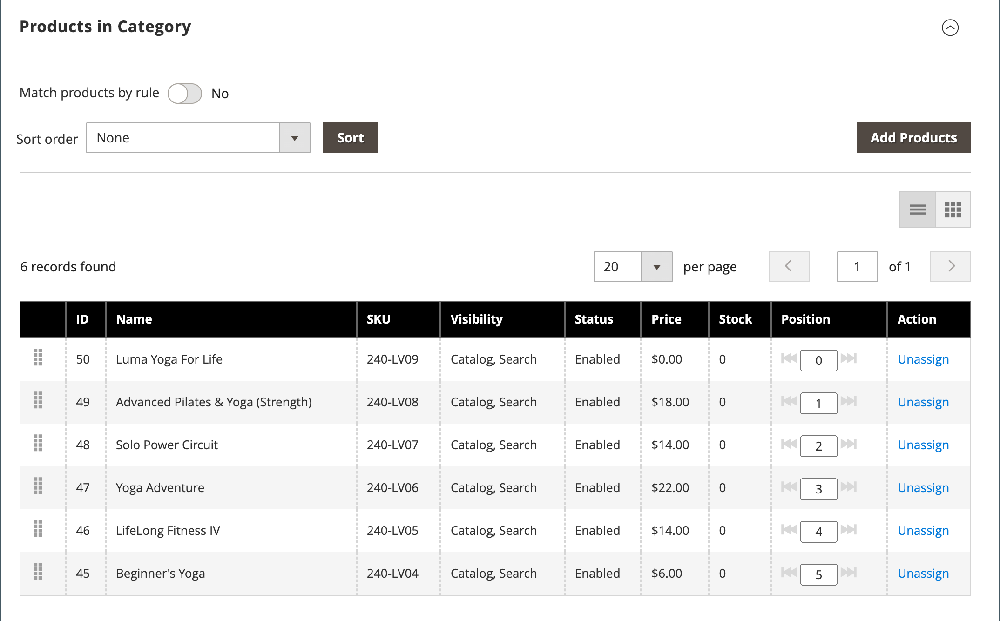

# Créer des catégories

La structure des catégories de votre catalogue s’apparente à une arborescence inversée, avec la racine en haut. Chaque section de l’arborescence peut être développée et réduite. Toutes les catégories désactivées ou masquées sont grisées. Les catégories du premier niveau (sous la [racine](category-root.md)) apparaissent généralement sous la forme d’options dans le [menu principal](navigation-top.md). Vous pouvez créer autant de sous-catégories supplémentaires que nécessaire, en fonction de la profondeur de menu maximale définie dans la configuration. Vous pouvez faire glisser des catégories vers d’autres emplacements de l’arborescence. Le numéro d’ID de catégorie s’affiche entre parenthèses après le nom de la catégorie en haut de la page.

Pour un site web comportant plusieurs [boutiques](../stores-purchase/stores.md#add-stores), vous pouvez créer une catégorie racine différente pour chaque boutique qui définit l’ensemble des catégories utilisées pour la [navigation supérieure](navigation-top.md).

{width="700" zoomable="yes"}

## Bonnes pratiques

Utilisez ces bonnes pratiques lorsque vous planifiez et créez des catégories.

### Structure des catégories

La structure des catégories dans le menu principal peut avoir un impact sur l’expérience client et les performances. Il est recommandé d’identifier une catégorie de niveau supérieur globale et d’éviter de créer d’autres catégories portant le même nom. Par exemple, plutôt que d’avoir plusieurs catégories pour « Enfants » organisées sous différents services, comme `Clothing/Kids`, `Shoes/Kids`, `Accessories/Kids`. Il peut s’avérer plus efficace de créer des `Kids` de catégorie parent de niveau supérieur, puis de créer des sous-catégories selon les besoins ci-dessous. Conservez la cohérence avec la structure des catégories et utilisez la même approche pour tous les types de produits de votre catalogue.

### Règles métier et automatisation

Tenez compte de la structure de catégories et des valeurs d’attribut disponibles lors de l’utilisation de la logique commerciale pour afficher des éléments similaires sur une page de catalogue ou pour configurer une promotion personnalisée, un processus automatisé ou des critères de recherche. Par exemple, si vous spécifiez « polo » comme catégorie parent, les résultats peuvent inclure des produits mixtes non appropriés en fonction du sexe et de l’âge. Cependant, si vous correspondez à une sous-catégorie spécifique de polos, les résultats sont plus étroits et sont susceptibles de plaire à un client spécifique. Les résultats peuvent être encore plus spécifiques lorsqu’ils sont combinés à d’autres valeurs d’attribut qui ciblent un client spécifique. Tenez compte du nombre de produits qui doivent être filtrés et récupérés lors du référencement d’un chemin de catégorie spécifique. La différence de résultats peut être spectaculaire. Tenez compte des différents résultats renvoyés par les chemins d’accès aux catégories suivants :

- `[Category:  All Products/Shirts/Father's Day/Polos/Sale]`
- `[Category Path: Men/Shirts/Polos]`
- `[Child Category: Polos]`

Il est important de définir clairement les relations catégorielles, telles que :

- catégorie parente
- sous-catégorie
- chemin d’accès de la catégorie

Définissez également les mots-clés et attributs associés, tels que :

- disponibilités
- prix de vente
- marque
- taille
- couleur

## Étape 1 : créer une catégorie

1. Dans la barre latérale _Admin_, accédez à **[!UICONTROL Catalog]** > **[!UICONTROL Categories]**.

1. Définissez **[!UICONTROL Store View]** pour déterminer où la nouvelle catégorie doit être disponible.

1. Dans l’arborescence des catégories, sélectionnez la catégorie parent de la nouvelle catégorie.

   Le parent se trouve un niveau au-dessus de la nouvelle catégorie.

   Si vous commencez sans données, il se peut que la liste ne contienne que deux catégories : _Catégorie par défaut_, qui est la racine, et une _Catégorie d’exemple_

1. Cliquez sur **[!UICONTROL Add Subcategory]**.

## Étape 2 : compléter les informations de base

1. Si vous souhaitez que la catégorie soit immédiatement disponible dans le magasin, définissez **[!UICONTROL Enable Category]** sur `Yes`.

1. Pour inclure la catégorie dans la [navigation supérieure](navigation-top.md), définissez **[!UICONTROL Include in Menu]** sur `Yes`.

1. Saisissez le **[!UICONTROL Category Name]**.

   {width="500" zoomable="yes"}

1. cliquez sur **[!UICONTROL Save]** et continuez.

## Étape 3 : remplir le contenu de la catégorie

1. Développez  la section **[!UICONTROL Content]** .

   {width="600" zoomable="yes"}

1. Pour afficher une **[!UICONTROL Category Image]** en haut de la page, vous pouvez charger votre propre image ou utiliser une image qui existe dans le [stockage de médias](../content-design/media-storage.md).

   - Pour charger votre propre image, cliquez sur **[!UICONTROL Upload]** et sélectionnez l’image que vous souhaitez représenter dans la catégorie.

   - Pour utiliser des images à partir du stockage de médias, cliquez sur **[!UICONTROL Select from Gallery]** et sélectionnez l’image que vous souhaitez représenter la catégorie.

   Dans la Galerie de médias, vous pouvez également utiliser l’intégration [Adobe Stock](../content-design/adobe-stock.md) pour rechercher une image appropriée en cliquant sur **[!UICONTROL Search Adobe Stock]**.

   >[!NOTE]
   >
   > Si AEM Assets est activé, voir [Gérer les catégories](../content-design/aem-assets-manage.md) pour plus d’informations.

1. Par **[!UICONTROL Description]**, saisissez le texte ou tout autre contenu qui doit apparaître sur la page de destination de la catégorie.

   Pour plus d’informations, voir [Contenu de catégorie](categories-content-settings.md).

1. Pour inclure un bloc de contenu sur la page de destination de la catégorie, choisissez le **[!UICONTROL CMS Block]** qui doit apparaître.

1. Cliquez sur **[!UICONTROL Save]** et continuez.

## Étape 4 : remplir les paramètres d&#39;affichage

1. Développez  la section **[!UICONTROL Display Setting]** .

   {width="600" zoomable="yes"}

   Pour plus d’informations sur ces options, voir [Paramètres d’affichage](categories-display-settings.md).

1. Définissez **[!UICONTROL Display Mode]** sur l’une des options suivantes :

   - `Products Only`
   - `Static Block Only`
   - `Static Block and Products`

1. Si vous souhaitez que la page de catégorie inclue la section _`Filter by Attribute`_de la navigation superposée, définissez **[!UICONTROL Anchor]**sur `Yes`.

1. Pour les options de **[!UICONTROL Available Product Listing Sort By]**, sélectionnez une ou plusieurs des valeurs disponibles pour que les clients puissent trier la liste. Ce paramètre ne s’applique pas au [!DNL Live Search] [widget de page de liste de produits](https://experienceleague.adobe.com/en/docs/commerce-merchant-services/live-search/live-search-storefront/plp-styling).

   Par défaut, toutes les valeurs disponibles sont incluses. Décochez la case **[!UICONTROL Use All]** pour modifier les sélections. Par exemple, les valeurs peuvent inclure :

   - `Position`
   - `Product Name`
   - `Price`

1. Pour définir l’ordre de tri par défaut de la catégorie, choisissez la valeur **[!UICONTROL Default Product Listing Sort By]** . Ce paramètre ne s’applique pas au [!DNL Live Search] [widget de page de liste de produits](https://experienceleague.adobe.com/en/docs/commerce-merchant-services/live-search/live-search-storefront/plp-styling).

1. Pour modifier le paramètre de navigation par couches par défaut [étape de prix](navigation-layered.md#configure-price-navigation), procédez comme suit :

   - Décochez la case **[!UICONTROL Use Config Settings]** .

   - Saisissez la valeur à utiliser comme étape de prix incrémentiel pour la navigation par couches.

1. Cliquez sur **[!UICONTROL Save]** et continuez.

## Étape 5 : définition des paramètres d’optimisation du moteur de recherche

1. Développez  la section **[!UICONTROL Search Engine Optimization Settings]** .

   {width="600" zoomable="yes"}

   Pour plus d’informations sur ces options, voir [Optimisation du moteur de recherche](categories-search-engine-optimization.md).

1. Renseignez les [métadonnées](../merchandising-promotions/meta-data.md) suivantes pour la catégorie :

   - [!UICONTROL Meta Title]
   - [!UICONTROL Meta Keywords]
   - [!UICONTROL Meta Description]

1. Cliquez sur **[!UICONTROL Save]** et continuez.

## Etape 6 : sélection des produits dans la catégorie

1. Développez  la section **[!UICONTROL Products in Category]** .

   {width="600" zoomable="yes"}

   Pour plus d’informations sur ces options, voir [ Produits dans la catégorie ](categories-product-assignments.md).

1. Si nécessaire, utilisez les [filtres](../getting-started/admin-grid-controls.md) pour rechercher les produits.

   Pour afficher tous les enregistrements qui ne sont pas encore inclus dans la catégorie, définissez le sélecteur d’enregistrements dans la première colonne sur `No` et cliquez sur **[!UICONTROL Search]**.

1. Dans la première colonne, cochez la case de chaque produit à inclure dans la catégorie.

1. Cliquez sur **[!UICONTROL Save]** et continuez.

## Étape 7 : définir les autorisations de catégorie

{{ee-feature}}

1. Développez  la section **[!UICONTROL Category Permissions]** .

1. Pour une installation multisite, choisissez l’**[!UICONTROL Website]** où s’appliquent les autorisations de catégorie.

1. Sélectionnez la **[!UICONTROL Customer Group]** où s’appliquent les autorisations de catégorie.

    ([Adobe Commerce B2B](../b2b/introduction.md) uniquement) Si nécessaire, vous pouvez choisir un **[!UICONTROL Shared Catalog]** à la place.

1. Définissez les autorisations suivantes selon vos besoins :

   - [!UICONTROL Browsing Category]
   - [!UICONTROL Display Product Prices]
   - [!UICONTROL Add to Cart]

1. Pour ajouter une autre règle d’autorisation, cliquez sur **[!UICONTROL New Permission]** et répétez le processus.

   {width="600" zoomable="yes"}

## Étape 8 : définition des paramètres de conception

1. Développez  la section **[!UICONTROL Design]** .

1. Définissez les paramètres de conception selon vos besoins :

   - ([Adobe Commerce B2B](../b2b/introduction.md) uniquement) Pour appliquer les paramètres de conception de la catégorie parente à cette catégorie, définissez **[!UICONTROL Use Parent Category Settings]** sur `Yes`.

   - Pour modifier la conception des pages de catégorie, choisissez la **[!UICONTROL Theme]** à appliquer.

   - Pour modifier la disposition des colonnes des pages de catégories, choisissez la **[!UICONTROL Layout]** à appliquer.

   - Pour saisir un code personnalisé, saisissez un code XML valide dans la zone de **[!UICONTROL Layout Update XML]**.

   - Pour utiliser la même conception pour les pages de produit, définissez **[!UICONTROL Apply Design to Products]** sur `Yes`.

   {width="600" zoomable="yes"}

1.  (Magento Open Source uniquement) Pour planifier la mise à jour de la conception pour une période spécifique, procédez comme suit :

   - Développez la section _[!UICONTROL Schedule Design Update]_.

   - Utilisez le calendrier () pour choisir les dates **[!UICONTROL from]** et **[!UICONTROL to]** de la mise à jour planifiée.

   {width="600" zoomable="yes"}

1. Cliquez ensuite sur **[!UICONTROL Save]**.
