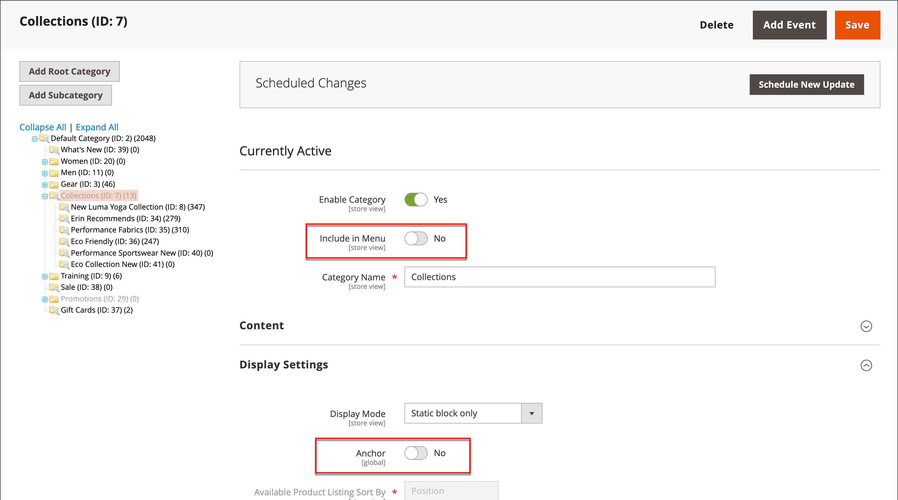

# Catégories masquées

Il existe de nombreuses façons d’utiliser des catégories masquées. Vous pouvez créer des niveaux de catégorie supplémentaires à des fins internes, mais n’afficher que les catégories de niveau supérieur à vos clients. Vous pouvez également créer un lien vers une catégorie qui n’est pas incluse dans le menu de navigation.

## Créer des catégories masquées

1. Sur la barre latérale _Admin_, accédez à **[!UICONTROL Catalog]** > **[!UICONTROL Categories]**.

1. Dans l&#39;arborescence des catégories, sélectionnez la catégorie à masquer et procédez comme suit :

   - Définissez **[!UICONTROL Is Active]** sur `Yes`.
   - Définissez **[!UICONTROL Include in Menu]** sur `No`.

1. Dans la section **[!UICONTROL Display Settings]**, définissez **[!UICONTROL Anchor]** sur `No`.

   {width="600" zoomable="yes"}

   La catégorie masquée est active, mais n’apparaît pas dans le menu supérieur ni dans la navigation par couches.

1. Définissez les paramètres suivants pour chaque sous-catégorie masquée afin de créer des sous-catégories :

   >[!NOTE]
   >
   >Bien que la catégorie soit masquée, vous pouvez créer des sous-catégories en dessous et les rendre actives.

   - Définissez **[!UICONTROL Enable Category]** sur `Yes`.
   - Dans la section **[!UICONTROL Display Settings]**, définissez **[!UICONTROL Anchor]** sur `Yes`.

   En tant que catégories actives, vous pouvez désormais les lier à partir d’autres emplacements de votre boutique, mais ils n’apparaissent pas dans le menu.

1. Une fois l’opération terminée, cliquez sur **[!UICONTROL Save]**.
