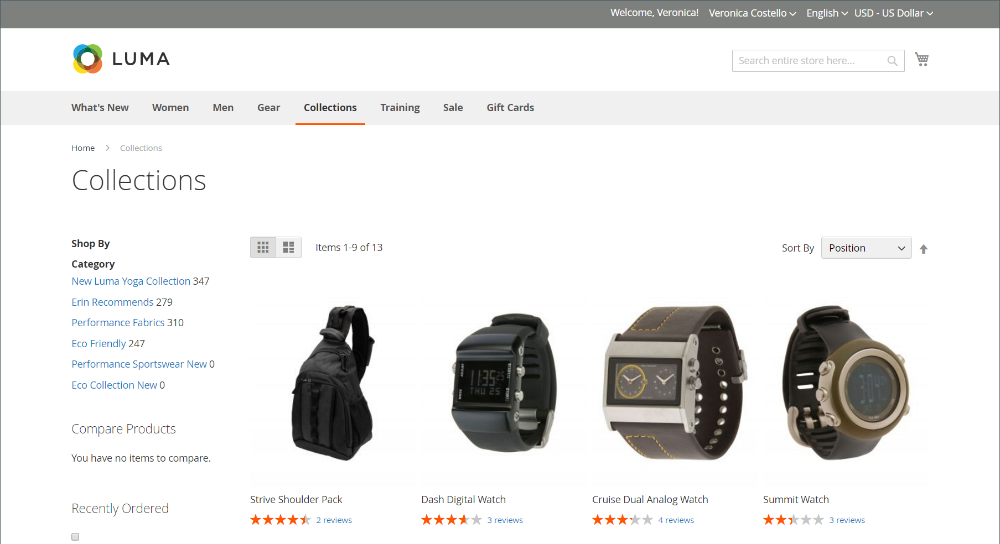
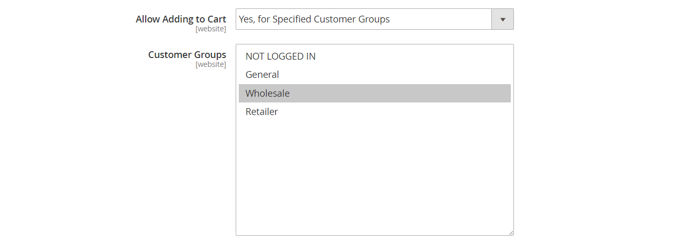
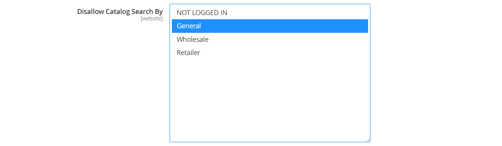

# Autorisations de catégorie

{{ee-feature}}

L’accès aux catégories peut être limité à des groupes de clients spécifiques ou être entièrement restreint. Vous pouvez contrôler l’affichage des prix des produits, déterminer quels groupes de clients peuvent ajouter des produits au panier et spécifier la page de destination.

>[!NOTE]
>
>Les autorisations de catégorie ont une portée globale. Lorsqu’elles sont activées, elles limitent l’accès à chaque catégorie en fonction de ses autorisations individuelles. Par défaut, les autorisations de catégorie ne sont pas activées.

Par exemple, si vous vendez uniquement aux clients en gros, vous pouvez autoriser n’importe qui à parcourir le catalogue, mais afficher les prix et autoriser les achats uniquement pour les acheteurs du groupe de clients _en gros_. Dans l’exemple suivant, seuls les utilisateurs connectés ont accès à la catégorie « Collections ». Pour les invités, l&#39;option « Collections » n&#39;apparaît pas dans le menu principal.

{width="600" zoomable="yes"}

Une fois activée, une nouvelle section _[!UICONTROL Category Permissions]_&#x200B;s’affiche sur la page Catégorie , ce qui vous permet d’appliquer l’accès nécessaire pour chaque catégorie. Vous pouvez ajouter plusieurs règles d’autorisation à chaque catégorie pour différents sites web et groupes de clients.

## Étape 1 : Configurer les autorisations de catégorie

>[!IMPORTANT]
>
>Toutes les [paramètres d’autorisation de groupe](../configuration-reference/catalog/catalog.md#category-permissions) existantes sont ignorées par les catégories **_all_** du catalogue lorsque la fonction **_[!UICONTROL Shared Catalog]_** est activée. [!UICONTROL Shared Catalog] contrôle entièrement toutes les autorisations de catégorie du catalogue lorsqu’il est activé.

1. Dans la barre latérale _Admin_, accédez à **[!UICONTROL Stores]** > _[!UICONTROL Settings]_>**[!UICONTROL Configuration]**.

1. Dans le panneau de gauche, développez **[!UICONTROL Catalog]** et choisissez **[!UICONTROL Catalog]** en dessous.

1. Développez  la section **[!UICONTROL Category Permissions]** .

   {width="600" zoomable="yes"}

   Pour obtenir la liste détaillée de ces options, voir [Autorisations de catégorie](../configuration-reference/catalog/catalog.md#category-permissions) dans le _Guide de référence de configuration_.

1. Définissez **[!UICONTROL Enable]** sur `Yes`.

1. Renseignez les autres options en fonction de ce que vous souhaitez autoriser ou restreindre dans votre boutique (voir les sections suivantes).

1. Cliquez ensuite sur **[!UICONTROL Save Config]**.

1. Lorsque vous êtes invité à mettre à jour le cache, cliquez sur le lien **[!UICONTROL Cache Management]** dans le message système et suivez les instructions pour actualiser le cache.

### [!UICONTROL Allow Browsing Category]

Cette option s’applique à toutes les catégories du [site web](../getting-started/websites-stores-views.md).

Pour permettre aux membres d’un **_groupe de clients spécifique_** de parcourir les produits de catégorie, procédez comme suit :

1. Définissez **[!UICONTROL Allow Browsing Category]** sur `Specified Customer Groups`.

1. Dans la zone de **[!UICONTROL Customer Groups]**, sélectionnez chaque groupe autorisé à parcourir les produits de la catégorie.

   Pour sélectionner plusieurs groupes, maintenez la touche Ctrl (PC) ou Commande (Mac) enfoncée tout en cliquant sur chaque groupe.

   {width="600" zoomable="yes"}

Pour **_restreindre l’accès et rediriger vers une page de destination_** procédez comme suit :

1. Définissez **[!UICONTROL Allow Browsing Category]** sur `No, Redirect to Landing Page`.

1. Choisissez le **[!UICONTROL Landing Page]** vers lequel les visiteurs sont redirigés.

   {width="600" zoomable="yes"}

   >[!NOTE]
   >
   >Bien que le paramètre _[!UICONTROL Allow Browsing Category]_&#x200B;s’applique à toutes les catégories du site web, vous pouvez configurer une page de destination différente pour chaque vue de magasin.

### [!UICONTROL Display Product Prices]

Cette option s’applique à toutes les catégories du [site web](../getting-started/websites-stores-views.md).

Pour autoriser uniquement les membres de **_groupes de clients spécifiques_** à voir le prix des produits de la catégorie, procédez comme suit :

1. Définissez **[!UICONTROL Display Product Prices]** sur `Yes, for Specified Customer Groups`.

1. Dans la zone de **[!UICONTROL Customer Groups]**, sélectionnez chaque groupe autorisé à voir le prix des produits de la catégorie.

   Pour sélectionner plusieurs groupes, maintenez la touche Ctrl (PC) ou Commande (Mac) enfoncée tout en cliquant sur chaque groupe.)

   {width="600" zoomable="yes"}

### [!UICONTROL Allow Adding to Cart]

Cette option s’applique à toutes les catégories du [site web](../getting-started/websites-stores-views.md).

Pour autoriser uniquement les membres de **_groupes de clients spécifiques_** à placer des produits de catégorie dans le panier, procédez comme suit :

1. Définissez **[!UICONTROL Allow Adding to Cart]** sur `Yes, for Specified Customer Groups`.

1. Dans la zone de **[!UICONTROL Customer Groups]**, sélectionnez chaque groupe autorisé à ajouter des produits de la catégorie au panier.

   Pour sélectionner plusieurs groupes, maintenez la touche Ctrl (PC) ou Commande (Mac) enfoncée tout en cliquant sur chaque groupe.

   {width="600" zoomable="yes"}

### [!UICONTROL Disallow Catalog Search]

Définissez cette option pour empêcher les membres d’un groupe de clients spécifique d’utiliser la recherche catalogue. Elle s’applique à toutes les catégories du [site web](../getting-started/websites-stores-views.md).

- Pour autoriser **_uniquement les clients connectés_** à utiliser la recherche catalogue, sélectionnez `NOT LOGGED IN`.

- Pour autoriser **_uniquement des groupes de clients spécifiques_** à utiliser la recherche catalogue, sélectionnez chaque groupe à exclure de l’utilisation de la recherche par catégorie.

  Pour sélectionner plusieurs groupes, maintenez la touche Ctrl (PC) ou Commande (Mac) enfoncée tout en cliquant sur chaque groupe.

  {width="600" zoomable="yes"}

## Étape 2 : appliquer les autorisations de catégorie

1. Dans la barre latérale _Admin_, accédez à **[!UICONTROL Catalog]** > **[!UICONTROL Categories]**.

1. Dans l’arborescence des catégories, sélectionnez la catégorie cible.

1. Développez  **[!UICONTROL Category Permissions]** sur la page et procédez comme suit :

   - Pour créer une règle d’autorisations, cliquez sur **[!UICONTROL New Permission]**.

     {width="600" zoomable="yes"}

   - Choisissez les **[!UICONTROL Website]** et **[!UICONTROL Customer Group]** applicables.

   - Définissez les autorisations individuelles selon vos besoins.

   >[!NOTE]
   >
   >Lorsque l’autorisation `Browsing Category` = `Deny` est définie pour une catégorie parent, elle ne s’affiche pas sur le [chemin de navigation](navigation-breadcrumb-trail.md) sur la page de catégorie enfant.

1. Cliquez ensuite sur **[!UICONTROL Save]**.

>[!NOTE]
>
>Si des autorisations **_Autoriser_** sont définies pour le `Root Category`, elles sont automatiquement appliquées à toutes les sous-catégories et à tous les produits du `Catalog`. Si un produit est affecté à plusieurs catégories et s’il dispose d’autorisations **_Autoriser_** pour au moins une catégorie, il dispose automatiquement des mêmes autorisations **_Autoriser_** pour toutes les catégories affectées.
