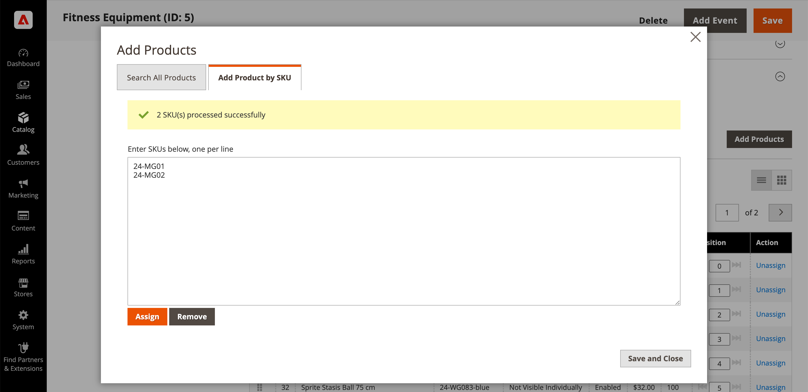

# Ajout et suppression de produits de catégorie

À partir de la section [Produits dans la catégorie](categories-product-assignments.md), un administrateur de magasin peut ajouter des produits à la catégorie. Cette section répertorie tous les produits affectés à la catégorie et affiche **[!UICONTROL Add Product]** lorsque **[!UICONTROL Match products by rule]** est défini sur `No`.

{width="600" zoomable="yes"}

## Rechercher des produits à ajouter

1. Sur la barre latérale _Admin_, accédez à **[!UICONTROL Catalog]** > **[!UICONTROL Categories]**.

1. Dans l’arborescence de gauche, sélectionnez la catégorie dans laquelle vous souhaitez ajouter un produit.

1. Développez la section  _Produits dans la catégorie_ .

1. Cliquez sur **[!UICONTROL Add Products]**.

1. Utilisez _Rechercher par mot-clé_ ou des filtres pour trouver les produits à ajouter.

   {width="700" zoomable="yes"}

1. Dans la colonne _[!UICONTROL Assign]_, faites basculer l’option sur `Yes` pour chaque produit à ajouter.

   Si vous souhaitez inclure tous les produits affichés, vous pouvez cliquer sur la flèche de menu dans l’en-tête de colonne et choisir **[!UICONTROL Select All]**.

1. Pour appliquer vos modifications, cliquez sur **[!UICONTROL Save and Close]**.

### Actions

| Action | Description |
|--- |--- |
| [!UICONTROL Select All] | Coche la case de tous les enregistrements de la liste. |
| [!UICONTROL Unselect All] | Efface la case à cocher de tous les enregistrements de la liste. |
| [!UICONTROL Select All on This Page] | Coche la case des enregistrements de la page active. |
| [!UICONTROL Deselect All on This Page] | Efface la case à cocher des enregistrements sur la page active. |

{style="table-layout:auto"}

## Ajout de produits par SKU

1. Cliquez sur **[!UICONTROL Add Products]**

1. Sélectionnez l’onglet **[!UICONTROL Add Products by SKU]** .

1. Saisissez les SKU (une par ligne) et cliquez sur **[!UICONTROL Assign]**.

   Pour annuler les modifications, cliquez sur **[!UICONTROL Remove]**.

   {width="700" zoomable="yes"}

1. Pour appliquer vos modifications, cliquez sur **[!UICONTROL Save and Close]**.

## Suppression de produits d’une catégorie

1. Sur la barre latérale _Admin_, accédez à **[!UICONTROL Catalog]** > **[!UICONTROL Categories]**.

1. Dans l&#39;arborescence de gauche, choisissez la catégorie à modifier.

1. Développez la section  sur _[!UICONTROL Products in Category]_.

1. Recherchez les produits à supprimer.

1. Dans la colonne _[!UICONTROL Actions]_, cliquez sur **[!UICONTROL Unassign]**.

1. Pour appliquer vos modifications, cliquez sur **[!UICONTROL Save]**.
