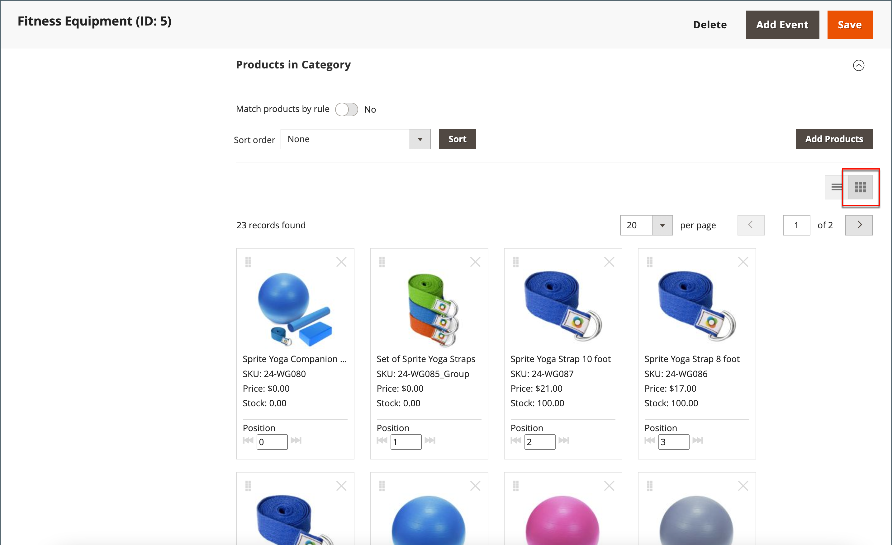
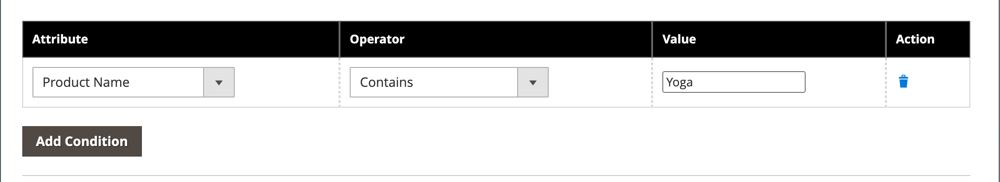

# Trier les produits de catégorie

{{ee-feature}}

La position des produits d’une catégorie peut être spécifiée manuellement en les faisant glisser et en les déposant en position ou en appliquant un ordre de tri prédéfini. Par défaut, les produits peuvent être triés par niveau de stock, âge, couleur, nom, SKU et prix. Le tri automatique remplace l’ordre de tri actuel et réinitialise les positions de glisser-déposer qui ont été définies manuellement. L’ordre de tri des couleurs et le niveau de stock minimal requis pour que les produits soient inclus dans la liste sont définis dans la variable [Marchandisage visuel](../configuration-reference/catalog/visual-merchandiser.md) configuration.

>[!NOTE]
>
>Sur les pages de catégorie, `Out of stock` les produits sont toujours affichés. **_after_** `In Stock` produits figurant sur la liste de produits avec tous les types de tri.

Vous pouvez configurer les options de catégorie séparément pour chaque [vue de magasin](../stores-purchase/stores.md#add-stores) pour déterminer la sélection des produits, leur position relative dans la liste et les attributs disponibles pour les règles de catégorie. Cependant, il existe un seul, **_global_** l’ordre de tri et la position du produit dans le catalogue ; ils sont partagés dans tous les [vues du magasin](../stores-purchase/store-views.md), magasins et sites web.

## Etape 1 : définir la portée de la configuration

1. Sur le _Administration_ barre latérale, accédez à **[!UICONTROL Catalog]** > **[!UICONTROL Categories]**.

1. Si nécessaire, choisissez la **[!UICONTROL Store View]** où les paramètres s’appliquent.

   Pour une installation multi-magasin, la variable _[!UICONTROL Store View]_applique l’ordre de tri à toutes les vues disponibles dans le magasin.

1. Dans l&#39;arborescence de gauche, choisissez la catégorie à modifier.

   {width="700" zoomable="yes"}

## Étape 2 : trier les produits

>[!NOTE]
>
>Lors du tri d’une catégorie selon un attribut de produit, les produits ayant les mêmes valeurs d’attribut sont également triés selon leur _[!UICONTROL Product ID]_dans l’ordre croissant.

Dans le _[!UICONTROL Products in Category]_, cliquez sur les mosaïques (  ) pour afficher les mosaïques de produit dans une grille. Utilisez la méthode manuelle ou automatique pour trier les produits.

{width="600" zoomable="yes"}

### Méthode 1 : tri manuel

1. Définir **[!UICONTROL Sort Order]** selon vos préférences.

   {width="600" zoomable="yes"}

1. Pour appliquer le nouveau tri, cliquez sur **[!UICONTROL Sort]**.

1. Pour enregistrer l’ordre de tri, cliquez sur **[!UICONTROL Save Category]**.

1. Lorsque vous y êtes invité, mettez à jour les indexeurs non valides.

### Méthode 2 : tri automatique

1. Définir **[!UICONTROL Match products by rule]** () à `Yes`.

1. Définir **[!UICONTROL Automatic Sorting]** selon vos préférences.

1. Pour créer une règle de catégorie, suivez les instructions de l’étape suivante.

## Étape 3 : création d’une règle de catégorie

1. Définir **[!UICONTROL Match products by rule]** () à `Yes`.

1. Cliquez sur **[!UICONTROL Add Condition]**.

1. Choisissez la **[!UICONTROL Attribute]** c&#39;est la base de la condition.

1. Définir **[!UICONTROL Operator]** à l’une des options suivantes :

   - `Equal`
   - `Not equal`
   - `Greater than`
   - `Greater than or equal to`
   - `Less than`
   - `Less than or equal to`
   - `Contains`

1. Saisissez les **[!UICONTROL Value]**.

   {width="600" zoomable="yes"}

1. Pour ajouter une autre condition, cliquez sur **[!UICONTROL Add Condition]** et répétez le processus.

## Étape 4 : enregistrement, actualisation et vérification

1. Lorsque vous avez terminé, cliquez sur **[!UICONTROL Save Category]**.

1. Lorsque vous y êtes invité, cliquez sur **[!UICONTROL Cache Management]** et actualisez chaque cache non valide.

1. Dans le storefront, vérifiez que la sélection de produits, le tri et les règles de catégorie fonctionnent correctement.

   Si vous devez effectuer des ajustements, modifiez les paramètres et réessayez.
