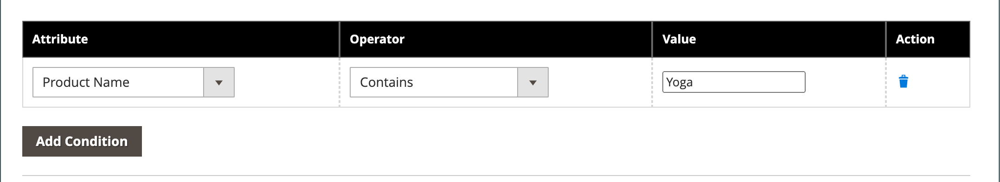

# Trier les produits de catégorie

{{ee-feature}}

La position des produits dans une catégorie peut être spécifiée manuellement en faisant glisser et en déposant les produits en position ou en appliquant un ordre de tri prédéfini. Par défaut, les produits peuvent être triés par niveau de stock, âge, couleur, nom, SKU et prix. Le tri automatique remplace l’ordre de tri actuel et réinitialise toutes les positions de glisser-déposer définies manuellement. L’ordre de tri des couleurs et le niveau de stock minimal qui peut être requis pour que les produits soient inclus dans la liste sont définis dans la configuration [Marchandiseur visuel](../configuration-reference/catalog/visual-merchandiser.md).

Vous pouvez configurer les options de catégorie séparément pour chaque [vue de magasin](../stores-purchase/stores.md#add-stores) afin de déterminer la sélection des produits, leur position relative dans la liste et les attributs disponibles pour les règles de catégorie. Cependant, il existe un seul ordre de tri **_global_** et la position des produits dans le catalogue, et ils sont partagés dans toutes les [&#x200B; vues de magasin](../stores-purchase/store-views.md), tous les magasins et tous les sites web.

## Étape 1 : définir la portée de la configuration

1. Dans la barre latérale _Admin_, accédez à **[!UICONTROL Catalog]** > **[!UICONTROL Categories]**.

1. Si nécessaire, choisissez l’**[!UICONTROL Store View]** où les paramètres s’appliquent.

   Pour une installation multi-magasin, le paramètre _[!UICONTROL Store View]_&#x200B;applique l’ordre de tri à toutes les vues disponibles dans le magasin.

1. Dans l’arborescence de catégorie à gauche, choisissez la catégorie à modifier.

   {width="700" zoomable="yes"}

## Étape 2 : trier les produits

>[!NOTE]
>
>Lors du tri d’une catégorie par attribut de produit, les produits ayant les mêmes valeurs d’attribut sont également triés en fonction de leur _[!UICONTROL Product ID]_&#x200B;dans l’ordre croissant.

Dans la section _[!UICONTROL Products in Category]_, cliquez sur l’icône en forme de mosaïque (  ) pour afficher les mosaïques de produit dans une grille. Utilisez la méthode manuelle ou automatique pour trier les produits.

{width="600" zoomable="yes"}

### Méthode 1 : tri manuel

1. Définissez **[!UICONTROL Sort Order]** sur vos préférences.

   {width="600" zoomable="yes"}

1. Pour appliquer le nouvel ordre de tri, cliquez sur **[!UICONTROL Sort]**.

1. Pour enregistrer l’ordre de tri, cliquez sur **[!UICONTROL Save Category]**.

1. Lorsque vous y êtes invité, mettez à jour tous les indexeurs non valides.

### Méthode 2 : tri automatique

1. Définissez **[!UICONTROL Match products by rule]** () sur `Yes`.

1. Définissez **[!UICONTROL Automatic Sorting]** sur vos préférences.

1. Pour créer une règle de catégorie, suivez les instructions de l’étape suivante.

## Étape 3 : créer une règle de catégorie

1. Définissez **[!UICONTROL Match products by rule]** () sur `Yes`.

1. Cliquez sur **[!UICONTROL Add Condition]**.

1. Sélectionnez le **[!UICONTROL Attribute]** qui est à la base de la condition.

1. Définissez **[!UICONTROL Operator]** sur l’une des options suivantes :

   - `Equal`
   - `Not equal`
   - `Greater than`
   - `Greater than or equal to`
   - `Less than`
   - `Less than or equal to`
   - `Contains`

1. Saisissez le **[!UICONTROL Value]** approprié.

   {width="600" zoomable="yes"}

1. Pour ajouter une autre condition, cliquez sur **[!UICONTROL Add Condition]** et répétez le processus.

## Étape 4 : enregistrer, actualiser et vérifier

1. Cliquez ensuite sur **[!UICONTROL Save Category]**.

1. Lorsque vous êtes invité à actualiser le cache, cliquez sur **[!UICONTROL Cache Management]** et actualisez chaque cache non valide.

1. Dans le storefront, vérifiez que les règles de sélection, de tri et de catégorie de produits fonctionnent correctement.

   Si vous devez effectuer des réglages, modifiez les paramètres et réessayez.
