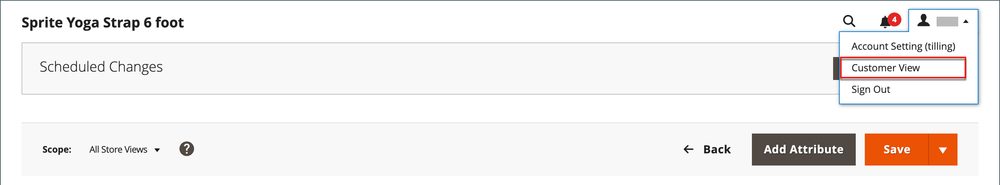

# Présentation de la gestion des catalogues

Adobe Commerce et Magento Open Source utilisent le terme _catalogue_ pour faire référence à la base de données de produits dans son ensemble.

La création et les catégories de produits sont l’un des aspects les plus importants de la création et de la gestion de votre boutique. L’administrateur fournit plusieurs outils que vous utilisez pour la configuration initiale de votre boutique, ainsi que pour la maintenance de votre boutique et l’optimisation de votre entreprise.

>[!TIP]
>
>Inventory management pour Adobe Commerce et Magento Open Source vous offre les outils nécessaires à la gestion de votre inventaire de produits. Les commerçants disposant d’un magasin unique pour plusieurs entrepôts, magasins, lieux de retrait, chargeurs, etc. peuvent utiliser ces fonctionnalités pour gérer les quantités pour les ventes et gérer les expéditions pour terminer les commandes. Pour plus d’informations sur ces fonctionnalités et sur leur utilisation pour gérer les stocks à plusieurs emplacements, consultez le [Guide d’utilisation d’](../inventory-management/introduction.md).

## Portée du catalogue

L’accès aux données du catalogue est déterminé par plusieurs facteurs, notamment la [portée](../getting-started/websites-stores-views.md#scope-settings) le paramètre, la configuration du catalogue et la [catégorie racine](category-root.md) qui est affectée au magasin. Le catalogue comprend les produits activés et disponibles à la vente, ainsi que les produits qui ne sont actuellement pas proposés à la vente.

Dans le domaine de la vente, le terme _catalogue_ fait généralement référence à une sélection de produits disponibles à la vente. Par exemple, un magasin peut avoir un « Catalogue de printemps » et un « Catalogue d’automne ».

Tout comme la table des matières d&#39;un catalogue imprimé, le menu principal de votre magasin — ou _navigation supérieure_ — organise les produits par catégorie pour permettre aux clients de trouver facilement ce qu&#39;ils veulent. Le menu principal est basé sur une _catégorie racine_, qui est un conteneur pour le menu affecté au magasin. Comme les options de menu spécifiques sont définies au niveau de l’affichage du magasin, chaque affichage peut avoir un menu principal différent basé sur la même catégorie racine. Dans chaque menu, vous pouvez proposer une sélection de produits adaptés au magasin.

{width="550"}

## Périmètre du produit

Pour les installations comportant plusieurs sites web, boutiques et vues, le paramètre [portée](../getting-started/websites-stores-views.md#scope-settings) détermine où les produits sont disponibles à la vente et les informations sur les produits disponibles pour chaque vue de boutique. Au départ, tous les produits que vous créez sont publiés sur le site web, le magasin et la vue de magasin par défaut.

{width="550"}

Si vous ne disposez que d’un seul magasin avec la vue par défaut, vous pouvez exécuter votre magasin en [mode magasin unique](../getting-started/websites-stores-views.md#single-store-mode) pour masquer les paramètres de l’étendue. Cependant, si votre magasin comporte plusieurs vues, un indicateur de portée s’affiche sous le nom de chaque champ.

- Pour modifier les informations sur les produits pour une vue spécifique, utilisez la commande _Vue du magasin_ dans le coin supérieur gauche pour choisir la vue. D’autres commandes sont disponibles pour tout champ pouvant être modifié au niveau de l’affichage du magasin.

- Pour définir la portée d’un produit dans une installation multisite, reportez-vous à la section [Produit sur les sites web](settings-basic-websites.md) des informations sur le produit.

Le processus de modification d’un produit pour une vue de magasin est similaire à l’ajout d’une couche d’informations sur le produit spécifique à la vue.

Vous pouvez uniquement modifier ou attribuer des produits pour le site pour lequel vous disposez d’autorisations, et non pour tous les sites auxquels le produit est affecté.

Bien que la vue de magasin _espagnol_ soit sélectionnée dans l’exemple suivant, les informations sur les produits apparaissent toujours dans la langue d’origine de la vue de magasin par défaut. Pour traduire les informations du produit, vous devez passer à la vue de magasin _Espagnol_ et traduire les champs de texte, tels que le titre du produit, la description et les métadonnées. Pour plus d’informations, voir [Localisation de produits](../stores-purchase/store-localize.md#localize-products).

## Modifier un produit pour une vue différente

>[!NOTE]
>
>La portée _Toutes les vues de la boutique_ est désactivée pour les utilisateurs administrateurs qui sont limités à une portée spécifique lorsque le produit est également publié en dehors de la portée autorisée. La première portée disponible pour modification est sélectionnée par défaut, car les utilisateurs restreints ne peuvent pas effectuer d’actions _globales_ ou d’actions qui affectent les portées auxquelles ils n’ont pas accès.

1. Dans le coin supérieur gauche, définissez **[!UICONTROL Store View]** sur la vue spécifique à modifier.

1. Pour confirmer la modification de la portée, cliquez sur **[!UICONTROL OK]**.

1. Mettez à jour le champ avec la nouvelle valeur pour la vue de magasin.

   Une case à cocher s’affiche sous tout champ pouvant être modifié pour la vue de magasin. Pour remplacer la valeur par défaut, désélectionnez la case **Utiliser la valeur par défaut**.

   {width="600" zoomable="yes"}

1. Cliquez ensuite sur **[!UICONTROL Save]**.

1. Dans le coin supérieur gauche, redéfinissez le sélecteur de **[!UICONTROL Store View]** sur la valeur par défaut.

1. Pour vérifier la modification dans votre boutique, procédez comme suit :

   - Dans le coin supérieur droit, cliquez sur la flèche du menu _Admin_ et choisissez **[!UICONTROL Customer View]**.

     {width="600" zoomable="yes"}

   - Dans le coin supérieur droit du magasin, définissez le **[!UICONTROL Language Chooser]** sur l’affichage du magasin du produit que vous avez modifié et recherchez le produit que vous avez modifié pour l’affichage.

     {width="700" zoomable="yes"}
