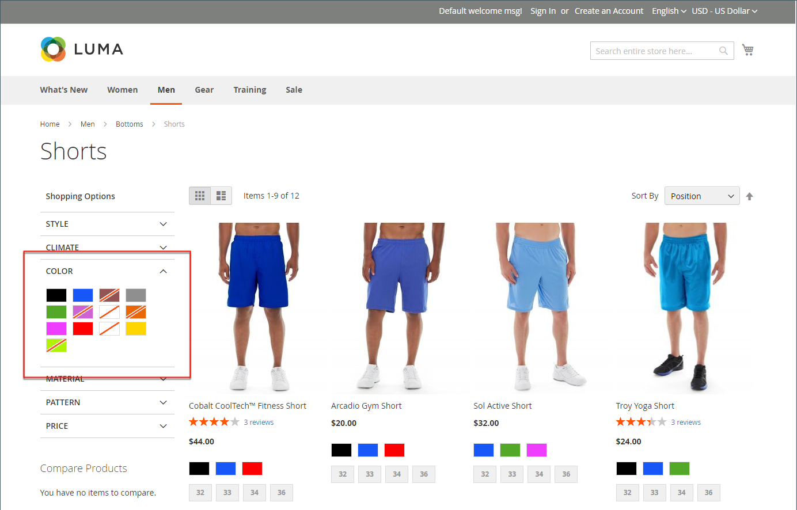
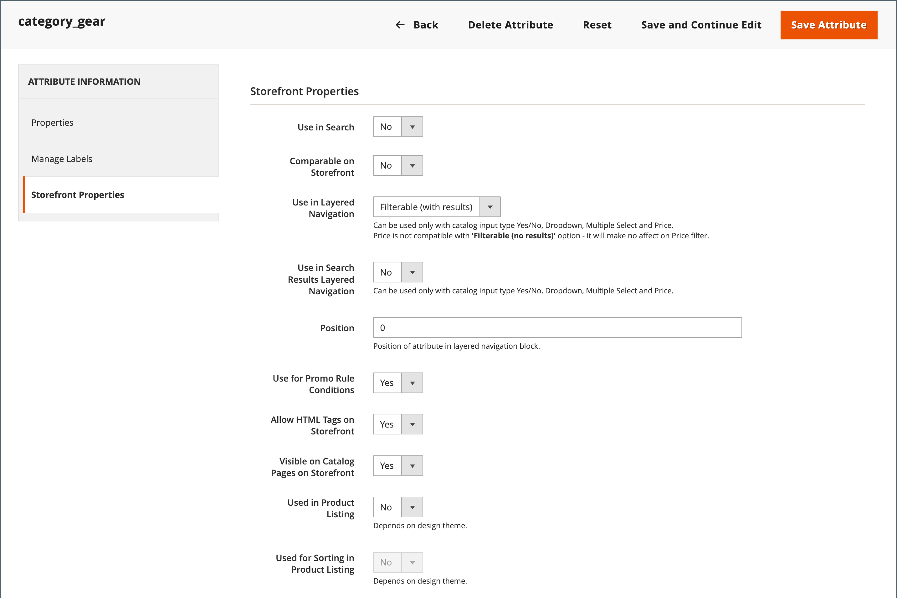
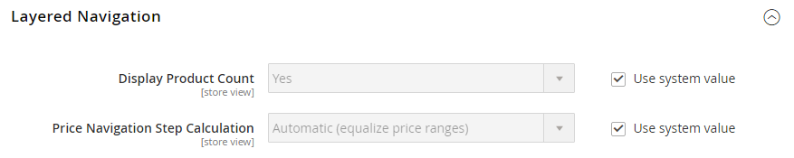

# Navigation par couches

>[!NOTE]
>
>La navigation par couches standard décrite dans cette section diffère de la navigation filtrée par recherche en direct avec [facettes](https://experienceleague.adobe.com/docs/commerce-merchant-services/live-search/live-search-admin/facets/facets.html).

La navigation par calques facilite la recherche de produits en fonction de leur catégorie, de leur gamme de prix ou de tout autre attribut disponible. La navigation par calques s’affiche généralement dans la colonne gauche des résultats de recherche et des pages de catégories, et parfois sur la page d’accueil. La navigation standard comprend un _Acheter par_ liste des catégories et plages de prix. Vous pouvez configurer l’affichage de la navigation par couches, y compris le nombre de produits et la plage de prix.

{width="700" zoomable="yes"}

## Attributs filtrables

>[!NOTE]
>
>Les exigences d’attribut filtrable décrites dans cette rubrique diffèrent pour [Recherche en direct](https://experienceleague.adobe.com/docs/commerce-merchant-services/live-search/overview.html). Pour en savoir plus, voir [Facettes](https://experienceleague.adobe.com/docs/commerce-merchant-services/live-search/live-search-admin/facets/facets.html).

La navigation par couches peut être utilisée pour rechercher des produits par catégorie ou par attribut. Par exemple, lorsqu’un acheteur choisit la catégorie Mens/Raccourcis dans le volet de navigation supérieur, les résultats initiaux incluent tous les produits de la catégorie. La liste peut être filtrée davantage en choisissant un style, un climat, une couleur, un matériau, un modèle ou un prix spécifique, ou une combinaison de valeurs. Les attributs filtrables apparaissent dans une section en développement qui répertorie chaque valeur d’attribut. Vous pouvez, au choix, configurer la liste des produits avec les résultats correspondants afin d’inclure les produits avec ou sans correspondance.

Les propriétés d’attribut, combinées au type d’entrée de produit, déterminent les attributs qui peuvent être utilisés pour la navigation par couches. La navigation par couches n’est disponible que pour [_ancre_](categories-display-settings.md) catégories, mais peuvent également être ajoutées aux pages de résultats de recherche. La variable **Type d’entrée de catalogue pour le propriétaire du magasin** de chaque attribut doit être définie sur `Yes/No`, `Dropdown`, `Multiple Select`, ou `Price`. Pour rendre les attributs filtrables, la variable **Utilisation dans la navigation par calques** doit être définie sur `Filterable (with results)` ou `Filterable (no results)`.

_Exemple : attributs filtrables avec résultats_

{width="700" zoomable="yes"}

_Exemple : valeurs d’échantillon filtrables affichées sans résultat_

{width="700" zoomable="yes"}

Les instructions suivantes expliquent comment configurer une navigation par couches de base avec des attributs filtrables. Pour une navigation par couches avancée avec les étapes de prix, voir [Navigation par prix](navigation-layered.md#configure-price-navigation).

## Étape 1 : configuration des propriétés d’attribut

1. Sur le _Administration_ barre latérale, accédez à **[!UICONTROL Stores]** > _[!UICONTROL Attributes]_>**[!UICONTROL Product]**.

1. Parcourez ou utilisez une recherche filtrée pour trouver un attribut dans la liste et l’ouvrir en mode d’édition.

   {width="700" zoomable="yes"}

1. Dans le panneau de gauche, choisissez **[!UICONTROL Storefront Properties]** et défini **[!UICONTROL Use In Layered Navigation]** à l’une des options suivantes :

   - `Filterable (with results)` - La navigation par calques inclut uniquement les filtres pour lesquels les produits correspondants sont disponibles. Toute valeur d’attribut qui s’applique déjà à tous les produits affichés dans la liste doit toujours apparaître comme filtre disponible. Les valeurs d’attribut avec un nombre de correspondances de produits nul (0) sont omises dans la liste des filtres disponibles. La liste filtrée inclut uniquement les produits qui correspondent au filtre. La liste des produits n’est mise à jour que si les filtres sélectionnés changent ce qui est affiché.

   - `Filterable (no results)` - La navigation par couches comprend des filtres pour toutes les valeurs d’attribut disponibles et leur nombre de produits, y compris les produits avec zéro (0) correspondance de produits. Si la valeur d’attribut est un échantillon, la valeur apparaît sous forme de filtre, mais est barrée. Le filtrage par couche de prix n’est pas pris en charge par cette option et n’affecte pas les filtres de prix.

1. Définir **[!UICONTROL Use In Search Results Layered Navigation]** to `Yes`.

   {width="600" zoomable="yes"}

1. Répétez ces étapes pour chaque attribut que vous souhaitez inclure dans la navigation par couches.

>[!NOTE]
>
>La variable [!UICONTROL Position] est grisé par défaut. vous devez donc enregistrer l’attribut avant de pouvoir modifier ce paramètre.

## Étape 2 : faire de la catégorie une ancre

1. Sur le _Administration_ barre latérale, accédez à **[!UICONTROL Catalog]** > **[!UICONTROL Categories]**.

1. Dans l’arborescence des catégories, sélectionnez la catégorie dans laquelle vous souhaitez utiliser la navigation par couches.

1. Développer  la valeur **[!UICONTROL Display Settings]** section et définition **[!UICONTROL Anchor]** to `Yes`.

   {width="600" zoomable="yes"}

1. Cliquez sur **[!UICONTROL Save]**.

## Etape 3 : Test des résultats

Pour tester le paramètre, rendez-vous dans votre boutique et accédez à la catégorie à partir du menu principal. La sélection des attributs filtrables s’affiche dans la navigation superposée de la page de catégorie.

Recherchez, filtrez et consultez les produits affichés.

## Suppression des valeurs d’attribut filtrables de la navigation superposée

La navigation par calques inclut des filtres pour toutes les valeurs d’attribut disponibles et leur nombre de produits, y compris les produits avec zéro (0) correspondance de produits (comme illustré dans l’image suivante).

{width="700" zoomable="yes"}

Ce résultat peut rendre difficile pour les clients la sélection d’un produit préféré et il n’est pas nécessaire d’afficher les valeurs d’attribut &#x200B; &#x200B; avec 0 produit au premier plan.

Vous pouvez utiliser les étapes suivantes pour supprimer les valeurs d’attribut filtrables avec 0 Produits de la navigation superposée :

1. Sur le _Administration_ barre latérale, accédez à **[!UICONTROL Stores]** > _[!UICONTROL Attributes]_>**[!UICONTROL Product]**.

1. Parcourez ou utilisez une recherche filtrée pour trouver un attribut dans la liste et l’ouvrir en mode d’édition.

1. Sous _[!UICONTROL Attribute Information]_, cliquez sur **[!UICONTROL Storefront Properties]**.

1. Pour **[!UICONTROL Layered Navigation]**, choisissez `Filterable (with results)`.

   {width="600" zoomable="yes"}

1. Cliquez sur **[!UICONTROL Save Attribute]**.

## Navigation dans les prix

>[!NOTE]
>
>La configuration de navigation par prix décrite dans cette rubrique diffère pour [Recherche en direct](https://experienceleague.adobe.com/docs/commerce-merchant-services/live-search/overview.html).

La navigation par prix peut être utilisée pour répartir les produits par gamme de prix dans la navigation par couches. Vous pouvez également fractionner chaque plage en intervalles. Il existe plusieurs façons de calculer la navigation par prix :

- Automatique (égaliser les plages de prix)
- Automatique (égaliser le nombre de produits)
- Manuel

Avec les deux premières méthodes, les étapes de navigation sont calculées automatiquement. La méthode manuelle permet de définir une limite de division pour les intervalles de prix. L’exemple suivant montre la différence entre les étapes de navigation par prix 10 et 100.

Le fractionnement itératif offre la meilleure distribution de produits parmi les plages de prix. Avec fractionnement itératif, après avoir choisi la plage de 0,00 à 99 $, le client peut descendre dans plusieurs sous-plages de prix. Le fractionnement des plages de prix s’arrête lorsque le nombre de produits atteint le seuil fixé par la limite de la division d’intervalle.

## Exemple : étapes de navigation par prix

| Étape du prix par 10 | Étape du prix par 100 |
|----------|--------|
| $20.00 - $29.99 (1) | $0.00 - $99.99 (4) |
| $30.00 - $39.99 (2) | $100 - $199.99 (5) |
| $70.00 - $79.99 (1) | $400.00 - $499.99 (2) |
| $100.00 - $109.99 (1) | 700,00 $ et plus (1) |
| $120.00 - $129.99 (2) |   |
| $150.00 - $159.99 (1) |   |
| $180.00 - $189.99 (1) |   |
| $420.00 - $429.99 (1) |   |
| $440.00 - $449.99 (1) |   |
| 710,00 $ et plus (1) |   |

{style="table-layout:auto"}

## Configuration de la navigation par prix

>[!IMPORTANT]
>
>Pour afficher correctement les produits et leurs prix en fonction des _filtres de prix_ dans la navigation par couches, assurez-vous que les paramètres du prix s’affichent dans la variable [Configuration de la taxe](../configuration-reference/sales/tax.md) ont la même valeur (`Excluding Tax` **ou** `Including Tax`). Pour le _[!UICONTROL Calculation Settings]_, vérifiez les **[!UICONTROL Catalog Prices]**. Et pour_[!UICONTROL Price Display Settings]_, vérifiez les **[!UICONTROL Display Product Prices in Catalog]** . Si ces valeurs sont différentes, les filtres de prix dans la navigation superposée peuvent ne pas correctement filtrer et trier les produits par prix.

1. Sur le _Administration_ barre latérale, accédez à **[!UICONTROL Stores]** > _[!UICONTROL Settings]_>**[!UICONTROL Configuration]**.

1. Dans le panneau de gauche, développez **[!UICONTROL Catalog]** et choisissez **[!UICONTROL Catalog]** en-dessous.

1. Développer  la valeur _Navigation par couches_ .

   Par défaut, **[!UICONTROL Display Product Count]** est défini sur `Yes`. Si nécessaire, désélectionnez l’option **[!UICONTROL Use system value]** pour modifier ce paramètre.

   {width="600" zoomable="yes"}

   Pour obtenir la liste détaillée de ces options de configuration, voir [Navigation par couches](../configuration-reference/catalog/catalog.md#layered-navigation) dans le _Référence de configuration_.

1. Définir **[!UICONTROL Price Navigation Steps Calculation]** pour l’une des méthodes des sections suivantes.

1. Lorsque vous avez terminé, cliquez sur **[!UICONTROL Save Config]**.

### Méthode 1 : automatique (égalisation des plages de prix)

Laisser **[!UICONTROL Price Navigation Steps Calculation]** défini sur `Automatic (Equalize Price Ranges)` (par défaut). Ce paramètre utilise l’algorithme standard pour la navigation par prix.

### Méthode 2 : automatique (égaliser le nombre de produits)

>[!TIP]
>
>Si nécessaire, désélectionnez tout d’abord l’option **[!UICONTROL Use system value]** pour modifier ces paramètres.

1. Définir **[!UICONTROL Price Navigation Steps Calculation]** to `Automatic (equalize product counts)`.

1. Pour afficher un seul prix lorsque plusieurs produits avec le même prix, définissez **[!UICONTROL Display Price Interval as One Price]** to `Yes`.

1. Pour **[!UICONTROL Interval Division Limit]**, indiquez le seuil du nombre de produits compris dans une fourchette de prix.

   La plage ne peut pas être fractionnée davantage au-delà de cette limite. La valeur par défaut est `9`.

   {width="600" zoomable="yes"}

### Méthode 3 : manuelle

>[!NOTE]
>
>Si nécessaire, désélectionnez tout d’abord l’option **[!UICONTROL Use system value]** pour modifier ces paramètres.

1. Définir **[!UICONTROL Price Navigation Steps Calculation]** to `Manual`.

1. Saisissez une valeur qui détermine la variable **[!UICONTROL Default Price Navigation Step]**.

1. Saisissez le **[!UICONTROL Maximum Number of Price Intervals]** autorisé, jusqu’à `100`.

   {width="600" zoomable="yes"}

## Configuration de la navigation par couches

>[!NOTE]
>
>La configuration standard décrite dans cette page diffère de la configuration [Recherche en direct](https://experienceleague.adobe.com/docs/commerce-merchant-services/live-search/overview.html).

La configuration de navigation par couches détermine si un nombre de produits s’affiche entre parenthèses après chaque attribut, ainsi que la taille du calcul de l’étape utilisée dans la navigation par prix.

1. Sur le _Administration_ barre latérale, accédez à **[!UICONTROL Stores]** > _[!UICONTROL Settings]_>**[!UICONTROL Configuration]**.

1. Dans le panneau de gauche, développez la variable _[!UICONTROL Catalog]_et choisissez **[!UICONTROL Catalog]**en-dessous.

1. Développez l’objet _[!UICONTROL Layered Navigation]_.

   >[!NOTE]
   >
   >Si nécessaire, désélectionnez tout d’abord l’option **[!UICONTROL Use system value]** pour modifier ces paramètres.

1. Pour afficher le nombre de produits trouvés pour chaque attribut, définissez **[!UICONTROL Display Product Count]** to `Yes`.

1. Définir **[!UICONTROL Price Navigation Step Calculation]** to `Automatic (equalize price ranges)`.

1. Lorsque vous avez terminé, cliquez sur **[!UICONTROL Save Config]**.
