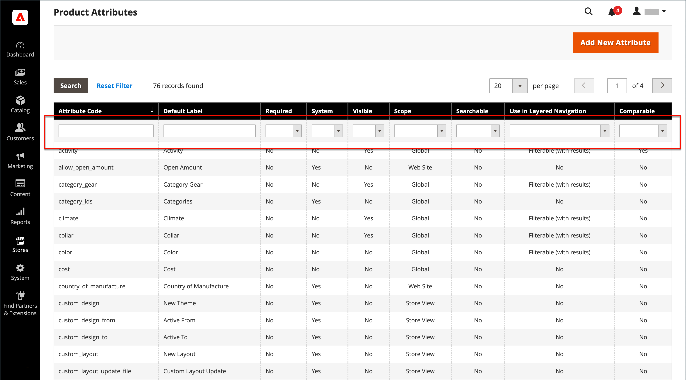

# Navigation superposée

>[!NOTE]
>
>La navigation par couches standard décrite dans cette section diffère de la navigation filtrée Live Search avec [facettes](https://experienceleague.adobe.com/fr/docs/commerce/live-search/live-search-admin/facets/facets).

La navigation en couches facilite la recherche de produits en fonction de la catégorie, de la gamme de prix ou de tout autre attribut disponible. La navigation superposée s’affiche généralement dans la colonne de gauche des résultats de recherche et des pages de catégories, et parfois sur la page d’accueil. La navigation standard comprend une liste _Shop By_ de catégories et de plages de prix. Vous pouvez configurer l’affichage d’une navigation par couches, y compris le nombre de produits et la plage de prix.

{width="700" zoomable="yes"}

## Attributs filtrables

>[!NOTE]
>
>Les exigences en matière d’attributs filtrables décrites dans cette rubrique diffèrent pour [Live Search](https://experienceleague.adobe.com/fr/docs/commerce/live-search/overview). Pour en savoir plus, voir [Facettes](https://experienceleague.adobe.com/fr/docs/commerce/live-search/live-search-admin/facets/facets).

La navigation en couches peut être utilisée pour rechercher des produits par catégorie ou par attribut. Par exemple, lorsqu’un acheteur sélectionne la catégorie Hommes/Shorts dans le volet de navigation supérieur, les premiers résultats incluent tous les produits de la catégorie. Vous pouvez filtrer davantage la liste en choisissant un style, un climat, une couleur, un matériau, un modèle ou un prix spécifique (ou une combinaison de valeurs). Les attributs filtrables s’affichent dans une section en expansion qui répertorie chaque valeur d’attribut. Il est possible de configurer la liste de produits présentant des résultats correspondants de manière à inclure des produits présentant ou non une correspondance.

Les propriétés d’attribut, combinées au type d’entrée de produit, déterminent quels attributs peuvent être utilisés pour la navigation superposée. La navigation superposée est disponible uniquement pour les catégories [_anchor_](categories-display-settings.md), mais peut également être ajoutée aux pages de résultats de recherche. La propriété **Type d’entrée de catalogue pour le propriétaire de la boutique** de chaque attribut doit être définie sur `Yes/No`, `Dropdown`, `Multiple Select` ou `Price`. Pour que les attributs puissent être filtrés, la propriété **Utiliser en navigation superposée** de chaque attribut doit être définie sur `Filterable (with results)` ou `Filterable (no results)`.

_Exemple : attributs filtrables avec résultats_

{width="700" zoomable="yes"}

_Exemple : valeurs d’échantillon filtrables affichées sans résultat_

{width="700" zoomable="yes"}

Les instructions suivantes montrent comment configurer une navigation par couches de base avec des attributs filtrables. Pour une navigation avancée par couches avec des étapes de prix, voir [Navigation par prix](navigation-layered.md#configure-price-navigation).

## Étape 1 : configurer les propriétés d’attribut

1. Dans la barre latérale _Admin_, accédez à **[!UICONTROL Stores]** > _[!UICONTROL Attributes]_>**[!UICONTROL Product]**.

1. Recherchez ou utilisez la recherche filtrée pour trouver un attribut dans la liste et ouvrez-le en mode d’édition.

   {width="700" zoomable="yes"}

1. Dans le panneau de gauche, choisissez **[!UICONTROL Storefront Properties]** et définissez **[!UICONTROL Use In Layered Navigation]** sur l’une des options suivantes :

   - `Filterable (with results)` - La navigation par couches inclut uniquement les filtres pour lesquels des produits correspondants peuvent être trouvés. Toute valeur d’attribut qui s’applique déjà à tous les produits affichés dans la liste doit toujours s’afficher comme un filtre disponible. Les valeurs d’attribut avec un nombre de zéro (0) correspondance de produit sont omises de la liste des filtres disponibles. La liste filtrée inclut uniquement les produits qui correspondent au filtre. La liste des produits n’est mise à jour que si les filtres sélectionnés modifient ce qui s’affiche.

   - `Filterable (no results)` - La navigation superposée affiche des filtres pour toutes les valeurs d’attribut disponibles et leur nombre de produits, même s’il existe des produits sans correspondance (0). Si la valeur de l’attribut est un échantillon, le filtre s’affiche mais est barré. Cette option ne prend pas en charge le filtrage par couches de prix et n’affecte pas les filtres de prix.

1. Définissez **[!UICONTROL Use In Search Results Layered Navigation]** sur `Yes`.

   {width="600" zoomable="yes"}

1. Répétez ces étapes pour chaque attribut que vous souhaitez inclure dans la navigation superposée.

>[!NOTE]
>
>- Si le paramètre _[!UICONTROL Use in Search]_&#x200B;est défini sur `No`, le paramètre&#x200B;_[!UICONTROL Use in Search Results Layered Navigation]_ ne s’affiche pas. Dans ce cas, l’attribut de produit n’est pas utilisé dans la recherche, quel que soit le paramètre [!UICONTROL Use in Layered Navigation].
>
>- Le champ [!UICONTROL Position] est grisé par défaut. Vous devez enregistrer l’attribut avant de pouvoir modifier ce paramètre.

## Étape 2 : faire de la catégorie une ancre

1. Dans la barre latérale _Admin_, accédez à **[!UICONTROL Catalog]** > **[!UICONTROL Categories]**.

1. Dans l’arborescence des catégories, sélectionnez la catégorie dans laquelle vous souhaitez utiliser la navigation superposée.

1. Développez  la section **[!UICONTROL Display Settings]** et définissez **[!UICONTROL Anchor]** sur `Yes`.

   {width="600" zoomable="yes"}

1. Cliquez sur **[!UICONTROL Save]**.

## Étape 3 : Tester les résultats

Pour tester le paramètre, visitez votre boutique et accédez à la catégorie à partir du menu principal. La sélection des attributs filtrables s’affiche dans la navigation superposée de la page de catégorie.

Rechercher, filtrer et examiner les produits affichés.

## Suppression des valeurs d’attribut filtrables de la navigation superposée

La navigation superposée inclut des filtres pour toutes les valeurs d’attribut disponibles et leur nombre de produits, y compris les produits sans correspondance de produit (0) (comme illustré dans l’image suivante).

{width="700" zoomable="yes"}

Cela peut rendre difficile la sélection d’un produit préféré pour les clients. Il n’est pas nécessaire d’afficher des valeurs d’attribut &#x200B;&#x200B;avec 0 produit au premier plan).

Vous pouvez suivre les étapes suivantes pour supprimer les valeurs d’attribut filtrables avec 0 produit de la navigation superposée :

1. Dans la barre latérale _Admin_, accédez à **[!UICONTROL Stores]** > _[!UICONTROL Attributes]_>**[!UICONTROL Product]**.

1. Recherchez ou utilisez la recherche filtrée pour trouver un attribut dans la liste et ouvrez-le en mode d’édition.

1. Sous _[!UICONTROL Attribute Information]_, cliquez sur **[!UICONTROL Storefront Properties]**.

1. Par **[!UICONTROL Layered Navigation]**, choisissez `Filterable (with results)`.

   {width="600" zoomable="yes"}

1. Cliquez sur **[!UICONTROL Save Attribute]**.

## Navigation dans les prix

>[!NOTE]
>
>La configuration de navigation par prix décrite dans cette section diffère de la navigation filtrée Live Search avec [ facettes ](https://experienceleague.adobe.com/fr/docs/commerce/live-search/live-search-admin/facets/facets).

La navigation par prix peut être utilisée pour distribuer les produits par plage de prix dans une navigation par couches. Vous pouvez également fractionner chaque plage en intervalles. Il existe plusieurs façons de calculer la navigation par prix :

- Automatique (égaliser les fourchettes de prix)
- Automatique (égaliser le nombre de produits)
- Manuelle

>[!BEGINSHADEBOX]

Lors du filtrage par prix dans la navigation superposée, Adobe Commerce utilise le prix le plus bas des éléments enfants d’un produit configurable. Par conséquent, un produit configurable n&#39;apparaît que dans la plage de prix la plus basse de ses produits enfants, même si certains produits enfants ont des prix plus élevés.

>[!ENDSHADEBOX]

Avec les deux premières méthodes, les étapes de navigation sont calculées automatiquement. La méthode manuelle permet de définir une limite de division pour les intervalles de prix. L’exemple suivant illustre la différence entre les étapes de navigation de prix de 10 et 100.

Le fractionnement itératif offre la meilleure répartition des produits entre les gammes de prix. Avec le fractionnement itératif, après avoir choisi la plage de 0,00 à 99 $, le client peut explorer plusieurs sous-plages de prix. Le fractionnement des gammes de prix s&#39;arrête lorsque le nombre de produits atteint le seuil défini par la limite de division d&#39;intervalle.

## Exemple : étapes de navigation dans les prix

| Échelon de prix par 10 | Échelon de prix par 100 |
|----------|--------|
| 20 $ - 29,99 $ (1) | 0,00 $ - 99,99 $ (4) |
| 30,00 $ - 39,99 $ (2) | 100 $ - 199,99 $ (5) |
| 70 $ - 79,99 $ (1) | 400,00 $ - 499,99 $ (2) |
| 100 $ - 109,99 $ (1) | 700,00 $ et plus (1) |
| 120,00 $ - 129,99 $ (2) |   |
| 150 $ - 159,99 $ (1) |   |
| 180 $ - 189,99 $ (1) |   |
| 420 $ - 429,99 $ (1) |   |
| 440 $ - 449,99 $ (1) |   |
| 710,00 $ et plus (1) |   |

{style="table-layout:auto"}

## Configurer la navigation des prix

>[!IMPORTANT]
>
>Pour afficher correctement les produits et leurs prix en fonction des _filtres de prix_ dans la navigation superposée, assurez-vous que les paramètres d’affichage des prix dans le [paramétrage de la taxe](../configuration-reference/sales/tax.md) ont la même valeur (`Excluding Tax` **ou** `Including Tax`). Pour l’_[!UICONTROL Calculation Settings]_, vérifiez la valeur **[!UICONTROL Catalog Prices]**. Et pour&#x200B;_[!UICONTROL Price Display Settings]_, vérifiez la valeur **[!UICONTROL Display Product Prices in Catalog]** . Si elles ont des valeurs différentes, les filtres de prix dans la navigation superposée peuvent ne pas filtrer et trier correctement les produits par prix.

1. Dans la barre latérale _Admin_, accédez à **[!UICONTROL Stores]** > _[!UICONTROL Settings]_>**[!UICONTROL Configuration]**.

1. Dans le panneau de gauche, développez **[!UICONTROL Catalog]** et choisissez **[!UICONTROL Catalog]** en dessous.

1. Développez  la section _Navigation superposée_.

   Par défaut, **[!UICONTROL Display Product Count]** est défini sur `Yes`. Si nécessaire, décochez la case **[!UICONTROL Use system value]** pour modifier ce paramètre.

   {width="600" zoomable="yes"}

   Pour obtenir la liste détaillée de ces options de configuration, voir [Navigation superposée](../configuration-reference/catalog/catalog.md#layered-navigation) dans la _Référence de configuration_.

1. Définissez des **[!UICONTROL Price Navigation Steps Calculation]** pour l’une des méthodes dans les sections suivantes.

1. Cliquez ensuite sur **[!UICONTROL Save Config]**.

### Méthode 1 : automatique (égalisation des gammes de prix)

Conservez la **[!UICONTROL Price Navigation Steps Calculation]** définie sur `Automatic (Equalize Price Ranges)` (par défaut). Ce paramètre utilise l’algorithme standard pour la navigation par prix.

### Méthode 2 : automatique (égaliser le nombre de produits)

>[!TIP]
>
>Si nécessaire, décochez d’abord la case **[!UICONTROL Use system value]** pour modifier ces paramètres.

1. Définissez **[!UICONTROL Price Navigation Steps Calculation]** sur `Automatic (equalize product counts)`.

1. Pour afficher un seul prix lorsque plusieurs produits ont le même prix, définissez **[!UICONTROL Display Price Interval as One Price]** sur `Yes`.

1. Par **[!UICONTROL Interval Division Limit]**, entrez le seuil pour le nombre de produits dans une gamme de prix.

   La plage ne peut pas être fractionnée au-delà de cette limite. La valeur par défaut est `9`.

   {width="600" zoomable="yes"}

### Méthode 3 : Manuelle

>[!NOTE]
>
>Si nécessaire, décochez d’abord la case **[!UICONTROL Use system value]** pour modifier ces paramètres.

1. Définissez **[!UICONTROL Price Navigation Steps Calculation]** sur `Manual`.

1. Saisissez une valeur qui détermine la **[!UICONTROL Default Price Navigation Step]**.

1. Entrez la **[!UICONTROL Maximum Number of Price Intervals]** autorisée, jusqu&#39;à `100`.

   {width="600" zoomable="yes"}

## Configuration de la navigation par couches

>[!NOTE]
>
>La navigation par couches standard décrite dans cette section diffère de la navigation filtrée Live Search avec [facettes](https://experienceleague.adobe.com/fr/docs/commerce/live-search/live-search-admin/facets/facets).

La configuration de navigation superposée détermine si un nombre de produits s’affiche entre parenthèses après chaque attribut et la taille du calcul d’étape utilisé dans la navigation par prix.

1. Dans la barre latérale _Admin_, accédez à **[!UICONTROL Stores]** > _[!UICONTROL Settings]_>**[!UICONTROL Configuration]**.

1. Dans le panneau de gauche, développez la section _[!UICONTROL Catalog]_&#x200B;et choisissez **[!UICONTROL Catalog]**&#x200B;en dessous.

1. Développez la section _[!UICONTROL Layered Navigation]_.

   >[!NOTE]
   >
   >Si nécessaire, décochez d’abord la case **[!UICONTROL Use system value]** pour modifier ces paramètres.

1. Pour afficher le nombre de produits trouvés pour chaque attribut, définissez **[!UICONTROL Display Product Count]** sur `Yes`.

1. Définissez **[!UICONTROL Price Navigation Step Calculation]** sur `Automatic (equalize price ranges)`.

1. Cliquez ensuite sur **[!UICONTROL Save Config]**.
