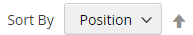

# Listes de produits

Les listes de produits peuvent être définies pour apparaître par défaut sous la forme d’une liste ou d’une grille. Vous pouvez également déterminer le nombre de produits qui apparaissent par page et l’attribut utilisé pour trier la liste. La liste de produits comprend un ensemble de contrôles qui peuvent être utilisés pour trier les produits, modifier le format de la liste, trier par attribut et passer d’une page à l’autre.

>[!NOTE]
>
>Lors du tri d’une catégorie selon un attribut de produit, les produits avec les mêmes valeurs d’attribut sont également triés par leur _[!UICONTROL Product ID]_dans l’ordre croissant.

{width="700" zoomable="yes"}

## Configuration des listes de produits

1. Sur la barre latérale _Admin_, accédez à **[!UICONTROL Stores]** > _[!UICONTROL Settings]_>**[!UICONTROL Configuration]**.

1. Dans le panneau de gauche, développez **[!UICONTROL Catalog]** et sélectionnez **[!UICONTROL Catalog]** sous .

1. Développez la section  sur **[!UICONTROL Storefront]** .

   {width="600" zoomable="yes"}

   Pour obtenir une liste détaillée de ces options, voir [Storefront](../configuration-reference/catalog/catalog.md#storefront) dans la _référence de configuration_.

   >[!NOTE]
   >
   >Pour afficher correctement les produits et leurs prix en fonction du _tri des produits par prix_, assurez-vous que les paramètres d&#39;affichage des prix dans la [configuration de la taxe sur les ventes](../configuration-reference/sales/tax.md) ont la même valeur (`Excluding Tax` **ou** `Including Tax`). Pour le _[!UICONTROL Calculation Settings]_, vérifiez la valeur **[!UICONTROL Catalog Prices]**. Et pour_[!UICONTROL Price Display Settings]_, vérifiez la valeur **[!UICONTROL Display Product Prices in Catalog]**. Si ces valeurs sont différentes, les filtres de prix dans la navigation superposée peuvent ne pas correctement filtrer et trier les produits par prix.

1. Définissez la valeur par défaut **[!UICONTROL List Mode]** sur l’une des options suivantes :

   - `Grid Only`
   - `List Only`
   - `Grid (default) / List`
   - `List (default / Grid`

1. Pour **[!UICONTROL Products per Page on Grid Allowed Values]**, saisissez le nombre de produits que vous souhaitez afficher par page lorsqu’ils sont affichés au format grille.

   Pour saisir une sélection de valeurs, séparez chaque nombre par une virgule.

1. Pour **[!UICONTROL Products per Page on Grid Default Value]**, saisissez le nombre de produits par défaut à afficher dans la grille par page.

1. Pour **[!UICONTROL Products per Page on List Allowed Values]**, saisissez le nombre de produits que vous souhaitez afficher par page lorsqu’ils sont affichés au format liste.

   Pour saisir une sélection de valeurs, séparez chaque nombre par une virgule.

1. Pour **[!UICONTROL Products per page on List Default Value]**, saisissez le nombre par défaut de produits qui apparaissent dans la liste, par page.

1. Définissez **[!UICONTROL Product Listing Sorted by]** sur l’attribut par défaut initialement utilisé pour trier la liste.

1. Pour donner aux clients la possibilité de répertorier tous les produits, définissez **[!UICONTROL Allow All Products on Page]** sur `Yes`.

1. Si vous souhaitez conserver tous les paramètres de pagination lorsque les clients parcourent les listes de catalogues, définissez **[!UICONTROL Remember Category Pagination]** sur `Yes`.

   L’activation de ce paramètre garantit que le nombre de produits affichés dans une liste ou une grille est conservé lorsque les acheteurs naviguent d’une catégorie à l’autre. Par défaut, ce champ est défini sur `No`, car il utilise plus de stockage du cache et peut avoir un impact sur la façon dont les pages sont indexées par les moteurs de recherche.

1. Si vous utilisez un [catalogue plat](catalog-flat.md) (**non recommandé**), procédez comme suit :

   - Pour afficher une liste plate de produits, définissez **[!UICONTROL Use Flat Catalog Category]** sur `Yes`.

   - Pour afficher une liste de produits plate, définissez **[!UICONTROL Use Flat Catalog Product]** sur `Yes`.

1. Si vous souhaitez autoriser les références dynamiques pour les ressources multimédias dans les URL de catégorie et de produit, définissez **[!UICONTROL Allow Dynamic Media URLs in Products and Categories]** sur `Yes`.

1. Une fois l’opération terminée, cliquez sur **[!UICONTROL Save Config]**.

## Contrôles de page

| Contrôle | Description |
|--- |--- |
| [!UICONTROL View As] | Affiche les produits au format grille ou liste. |
| [!UICONTROL Sort By] | Modifie l’ordre de tri de la liste. |
| [!UICONTROL Show Per Page] | Détermine le nombre de produits qui apparaissent par page. |
| Liens de pagination | Liens de navigation vers d’autres pages. |

{style="table-layout:auto"}

## Contrôles de pagination

Les paramètres de pagination apparaissent en haut et en bas de la liste et contrôlent le format des liens de pagination pour les listes de produits. Vous pouvez définir le nombre de liens qui apparaissent dans le contrôle et configurer les liens Suivant et Précédent . Pour que les liens de pagination s’affichent, la liste doit contenir plus de produits que ce qui est autorisé par page dans la configuration de la liste de produits.

{width="700" zoomable="yes"}

### Contrôles de pagination du storefront

| Contrôle | Description |
|--- |--- |
|  | [!UICONTROL View As] : affiche la liste au format Grille ou Liste. |
|  | [!UICONTROL Sort By] - Modifie l’ordre de tri de la liste. La propriété _[!UICONTROL Used for Sorting in Product Listing]_storefront détermine les [attributs de produit](../catalog/product-attributes.md) pouvant être utilisés pour trier la liste. |
|  | [!UICONTROL Show Per Page] - Détermine le nombre de produits qui apparaissent par page. |
|  | Liens de pagination : liens de navigation vers d’autres pages. |

{style="table-layout:auto"}

### Configuration des commandes de pagination

1. Sur la barre latérale _Admin_, accédez à **[!UICONTROL Content]** > _[!UICONTROL Design]_>**[!UICONTROL Configuration]**.

1. Recherchez la vue de magasin que vous souhaitez configurer et, dans la colonne **[!UICONTROL Action]**, cliquez sur **[!UICONTROL Edit]**.

1. Sous **[!UICONTROL Other Settings]**, développez la section  sur **[!UICONTROL Pagination]** .

   {width="600" zoomable="yes"}

   Pour plus d’informations sur ces paramètres, voir [Configuration de conception](../content-design/configuration.md).

1. Pour **[!UICONTROL Pagination Frame]**, saisissez le nombre de liens à afficher dans la commande de pagination.

1. Pour **[!UICONTROL Pagination Frame Skip]**, saisissez le nombre de liens que vous souhaitez ignorer avant d’afficher le prochain ensemble de liens dans la commande de pagination.

   Par exemple, si le cadre de pagination comporte cinq liens et que vous souhaitez passer aux cinq liens suivants, combien de liens souhaitez-vous ignorer ? Si vous définissez la valeur sur quatre (`4`), le dernier lien de l’ensemble précédent est le premier lien de l’ensemble suivant.

1. Pour **[!UICONTROL Anchor Text for Previous]**, saisissez le texte à afficher pour le lien Précédent .

   Laissez vide pour utiliser la flèche par défaut.

1. Pour **[!UICONTROL Anchor Text for Next]**, saisissez le texte à afficher pour le lien Suivant. Laissez vide pour utiliser la flèche par défaut.

1. Une fois l’opération terminée, cliquez sur **[!UICONTROL Save Configuration]**.
