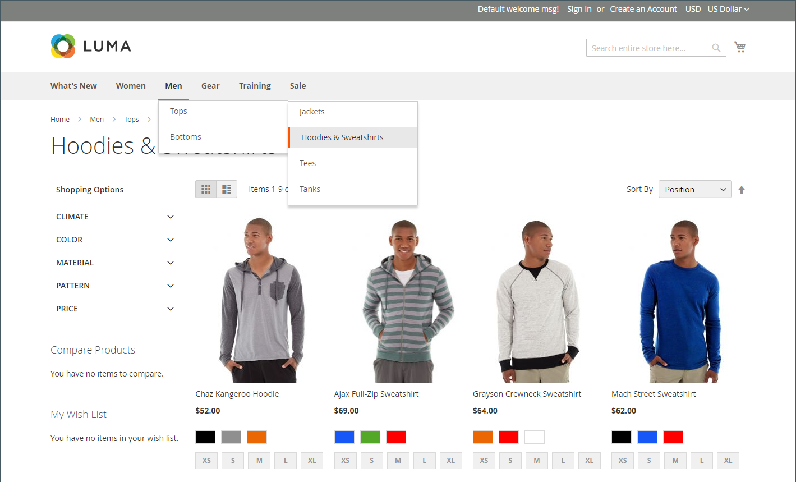

# Navigation dans les catalogues

Le terme _navigation_ fait référence aux méthodes utilisées par les acheteurs pour se déplacer d’une page à l’autre dans votre boutique. Le menu principal, ou navigation supérieure, de votre boutique est en fait une liste de liens de catégories et permet d’accéder facilement aux produits de votre catalogue. Il existe également des catégories dans le chemin de navigation qui s’affiche en haut de la plupart des pages et dans la navigation superposée qui s’affiche sur le côté gauche de certaines pages à deux ou trois colonnes. Pour plus d’informations sur les options d’affichage des catégories, voir [ Paramètres d’affichage ](categories-display-settings.md).

Pour qu’un produit soit visible dans votre boutique, il doit être affecté à au moins une catégorie (voir [Définir la navigation supérieure](navigation-top.md)). Chaque catégorie peut avoir une page de destination dédiée avec une image, un bloc statique, une description et une liste de produits dans la catégorie. Vous pouvez également créer des conceptions spéciales pour les pages de catégorie qui ne sont actives que pendant une période spécifique, par exemple pour un jour férié ou une promotion.

{width="700" zoomable="yes"}
