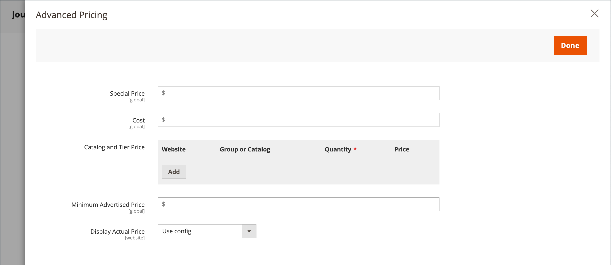

# Tarification avancée

Adobe Commerce et Magento Open Source prennent en charge différentes options de tarification que vous pouvez utiliser pour les promotions ou pour répondre aux exigences de tarification minimales annoncées par le fabricant. Les modifications apportées à la tarification des produits peuvent l&#39;être selon les prévisions ou par une règle de prix appliquée au niveau du produit ou dans le panier.

Gérez les prix de vos produits grâce à une tarification avancée afin d&#39;offrir aux clients de meilleurs taux qui encouragent les consommateurs à dépenser plus, à augmenter le trafic sur votre site et à liquider les anciens stocks.

Les paramètres _[!UICONTROL Advanced Pricing]_définissent les conditions requises pour une tarification spéciale disponible pour un groupe de clients ou un catalogue partagé spécifique. La tarification avancée peut être appliquée aux produits simples, virtuels, téléchargeables et groupés. Pour appliquer une remise à d&#39;autres types de produits, utilisez une [règle de prix de catalogue](../merchandising-promotions/price-rules-catalog.md). Pour plus d&#39;informations, voir [Périmètre du prix](catalog-price-scope.md).

Les données de tarification avancées sont synchronisées avec les pages de produits. Par exemple, si vous mettez à jour une quantité de prix de niveau, le système met à jour la valeur sur la page des produits.

 (disponible avec [Adobe Commerce B2B](./b2b/../introduction.md) uniquement) Si vous utilisez des catalogues partagés, les données de tarification avancées sont synchronisées avec les pages de produits et les catalogues partagés. Par exemple, si vous mettez à jour une quantité de prix de niveau, le système met à jour la valeur dans le catalogue partagé et sur la page de produits. Toute tarification personnalisée indiquée dans le catalogue partagé a la priorité sur la tarification du groupe de clients. Reportez-vous également à la section [Définir la tarification et la structure du catalogue partagé](https://experienceleague.adobe.com/docs/commerce-admin/b2b/shared-catalogs/define/catalog-shared-pricing-structure.html) dans le _Guide B2B d’Adobe Commerce_.

{width="600" zoomable="yes"}

## Accéder aux options de tarification avancées

1. Ouvrez le produit en mode d’édition.

1. Sous **[!UICONTROL Price]**, cliquez sur **[!UICONTROL Advanced Pricing]**.

1. Suivez les instructions correspondant au type de tarification avancée nécessaire.

   - [Prix du groupe](product-price-group.md)

   - [Prix spécial](product-price-special.md)

   - [Prix de niveau](product-price-tier.md)

   - [Prix minimum annoncé](product-price-minimum-advertised.md)

## Référence de page

### [!UICONTROL Special Price]

Pour proposer un prix réduit au cours d&#39;une période spécifiée ou d&#39;une campagne planifiée, saisissez le prix spécial. Lorsqu’un prix spécial est disponible, le prix de détail est biffé et le prix spécial apparaît ci-dessous en gros caractères gras.

#### [!UICONTROL Special Price From] dates

{{ce-feature}}

| Champ | Description |
| ---- | ----------- |
| [!UICONTROL From] | Définit la première date de disponibilité du prix spécial. Vous pouvez saisir la date ou la sélectionner dans le calendrier. |
| [!UICONTROL To] | Définit la dernière date de disponibilité du prix spécial. Vous pouvez saisir la date ou la sélectionner dans le calendrier. |

{style="table-layout:auto"}

### [!UICONTROL Cost]

Permet d&#39;entrer le coût réel de l&#39;article.

### [!UICONTROL Customer Group Price]

{width="600" zoomable="yes"}

Configurez les prix promotionnels et de niveau pour des groupes de clients spécifiques.

| Poste | Description |
| ---- | ----------- |
| [!UICONTROL Website] | Identifie le site web auquel la règle de prix de groupe s’applique. Cette option s’affiche uniquement si l’installation comporte plusieurs sites web. |
| [!UICONTROL Customer Group] | (Obligatoire) Identifie le groupe de clients pouvant recevoir le prix de remise. Lorsqu’une valeur d’un champ de groupe ou de catalogue est modifiée, la ligne de prix personnalisée correspondante qui correspondait au paramètre précédent est supprimée du catalogue partagé.  **[!UICONTROL ALL GROUPS]**- Applique la règle à tous les groupes de clients. **[!UICONTROL NOT LOGGED IN]** - Applique la règle aux invités et aux clients qui ne sont pas connectés à leurs comptes. |
| [!UICONTROL Quantity] | Spécifie la quantité requise pour recevoir un prix de niveau. |
| [!UICONTROL Price] | (Obligatoire) Indique un prix de produit fixe ou réduit pour les membres du groupe de clients, dans le site web spécifique. Options :  **[!UICONTROL Fixed]**- (Par défaut) Le prix de remise est saisi sous la forme d’une valeur décimale fixe. Par exemple, saisissez `9.99` comme prix de remise. **[!UICONTROL Discount]** - Le prix de remise est saisi en pourcentage (%) du prix de base du produit. Par exemple, saisissez `10` pour une remise de 10 %. |
|  | Supprime la règle actuelle. |
| **[!UICONTROL Add]** | Insère une autre ligne pour une nouvelle règle. |

{style="table-layout:auto"}

### [!UICONTROL Catalog and Tier Price]

Configurez des prix promotionnels et de niveau pour des catalogues partagés et des groupes de clients spécifiques.

{{b2b-feature}}

{width="600" zoomable="yes"}

| Poste | Description |
|----|-----------|
| [!UICONTROL Website] | Identifie le site web auquel la règle de prix de groupe s’applique. Cette option s’affiche uniquement si l’installation comporte plusieurs sites web.  **_Important:_**Dans la configuration [Périmètre du prix du catalogue](catalog-price-scope.md), sélectionnez également_ Site Web_. Dans le cas contraire, les prix avancés définis s’affichent pour **tous** les sites Web. |
| [!UICONTROL Group or Catalog] | (Obligatoire) Identifie le groupe de clients ou le catalogue partagé pouvant recevoir le prix de remise. Lorsqu’une valeur d’un champ de groupe ou de catalogue est modifiée, la ligne de prix personnalisée correspondante qui correspondait au paramètre précédent est supprimée du catalogue partagé.  **[!UICONTROL ALL GROUPS]**- Applique la règle à tous les groupes de clients. La valeur n’est pas appliquée au catalogue partagé et les modifications apportées aux données de tarification avancées ne sont pas synchronisées avec le catalogue partagé. **[!UICONTROL NOT LOGGED IN]** - Applique la règle aux invités et aux clients qui ne sont pas connectés à leurs comptes. **[!UICONTROL Shared Catalogs]**: applique la règle à un catalogue partagé spécifique. |
| Quantité | Spécifie la quantité requise pour recevoir un prix de niveau. |
| [!UICONTROL Price] | (Obligatoire) Indique un prix de produit fixe ou réduit pour les membres du groupe de clients, dans le site web spécifique. Options :  **[!UICONTROL Fixed]**- (Par défaut) Le prix de remise est saisi sous la forme d’une valeur décimale fixe. Par exemple, saisissez `9.99` comme prix de remise. **[!UICONTROL Discount]** - Le prix de remise est saisi en pourcentage (%) du prix de base du produit. Par exemple, saisissez `10` pour une remise de 10 %. |
|  | Supprime la règle actuelle. |
| **[!UICONTROL Add]** | Insère une autre ligne pour une nouvelle règle. |

{style="table-layout:auto"}

### [!UICONTROL Minimum Advertised Price]

Prix minimum annoncé (MAP) du produit.

### [!UICONTROL Display Actual Price]

Détermine où le prix réel du produit est visible pour le client.

| Poste | Description |
|----|-----------|
| [!UICONTROL Use Config] | Utilise le paramètre de configuration actuel pour l’affichage des prix. |
| [!UICONTROL On Gesture] | Affiche le prix réel du produit dans une fenêtre contextuelle, en réponse à la _Cliquez pour connaître le prix_ ou _Qu&#39;est-ce que c&#39;est ?_ lien. |
| [!UICONTROL In Cart] | Affiche le prix réel du produit dans le panier. |
| [!UICONTROL Before Order Confirmation] | Affiche le prix réel du produit à la fin du processus de passage en caisse, juste avant la soumission de la commande. |

{style="table-layout:auto"}
