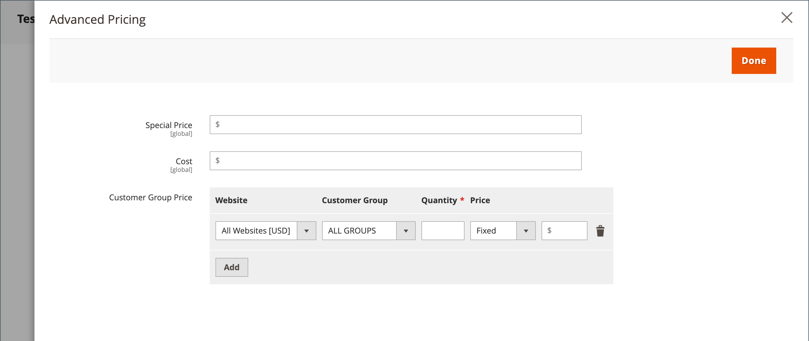

# Tarifs avancés

Adobe Commerce et Magento Open Source prennent en charge diverses options de prix que vous pouvez utiliser pour des promotions ou pour répondre aux exigences minimales de prix annoncés du fabricant. Les modifications de prix des produits peuvent être effectuées selon le calendrier ou par règle de prix appliquée au niveau du produit ou dans le panier.

Gérez les prix de vos produits avec des prix avancés afin d’offrir aux clients de meilleurs taux qui incitent les consommateurs à dépenser plus, orientez le trafic vers votre site et effacez les anciens stocks.

La variable _[!UICONTROL Advanced Pricing]_Les paramètres définissent les conditions requises pour les tarifs spéciaux disponibles pour un groupe de clients spécifique ou un catalogue partagé. La tarification avancée peut être appliquée à des produits simples, virtuels, téléchargeables et groupés. Pour appliquer des tarifs réduits à d’autres types de produits, utilisez un [règle de prix du catalogue](../merchandising-promotions/price-rules-catalog.md). Pour plus d’informations, voir [Étendue du prix](catalog-price-scope.md).

Les données de tarification avancées sont synchronisées avec les pages de produits. Par exemple, si vous mettez à jour une quantité de prix de niveau, le système met à jour la valeur sur la page du produit.

 (Disponible avec [Adobe Commerce B2B](./b2b/../introduction.md) uniquement) Si vous utilisez des catalogues partagés, les données de tarification avancées sont synchronisées avec les pages de produits et les catalogues partagés. Par exemple, si vous mettez à jour une quantité de prix de niveau, le système met à jour la valeur dans le catalogue partagé et sur la page du produit. Toute tarification personnalisée indiquée dans le catalogue partagé a priorité sur la tarification du groupe de clients. Voir aussi [Définition de la tarification et de la structure du catalogue partagées](https://experienceleague.adobe.com/docs/commerce-admin/b2b/shared-catalogs/define/catalog-shared-pricing-structure.html) dans le _Guide Adobe Commerce B2B_.

{width="600" zoomable="yes"}

## Accès aux options de tarification avancées

1. Ouvrez le produit en mode d’édition.

1. Sous **[!UICONTROL Price]**, cliquez sur **[!UICONTROL Advanced Pricing]**.

1. Suivez les instructions relatives au type de tarification avancée nécessaire.

   - [Prix du groupe](product-price-group.md)

   - [Prix spécial](product-price-special.md)

   - [Prix de niveau](product-price-tier.md)

   - [Prix publicitaire minimal](product-price-minimum-advertised.md)

## Référence de page

### [!UICONTROL Special Price]

Pour proposer un prix réduit pendant une période spécifiée ou une opération planifiée, indiquez le prix spécial. Lorsqu&#39;un prix spécial est disponible, le prix de détail est dépassé et le prix spécial apparaît en dessous dans un texte grand et en gras.

#### [!UICONTROL Special Price From] dates

{{ce-feature}}

| Champ | Description |
| ---- | ----------- |
| [!UICONTROL From] | Définit la première date à laquelle le prix spécial est disponible. Vous pouvez saisir la date ou la sélectionner dans le calendrier. |
| [!UICONTROL To] | Définit la dernière date à laquelle le prix spécial est disponible. Vous pouvez saisir la date ou la sélectionner dans le calendrier. |

{style="table-layout:auto"}

### [!UICONTROL Cost]

Saisissez le coût réel de l’article.

### [!UICONTROL Customer Group Price]

{width="600" zoomable="yes"}

Définit des prix promotionnels et des niveaux pour des groupes de clients spécifiques.

| Élément | Description |
| ---- | ----------- |
| [!UICONTROL Website] | Identifie le site web sur lequel la règle de prix de groupe s’applique. Cette option s’affiche uniquement si l’installation comporte plusieurs sites web. |
| [!UICONTROL Customer Group] | (Obligatoire) Identifie le groupe de clients qui est admissible pour recevoir le prix de remise. Lorsqu’une valeur d’un champ de catalogue ou d’un groupe est modifiée, la ligne de prix personnalisée correspondante correspondant au paramètre précédent est supprimée du catalogue partagé.  **[!UICONTROL ALL GROUPS]**- Applique la règle à tous les groupes de clients. **[!UICONTROL NOT LOGGED IN]** - Applique les invités de règle et les clients qui ne sont pas connectés à leurs comptes. |
| [!UICONTROL Quantity] | Indique la quantité requise pour recevoir un prix de niveau. |
| [!UICONTROL Price] | (Obligatoire) Indique un prix fixe ou une remise pour les membres du groupe de clients, dans le site web spécifique. Options :  **[!UICONTROL Fixed]**- (Par défaut) Le prix de remise est renseigné sous la forme d’une valeur décimale fixe. Par exemple, saisissez `9.99` comme prix de remise. **[!UICONTROL Discount]** - Le prix de remise est renseigné en pourcentage (%) du prix de base du produit. Par exemple, saisissez `10` pour une remise de 10 %. |
|  | Supprime la règle actuelle. |
| **[!UICONTROL Add]** | Insère une autre ligne pour une nouvelle règle. |

{style="table-layout:auto"}

### [!UICONTROL Catalog and Tier Price]

Définit des prix promotionnels et des prix de niveau pour des catalogues partagés spécifiques et des groupes de clients.

{{b2b-feature}}

{width="600" zoomable="yes"}

| Élément | Description |
|----|-----------|
| [!UICONTROL Website] | Identifie le site web sur lequel la règle de prix de groupe s’applique. Cette option s’affiche uniquement si l’installation comporte plusieurs sites web.  **_Important :_**ALso select_Site Web _dans le [Portée du prix du catalogue](catalog-price-scope.md) , sinon les prix avancés définis sont affichés pour**all **sites web. |
| [!UICONTROL Group or Catalog] | (Obligatoire) Identifie le groupe de clients ou le catalogue partagé qui est admissible pour recevoir le prix de remise. Lorsqu’une valeur d’un champ de catalogue ou d’un groupe est modifiée, la ligne de prix personnalisée correspondante correspondant au paramètre précédent est supprimée du catalogue partagé.  **[!UICONTROL ALL GROUPS]**- Applique la règle à tous les groupes de clients. La valeur n’est pas appliquée au catalogue partagé et les modifications apportées aux données de tarification avancées ne sont pas synchronisées avec le catalogue partagé. **[!UICONTROL NOT LOGGED IN]** - Applique les invités de règle et les clients qui ne sont pas connectés à leurs comptes. **[!UICONTROL Shared Catalogs]**- Applique la règle à un catalogue partagé spécifique. |
| Quantité | Indique la quantité requise pour recevoir un prix de niveau. |
| [!UICONTROL Price] | (Obligatoire) Indique un prix fixe ou une remise pour les membres du groupe de clients, dans le site web spécifique. Options :  **[!UICONTROL Fixed]**- (Par défaut) Le prix de remise est renseigné sous la forme d’une valeur décimale fixe. Par exemple, saisissez `9.99` comme prix de remise. **[!UICONTROL Discount]** - Le prix de remise est renseigné en pourcentage (%) du prix de base du produit. Par exemple, saisissez `10` pour une remise de 10 %. |
|  | Supprime la règle actuelle. |
| **[!UICONTROL Add]** | Insère une autre ligne pour une nouvelle règle. |

{style="table-layout:auto"}

### [!UICONTROL Minimum Advertised Price]

Prix minimum annoncé (MAP) pour le produit.

### [!UICONTROL Display Actual Price]

Détermine où le prix réel du produit est visible pour le client.

| Élément | Description |
|----|-----------|
| [!UICONTROL Use Config] | Utilise le paramètre de configuration actuel pour l’affichage des prix. |
| [!UICONTROL On Gesture] | Affiche le prix réel du produit dans une fenêtre contextuelle, en réponse à la variable _Clic pour le prix_ ou _Qu&#39;est-ce ?_ lien. |
| [!UICONTROL In Cart] | Affiche le prix réel du produit dans le panier. |
| [!UICONTROL Before Order Confirmation] | Affiche le prix réel du produit à la fin du processus de paiement, juste avant l’envoi de la commande. |

{style="table-layout:auto"}
