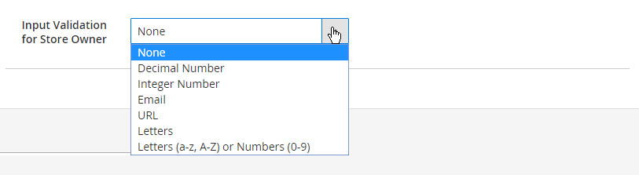

# Ajout d’attributs à un produit

Bien que les attributs soient principalement gérés à partir du menu [Magasins](../stores-purchase/stores-menu.md), vous pouvez également ajouter de nouveaux attributs _à la volée_ lorsque vous travaillez sur un produit. Vous pouvez choisir dans la liste des attributs existants ou créer un attribut. Le nouvel attribut est ajouté au [jeu d’attributs](../catalog/attribute-sets.md) sur lequel le produit est basé.

## Étape 1 : ajouter un attribut

1. Ouvrez le produit en mode d’édition.

1. Dans le coin supérieur droit, cliquez sur **[!UICONTROL Add Attribute]**.

   {width="600" zoomable="yes"}

1. Pour ajouter un attribut existant au produit, utilisez les contrôles [filter](../getting-started/admin-grid-controls.md) afin de trouver l’attribut dans la grille et procédez comme suit :

   - Cochez la case située dans la première colonne de chaque attribut à ajouter.

   - Cliquez sur **[!UICONTROL Add Selected]**.

   {width="600" zoomable="yes"}

1. Pour définir un nouvel attribut, cliquez sur **[!UICONTROL Create New Attribute]** et effectuez les étapes de l’étape 2.

## Étape 2 : description des propriétés d’attribut de base

{width="600" zoomable="yes"}

1. Sous _[!UICONTROL Attribute Properties]_, saisissez un **[!UICONTROL Attribute Label]**pour identifier l’attribut.

1. Définissez **[!UICONTROL Catalog Input Type for Store Owner]** sur le type de [contrôle de saisie](attributes-input-types.md) à utiliser pour la saisie de données.

   Si l’attribut est utilisé pour un [produit configurable](product-create-configurable.md), choisissez `Dropdown`. Définissez ensuite **[!UICONTROL Required]** sur `Yes`.

1. Pour les types d’entrée `Dropdown` et `Multiple Select`, procédez comme suit :

   - Sous **[!UICONTROL Values]**, cliquez sur **[!UICONTROL Add Value]**.

   - Saisissez la première valeur qui doit apparaître dans la liste.

     Vous pouvez saisir une valeur pour l’administrateur et une traduction de la valeur pour chaque vue de magasin. Si vous n’avez qu’une seule vue de magasin, vous ne pouvez saisir que la valeur Admin. Elle est également utilisée pour le storefront.

   - Cliquez sur **[!UICONTROL Add Value]** et répétez l’étape précédente pour chaque option que vous souhaitez inclure dans la liste.

   - Sélectionnez **[!UICONTROL Is Default]** pour utiliser l’option comme valeur par défaut.

   {width="600" zoomable="yes"}

1. Si vous souhaitez que le client choisisse une option avant de pouvoir acheter le produit, définissez **[!UICONTROL Required]** sur `Yes`.

## Étape 3 : décrire les propriétés avancées (facultatif)

{width="600" zoomable="yes"}

1. Saisissez un **[!UICONTROL Attribute Code]** unique en minuscules et sans espaces.

1. Définissez **[!UICONTROL Scope]** pour indiquer où, dans la hiérarchie de votre magasin, l’attribut peut être utilisé.

   Si l’attribut est utilisé pour un [produit configurable](product-create-configurable.md), choisissez `Global`.

1. Si cet attribut s’applique uniquement à ce produit, définissez **[!UICONTROL Unique Value]** sur `Yes`.

1. Pour exécuter un test de validité sur toutes les données saisies dans un champ de texte, définissez **[!UICONTROL Input Validation for Store Owner]** sur le type de données que le champ doit contenir.

   Ce champ n’est pas disponible pour les types d’entrée avec des valeurs sélectionnées. La validation d’entrée peut être utilisée pour l’un des éléments suivants :

   - `Decimal Number`
   - `Integer Number`
   - `Email`
   - `URL`
   - `Letters`
   - `Letters (a-z, A-Z) or Numbers (0-9)`

   {width="500"}

1. Si vous souhaitez pouvoir inclure l’attribut en tant que colonne dans la grille Produits, définissez **[!UICONTROL Add to Column Options]** sur `Yes`.

1. Si vous souhaitez pouvoir filtrer la grille de _[!UICONTROL Products]_en fonction de cette colonne, définissez **[!UICONTROL Use in Filter Options]**sur `Yes`.

## Étape 4 : saisir le libellé du champ

1. Développez  la section **[!UICONTROL Manage titles]** .

1. Saisissez un **[!UICONTROL Title]** à utiliser comme libellé pour le champ.

   Si votre boutique est disponible dans différentes langues, vous pouvez saisir un titre traduit pour chaque affichage.

   {width="600" zoomable="yes"}

   >[!NOTE]
   >
   > Si vous prévoyez d’utiliser cet attribut en tant que facette dans la recherche en direct, vous devez spécifier un libellé spécifique au magasin. Sans cela, le nom de l’attribut risque de ne pas s’afficher correctement sur la page de configuration des facettes. Pour mettre à jour la configuration, modifiez manuellement le libellé à l’aide de l’option [modifier dans la liste de facettes de Live Search](https://experienceleague.adobe.com/en/docs/commerce/live-search/live-search-admin/facets/facets-add#step-2-edit-facet-properties-optional) dans le _Guide de Live Search_.

## Étape 5 : décrire les propriétés du storefront

1. Développez  la section **[!UICONTROL Storefront Properties]** .

   {width="600" zoomable="yes"}

1. Pour rendre l’attribut disponible pour la recherche, définissez **[!UICONTROL Use in Search]** sur `Yes`.

1. Pour inclure l’attribut dans la comparaison de produits, définissez **[!UICONTROL Comparable on Storefront]** sur `Yes`.

1. Pour inclure des attributs de liste déroulante, de sélection multiple ou de prix dans une navigation superposée, définissez **[!UICONTROL Use in Search Results Layered Navigation]** sur l’une des options suivantes :

   - `Filterable (with results)` - La navigation par couches inclut uniquement les filtres pour lesquels des produits correspondants peuvent être trouvés. Toute valeur d’attribut qui s’applique déjà à tous les produits affichés dans la liste n’apparaît pas comme un filtre disponible. Les valeurs d’attribut avec un nombre de zéro (0) correspondance de produit sont également omises de la liste des filtres disponibles.  La liste filtrée de produits comprend uniquement les produits qui correspondent au filtre. La liste des produits n’est mise à jour que si les filtres sélectionnés modifient ce qui s’affiche.

   - `Filterable (no results)` - La navigation superposée inclut des filtres pour toutes les valeurs d’attribut disponibles et leur nombre de produits, y compris les produits sans correspondance de produit (0). Si la valeur de l’attribut est un échantillon, la valeur apparaît comme un filtre, mais est barrée.

   >[!NOTE]
   >
   >Lorsque le paramètre _[!UICONTROL Use in Search]_est défini sur `No`, le paramètre_[!UICONTROL Use in Search Results Layered Navigation]_ n’est pas affiché et l’attribut product n’est pas utilisé dans la recherche avec une valeur de paramètre [!UICONTROL Use in Layered Navigation].

1. Pour utiliser l’attribut dans une navigation superposée sur les pages de résultats de recherche, définissez **[!UICONTROL Use in Search Results Layered Navigation]** sur `Yes` et saisissez un nombre dans le champ **[!UICONTROL Position]** .

   Le numéro de position indique la position relative de l’attribut dans le bloc de navigation superposé.

   >[!NOTE]
   >
   >Le champ _[!UICONTROL Position]_est grisé par défaut et vous devez enregistrer l’attribut avant de pouvoir modifier ce paramètre.

1. Pour utiliser l’attribut dans les règles de prix, définissez **[!UICONTROL Use for Promo Rule Conditions]** sur `Yes`.

1. Pour permettre la mise en forme du texte avec HTML, définissez **[!UICONTROL Allow HTML Tags on Storefront]** sur `Yes`.

   Ce paramètre rend l’éditeur WYSIWYG disponible lors de la modification du champ.

1. Pour inclure l’attribut dans la page de produit, définissez **[!UICONTROL Visible on Catalog Pages on Storefront]** sur `Yes`.

1. Renseignez les paramètres suivants comme pris en charge par votre thème :

   - Pour inclure l’attribut dans les listes de produits, définissez **[!UICONTROL Used in Product Listing]** sur `Yes`.

   - Pour utiliser l’attribut comme paramètre de tri pour les listes de produits, définissez **[!UICONTROL Used for Sorting in Product Listing]** sur `Yes`.

1. Cliquez ensuite sur **[!UICONTROL Save Attribute]**.
