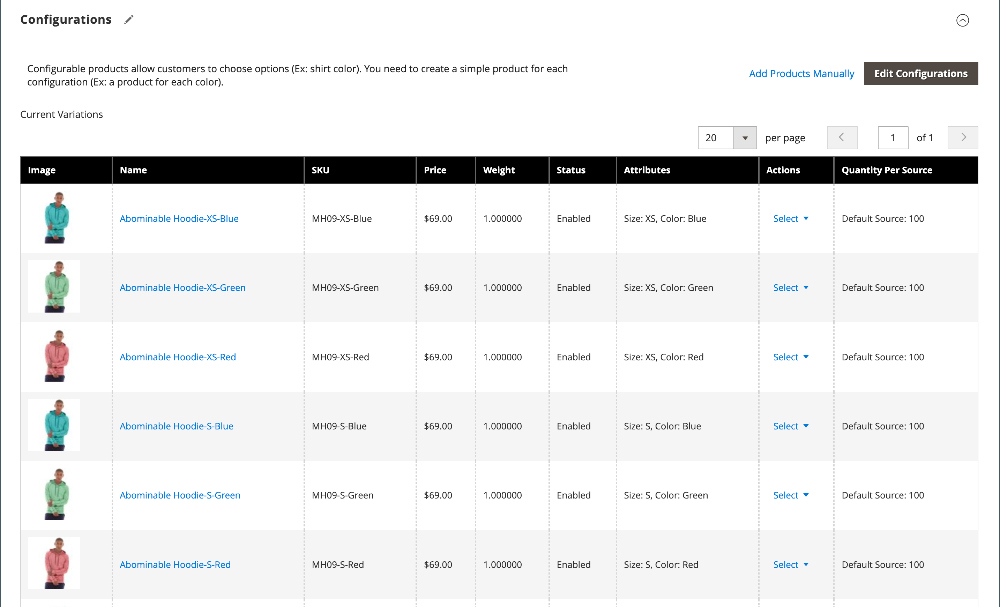

# Paramètres du produit - [!UICONTROL Configurations]

La section _[!UICONTROL Configurations]_répertorie toutes les variations existantes du produit et peut être utilisée pour générer des variations à utiliser avec le type de produit Configurable. Pour plus d’informations, voir [Produit configurable](product-create-configurable.md).

{width="600" zoomable="yes"}

{width="600" zoomable="yes"}

## Référence du champ

| Champ | Description |
|--- |--- |
| [!UICONTROL Image] | Image du produit |
| [!UICONTROL Name] | Nom unique d’un produit |
| [!UICONTROL SKU] | En fonction du nom du produit |
| [!UICONTROL Price] | Prix du produit |
| [!UICONTROL Quantity] | Montant des stocks disponibles pour chaque produit |
| [!UICONTROL Weight] | Poids du produit |
| [!UICONTROL Status] | Statut du produit **[!UICONTROL Enabled]** / **[!UICONTROL Disabled]** |
| [!UICONTROL Attributes] | Ensemble d’attributs utilisés pour décrire un produit |
| [!UICONTROL Actions] | Répertorie toutes les actions qui peuvent être appliquées aux produits sélectionnés. Actions :  **[!UICONTROL Choose a different Product]** - Supprime et remplace le produit actuel par la nouvelle sélection.  **[!UICONTROL Disable Product]**/**[!UICONTROL Enable Product]** - Désactive ou active le produit sélectionné.  **[!UICONTROL Remove Product]** - Supprime le produit sélectionné de la configuration actuelle. |

{style="table-layout:auto"}
