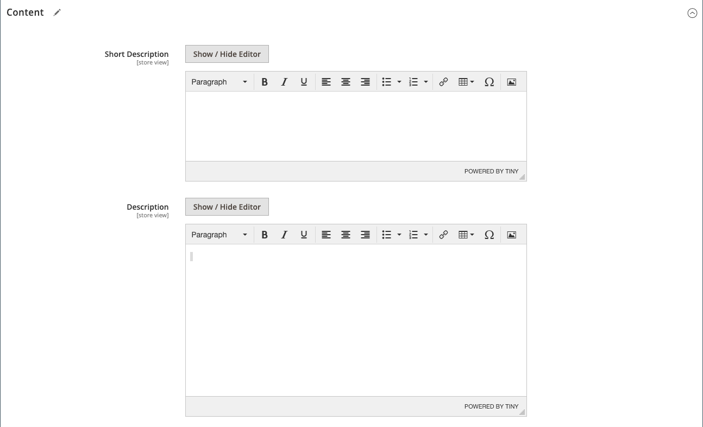

# Paramètres du produit - [!UICONTROL Content]

La section _[!UICONTROL Content]_&#x200B;permet de saisir et de modifier la description principale du produit qui apparaît sur la page du produit. La description courte peut être utilisée dans la plupart des flux RSS et peut également apparaître dans les listes de catalogue, selon [thème](../content-design/themes.md).

## Ajoutez la description du produit dans [!DNL Page Builder]

1. Ouvrez le produit en mode d’édition.

1. Faites défiler vers le bas et développez  la section **[!UICONTROL Content]** .

   {width="600" zoomable="yes"}

1. Saisissez une **[!UICONTROL Short Description]** du produit et utilisez la barre d’outils de l’éditeur [editor](../content-design/editor.md) pour le formater selon vos besoins.

1. Dans le libellé **[!UICONTROL Description]**, cliquez sur **[!UICONTROL Edit with Page Builder]**.

1. Utilisez les outils de contenu [[!DNL Page Builder]](../page-builder/introduction.md) pour [modifier le texte existant](../page-builder/text.md) et ajouter d’autres contenus (si nécessaire).

## Aperçu [!DNL Page Builder]

Lorsque vous développez la section _[!UICONTROL Content]_&#x200B;d’un produit existant contenant du contenu créé avec [!DNL Page Builder], elle affiche un aperçu du contenu **[!UICONTROL Description]**&#x200B;tel qu’il apparaîtrait sur la page du produit. Ouvrez l’espace de travail [!DNL Page Builder], où vous pouvez effectuer les mises à jour nécessaires, en cliquant sur **[!UICONTROL Edit with Page Builder]**.

{width="600" zoomable="yes"}

Cet aperçu du contenu est activé par défaut pour les formulaires de produits et de catégories. Si les performances pâtissent du chargement de l’aperçu, vous pouvez le désactiver dans les paramètres [Configuration de la gestion de contenu](../configuration-reference/general/content-management.md#advanced-content-tools).

## Ajouter la description du produit dans l’éditeur

Si [!DNL Page Builder] est désactivé pour votre boutique, utilisez l’éditeur de texte pour ajouter le contenu du produit. Saisissez uniquement des caractères ASCII simples dans la zone de texte. Si vous collez du texte à partir d’un traitement de texte, enregistrez-le d’abord en tant que fichier .TXT brut pour supprimer tous les caractères de contrôle invisibles. Pour plus d’informations, voir [&#x200B; Utilisation de l’éditeur &#x200B;](../content-design/editor.md).

1. Ouvrez le produit en mode d’édition.

1. Faites défiler vers le bas et développez  la section **[!UICONTROL Content]** .

   {width="600" zoomable="yes"}

1. Saisissez un **[!UICONTROL Short Description]** du produit et du format, le cas échéant.

1. Saisissez le **[!UICONTROL Description]** de produit principal et utilisez la barre d’outils de l’éditeur pour le formater selon vos besoins.

   Vous pouvez faire glisser le coin inférieur droit pour modifier la hauteur de la zone de texte.
