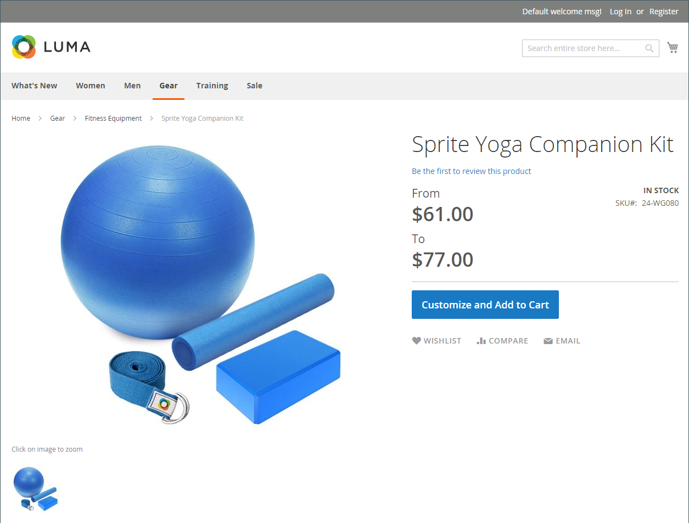
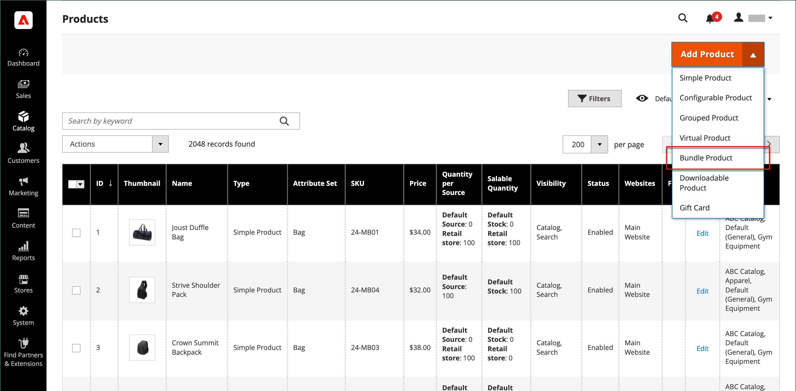
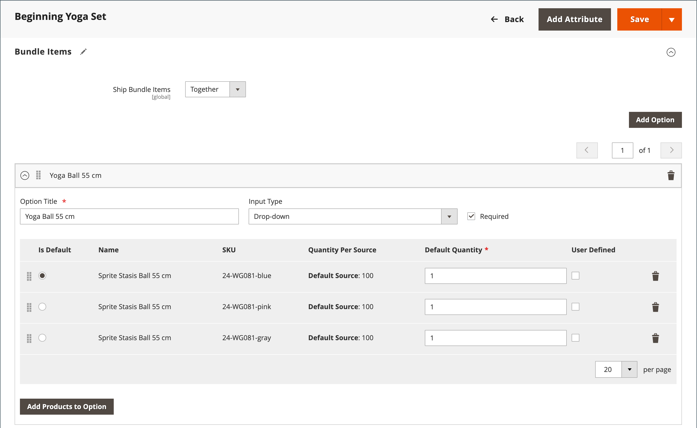
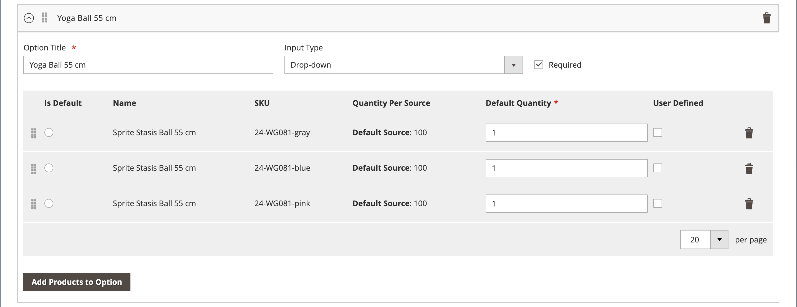
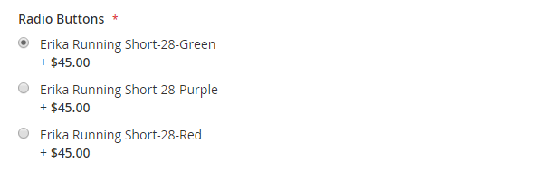

# Produit groupé

Une offre groupée est un produit _créez le vôtre_ personnalisable. Chaque élément d’une offre groupée peut être basé sur l’un des types de produits suivants :

- [Produit simple](product-create-simple.md)
- [Produit Virtuel](product-create-virtual.md)

{width="700" zoomable="yes"}

Les options s’affichent lorsque le client clique sur **[!UICONTROL Customize]** ou **[!UICONTROL Add to Cart]**. Comme les produits inclus dans le lot varient, le SKU, le prix et le poids peuvent être définis sur une valeur dynamique ou fixe.

>[!NOTE]
>
>Le prix minimum annoncé (MAP) n’est pas disponible pour les produits groupés qui utilisent la tarification dynamique.

>[!NOTE]
>
>Le produit parent groupé est toujours affiché automatiquement comme produit de mise à niveau pour tous ses produits enfants.

Si l’option [Achat instantané](../stores-purchase/checkout-instant-purchase.md) est disponible, le bouton _Achat instantané_ s’affiche sous le bouton _Ajouter au panier_ pour chaque article du lot.

{width="600" zoomable="yes"}

Les instructions suivantes vous guident tout au long du processus de création d’une offre groupée à l’aide d’un [modèle de produit](attribute-sets.md), de champs obligatoires et de paramètres de base. Chaque champ obligatoire est signalé par un astérisque rouge (`*`). Lorsque vous avez terminé les principes de base, vous pouvez définir les autres paramètres du produit selon vos besoins.

## Étape 1 : sélection du type de produit

1. Dans la barre latérale _Admin_, accédez à **[!UICONTROL Catalog]** > **[!UICONTROL Products]**.

1. Dans l’angle supérieur droit du menu _[!UICONTROL Add Product]_( {width="25"} ), choisissez **[!UICONTROL Bundle Product]**.

   {width="700" zoomable="yes"}

## Étape 2 : sélection du jeu d’attributs

Pour choisir le [jeu d’attributs](attribute-sets.md) utilisé comme modèle pour le produit, effectuez l’une des opérations suivantes :

- Par **[!UICONTROL Search]**, saisissez le nom du jeu d’attributs,
- Dans la liste, choisissez le jeu d’attributs à utiliser.

Le formulaire est mis à jour pour refléter la modification.

{width="600" zoomable="yes"}

## Étape 3 : effectuez les paramètres requis

1. Saisissez le **[!UICONTROL Product Name]** du produit.

1. Acceptez le **[!UICONTROL SKU]** par défaut basé sur le nom du produit ou saisissez une autre valeur.

   Pour déterminer le type de SKU affecté à chaque élément de lot, procédez comme suit :

   - Un **[!UICONTROL Dynamic SKU]** peut être attribué automatiquement à chaque élément de bundle en ajoutant un suffixe au SKU par défaut. Par défaut, elle est définie sur `Yes`.

   - Si vous préférez attribuer un SKU unique à chaque élément du lot, définissez **[!UICONTROL Dynamic SKU]** sur `No`.

   {width="600" zoomable="yes"}

1. Pour déterminer le prix du lot, effectuez l’une des opérations suivantes :

   - Pour que le prix reflète les options choisies par le client, définissez **[!UICONTROL Dynamic Price]** sur `Yes` et laissez **[!UICONTROL Price]** vide. Dans ce cas, un produit groupé n&#39;a pas son propre prix dans le catalogue et le prix du produit est dérivé du prix des différents produits inclus dans le lot.

   - Pour facturer un prix fixe pour le bundle, définissez **[!UICONTROL Dynamic Price]** sur `No` et saisissez le **[!UICONTROL Price]** que vous souhaitez facturer pour le bundle.

   >[!NOTE]
   >
   >[!UICONTROL Special Price] et [!UICONTROL Customer Group Price] (prix de niveau) sont toujours définis comme pourcentage de remise pour tous les types de produits groupés.

1. Comme le produit n’est pas encore prêt à être publié, définissez **[!UICONTROL Enable Product]** sur `No`.

1. Cliquez sur **[!UICONTROL Save]** et continuez.

   Lorsque le produit est enregistré, le sélecteur [Vue Boutique](introduction.md#product-scope) s’affiche dans le coin supérieur gauche.

1. Choisissez le **[!UICONTROL Store View]** où le produit doit être disponible.

   {width="600" zoomable="yes"}

## Étape 4 : définition des paramètres de base

1. Si le bundle a une tarification fixe, définissez **[!UICONTROL Tax Class]** sur l’une des options suivantes :

   - `None`
   - `Taxable Goods`

   Si le bundle a une tarification dynamique, la taxe est déterminée pour **_chaque_** élément du bundle. Si le bundle a un prix fixe, la taxe est déterminée pour le produit **_entier_** du bundle.

1. Tenez compte des points suivants :

   - Le **[!UICONTROL Quantity]** n’est pas disponible, car la valeur est déterminée pour chaque élément du lot.

   - Par défaut, la **[!UICONTROL Stock Status]** est définie sur `In Stock`.

1. Pour déterminer le poids du lot, effectuez l’une des opérations suivantes :

   - Pour que le poids reflète les options choisies par le client, définissez **[!UICONTROL Dynamic Weight]** définir `Yes` et laissez **[!UICONTROL Weight]** vide.

   - Pour attribuer un poids fixe au lot, définissez **[!UICONTROL Dynamic Weight]** sur `No` et saisissez le **[!UICONTROL Weight]** du lot.

   {width="600" zoomable="yes"}

1. Pour mettre le produit en avant dans la liste des [nouveaux produits](../content-design/widget-new-products-list.md), cochez la case **[!UICONTROL Set Product as New]**.

1. Acceptez le paramètre de **[!UICONTROL Visibility]** par défaut de `Catalog, Search`.

1. Pour attribuer des _[!UICONTROL Categories]_&#x200B;au produit, cliquez sur la zone de **[!UICONTROL Select…]**&#x200B;et effectuez l’une des opérations suivantes :

   **Choisir une catégorie existante :**

   - Commencez à taper dans la zone jusqu’à ce que vous trouviez une correspondance.

   - Cochez la case de chaque catégorie à affecter.

   {width="600" zoomable="yes"}

   **Créer une catégorie :**

   - Cliquez sur **[!UICONTROL New Category]**.

   - Saisissez le **[!UICONTROL Category Name]** et choisissez le **[!UICONTROL Parent Category]**, qui détermine sa position dans la structure du menu.

   - Cliquez sur **[!UICONTROL Create Category]**.

1. Choisissez le **[!UICONTROL Country of Manufacture]**.

   D’autres attributs peuvent décrire le produit. La sélection varie l’ensemble d’attributs et vous pouvez les terminer ultérieurement.

## Étape 5 : ajouter les éléments du lot

La section _[!UICONTROL Bundle Items]_&#x200B;permet d’ajouter des éléments à un type de produit Offre groupée et de modifier la sélection d’éléments actuelle.

{width="600" zoomable="yes"}

1. Faites défiler l’écran jusqu’à la section _Éléments groupés_ et définissez l’**[!UICONTROL Ship Bundle Items]** sur l’une des options suivantes :

   - `Separately`
   - `Together`

   Si vous sélectionnez `Together`, tous les éléments du lot doivent être affectés au même [source](../inventory-management/sources-manage.md).

1. Cliquez sur **[!UICONTROL Add Option]** et procédez comme suit :

   - Saisissez un **[!UICONTROL Option Title]** à utiliser comme libellé du champ.

   - Définissez **[!UICONTROL Input Type]** sur l’une des options suivantes :

      - `Drop-down`
      - `Radio buttons`
      - `Checkbox`
      - `Multiple Select`

   - Pour que le champ soit une entrée obligatoire, cochez la case **[!UICONTROL Required]**.

   - Cliquez sur **[!UICONTROL Add Products to Option]** et cochez la case de chaque produit à inclure dans cette option.

     S’il existe de nombreux produits, utilisez les filtres de liste et les contrôles de pagination pour trouver les produits dont vous avez besoin.

   - Cliquez sur **[!UICONTROL Add Selected Products]**.

     {width="600" zoomable="yes"}

   - Une fois que les éléments apparaissent dans la section _Options_, choisissez un élément à sélectionner en **[!UICONTROL Default]**.

   - Dans la colonne _Quantité par défaut_, saisissez la quantité de chaque article à ajouter au lot lorsqu&#39;un client choisit l&#39;article.

   - Pour permettre aux clients de modifier la quantité d&#39;un article groupé, sélectionnez **[!UICONTROL User Defined]**.

     >[!NOTE]
     >
     >La quantité peut être une valeur prédéfinie ou définie par l’utilisateur. Toutefois, n’affectez pas la propriété _[!UICONTROL User Defined]_&#x200B;aux types d’entrée de case à cocher ou de sélection multiple.

     Par défaut, la quantité par défaut incluse dans un article groupé ne peut pas être modifiée par le client. Cependant, le client peut entrer la quantité de l&#39;article à inclure dans le lot.

     Par exemple, si la Quantité par défaut de la boule Sprite Status est définie sur `2` et que le client commande des `4` de cette option de lot, le nombre total de boules achetées est `8`.

     {width="600" zoomable="yes"}

1. Répétez ces étapes pour chaque élément que vous souhaitez ajouter au lot.

1. Pour modifier l’ordre des éléments dans une section de lot, cliquez sur l’icône _Déplacer_ (  ) au début de la ligne et faites glisser l’élément en position.

   {width="600" zoomable="yes"}

   L’ordre des éléments peut également être modifié dans les données d’un produit groupé exporté, puis réimporté dans le catalogue. Pour plus d’informations, voir [Importer des produits groupés](../systems/data-transfer-bundle-products.md).

   Pour obtenir une meilleure vue de l’espace de travail, réduisez d’abord chaque section, puis faites-la glisser pour la mettre en position.

1. Pour supprimer un élément du lot, cliquez sur l’icône **[!UICONTROL Delete]** (  ).

1. Cliquez ensuite sur **[!UICONTROL Save]**.

## Étape 6 : compléter les informations sur le produit

Faites défiler vers le bas et renseignez les informations des sections suivantes selon vos besoins :

- [Contenu](product-content.md)
- [Images et vidéos](product-images-and-video.md)
- [Optimisation du moteur de recherche](product-search-engine-optimization.md)
- [Produits associés, ventes incitatives et ventes croisées](related-products-up-sells-cross-sells.md)
- [Options personnalisables](settings-advanced-custom-options.md)
- [Produits dans les sites web](settings-basic-websites.md)
- [Conception](settings-advanced-design.md)
- [Options de cadeau](product-gift-options.md)

## Étape 7 : publier le produit

1. Si vous êtes prêt à publier le produit dans le catalogue, définissez **[!UICONTROL Enable Product]** sur `Yes` (  ).

1. Effectuez l’une des opérations suivantes :

   **Méthode 1 :** Enregistrer et prévisualiser

   - Dans le coin supérieur droit, cliquez sur **[!UICONTROL Save]**.

   - Pour afficher le produit dans votre boutique, choisissez **[!UICONTROL Customer View]** dans le menu _Admin_ (  ).

     Le magasin s’ouvre dans un nouvel onglet du navigateur.

   {width="600" zoomable="yes"}

   **Méthode 2 :** Enregistrer et fermer

   Dans le menu _[!UICONTROL Save]_( {width="25"} ), choisissez **[!UICONTROL Save & Close]**.

## Contrôles de saisie

| Contrôle | Description | Exemple |
|--- |--- |--- |
| [!UICONTROL Drop-down] | Affiche une liste déroulante d’options avec le nom et le prix du produit. Un seul élément peut être sélectionné. | {width="200"} |
| [!UICONTROL Radio Buttons] | Affiche un bouton radio pour chaque option, suivi du nom et du prix du produit. Un seul élément peut être sélectionné. | {width="200"} |
| [!UICONTROL Checkbox] | Affiche une case à cocher pour chaque option, suivie du nom et du prix du produit. Plusieurs éléments peuvent être sélectionnés. | {width="200"} |
| [!UICONTROL Multiple Select] | Affiche une liste d’options avec le nom et le prix du produit. Pour sélectionner plusieurs éléments, maintenez la touche Ctrl (PC) ou Commande (Mac) enfoncée et cliquez sur chaque élément. | {width="200"} |

{style="table-layout:auto"}

## Descriptions des champs

| Champ | Description |
|--- |--- |
| [!UICONTROL SKU] | Détermine si un SKU dynamique ou variable est affecté à chaque élément ou si un SKU fixe est utilisé pour le lot. Options : `Fixed` / `Dynamic` |
| [!UICONTROL Weight] | Indique si le poids est calculé en fonction des articles sélectionnés ou s&#39;il s&#39;agit d&#39;un poids fixe pour l&#39;ensemble du lot. Options : `Fixed` / `Dynamic` |
| [!UICONTROL Price View] | Détermine si le prix du produit s&#39;affiche sous la forme d&#39;une plage, du moins cher au plus cher (plage de prix) ou du moins cher (aussi bas que). Options : `Price Range` / `As Low As` |
| Expédier les articles groupés | Spécifie si des articles individuels peuvent être expédiés séparément. |

{style="table-layout:auto"}

## Statut du stock de produits groupés

Le statut du stock de produits groupés est **_automatiquement remplacé par Rupture de stock_** lorsque l’un de ces scénarios se produit :

- Toutes les options sont facultatives et tous les produits associés sont _en rupture de stock_.

- Certaines options sont requises et les produits associés à toutes les options requises sont _En rupture de stock_.

Le statut du stock de produits groupés n’est **_pas automatiquement modifié en Rupture de stock_** lorsque l’un de ces scénarios se produit :

- Toutes les options sont facultatives et au moins un produit associé est _en stock_.

- Certaines options sont requises et au moins un produit associé dans chaque option requise est _En stock_.

## Éléments à retenir

 Les clients peuvent _créer leur propre_ offre groupée de produits.

 L’affectation de tous les produits enfants est annulée et l’affectation de tous les produits de l’offre groupée **_globalement_** est simultanée pour tous les sites web, toutes les boutiques et toutes les vues de boutique.

 Les éléments de bundle peuvent être des produits simples ou virtuels sans options personnalisées.

 La vue Prix peut être définie sur `Price Range` ou `As Low As`.

 SKU et poids peuvent être `Fixed` ou `Dynamic`.

 La quantité peut être un paramètre prédéfini ou une valeur définie par l’utilisateur. Toutefois, n’affectez pas la propriété _[!UICONTROL User Defined]_&#x200B;aux types d’entrée de case à cocher ou de sélection multiple.

 Les éléments groupés peuvent être expédiés ensemble ou séparément.

 Le produit du bundle parent s’affiche toujours automatiquement comme un produit de mise à niveau pour tous ses produits enfants.

 [!UICONTROL Special Price] et [!UICONTROL Customer Group Price] (Prix de niveau) sont toujours définis comme pourcentage de remise pour tous les types de produits groupés.
