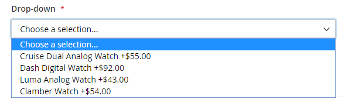

# Produit groupé

Un lot est un _build your own_, un produit personnalisable. Chaque élément d’un lot peut être basé sur l’un des types de produits suivants :

- [Produit simple](product-create-simple.md)
- [Produit virtuel](product-create-virtual.md)

{width="700" zoomable="yes"}

Les options s’affichent lorsque le client clique sur **[!UICONTROL Customize]** ou **[!UICONTROL Add to Cart]**. Étant donné que les produits inclus dans le lot varient, le SKU, le prix et le poids peuvent être définis sur une valeur dynamique ou fixe.

>[!NOTE]
>
>Le prix publicitaire minimum (MAP) n’est pas disponible pour les produits Bundle qui utilisent la tarification dynamique.

>[!NOTE]
>
>Le produit du lot parent s’affiche toujours automatiquement sous la forme d’un produit de vente incitative pour tous ses produits enfants.

Si [Achat instantané](../stores-purchase/checkout-instant-purchase.md) est disponible, le bouton _Achat instantané_ s’affiche sous le bouton _Ajouter au panier_ pour chaque élément du lot.

{width="600" zoomable="yes"}

Les instructions suivantes vous guident tout au long du processus de création d’un produit en regroupement à l’aide d’un [modèle de produit](attribute-sets.md), de champs obligatoires et de paramètres de base. Chaque champ obligatoire est marqué d’un astérisque rouge (`*`). Lorsque vous avez terminé les étapes de base, vous pouvez définir les autres paramètres du produit selon vos besoins.

## Etape 1 : Sélection du type de produit

1. Sur la barre latérale _Admin_, accédez à **[!UICONTROL Catalog]** > **[!UICONTROL Products]**.

1. Dans le coin supérieur droit du menu _[!UICONTROL Add Product]_( {width="25"} ), choisissez **[!UICONTROL Bundle Product]**.

   {width="700" zoomable="yes"}

## Étape 2 : sélection du jeu d’attributs

Pour choisir le [jeu d’attributs](attribute-sets.md) utilisé comme modèle pour le produit, effectuez l’une des opérations suivantes :

- Pour **[!UICONTROL Search]**, saisissez le nom du jeu d’attributs,
- Dans la liste, choisissez le jeu d’attributs à utiliser.

Le formulaire est mis à jour pour refléter la modification.

{width="600" zoomable="yes"}

## Étape 3 : Définissez les paramètres requis

1. Saisissez le produit **[!UICONTROL Product Name]**.

1. Acceptez la valeur par défaut **[!UICONTROL SKU]** basée sur le nom du produit ou saisissez une autre valeur.

   Pour déterminer le type de SKU affecté à chaque élément de lot, procédez comme suit :

   - Un **[!UICONTROL Dynamic SKU]** peut être attribué automatiquement à chaque élément de lot en ajoutant un suffixe au SKU par défaut. Par défaut, il est défini sur `Yes`.

   - Si vous préférez attribuer un SKU unique pour chaque élément de lot, définissez **[!UICONTROL Dynamic SKU]** sur `No`.

   {width="600" zoomable="yes"}

1. Pour déterminer le prix du lot, effectuez l’une des opérations suivantes :

   - Pour que le prix reflète les options sélectionnées par le client, définissez **[!UICONTROL Dynamic Price]** sur `Yes` et laissez **[!UICONTROL Price]** vide. Dans ce cas, un produit groupé n’a pas son propre prix du catalogue et le prix du produit est dérivé du prix des produits individuels inclus dans le lot.

   - Pour facturer un prix fixe pour le lot, définissez **[!UICONTROL Dynamic Price]** sur `No` et saisissez le **[!UICONTROL Price]** que vous souhaitez facturer pour le lot.

   >[!NOTE]
   >
   >[!UICONTROL Special Price] et [!UICONTROL Customer Group Price] (Prix de niveau) sont toujours définis comme pourcentage de remise pour tous les types de produits regroupés.

1. Comme le produit n’est pas encore prêt à être publié, définissez **[!UICONTROL Enable Product]** sur `No`.

1. Cliquez sur **[!UICONTROL Save]** et continuez.

   Lorsque le produit est enregistré, le programme de sélection [Affichage magasin](introduction.md#product-scope) s’affiche dans le coin supérieur gauche.

1. Sélectionnez l’ **[!UICONTROL Store View]** où le produit doit être disponible.

   {width="600" zoomable="yes"}

## Étape 4 : définition des paramètres de base

1. Si le lot a une tarification fixe, définissez **[!UICONTROL Tax Class]** sur l’une des options suivantes :

   - `None`
   - `Taxable Goods`

   Si le lot a des tarifs dynamiques, la taxe est déterminée pour **_chaque article_** du lot. Si le lot a une tarification fixe, la taxe est déterminée pour le produit **_full_** du lot.

1. Prenez note des points suivants :

   - **[!UICONTROL Quantity]** n’est pas disponible, car la valeur est déterminée pour chaque élément de lot.

   - Par défaut, **[!UICONTROL Stock Status]** est défini sur `In Stock`.

1. Pour déterminer le poids du lot, effectuez l’une des opérations suivantes :

   - Pour que le poids reflète les options sélectionnées par le client, définissez **[!UICONTROL Dynamic Weight]** set `Yes` et laissez **[!UICONTROL Weight]** vide.

   - Pour attribuer un poids fixe au lot, définissez **[!UICONTROL Dynamic Weight]** sur `No` et saisissez le **[!UICONTROL Weight]** du lot.

   {width="600" zoomable="yes"}

1. Pour afficher le produit dans la liste de [nouveaux produits](../content-design/widget-new-products-list.md), cochez la case **[!UICONTROL Set Product as New]** .

1. Acceptez le paramètre par défaut **[!UICONTROL Visibility]** de `Catalog, Search`.

1. Pour attribuer _[!UICONTROL Categories]_&#x200B;au produit, cliquez sur la zone **[!UICONTROL Select…]**&#x200B;et effectuez l’une des opérations suivantes :

   **Choisissez une catégorie existante :**

   - Commencez à taper dans la zone jusqu’à ce que vous trouviez une correspondance.

   - Cochez la case de chaque catégorie à attribuer.

   {width="600" zoomable="yes"}

   **Créer une catégorie :**

   - Cliquez sur **[!UICONTROL New Category]**.

   - Saisissez le **[!UICONTROL Category Name]** et choisissez le **[!UICONTROL Parent Category]**, qui détermine sa position dans la structure de menus.

   - Cliquez sur **[!UICONTROL Create Category]**.

1. Sélectionnez le **[!UICONTROL Country of Manufacture]**.

   Il peut y avoir des attributs supplémentaires qui décrivent le produit. La sélection varie le jeu d’attributs et vous pouvez les terminer ultérieurement.

## Étape 5 : Ajout des éléments du lot

La section _[!UICONTROL Bundle Items]_&#x200B;est utilisée pour ajouter des éléments à un type de produit Bundle et pour modifier la sélection actuelle d’éléments.

{width="600" zoomable="yes"}

1. Faites défiler l’écran jusqu’à la section _Éléments groupés_ et définissez **[!UICONTROL Ship Bundle Items]** sur l’un des éléments suivants :

   - `Separately`
   - `Together`

   Si vous sélectionnez `Together`, tous les éléments de lot doivent se voir attribuer le même [source](../inventory-management/sources-manage.md).

1. Cliquez sur **[!UICONTROL Add Option]** et procédez comme suit :

   - Saisissez un **[!UICONTROL Option Title]** à utiliser comme libellé de champ.

   - Définissez **[!UICONTROL Input Type]** sur l’une des options suivantes :

      - `Drop-down`
      - `Radio buttons`
      - `Checkbox`
      - `Multiple Select`

   - Pour que le champ devienne une entrée obligatoire, cochez la case **[!UICONTROL Required]** .

   - Cliquez sur **[!UICONTROL Add Products to Option]** et cochez la case de chaque produit que vous souhaitez inclure dans cette option.

     S’il existe de nombreux produits, utilisez les filtres de liste et les contrôles de pagination pour trouver les produits dont vous avez besoin.

   - Cliquez sur **[!UICONTROL Add Selected Products]**.

     {width="600" zoomable="yes"}

   - Une fois les éléments affichés dans la section _Options_, choisissez un élément pour la sélection **[!UICONTROL Default]**.

   - Dans la colonne _Quantité par défaut_, saisissez la quantité de chaque élément à ajouter au lot lorsqu’un client choisit l’élément.

   - Pour permettre aux clients de modifier la quantité d&#39;un élément de lot, sélectionnez **[!UICONTROL User Defined]**.

     >[!NOTE]
     >
     >La quantité peut être une valeur prédéfinie ou définie par l’utilisateur. Cependant, n’affectez pas la propriété _[!UICONTROL User Defined]_&#x200B;à la case à cocher ou aux types d’entrée à sélection multiple.

     Par défaut, la quantité par défaut incluse dans un élément de lot ne peut pas être modifiée par le client. Cependant, le client peut saisir la quantité de l’article à inclure dans le lot.

     Par exemple, si la quantité par défaut du lot d’état Sprite est définie sur `2` et que le client commande `4` de cette option de lot, le nombre total de balles achetées est `8`.

     {width="600" zoomable="yes"}

1. Répétez ces étapes pour chaque élément à ajouter au lot.

1. Pour modifier l’ordre des éléments dans une section de lot, cliquez sur l’icône _Déplacer_ (  ) au début de la ligne et faites glisser l’élément en position.

   {width="600" zoomable="yes"}

   L’ordre des éléments peut également être modifié dans les données d’un produit en bundle exporté, puis réimporté dans le catalogue. Pour plus d’informations, voir [Importation de produits groupés](../systems/data-transfer-bundle-products.md).

   Pour disposer d’une meilleure vue de l’espace de travail, réduisez d’abord chaque section, puis faites-la glisser jusqu’à sa position.

1. Pour supprimer un élément du lot, cliquez sur l’icône **[!UICONTROL Delete]** (  ).

1. Une fois l’opération terminée, cliquez sur **[!UICONTROL Save]**.

## Étape 6 : renseigner les informations sur le produit

Faites défiler l’écran vers le bas et renseignez les informations des sections suivantes selon vos besoins :

- [Contenu](product-content.md)
- [Images et vidéos](product-images-and-video.md)
- [Optimisation du moteur de recherche](product-search-engine-optimization.md)
- [Produits associés, ventes consécutives et ventes croisées](related-products-up-sells-cross-sells.md)
- [Options personnalisables](settings-advanced-custom-options.md)
- [Produits sur les sites web](settings-basic-websites.md)
- [Conception](settings-advanced-design.md)
- [Options de cadeau](product-gift-options.md)

## Étape 7 : Publish du produit

1. Si vous êtes prêt à publier le produit dans le catalogue, définissez **[!UICONTROL Enable Product]** sur `Yes` (  ).

1. Effectuez l’une des opérations suivantes :

   **Méthode 1 :** Enregistrer et prévisualiser

   - Dans le coin supérieur droit, cliquez sur **[!UICONTROL Save]**.

   - Pour afficher le produit dans votre boutique, sélectionnez **[!UICONTROL Customer View]** dans le menu _Admin_ (  ).

     Le magasin s’ouvre dans un nouvel onglet du navigateur.

   {width="600" zoomable="yes"}

   **Méthode 2 :** Enregistrer et fermer

   Dans le menu _[!UICONTROL Save]_( {width="25"} ), choisissez **[!UICONTROL Save & Close]**.

## Contrôles de saisie

| Contrôle | Description | Exemple |
|--- |--- |--- |
| [!UICONTROL Drop-down] | Affiche une liste déroulante d’options avec le nom et le prix du produit. Un seul élément peut être sélectionné. | {width="200"} |
| [!UICONTROL Radio Buttons] | Affiche un bouton radio pour chaque option, suivi du nom et du prix du produit. Un seul élément peut être sélectionné. | {width="200"} |
| [!UICONTROL Checkbox] | Affiche une case à cocher pour chaque option, suivie du nom et du prix du produit. Plusieurs éléments peuvent être sélectionnés. | {width="200"} |
| [!UICONTROL Multiple Select] | Affiche une liste d’options avec le nom et le prix du produit. Pour sélectionner plusieurs éléments, maintenez la touche Ctrl (PC) ou la touche Commande (Mac) enfoncée, puis cliquez sur chaque élément. | {width="200"} |

{style="table-layout:auto"}

## Descriptions des champs

| Champ | Description |
|--- |--- |
| [!UICONTROL SKU] | Détermine si chaque élément se voit attribuer une variable ou un SKU dynamique ou si un SKU fixe est utilisé pour le lot. Options : `Fixed` / `Dynamic` |
| [!UICONTROL Weight] | Indique si le poids est calculé en fonction des éléments sélectionnés ou s’il s’agit d’un poids fixe pour l’ensemble du lot. Options : `Fixed` / `Dynamic` |
| [!UICONTROL Price View] | Détermine si le prix du produit s’affiche sous la forme d’une plage, du moins cher au plus cher (Plage de prix) ou avec le moins cher affiché (Aussi bas que). Options : `Price Range` / `As Low As` |
| Ship Bundle Items | Indique si des éléments individuels peuvent être fournis séparément. |

{style="table-layout:auto"}

## Statut du stock de produit groupé

L’état du stock de produits en bundle est **_automatiquement remplacé par Out of Stock_** lorsque l’un de ces scénarios se produit :

- Toutes les options sont facultatives et tous les produits associés sont _En rupture de stock_.

- Certaines options sont requises et les produits associés à toutes les options requises sont _Out of Stock_.

L’état du stock de produits en bundle est **_non automatiquement remplacé par Out of Stock_** lorsque l’un de ces scénarios se produit :

- Toutes les options sont facultatives et au moins un produit associé est _En stock_.

- Certaines options sont requises et au moins un produit associé dans chaque option requise est _En stock_.

## Les choses à retenir

 Les clients peuvent _créer leur propre produit_ groupé.

 Tous les produits enfants sont attribués et non attribués à partir du produit groupé **_globalement_** pour tous les sites web, magasins et vues de magasin en même temps.

 Les éléments de bundle peuvent être des produits simples ou virtuels sans options personnalisées.

 L’option Affichage du prix peut être définie sur `Price Range` ou `As Low As`.

 Le SKU et le poids peuvent être `Fixed` ou `Dynamic`.

 La quantité peut être une valeur prédéfinie ou définie par l’utilisateur. Cependant, n’affectez pas la propriété _[!UICONTROL User Defined]_&#x200B;à la case à cocher ou aux types d’entrée à sélection multiple.

 Les éléments du bundle peuvent être livrés ensemble ou séparément.

 Le produit du lot parent s’affiche toujours automatiquement en tant que produit de vente incitative pour tous ses produits enfants.

 [!UICONTROL Special Price] et [!UICONTROL Customer Group Price] (Prix de niveau) sont toujours définis comme pourcentage de remise pour tous les types de produits en regroupement.
