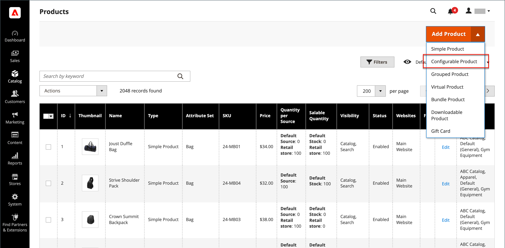
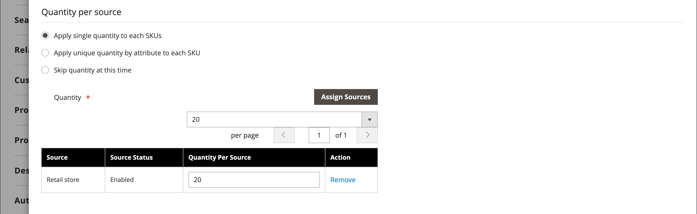

# Produit configurable

Un produit configurable ressemble à un seul produit avec une liste déroulante de chaque variation. Chaque élément de liste est en fait un produit simple distinct avec un SKU unique, ce qui permet d’effectuer le suivi de l’inventaire pour chaque variation de produit. Vous pouvez obtenir un effet similaire en utilisant un produit simple avec des options personnalisées, mais sans la possibilité d’effectuer le suivi de l’inventaire pour chaque variation.

Les instructions suivantes illustrent le processus de création d’un produit configurable à l’aide d’un [modèle de produit](attribute-sets.md), de champs obligatoires et de paramètres de base. Chaque champ obligatoire est signalé par un astérisque rouge (`*`). Lorsque vous avez terminé les principes de base, vous pouvez définir les autres paramètres du produit selon vos besoins.

{width="700" zoomable="yes"}

## Partie 1 : création d’un produit configurable

Bien qu’un produit configurable utilise plus de SKU et puisse prendre un peu plus de temps à configurer au début, il peut vous faire gagner du temps à la fin. Si vous prévoyez faire croître votre entreprise, le type de produit configurable est un bon choix pour les produits à options multiples.

Avant de commencer, préparez un [jeu d’attributs](attribute-sets.md) qui comprend un attribut défini sur l’un des types d’entrée autorisés pour chaque variation de produit. Par exemple, le jeu d’attributs peut inclure des attributs de liste déroulante pour la couleur et la taille.

Les propriétés de chaque attribut utilisé pour une variation de produit configurable doivent présenter les paramètres suivants :

### Exigences d’attribut de variation de produit

| Propriété | Paramètre |
|--- |--- |
| [!UICONTROL Scope] | `Global` |
| [!UICONTROL Catalog Input Type for Store Owner] | Le type d’entrée de tout attribut utilisé pour une variation de produit doit être l’un des suivants : `Dropdown`, `Visual Swatch` ou `Text Swatch`. |
| [!UICONTROL Values Required] | `Yes` |

{style="table-layout:auto"}

### Étape 1 : sélection du type de produit

1. Dans la barre latérale _Admin_, accédez à **[!UICONTROL Catalog]** > **[!UICONTROL Products]**.

1. Dans le menu _[!UICONTROL Add Product]_( {width="25"} ) dans le coin supérieur droit, choisissez **[!UICONTROL Configurable Product]**.

   {width="700" zoomable="yes"}

### Étape 2 : sélection du jeu d’attributs

Le [jeu d’attributs](attribute-sets.md) détermine la sélection des champs utilisés dans le produit. Le jeu d’attributs utilisé dans l’exemple suivant comporte des attributs pour la couleur et la taille. Le nom du jeu d’attributs est indiqué en haut de la page et est initialement défini sur `Default`.

1. Pour sélectionner le jeu d’attributs du produit, cliquez sur le champ en haut de la page et effectuez l’une des opérations suivantes :

   - Par **[!UICONTROL Search]**, saisissez le nom du jeu d’attributs.
   - Dans la liste, choisissez le jeu d’attributs à utiliser.

   Le formulaire est mis à jour pour refléter la modification.

1. Si vous souhaitez ajouter un autre attribut au jeu d’attributs, cliquez sur **[!UICONTROL Add Attribute]** et suivez les instructions de la section [Ajout d’un attribut](product-attributes-add.md).

   {width="600" zoomable="yes"}

### Étape 3 : effectuez les paramètres requis

1. Saisissez le **[!UICONTROL Product Name]** du produit.

1. Acceptez le **[!UICONTROL SKU]** par défaut basé sur le nom du produit ou saisissez-en un autre.

1. Saisissez le **[!UICONTROL Price]** du produit.

1. Comme le produit n’est pas encore prêt à être publié, définissez **[!UICONTROL Enable Product]** sur `No`.

1. cliquez sur **[!UICONTROL Save]** et continuez.

   Lorsque le produit est enregistré, le sélecteur [Vue Boutique](introduction.md#product-scope) s’affiche dans le coin supérieur gauche.

1. Choisissez le **[!UICONTROL Store View]** où le produit doit être disponible.

   {width="600" zoomable="yes"}

### Étape 4 : définition des paramètres de base

1. Définissez **[!UICONTROL Tax Class]** sur l’une des options suivantes :

   - `None`
   - `Taxable Goods`

1. La **[!UICONTROL Quantity]** est déterminée par les variations du produit, vous pouvez donc la laisser vide.

1. Laissez le **[!UICONTROL Stock Status]** défini.

   L&#39;état du stock d&#39;un produit configurable est déterminé par chaque configuration associée. Étant donné que le produit a été enregistré sans saisir de quantité, la **[!UICONTROL Stock Status]** est définie sur `Out of Stock`.

   >[!NOTE]
   >
   >Le **Statut du stock** du produit configurable est un paramètre contrôlé **_semi-manuellement_**. Elle est partiellement contrôlée par l&#39;état des stocks de ses produits fils. Il fait partie d’un calcul d’état des stocks **_à critères multiples_** décrit dans la section [&#x200B; Configurer l’état des stocks](#configure-the-stock-status).

1. Saisissez le **[!UICONTROL Weight]** du produit.

>[!NOTE]
>
>Un produit configurable doit toujours avoir un poids. Si vous sélectionnez **[!UICONTROL This item has no weight]** dans la liste déroulante, elle est automatiquement remplacée par **[!UICONTROL This item has weight]** après l’enregistrement du produit.

1. Acceptez le paramètre de **[!UICONTROL Visibility]** par défaut de `Catalog, Search`.

1. Pour mettre le produit en avant dans la liste des [nouveaux produits](../content-design/widget-new-products-list.md), cochez la case **[!UICONTROL Set Product as New]**.

1. Pour attribuer des catégories au produit, cliquez sur la zone de **[!UICONTROL Select…]** et effectuez l’une des opérations suivantes :

   **Choisissez une catégorie existante** :

   - Commencez à taper dans la zone jusqu’à ce que vous trouviez une correspondance.

   - Cochez la case de la catégorie à affecter.

   {width="600" zoomable="yes"}

   **Créer une catégorie** :

   - Cliquez sur **[!UICONTROL New Category]**.

   - Saisissez le **[!UICONTROL Category Name]** et choisissez le **[!UICONTROL Parent Category]**, qui détermine sa position dans la structure du menu.

   s- Cliquez sur **[!UICONTROL Create Category]**.

1. Choisissez le **[!UICONTROL Country of Manufacture]**.

   D’autres attributs peuvent être utilisés pour décrire le produit. La sélection varie en fonction du jeu d’attributs. Vous pouvez les effectuer ultérieurement.

### Étape 5 : Enregistrer et continuer

C’est le moment d’enregistrer votre travail. Dans le coin supérieur droit, cliquez sur **[!UICONTROL Save]**. Dans la série d’étapes suivante, vous allez configurer les configurations pour chaque variation du produit.

## Partie 2 : ajout de configurations

L’exemple suivant montre comment ajouter des configurations pour trois couleurs et trois tailles. Au total, neuf produits simples sont créés avec des SKU uniques pour couvrir toutes les combinaisons possibles de variations. Par défaut, le nom du produit et le SKU de chaque variation sont basés sur la valeur d’attribut et le nom du produit parent ou le SKU.

La barre de progression en haut de la page indique où vous en êtes dans le processus et vous guide tout au long de chaque étape.

### Étape 1 : sélection des attributs

1. En continuant depuis le haut, faites défiler l’écran vers le bas jusqu’à la section _[!UICONTROL Configurations]_&#x200B;et cliquez sur **[!UICONTROL Create Configurations]**.

   {width="600" zoomable="yes"}

1. Cochez la case de chaque attribut à inclure en tant que configuration.

   Pour cet exemple, `color` et `size` sont sélectionnés.

   {width="600" zoomable="yes"}

   La liste inclut tous les attributs du jeu d’attributs pouvant être utilisés dans un produit configurable.

1. Si vous souhaitez ajouter un attribut, cliquez sur **[!UICONTROL Create New Attribute]** et procédez comme suit :

   - Renseignez les propriétés de l’attribut.

   - Cliquez sur **[!UICONTROL Save Attribute]**.

   - Cochez la case correspondant à l’attribut .

1. Dans le coin supérieur droit, cliquez sur **[!UICONTROL Next]**.

### Étape 2 : saisir les valeurs d’attribut

1. Pour chaque attribut, cochez la case des valeurs qui s’appliquent au produit.

   {width="600" zoomable="yes"}

1. Pour réorganiser les attributs, saisissez l’icône _Réorganiser_ (  ) et déplacez la section vers un nouvel emplacement.

   L’ordre détermine la position des listes déroulantes sur la page de produits.

1. Dans la barre de progression, cliquez sur **[!UICONTROL Next]**.

### Étape 3 : configurer les images, le prix et la quantité

Cette étape détermine les images, le prix et la quantité de chaque configuration. Les options disponibles sont les mêmes pour chacune et vous ne pouvez en choisir qu’une seule. Vous pouvez appliquer le même paramètre à tous les SKU, appliquer un paramètre unique à chaque SKU ou ignorer les paramètres pour l’instant.

Choisissez les options de configuration qui s’appliquent.

Utilisez l’une des méthodes suivantes pour configurer le **[!UICONTROL images]** :

**Méthode 1 :** appliquer un seul ensemble d’images à tous les SKU

1. Sélectionnez **[!UICONTROL Apply single set of images to all SKUs]**.

1. Accédez à chaque image que vous souhaitez inclure dans la galerie de produits ou faites-les glisser dans la zone.

{width="600" zoomable="yes"}

**Méthode 2 :** appliquer des images uniques pour chaque SKU

Comme l’image du produit parent est déjà téléchargée, vous pouvez utiliser cette option pour télécharger une image de chaque couleur. Vous pouvez ajouter une autre image qui s’affiche dans le panier lorsque quelqu’un achète l’article dans une couleur spécifique.

1. Sélectionnez **[!UICONTROL Apply unique images by attribute to each SKU]**.

1. Sélectionnez les **[!UICONTROL Attribute]** illustrées par les images, telles que `color`.

1. Pour chaque valeur d’attribut, accédez aux images à utiliser pour cette configuration ou faites-les glisser vers la zone.

   Si vous faites glisser l’image vers une zone de valeur, elle apparaît également dans les sections pour les autres valeurs. Si vous souhaitez supprimer une image, cliquez sur l’icône _Corbeille_ ().

   {width="600" zoomable="yes"}

Utilisez l’une des méthodes suivantes pour configurer le **[!UICONTROL prices]** :

>[!NOTE]
>
>Un produit configurable n&#39;a pas son propre prix dans le catalogue. Le prix configurable du produit est dérivé de ses produits enfants [!UICONTROL In Stock].

**Méthode 1 :** appliquer le même prix à tous les SKU

1. Si le prix est le même pour toutes les variations, sélectionnez **[!UICONTROL Apply single price to all SKUs]**.

1. Saisissez le **[!UICONTROL Price]**.

   {width="600" zoomable="yes"}

**Méthode 2 :** appliquer un prix différent pour chaque SKU

1. Si le prix diffère pour chaque produit ou pour certaines variantes du produit, sélectionnez **[!UICONTROL Apply unique prices by attribute to each SKU]**.

1. Sélectionnez le **[!UICONTROL Attribute]** qui est à la base de la différence de prix.

1. Saisissez le **[!UICONTROL Price]** de chaque valeur d’attribut.

   Dans cet exemple, la taille XL coûte plus cher.

   {width="600" zoomable="yes"}

Utilisez l’une des méthodes suivantes pour configurer le **[!UICONTROL Quantity]** :

**Méthode 1 :** appliquer la même quantité à tous les SKU

Si la quantité est identique pour tous les SKU, sélectionnez **[!UICONTROL Apply single quantity to each SKU]** et spécifiez la quantité.

_Marchands monosources_ - Saisissez le **[!UICONTROL Quantity]**.

_Marchands Multi Source utilisant [Inventory management](../inventory-management/introduction.md)_ - Attribuez des sources et ajoutez des quantités pour toutes les variantes de produits générées :

1. Sélectionnez l’option **[!UICONTROL Apply single quantity to each SKU]** .

1. Pour ajouter une source, cliquez sur **[!UICONTROL Assign Sources]**.

1. Recherchez ou recherchez une source à ajouter. Cochez la case en regard des sources que vous souhaitez ajouter pour le produit.

1. Entrez un montant de stock disponible par origine.

   {width="600" zoomable="yes"}

**Méthode 2 :** appliquer une quantité différente par attribut

_Marchands monosources_ - Saisissez le **[!UICONTROL Quantity]**.

_Marchands Multi Source utilisant [Inventory management](../inventory-management/introduction.md)_ - Attribuez des sources et ajoutez des quantités pour toutes les variantes de produits générées :

1. Si la quantité est différente pour chaque SKU, sélectionnez **[!UICONTROL Apply unique quantity by attribute to each SKU]**.

1. Saisissez le **[!UICONTROL Quantity]** de chacun d’eux.

   {width="600" zoomable="yes"}

Lorsque la configuration des images, du prix et de la quantité est terminée, cliquez sur **[!UICONTROL Next]** dans le coin supérieur droit.

### Étape 4 : générer les configurations de produit

Attendez que la liste des produits s’affiche et effectuez l’une des opérations suivantes :

- Si les configurations vous conviennent, cliquez sur **[!UICONTROL Generate Products]**.

- Pour apporter des corrections, cliquez sur **[!UICONTROL Back]**.

{width="600" zoomable="yes"}

Les variations actuelles du produit s’affichent au bas de la section _Configuration_.

{width="600" zoomable="yes"}

### Étape 5 : ajouter des images de produit

1. Faites défiler vers le bas et développez  la section _[!UICONTROL Images and Videos]_.

1. Cliquez sur la mosaïque _Appareil photo_ et accédez à l’image principale que vous souhaitez utiliser pour le produit configurable.

Pour plus d’informations, voir [&#x200B; Images et vidéo &#x200B;](product-images-and-video.md).

### Étape 6 : compléter les informations sur le produit

Faites défiler vers le bas et renseignez les informations des sections suivantes selon vos besoins :

- [Contenu](product-content.md)

- [Produits associés, ventes incitatives et ventes croisées](related-products-up-sells-cross-sells.md)

- [Optimisation du moteur de recherche](product-search-engine-optimization.md)

- [Options personnalisables](settings-advanced-custom-options.md)

- [Produits dans les sites web](settings-basic-websites.md)

- [Conception](settings-advanced-design.md)

- [Options de cadeau](product-gift-options.md)

### Étape 7 : publier le produit

1. Si vous êtes prêt à publier le produit dans le catalogue, définissez **[!UICONTROL Enable Product]** sur `Yes` et effectuez l’une des opérations suivantes :

   - **Méthode 1 :** Enregistrer et prévisualiser

      - Dans le coin supérieur droit, cliquez sur **[!UICONTROL Save]**.

      - Pour afficher le produit dans votre boutique, choisissez **[!UICONTROL Customer View]** dans le menu _Admin_ (  ).

     Le magasin s’ouvre dans un nouvel onglet du navigateur.

     {width="600" zoomable="yes"}

   - **Méthode 2 :** Enregistrer et fermer

     Dans le menu _[!UICONTROL Save]_( {width="25"} ), choisissez **[!UICONTROL Save & Close]**.

### Étape 8 : configuration des miniatures de panier

Si vous disposez d’une image différente pour chaque variation, vous pouvez définir la configuration afin d’utiliser l’image correcte pour la miniature du panier.

1. Dans la barre latérale _Admin_, accédez à **[!UICONTROL Stores]** > _[!UICONTROL Settings]_>**[!UICONTROL Configuration]**.

1. Dans le panneau de gauche, développez **[!UICONTROL Sales]** et choisissez **[!UICONTROL Checkout]** en dessous.

1. Développez  la section _[!UICONTROL Shopping Cart]_.

1. Définissez **[!UICONTROL Configurable Product Image]** sur `Product Thumbnail Itself`.

1. Cliquez ensuite sur **[!UICONTROL Save Config]**.

   {width="600" zoomable="yes"}

## Configuration du statut du stock

Le statut de stock de produit configurable est différent du statut de stock du produit simple, où il s’agit d’une représentation directe de la disponibilité du produit. Pour un produit configurable, le statut du stock fait partie d&#39;un calcul de statut de stock **_critères multiples_**.

### Vue d’ensemble

Les principes fondamentaux des relations d&#39;état des stocks sont les suivants :

- Lorsque vous modifiez la **[!UICONTROL Stock Status]** du produit configurable en tant que `Out of Stock` et que vous cliquez sur **[!UICONTROL Save]**, il n&#39;est **_pas contrôlé_** par les statuts de stock de ses produits enfants. Il est toujours affiché comme `Out of Stock` dans Admin et sur le Storefront.

- Lorsque vous définissez la **[!UICONTROL Stock Status]** du produit configurable sur `In Stock` et que vous cliquez sur **[!UICONTROL Save]**, elle n’est **_partiellement contrôlée_** par les statuts de stock de ses produits enfants, qui sont reflétés dans Admin et sur Storefront.

### Description détaillée

Le _Statut des stocks_ du produit configurable est partiellement contrôlé par le statut des stocks de ses produits enfants, et selon les calculs de statut des stocks **_critères multiples_** suivants :

#### Avec la source/le stock par défaut uniquement :

- Si le statut du stock de produit configurable est **_manuellement_** défini sur `Out of Stock` par un utilisateur administrateur, un import de fichier ou un appel API, il reste `Out of Stock` à la fois sur les **_Admin_** et **_Storefront_** jusqu’à ce qu’il soit **_manuellement_** modifié en `In stock` par un utilisateur administrateur, un import de fichier ou un appel API. Il ne peut pas être contrôlé par l&#39;état des stocks de ses produits enfants.

- Si l’état du stock du produit configurable est **_manuellement_** défini sur `In Stock` par un utilisateur administrateur, une importation de fichier ou un appel API, son état du stock est **_automatiquement_** contrôlé par l’état du stock de ses produits enfants sur les deux **_Admin_** et **_Storefront_**.

>[!NOTE]
>
>Les stocks et sources personnalisés font partie de l’extension [Inventory management](../inventory-management/sources-stocks.md) et il est vivement recommandé d’utiliser cet outil exclusivement pour gérer le stock et la source. Les fonctions source et stock par défaut font partie du module `CatalogInventory`, qui est désormais obsolète.

#### Avec au moins une source/un stock personnalisé(e) :

- Si la valeur configurable de Statut du stock de produit est **_manuellement_** définie sur `Out of Stock` par un utilisateur administrateur, un import de fichier ou un appel API, elle reste `Out of Stock` sur les deux **_Admin_** et **_Storefront_** jusqu’à ce qu’elle soit **_manuellement_** remplacée par `In Stock` par un utilisateur administrateur, un import de fichier ou un appel API. Il **_ne peut pas_** être contrôlé par l’état des stocks de ses produits enfants.

- Si la valeur configurable de Statut du stock du produit est **_manuellement_** définie sur `In Stock` par un utilisateur administrateur, un import de fichier ou un appel API, son statut de stock est **_automatiquement_** contrôlé par le statut du stock de ses produits enfants sur le **_Storefront_** uniquement.

- Si la valeur configurable de Statut du stock de produit est **_manuellement_** définie sur `In Stock` par un utilisateur administrateur, un import de fichier ou un appel API, elle reste `In Stock` dans le **_Administrateur_** jusqu’à ce qu’elle soit **_manuellement_** remplacée par `Out of Stock` par un utilisateur administrateur, un import de fichier ou un appel API. Il **_ne peut pas_** être contrôlé par l’état des stocks de ses produits enfants.

## Éléments à retenir

- Un produit configurable permet à l’acheteur de choisir des options parmi les types d’entrée de liste déroulante, de sélection multiple, d’échantillon visuel et d’échantillon de texte. Chaque option est un produit simple et distinct.

- [État du stock](../inventory-management/sources-stocks.md) pour un produit configurable est un paramètre contrôlé de manière semi-manuelle. Il est différent de l’état du stock du produit simple, où il est une représentation directe de la disponibilité du produit. Pour un produit configurable, le statut du stock fait partie d&#39;un calcul de statut du stock à critères multiples.

- Les produits enfants configurables peuvent être des produits simples ou virtuels **sans options personnalisées**. Pour rendre virtuels des produits enfants personnalisés, vous devez sélectionner `Тhis item has no weight` pour le paramètre **[!UICONTROL Weight]** de chacun d’eux.

- L’affectation de tous les produits enfants est annulée et continue à partir du produit configurable **_globalement_** pour tous les sites web, magasins et vues de magasin en même temps.

- Un produit configurable n&#39;a pas son propre prix dans le catalogue. Le prix configurable du produit est dérivé de ses produits enfants [!UICONTROL In Stock].

- Les attributs utilisés pour les variations de produit doivent avoir une portée globale et le client doit être tenu de choisir une valeur. Les attributs de variation de produit doivent être inclus dans le jeu d’attributs utilisé comme modèle pour le produit configurable.

- Le jeu d’attributs utilisé comme modèle pour un produit configurable doit inclure les attributs contenant les valeurs nécessaires pour chaque variation de produit.

- L’image de miniature du panier peut être définie pour afficher l’image à partir de l’enregistrement de produit configurable ou de la variation de produit.

- Les [attributs d’échantillon](swatches.md#create-swatches-for-products) peuvent être configurés pour ne pas afficher les images de produits simples correspondantes lorsque l’échantillon est sélectionné en définissant la valeur de l’option **[!UICONTROL Update Product Preview Image]** sur `No` dans la page de modification des attributs dans l’Administration.

- Le thème contrôle le comportement de la galerie d’images lorsqu’un utilisateur ou une utilisatrice passe d’une configuration de produit à l’autre. Le comportement par défaut du thème _Vide_ consiste à remplacer les images configurables du produit parent par la variation de produit sélectionnée. Pour le thème Luma , le comportement par défaut consiste à ajouter les images de variation de produit sélectionnées aux images de produit configurables parentes.
