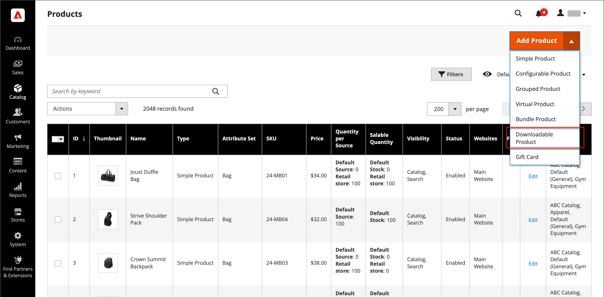
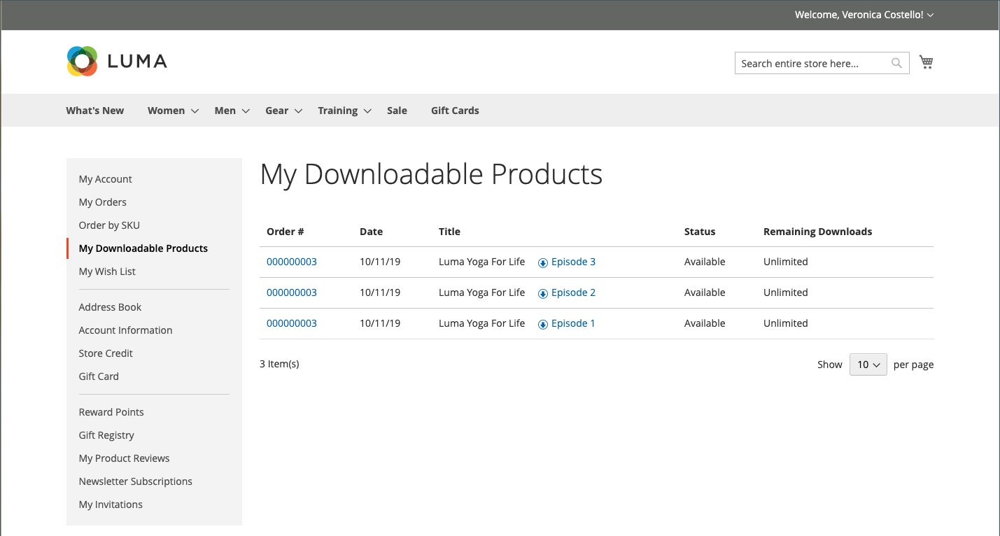

# Produit téléchargeable

Un produit téléchargeable peut être tout ce que vous pouvez diffuser sous forme de fichier, par exemple un livre électronique, de la musique, une vidéo, une application logicielle ou une mise à jour. Vous pouvez proposer un album à vendre et vendre chaque chanson individuellement. Vous pouvez également utiliser un produit téléchargeable pour diffuser une version électronique de votre catalogue de produits.

Le téléchargement n’étant disponible qu’après l’achat, vous pouvez fournir des exemples, tels qu’un extrait d’un livre, un clip d’un fichier audio ou une bande-annonce d’une vidéo. Le client peut essayer un échantillon avant d’acheter le produit. Les fichiers que vous proposez peuvent être téléchargés sur votre serveur ou depuis un autre serveur.

{width="700" zoomable="yes"}

Les produits téléchargeables peuvent être configurés de manière à exiger que le client se connecte à un compte pour recevoir le lien ou qu’il puisse être envoyé par courrier électronique et partagé avec d’autres utilisateurs. L’état de la commande avant que le téléchargement ne soit disponible, les valeurs par défaut et d’autres options de remise sont définies dans la configuration. Lorsque vous planifiez vos ajouts de catalogue téléchargeables, prenez note des éléments suivants :

- Les produits téléchargeables peuvent être téléchargés sur le serveur ou liés à un autre serveur sur Internet.

- Vous pouvez déterminer le nombre de fois où un client peut télécharger un produit.

- Les clients qui achètent un produit téléchargeable peuvent avoir besoin de se connecter avant de passer en caisse.

- La livraison d’un produit téléchargeable peut être effectuée lorsque la commande se trouve dans un `Pending` ou `Invoiced` statut.

- Comme les produits téléchargeables ne sont pas fournis, la variable _Expédition_ l’étape du passage en caisse est ignorée lorsque le panier contient uniquement le produit téléchargeable.

## Configuration des options de téléchargement

Les paramètres de configuration téléchargeables déterminent les valeurs par défaut et les options de remise des produits téléchargeables, et déterminent si les invités peuvent acheter des téléchargements.

1. Sur le _Administration_ barre latérale, accédez à **[!UICONTROL Stores]** > _[!UICONTROL Settings]_>**[!UICONTROL Configuration]**.

1. Dans le panneau de gauche, développez **[!UICONTROL Catalog]** et choisissez **[!UICONTROL Catalog]** en-dessous.

1. Développer  la valeur _[!UICONTROL Downloadable Product Options]_.

   {width="700" zoomable="yes"}

   Pour obtenir la liste détaillée de ces options de configuration, voir [_Options de produit téléchargeables_](../configuration-reference/catalog/catalog.md#downloadable-product-options) dans le _Référence de configuration_.

1. Pour déterminer l’état du processus de commande lorsque le téléchargement devient disponible, définissez **[!UICONTROL Order Item Status to Enable Downloads]** à l’une des options suivantes :

   - `Pending`
   - `Invoiced`

1. Pour définir une limite par défaut sur le nombre de téléchargements qu’un seul client peut effectuer, saisissez le nombre de **[!UICONTROL Default Maximum Number of Downloads]**.

1. Définir **[!UICONTROL Shareable]** à l’une des options suivantes :

   - `Yes` - Permet aux clients d’envoyer par e-mail le lien de téléchargement à d’autres personnes.
   - `No` - Empêche les clients de partager le lien de téléchargement avec d’autres en exigeant qu’ils se connectent à leurs comptes pour accéder aux liens de téléchargement.

1. Pour **[!UICONTROL Default Sample Title]**, saisissez l’en-tête qui doit apparaître au-dessus de la sélection des exemples.

   {width="400"}

1. Pour **[!UICONTROL Default Link Title]**, saisissez le texte par défaut à utiliser pour les liens de téléchargement.

1. Si vous souhaitez que le lien de téléchargement s’ouvre dans une nouvelle fenêtre du navigateur, définissez **[!UICONTROL Opens Links in New Window]** to `Yes`.

   Ce paramètre permet de garder ouverte la fenêtre du navigateur pour votre magasin.

1. Pour déterminer comment le contenu téléchargeable est diffusé, définissez **[!UICONTROL Use Content Disposition]** à l’une des options suivantes :

   - `Attachment` - Diffuse le lien de téléchargement par courrier électronique en tant que pièce jointe.
   - `Inline` - Diffuse le lien de téléchargement sous forme de lien sur une page web.

1. Si vous souhaitez que les acheteurs s’inscrivent à un compte client et se connectent avant d’acheter un téléchargement, définissez **[!UICONTROL Disable Guest Checkout if Cart Contains Downloadable Items]** to `Yes`.

1. Lorsque vous avez terminé, cliquez sur **[!UICONTROL Save Config]**.

## Créer un produit téléchargeable

Les instructions suivantes montrent le processus de création d’un produit téléchargeable à l’aide d’une [modèle de produit](attribute-sets.md), champs obligatoires et paramètres de base. Chaque champ requis est marqué d’un astérisque rouge (`*`). Lorsque vous avez terminé les étapes de base, vous pouvez définir les autres paramètres du produit selon vos besoins.

>[!NOTE]
>
>Les noms de fichiers téléchargeables peuvent inclure des lettres et des chiffres. Un tiret ou un trait de soulignement peut être utilisé pour représenter un espace entre les mots. Les caractères non valides du nom de fichier sont remplacés par un trait de soulignement.

### Etape 1 : Sélection du type de produit

1. Sur le _Administration_ barre latérale, accédez à **[!UICONTROL Catalog]** > **[!UICONTROL Products]**.

1. Sur le _[!UICONTROL Add Product]_( {width="25"} ) dans le coin supérieur droit, sélectionnez `Downloadable Product`.

   {width="700" zoomable="yes"}

### Étape 2 : sélection du jeu d’attributs

Les exemples de données incluent un [jeu d’attributs](attribute-sets.md) appelé _Téléchargeable_ qui comporte des champs spéciaux pour les produits téléchargeables. Vous pouvez utiliser un modèle existant ou en créer un autre avant l’enregistrement du produit.

Pour choisir le jeu d’attributs utilisé comme modèle pour le produit, effectuez l’une des opérations suivantes :

- Pour **[!UICONTROL Search]**, saisissez le nom du jeu d’attributs.

- Dans la liste, choisissez la `Downloadable` ensemble d’attributs.

Le formulaire est mis à jour pour refléter la modification.

{width="600" zoomable="yes"}

### Étape 3 : Définissez les paramètres requis

1. Saisissez le **[!UICONTROL Product Name]**.

1. Acceptation de la valeur par défaut **[!UICONTROL SKU]** selon le nom du produit ou saisissez-en un autre.

1. Saisissez le produit. **[!UICONTROL Price]**.

1. Comme le produit n’est pas encore prêt à être publié, définissez **[!UICONTROL Enable Product]** to `No`.

1. click **[!UICONTROL Save]** et continuez.

   Lorsque le produit est enregistré, la variable [Affichage en magasin](introduction.md#product-scope) s’affiche dans le coin supérieur gauche.

1. Choisissez la **[!UICONTROL Store View]** où le produit doit être disponible.

   {width="600" zoomable="yes"}

### Étape 4 : définition des paramètres de base

1. Définir **[!UICONTROL Tax Class]** à l’une des options suivantes :

   - `None`
   - `Taxable Goods`

1. Saisissez le **[!UICONTROL Quantity]** du produit en stock.

   Prenez note des points suivants :

   - Par défaut, **[!UICONTROL Stock Status]** est défini sur `Out of Stock`.

   - Comme les produits téléchargeables ne sont pas fournis, la variable **[!UICONTROL Weight]** n’est pas utilisé. Si vous activez cette fonction, elle devient une [Produit simple](product-create-simple.md) et la variable _Ce produit peut-il être téléchargé ?_ ne peut pas être utilisé.

   >[!NOTE]
   >
   >Si vous activez [Inventory management](../inventory-management/introduction.md), les marchands à source unique définissent la quantité dans cette section. Les marchands multi-sources ajoutent des sources et des quantités dans la section Sources . Voir ce qui suit _Attribution de sources et de quantités (Inventory management)_ .

1. Acceptation de la valeur par défaut **[!UICONTROL Visibility]** paramètre de `Catalog, Search`.

1. Pour afficher le produit dans la variable [liste des nouveaux produits](../content-design/widget-new-products-list.md), sélectionnez la variable **[!UICONTROL Set Product as New]** .

1. Pour affecter _[!UICONTROL Categories]_pour accéder au produit, cliquez sur l’icône **[!UICONTROL Select…]**et effectuez l’une des opérations suivantes :

   **Choisir une catégorie existante**:

   - Commencez à taper dans la zone jusqu’à ce que vous trouviez une correspondance.

   - Cochez la case de chaque catégorie à attribuer.

   **Création d’une catégorie**:

   - Cliquez sur **[!UICONTROL New Category]**.

   - Saisissez le **[!UICONTROL Category Name]** et sélectionnez la variable **[!UICONTROL Parent Category]**, qui détermine sa position dans la variable [structure de menu](category-root.md).

   - Cliquez sur **[!UICONTROL Create Category]**.

1. Définir **[!UICONTROL Format]** à l’une des options suivantes :

   - `Download`
   - `DVD`

   Si nécessaire, vous pouvez modifier la variable [attribute](attribute-product-create.md) pour ajouter d’autres valeurs.

   Il peut y avoir des attributs supplémentaires qui décrivent le produit. La sélection varie en fonction de l’ensemble d’attributs. Vous pouvez la terminer ultérieurement.

#### Attribuer des sources et des quantités ([!DNL Inventory Management])

{{$include /help/_includes/inventory-assign-sources.md}}

### Étape 5 : renseigner les informations téléchargeables

Faire défiler vers le bas, développer  la valeur _[!UICONTROL Downloadable Information]_, puis sélectionnez la variable **[!UICONTROL Is this downloadable product?]**.

Lorsque cette option est activée, la variable _[!UICONTROL Downloadable Information]_comporte deux parties. La première partie décrit chaque lien de téléchargement et la seconde partie décrit chaque fichier d’exemple. La valeur par défaut de la plupart de ces options peut être définie dans la variable [configuration](#configure-the-download-options).

{width="600" zoomable="yes"}

#### Remplir les liens

1. Dans le _[!UICONTROL Links]_, saisissez la **[!UICONTROL Title]**à utiliser comme en-tête pour les liens de téléchargement.

1. Le cas échéant, sélectionnez la variable **[!UICONTROL Links can be purchased separately]** .

1. Cliquez sur **[!UICONTROL Add Link]** et procédez comme suit :

   - Saisissez le **[!UICONTROL Title]** et **[!UICONTROL Price]** du téléchargement.

   - Pour les **[!UICONTROL File]** et **[!UICONTROL Sample]** , sélectionnez l’une des méthodes de distribution suivantes pour les téléchargements :

      - `Upload File` - Choisissez cette méthode pour télécharger le fichier de distribution sur le serveur. Accédez au fichier et sélectionnez-le pour le transfert.
      - `URL` - Choisissez cette méthode pour accéder au fichier de distribution à partir d’une URL. Saisissez l’URL complète vers le fichier de téléchargement.

   >[!NOTE]
   >
   >Vous ne pouvez pas utiliser de liens vers des ressources externes comme produits téléchargeables. Les domaines de lien valides sont prédéfinis par programmation dans la variable `env.php` (voir [référence env.php](https://experienceleague.adobe.com/docs/commerce-operations/configuration-guide/files/config-reference-envphp.html) dans le _Guide de configuration_).

   - Définir **[!UICONTROL Shareable]** à l’une des options suivantes :

      - `No` - Nécessite que les clients se connectent à leurs comptes pour accéder au lien de téléchargement.

      - `Yes` - Envoie le lien par courrier électronique, que les clients peuvent partager avec d’autres personnes.

      - `Use Config` : utilise la méthode spécifiée dans la variable [Options de produit téléchargeables](../configuration-reference/catalog/catalog.md) configuration.

   - Effectuez l’une des opérations suivantes :

      - Pour limiter les téléchargements par client, saisissez le nombre maximal de **[!UICONTROL Max. Downloads]**.
      - Pour autoriser un nombre illimité de téléchargements, sélectionnez la variable **[!UICONTROL Unlimited]** .

   {width="600" zoomable="yes"}

1. Pour ajouter un autre lien, cliquez sur **[!UICONTROL Add Link]** et répétez ces étapes.

#### Remplissage des exemples

1. Dans le _[!UICONTROL Samples]_, saisissez la **[!UICONTROL Title]**que vous souhaitez utiliser comme en-tête pour les exemples.

1. Pour renseigner les informations de chaque échantillon, cliquez sur **[!UICONTROL Add Link]**.

   {width="600" zoomable="yes"}

1. Renseignez le détail du lien comme suit :

   - Saisissez le **[!UICONTROL Title]** de l’échantillon individuel.

   - Choisissez l&#39;une des méthodes de distribution suivantes :

      - `Upload File` - Choisissez cette méthode pour télécharger le fichier de distribution sur le serveur. Accédez au fichier et sélectionnez-le pour le transfert.
      - `URL` - Choisissez cette méthode pour accéder au fichier de distribution à partir d’une URL. Saisissez l’URL complète vers le fichier de téléchargement.

   - Pour ajouter un autre exemple, cliquez sur **[!UICONTROL Add Link]** et répétez ces étapes.

   - Pour modifier l’ordre des exemples, accédez à la _Modifier l’ordre_ (  ) et faites glisser l’exemple vers une nouvelle position.

### Étape 6 : renseigner les informations sur le produit

Faites défiler l’écran vers le bas et renseignez les informations des sections suivantes selon vos besoins :

- [Contenu](product-content.md)
- [Images et vidéos](product-images-and-video.md)
- [Optimisation du moteur de recherche](product-search-engine-optimization.md)
- [Produits associés, ventes consécutives et ventes croisées](related-products-up-sells-cross-sells.md)
- [Options personnalisables](settings-advanced-custom-options.md)
- [Produits sur les sites web](settings-basic-websites.md)
- [Conception](settings-advanced-design.md)
- [Options de cadeau](product-gift-options.md)

### Etape 7 : Publier le produit

Si vous êtes prêt à publier le produit dans le catalogue, définissez **[!UICONTROL Enable Product]** to `Yes` et effectuez l’une des opérations suivantes :

**Méthode 1 :** Enregistrer et prévisualiser

- Dans le coin supérieur droit, cliquez sur **[!UICONTROL Save]**.

- Pour afficher le produit dans votre boutique, choisissez **[!UICONTROL Customer View]** sur le _Administration_ (  ).

  Le magasin s’ouvre dans un nouvel onglet du navigateur.

  {width="600" zoomable="yes"}

**Méthode 2 :** Enregistrer et fermer

Sur le _[!UICONTROL Save]_( {width="25"} ), choisissez **[!UICONTROL Save & Close]**.

## Expérience Storefront

Dans le tableau de bord du compte client, la variable _[!UICONTROL My Downloadable Products]_liens vers chaque commande de produits téléchargeables. Les téléchargements deviennent disponibles à partir du compte du client lorsque la commande est terminée.

{width="700" zoomable="yes"}

Le tableau suivant décrit la variable _Mes produits téléchargeables_ values :

| Colonne | Description |
|--- |--- |
| [!UICONTROL Order#] | La variable [order](../stores-purchase/orders.md) dans laquelle le produit téléchargeable a été acheté. Fournit un lien vers le détail de la commande. |
| [!UICONTROL Date] | Date de création de la commande. |
| [!UICONTROL Title] | Nom du produit téléchargeable acheté avec la commande. Fournit un lien vers le produit téléchargeable. |
| [!UICONTROL Status] | État du traitement des commandes. |
| [!UICONTROL Remaining Downloads] | Nombre de téléchargements disponibles du produit téléchargé. |

_**Pour télécharger un fichier de produit à partir du tableau de bord du compte**_

1. Dans le tableau de bord de leur compte, le client choisit **[!UICONTROL My Downloadable Products]**.

1. Recherche l’ordre dans la liste et clique sur le lien situé après le titre.

1. Dans le coin inférieur droit de la fenêtre de téléchargement, cliquez sur le bouton _télécharger_ Icône

1. Localise le fichier à l’emplacement de téléchargement et enregistre le fichier à l’emplacement souhaité.
