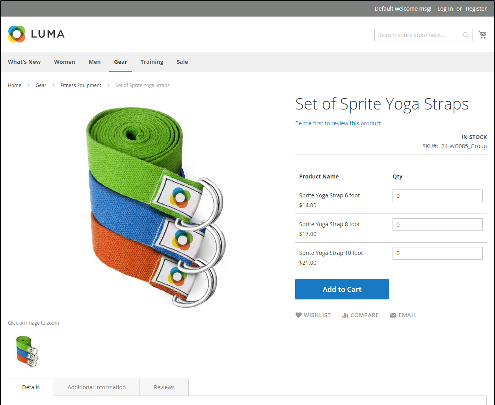
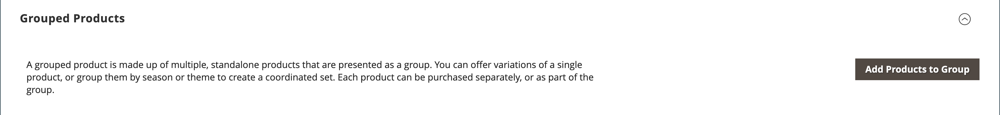

# Produit groupé

Un produit groupé est constitué de produits autonomes simples présentés sous la forme d’un groupe. Vous pouvez proposer des variantes d’un seul produit ou les regrouper par saison ou thème. Présenter un produit groupé peut inciter les clients à acheter des articles supplémentaires. Un produit groupé permet d’offrir facilement des variantes d’un produit et de les répertorier toutes sur la même page.

Par exemple, vous pouvez vendre des articles plats en stock et répertorier tous les types d’ustensiles utilisés dans un cadre formel. Certains pourraient commander plusieurs fourchettes de salade, fourchettes de poisson, fourchettes de dîner, couteaux de diner, couteaux de poisson, couteaux de beurre, cuillères à soupe et cuillères de dessert. D’autres clients peuvent commander une fourchette simple, un couteau et une cuillère. Les clients peuvent commander n’importe quel numéro de chaque article comme ils le souhaitent.

Bien qu’ils soient présentés sous la forme d’un groupe, chaque produit du groupe est acheté en tant qu’article distinct. Dans le panier, chaque article et la quantité achetée sont affichés sous la forme d’une ligne distincte.

Les instructions suivantes montrent le processus de création d’un produit groupé à l’aide d’une [modèle de produit](attribute-sets.md), champs obligatoires et paramètres de base. Chaque champ requis est marqué d’un astérisque rouge (`*`). Lorsque vous avez terminé les étapes de base, vous pouvez définir les autres paramètres du produit selon vos besoins.

{width="700" zoomable="yes"}

## Etape 1 : Sélection du type de produit

1. Sur le _Administration_ barre latérale, accédez à **[!UICONTROL Catalog]** > **[!UICONTROL Products]**.

1. Sur le _[!UICONTROL Add Product]_( {width="25"} ) dans le coin supérieur droit, sélectionnez **[!UICONTROL Grouped Product]**.

   {width="700" zoomable="yes"}

## Étape 2 : sélection du jeu d’attributs

Pour choisir la variable [jeu d’attributs](attribute-sets.md) qui est utilisé comme modèle pour le produit, effectuez l’une des opérations suivantes :

- Pour effectuer une recherche, saisissez le nom du champ **[!UICONTROL Attribute Set]**.
- Dans la liste, choisissez le jeu d’attributs à utiliser.

Le formulaire est mis à jour pour refléter la modification.

{width="600" zoomable="yes"}

Si les attributs nécessaires n’existent pas, vous pouvez ajouter de nouveaux attributs lors de la création d’un produit :

- Dans le coin supérieur droit, cliquez sur **[!UICONTROL Add Attribute]**.
- Définition d’un nouvel attribut (voir [Ajout d’un attribut à un produit](product-attributes-add.md)).

  {width="600" zoomable="yes"}

Pour ajouter un attribut existant au produit, utilisez la variable [contrôles de filtre](../getting-started/admin-grid-controls.md) pour trouver l’attribut dans la grille et procédez comme suit :

- Cochez la case dans la première colonne de chaque attribut à ajouter.
- Cliquez sur **[!UICONTROL Add Selected]**.

## Étape 3 : Définissez les paramètres requis

1. Saisissez le **[!UICONTROL Product Name]**.

1. Acceptation de la valeur par défaut **[!UICONTROL SKU]** selon le nom du produit ou saisissez-en un autre.

   Notez que la variable **[!UICONTROL Quantity]** n’est pas disponible, car la valeur est dérivée des produits individuels qui constituent le groupe.

1. Comme le produit n’est pas encore prêt à être publié, définissez **[!UICONTROL Enable Product]** to `No` (  ).

1. Cliquez sur **[!UICONTROL Save]** et continuez.

   Lorsque le produit est enregistré, son nom apparaît en haut de la page et la variable [Affichage en magasin](introduction.md#product-scope) s’affiche dans le coin supérieur gauche.

1. Choisissez la **[!UICONTROL Store View]** où le produit doit être disponible.

   {width="600" zoomable="yes"}

## Étape 4 : définition des paramètres de base

1. Acceptez la variable **[!UICONTROL Stock Status]** paramètre de `In Stock`.

1. Pour affecter **[!UICONTROL Categories]** pour accéder au produit, cliquez sur l’icône **[!UICONTROL Select…]** et effectuez l’une des opérations suivantes :

   **Choisissez une catégorie existante :**

   - Commencez à taper dans la zone jusqu’à ce que vous trouviez une correspondance.

   - Cochez la case de la catégorie à attribuer.

   **Créez une catégorie :**

   - Cliquez sur **[!UICONTROL New Category]**.

   - Saisissez le **[!UICONTROL Category Name]** et sélectionnez la variable **[!UICONTROL Parent Category]**, qui détermine sa position dans la structure de menus.

   - Cliquez sur **[!UICONTROL Create Category]**.

1. Acceptez la variable **[!UICONTROL Visibility]** des paramètres de `Catalog, Search`.

1. Pour afficher le produit dans la variable [liste des nouveaux produits](../content-design/widget-new-products-list.md), choisissez la variable **[!UICONTROL Set Product as New]** **[!UICONTROL from]** et **[!UICONTROL to]** dates sur le calendrier.

1. Choisissez la **[!UICONTROL Country of Manufacture]**.

   Il peut y avoir d’autres attributs individuels qui décrivent le produit. La sélection varie le jeu d’attributs et vous pouvez les terminer ultérieurement.

## Étape 5 : Ajout de produits au groupe

1. Faites défiler l’écran vers le bas jusqu’à **[!UICONTROL Grouped Products]** et cliquez sur **[!UICONTROL Add Products to Group]**.

   {width="600" zoomable="yes"}

1. Si nécessaire, utilisez la méthode [filtres](../getting-started/admin-grid-controls.md) pour trouver les produits que vous souhaitez inclure dans le groupe.

1. Dans la liste, cochez la case de chaque élément à inclure dans le groupe.

   >[!NOTE]
   >
   >Seuls les produits enfants simples, téléchargeables et virtuels sans options configurables peuvent être regroupés. D’autres types de produits n’apparaissent pas dans la liste de sélection.

   {width="600" zoomable="yes"}

1. Pour les ajouter au groupe de produits, cliquez sur **[!UICONTROL Add Selected Products]**.

   Les produits sélectionnés apparaissent dans le _[!UICONTROL Grouped Products]_.

   Pour les marchands multisource avec [Inventory management](../inventory-management/sources-stocks.md), la grille comprend une **[!UICONTROL Quantity per Source]** avec chaque source et stock de stocks attribués.

   {width="600" zoomable="yes"}

1. Saisissez un **[!UICONTROL Default Quantity]** pour l’un des éléments.

1. Pour modifier l’ordre des produits, appuyez sur la touche _Modifier l’ordre_ icône (  ) dans la première colonne et faites glisser le produit vers le nouvel emplacement de la liste.

1. Pour supprimer un produit du groupe, cliquez sur **[!UICONTROL Remove]**.

## Étape 5 : renseigner les informations sur le produit

Renseignez les informations des sections suivantes si nécessaire :

- [Contenu](product-content.md)
- [Images et vidéos](product-images-and-video.md)
- [Optimisation du moteur de recherche](product-search-engine-optimization.md)
- [Produits associés, ventes consécutives et ventes croisées](related-products-up-sells-cross-sells.md)
- [Options personnalisables](settings-advanced-custom-options.md)
- [Produits sur les sites web](settings-basic-websites.md)
- [Conception](settings-advanced-design.md)
- [Options de cadeau](product-gift-options.md)

## Etape 6 : Publier le produit

1. Si vous êtes prêt à publier le produit dans le catalogue, définissez **[!UICONTROL Enable Product]** to `Yes`.

1. Effectuez l’une des opérations suivantes :

   **Méthode 1 :** Enregistrer et prévisualiser

   - Dans le coin supérieur droit, cliquez sur **[!UICONTROL Save]**.

   - Pour afficher le produit dans votre boutique, choisissez **[!UICONTROL Customer View]** sur le _Administration_ (  ).

     Le magasin s’ouvre dans un nouvel onglet du navigateur.

     {width="700" zoomable="yes"}

   **Méthode 2 :** Enregistrer et fermer

   - Sur le _[!UICONTROL Save]_( {width="25"} ), choisissez **[!UICONTROL Save & Close]**.

## Étape 7 : configuration des miniatures de panier (facultatif)

Si vous disposez d’une image différente pour chaque produit du groupe, vous pouvez définir la configuration de manière à utiliser l’image appropriée pour la miniature du panier.

1. Sur le _Administration_ barre latérale, accédez à **[!UICONTROL Stores]** > _[!UICONTROL Settings]_>**[!UICONTROL Configuration]**.

1. Dans le panneau de gauche, développez **[!UICONTROL Sales]** et choisissez **[!UICONTROL Checkout]**.

1. Développer  la valeur **[!UICONTROL Shopping Cart]**.

   Pour obtenir la liste détaillée de ces options de configuration, voir [Panier](../configuration-reference/sales/checkout.md#shopping-cart) dans le _Référence de configuration_.

1. Définir **[!UICONTROL Grouped Product Image]** to `Product Thumbnail Itself`.

   {width="600" zoomable="yes"}

   Si nécessaire, désélectionnez l’option **[!UICONTROL Use system value]** pour définir cette option.

1. Cliquez sur **[!UICONTROL Save Config]**.

## Les choses à retenir

- Un produit groupé est essentiellement une collection de produits associés simples.

- Les produits enfants groupés peuvent être simples, téléchargeables ou virtuels. **[!UICONTROL without custom options]**.

- Chaque article acheté apparaît individuellement dans le panier, plutôt que dans le cadre du groupe.

- L’image miniature du panier peut être définie pour afficher l’image du produit parent groupé ou du produit associé.
