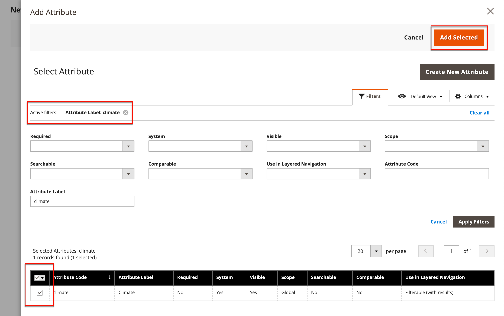
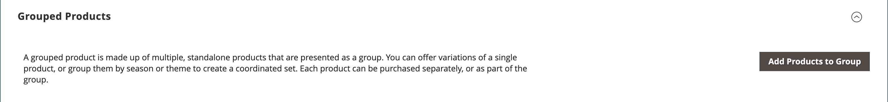
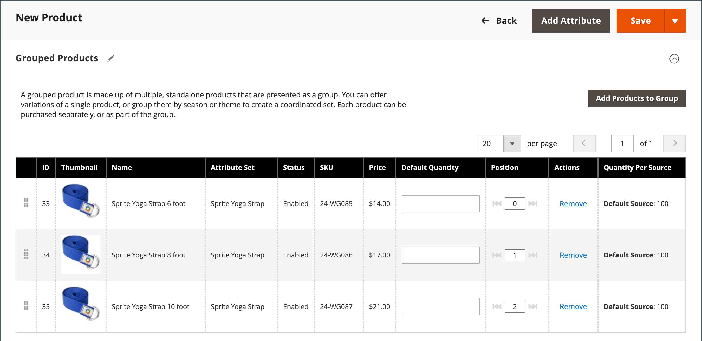
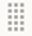

# Produit groupé

Un produit regroupé se compose de produits simples autonomes présentés sous la forme d’un groupe. Vous pouvez proposer des variations d’un seul produit ou les regrouper par saison ou thème. La présentation d’un produit groupé peut inciter les clients à acheter des articles supplémentaires. Un produit regroupé permet de proposer facilement des variantes d’un produit et de toutes les répertorier sur la même page.

Par exemple, vous pouvez vendre de la vaisselle en libre-service et répertorier tous les types d&#39;ustensiles utilisés dans un environnement formel. Certains pourraient commander plusieurs fourchettes à salade, fourchettes à poisson, fourchettes à dîner, couteaux à dîner, couteaux à poisson, couteaux à beurre, cuillères à soupe et cuillères à dessert. D’autres clients peuvent commander une simple fourchette, un couteau et une cuillère. Les clients peuvent commander n&#39;importe quel numéro de chaque article comme ils le souhaitent.

Bien qu’ils soient présentés en tant que groupe, chaque produit du groupe est acheté en tant qu’article distinct. Dans le panier, chaque article et la quantité achetée s’affichent sous la forme d’un article distinct.

Les instructions suivantes illustrent le processus de création d’un produit groupé à l’aide d’un [modèle de produit](attribute-sets.md), de champs obligatoires et de paramètres de base. Chaque champ obligatoire est signalé par un astérisque rouge (`*`). Lorsque vous avez terminé les principes de base, vous pouvez définir les autres paramètres du produit selon vos besoins.

{width="700" zoomable="yes"}

## Étape 1 : sélection du type de produit

1. Dans la barre latérale _Admin_, accédez à **[!UICONTROL Catalog]** > **[!UICONTROL Products]**.

1. Dans le menu _[!UICONTROL Add Product]_( {width="25"} ) dans le coin supérieur droit, choisissez **[!UICONTROL Grouped Product]**.

   {width="700" zoomable="yes"}

## Étape 2 : sélection du jeu d’attributs

Pour choisir le [jeu d’attributs](attribute-sets.md) utilisé comme modèle pour le produit, effectuez l’une des opérations suivantes :

- Pour effectuer une recherche, saisissez le nom du **[!UICONTROL Attribute Set]**.
- Dans la liste, choisissez le jeu d’attributs à utiliser.

Le formulaire est mis à jour pour refléter la modification.

{width="600" zoomable="yes"}

Si les attributs nécessaires n’existent pas, vous pouvez ajouter de nouveaux attributs lors de la création d’un produit :

- Dans le coin supérieur droit, cliquez sur **[!UICONTROL Add Attribute]**.
- Définissez un nouvel attribut (voir [Ajouter un attribut à un produit](product-attributes-add.md)).

  {width="600" zoomable="yes"}

Pour ajouter un attribut existant au produit, utilisez les contrôles [filter](../getting-started/admin-grid-controls.md) afin de trouver l’attribut dans la grille et procédez comme suit :

- Cochez la case située dans la première colonne de chaque attribut à ajouter.
- Cliquez sur **[!UICONTROL Add Selected]**.

## Étape 3 : effectuez les paramètres requis

1. Saisissez le **[!UICONTROL Product Name]**.

1. Acceptez le **[!UICONTROL SKU]** par défaut basé sur le nom du produit ou saisissez-en un autre.

   Notez que le champ **[!UICONTROL Quantity]** n’est pas disponible, car la valeur est dérivée des produits individuels qui constituent le groupe.

   Un produit groupé n&#39;a pas son propre prix dans le catalogue. Le prix du produit groupé est dérivé du prix des produits individuels qui sont inclus dans le groupe.

1. Comme le produit n’est pas encore prêt à être publié, définissez **[!UICONTROL Enable Product]** sur `No` (  ).

1. Cliquez sur **[!UICONTROL Save]** et continuez.

   Lorsque le produit est enregistré, le nom du produit s’affiche en haut de la page et le sélecteur [Vue du magasin](introduction.md#product-scope) s’affiche dans le coin supérieur gauche.

1. Choisissez le **[!UICONTROL Store View]** où le produit doit être disponible.

   {width="600" zoomable="yes"}

## Étape 4 : définition des paramètres de base

1. Acceptez le paramètre **[!UICONTROL Stock Status]** de `In Stock`.

1. Pour attribuer des **[!UICONTROL Categories]** au produit, cliquez sur la zone de **[!UICONTROL Select…]** et effectuez l’une des opérations suivantes :

   **Choisir une catégorie existante :**

   - Commencez à taper dans la zone jusqu’à ce que vous trouviez une correspondance.

   - Cochez la case de la catégorie à affecter.

   **Créer une catégorie :**

   - Cliquez sur **[!UICONTROL New Category]**.

   - Saisissez le **[!UICONTROL Category Name]** et choisissez le **[!UICONTROL Parent Category]**, qui détermine sa position dans la structure du menu.

   - Cliquez sur **[!UICONTROL Create Category]**.

1. Acceptez les paramètres **[!UICONTROL Visibility]** de `Catalog, Search`.

1. Pour mettre le produit en avant dans la [liste des nouveaux produits](../content-design/widget-new-products-list.md), choisissez les **[!UICONTROL from]** **[!UICONTROL Set Product as New]** et **[!UICONTROL to]** dates dans le calendrier.

1. Choisissez le **[!UICONTROL Country of Manufacture]**.

   D’autres attributs individuels peuvent décrire le produit. La sélection varie l’ensemble d’attributs et vous pouvez les terminer ultérieurement.

## Étape 5 : ajouter des produits au groupe

1. Faites défiler jusqu’à la section **[!UICONTROL Grouped Products]** et cliquez sur **[!UICONTROL Add Products to Group]**.

   {width="600" zoomable="yes"}

1. Si nécessaire, utilisez les [filtres](../getting-started/admin-grid-controls.md) pour rechercher les produits à inclure dans le groupe.

1. Dans la liste, cochez la case de chaque élément à inclure dans le groupe.

   >[!NOTE]
   >
   >Seuls les produits simples, téléchargeables et virtuels sans options configurables peuvent être regroupés en produits enfants. Les autres types de produits n’apparaissent pas dans la liste de sélection.

   {width="600" zoomable="yes"}

1. Pour les ajouter au groupe de produits, cliquez sur **[!UICONTROL Add Selected Products]**.

   Les produits sélectionnés s’affichent dans la section _[!UICONTROL Grouped Products]_.

   Pour les commerçants Multi Source avec [Inventory management](../inventory-management/sources-stocks.md), la grille comprend une colonne **[!UICONTROL Quantity per Source]** avec chaque source affectée et le montant du stock.

   {width="600" zoomable="yes"}

1. Saisissez un **[!UICONTROL Default Quantity]** pour l’un des éléments.

1. Pour modifier l’ordre des produits, saisissez l’icône _Modifier l’ordre_ (  ) dans la première colonne et faites glisser le produit vers sa nouvelle position dans la liste.

1. Pour supprimer un produit du groupe, cliquez sur **[!UICONTROL Remove]**.

## Étape 5 : compléter les informations sur le produit

Renseignez les informations des sections suivantes selon vos besoins :

- [Contenu](product-content.md)
- [Images et vidéos](product-images-and-video.md)
- [Optimisation du moteur de recherche](product-search-engine-optimization.md)
- [Produits associés, ventes incitatives et ventes croisées](related-products-up-sells-cross-sells.md)
- [Options personnalisables](settings-advanced-custom-options.md)
- [Produits dans les sites web](settings-basic-websites.md)
- [Conception](settings-advanced-design.md)
- [Options de cadeau](product-gift-options.md)

## Étape 6 : publier le produit

1. Si vous êtes prêt à publier le produit dans le catalogue, définissez **[!UICONTROL Enable Product]** sur `Yes`.

1. Effectuez l’une des opérations suivantes :

   **Méthode 1 :** Enregistrer et prévisualiser

   - Dans le coin supérieur droit, cliquez sur **[!UICONTROL Save]**.

   - Pour afficher le produit dans votre boutique, choisissez **[!UICONTROL Customer View]** dans le menu _Admin_ (  ).

     Le magasin s’ouvre dans un nouvel onglet du navigateur.

     {width="700" zoomable="yes"}

   **Méthode 2 :** Enregistrer et fermer

   - Dans le menu _[!UICONTROL Save]_( {width="25"} ), choisissez **[!UICONTROL Save & Close]**.

## Étape 7 : Configurer les miniatures de panier (facultatif)

Si vous disposez d’une image différente pour chaque produit du groupe, vous pouvez définir la configuration afin d’utiliser l’image correcte pour la miniature du panier.

1. Dans la barre latérale _Admin_, accédez à **[!UICONTROL Stores]** > _[!UICONTROL Settings]_>**[!UICONTROL Configuration]**.

1. Dans le panneau de gauche, développez **[!UICONTROL Sales]** et choisissez **[!UICONTROL Checkout]**.

1. Développez  le **[!UICONTROL Shopping Cart]**.

   Pour obtenir la liste détaillée de ces options de configuration, voir [Panier](../configuration-reference/sales/checkout.md#shopping-cart) dans la _Référence de configuration_.

1. Définissez **[!UICONTROL Grouped Product Image]** sur `Product Thumbnail Itself`.

   {width="600" zoomable="yes"}

   Si nécessaire, décochez la case **[!UICONTROL Use system value]** pour définir cette option.

1. Cliquez sur **[!UICONTROL Save Config]**.

## Éléments à retenir

- Un produit groupé est essentiellement un ensemble de produits associés simples.

- L’affectation de tous les produits enfants est annulée et continue pour le produit regroupé **_globalement_** pour tous les sites web, boutiques et affichages de boutique en même temps.

- Les produits enfants regroupés peuvent être des produits simples, téléchargeables ou virtuels **[!UICONTROL without custom options]**.

- Chaque article acheté apparaît individuellement dans le panier, plutôt que dans le groupe.

- Un produit groupé n&#39;a pas son propre prix dans le catalogue. Le prix du produit groupé est dérivé du prix des produits individuels qui sont inclus dans le groupe.

- L’image de miniature du panier peut être définie pour afficher l’image du produit parent regroupé ou du produit associé.
