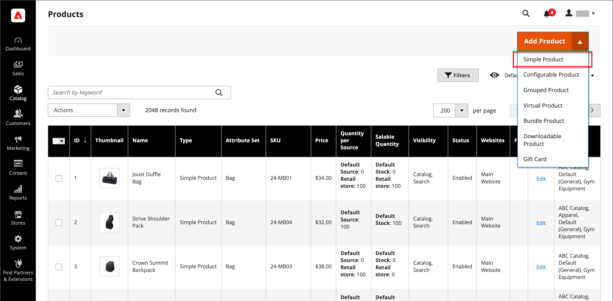

# Produit simple

L’une des clés pour exploiter la puissance des types de produits est d’apprendre quand utiliser un produit simple et autonome. Un produit simple peut être vendu individuellement ou dans le cadre d’un produit groupé, configurable ou groupé. Un produit simple avec des options personnalisées est parfois appelé _produit composite_.

Les instructions suivantes montrent le processus de création d’un produit simple à l’aide d’un [modèle de produit](attribute-sets.md), de champs obligatoires et de paramètres de base. Chaque champ obligatoire est marqué d’un astérisque rouge (`*`). Lorsque vous avez terminé les étapes de base, vous pouvez définir les autres paramètres du produit selon vos besoins.

{width="700" zoomable="yes"}

## Etape 1 : Sélection du type de produit

1. Sur la barre latérale _Admin_, accédez à **[!UICONTROL Catalog]** > **[!UICONTROL Products]**.

1. Dans le menu _[!UICONTROL Add Product]_( {width="25"} ) en haut à droite, choisissez **[!UICONTROL Simple Product]**.

   {width="700" zoomable="yes"}

## Étape 2 : sélection du jeu d’attributs

Pour choisir le [jeu d’attributs](attribute-sets.md) utilisé comme modèle pour le produit :

- Cliquez dans le champ **[!UICONTROL Attribute Set]** et saisissez tout ou partie du nom du jeu d’attributs.

- Dans la liste affichée, choisissez le jeu d’attributs à utiliser.

Le formulaire est mis à jour pour refléter la modification.

{width="600" zoomable="yes"}

## Étape 3 : Définissez les paramètres requis

1. Saisissez le **[!UICONTROL Product Name]**.

1. Acceptez la valeur par défaut **[!UICONTROL SKU]** basée sur le nom du produit ou saisissez-en une autre.

1. Saisissez le produit **[!UICONTROL Price]**.

1. Comme le produit n’est pas encore prêt à être publié, définissez l’option **[!UICONTROL Enable Product]** sur `No`.

1. cliquez sur **[!UICONTROL Save]** et continuez.

   Lorsque le produit est enregistré, le programme de sélection [Affichage magasin](introduction.md#product-scope) s’affiche dans le coin supérieur gauche.

1. Sélectionnez l’ **[!UICONTROL Store View]** où le produit doit être disponible.

   {width="600" zoomable="yes"}

## Étape 4 : définition des paramètres de base

1. Définissez **[!UICONTROL Tax Class]** sur l’une des options suivantes :

   - `None`
   - `Taxable Goods`
   - `Refund Adjustments`
   - `Gift Options`
   - `Order Gift Wrapping`
   - `Item Gift Wrapping`
   - `Printed Gift Card`
   - `Reward Points`
   - `VAT Reduced`
   - `VAT Standard`

1. Saisissez le **[!UICONTROL Quantity]** du produit en stock.

   Par défaut, **[!UICONTROL Stock Status]** est défini sur `In Stock`.

   >[!NOTE]
   >
   >Si vous activez [Inventory management](../inventory-management/introduction.md), les vendeurs Source uniques définissent la quantité dans cette section. Les marchands multi-Source ajoutent des sources et des quantités dans la section Sources . Voir la section suivante _Attribuer des sources et des quantités (Inventory management)_ .

1. Saisissez le **[!UICONTROL Weight]** du produit.

1. Acceptez le paramètre par défaut **[!UICONTROL Visibility]** de `Catalog, Search`.

1. Pour attribuer _[!UICONTROL Categories]_au produit, cliquez sur la zone **[!UICONTROL Select…]**et effectuez l’une des opérations suivantes :

   **Choisissez une catégorie existante** :

   - Commencez à taper dans la zone jusqu’à ce que vous trouviez une correspondance.

   - Cochez la case de chaque catégorie à attribuer.

   **Créer une catégorie** :

   - Cliquez sur **[!UICONTROL New Category]**.

   - Saisissez le **[!UICONTROL Category Name]** et choisissez le **[!UICONTROL Parent Category]**, qui détermine sa position dans la structure de menus.

   - Cliquez sur **[!UICONTROL Create Category]**.

1. Pour afficher le produit dans la liste de [nouveaux produits](../content-design/widget-new-products-list.md), cochez la case **[!UICONTROL Set Product as New]** .

1. Sélectionnez le **[!UICONTROL Country of Manufacture]**.

Il peut y avoir d’autres attributs individuels qui décrivent le produit. La sélection varie en fonction de l’ensemble d’attributs. Vous pouvez la terminer ultérieurement.

### Affecter des sources et des quantités ([!DNL Inventory Management])

{{$include /help/_includes/inventory-assign-sources.md}}

## Étape 5 : renseigner les informations sur le produit

Faites défiler l’écran vers le bas et renseignez les informations des sections suivantes selon vos besoins :

- [Contenu](product-content.md)
- [Images et vidéos](product-images-and-video.md)
- [Produits associés, ventes consécutives et ventes croisées](related-products-up-sells-cross-sells.md)
- [Optimisation du moteur de recherche](product-search-engine-optimization.md)
- [Options personnalisables](settings-advanced-custom-options.md)
- [Produits sur les sites web](settings-basic-websites.md)
- [Conception](settings-advanced-design.md)
- [Options de cadeau](product-gift-options.md)

## Étape 6 : Publish du produit

1. Si vous êtes prêt à publier le produit dans le catalogue, définissez le commutateur **[!UICONTROL Enable Product]** sur `Yes`.

1. Effectuez l’une des opérations suivantes :

   - **Méthode 1 :** Enregistrer et prévisualiser

      - Dans le coin supérieur droit, cliquez sur **[!UICONTROL Save]**.

      - Pour afficher le produit dans votre boutique, sélectionnez **[!UICONTROL Customer View]** dans le menu _Admin_ ().

     Le magasin s’ouvre dans un nouvel onglet du navigateur.

     {width="600" zoomable="yes"}

   - **Méthode 2 :** Enregistrer et fermer

     Dans le menu _[!UICONTROL Save]_( {width="25"} ), choisissez **[!UICONTROL Save & Close]**.

## Les choses à retenir

- Les produits simples peuvent être inclus dans des types de produits configurables, regroupés et regroupés.

- La configuration de produit simple remplace les configurations de produit configurables pour un produit spécifique.

- Un produit simple peut comporter des options personnalisées avec différents types d’entrée, ce qui permet de vendre de nombreuses variantes de produits à partir d’un seul SKU.
