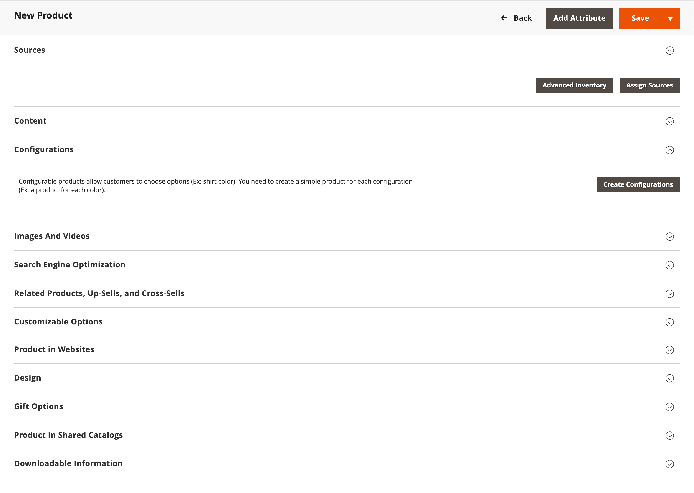

# Création d’un produit

Le choix d’un type de produit est l’une des premières choses que vous devez faire pour créer un produit. Si vous commencez tout juste à créer votre catalogue de produits, vous pouvez créer quelques exemples de produits à tester avec chaque type de produit. Outre les types de produits de base, le terme _produit complexe_ est parfois utilisé pour faire référence à des produits avec plusieurs options, tels qu’un produit configurable disponible en différentes couleurs et tailles.

>[!NOTE]
>
>Pour une compréhension plus approfondie, reportez-vous au catalogue . [navigation](navigation.md), procédure de configuration [categories](categories.md) et [Attributs](product-attributes.md), et le catalogue [Options d’URL](catalog-urls.md) disponibles. Une fois que vous avez compris ces concepts, la méthode la plus efficace pour ajouter de nombreux produits au catalogue consiste à [import](../systems/data-import.md) à partir d’un fichier CSV.

{width="700" zoomable="yes"}

## Types de produits

**[Produit simple](product-create-simple.md)** - Un produit simple est un élément physique avec un seul SKU. Les produits simples ont différents prix et contrôles d’entrée ce qui permet de vendre des variantes du produit. Les produits simples peuvent être utilisés en association avec des produits regroupés, regroupés et configurables.

**[Produit configurable](product-create-configurable.md)** - Un produit configurable semble être un produit unique avec des listes d’options pour chaque variation. Cependant, chaque option représente un produit simple distinct avec un SKU distinct, ce qui permet de suivre l’inventaire de chaque variation.

**[Produit groupé](product-create-grouped.md)** - Un produit groupé présente plusieurs produits autonomes sous la forme d’un groupe. Vous pouvez proposer des variantes d’un seul produit ou les regrouper pour une promotion. Les produits peuvent être achetés séparément ou en groupe.

**[Produits virtuels](product-create-virtual.md)** - Un produit virtuel n’est pas un produit tangible et est généralement utilisé pour des produits tels que des services, des adhésions, des garanties et des abonnements. Les produits virtuels peuvent être utilisés en association avec des produits regroupés et regroupés.

**[Produit groupé](product-create-bundle.md)**  - Un produit groupé permet aux clients de &quot;créer les leurs&quot; à partir d’un assortiment d’options. Il peut s’agir d’un panier de cadeaux, d’un ordinateur ou de tout autre élément qui peut être personnalisé. Chaque élément du lot est un produit autonome distinct.

**[Produit téléchargeable](product-create-downloadable.md)** - Un produit téléchargeable numériquement se compose d’un ou de plusieurs fichiers téléchargés. Les fichiers peuvent résider sur votre serveur ou être fournis sous forme d’URL à tout autre serveur.

**[Carte cadeau](product-gift-card-create.md)** - ([Adobe Commerce](../landing/home.md#product-editions) uniquement) Il existe trois types de cartes-cadeaux. _Virtuel_ les cartes-cadeaux sont envoyées par e-mail. _Physique_ les cartes-cadeaux sont expédiées au destinataire. _Combiné_ cartes-cadeaux qui combinent virtuel et physique. Chacun comporte un code unique, qui est consommé lors du passage en caisse. Les cartes cadeau peuvent également être incluses dans un produit groupé.

## Paramètres du produit

Les paramètres et attributs de produit les plus fréquemment utilisés s’affichent en haut de la page, suivis des attributs personnalisés. Tous les autres paramètres de produit se trouvent dans des sections extensibles au bas de la page.

{width="600" zoomable="yes"}

| Paramètre | Description |
|--- |--- |
| [[!UICONTROL Sources]](../inventory-management/sources-assign-per-product.md) | (Lorsque [[!DNL Inventory Management]](../inventory-management/introduction.md) est activé) Répertorie les sources à partir desquelles le produit peut être distribué. |
| [[!UICONTROL Content]](product-content.md) | Utilisé pour saisir et modifier la description du produit principal qui apparaît sur la page du produit storefront. |
| [[!UICONTROL Configurations]](product-configurations.md) | Répertorie toutes les variations existantes du produit et peut être utilisé pour générer des variations à utiliser avec le type de produit Configurable . |
| [[!UICONTROL Product Reviews]](settings-advanced-product-reviews.md) | Répertorie toutes les révisions que les clients ont envoyées pour le produit. |
| [[!UICONTROL Search Engine Optimization]](product-search-engine-optimization.md) | Indique les champs de clé d’URL et de métadonnées utilisés par les moteurs de recherche pour indexer le produit. |
| [[!UICONTROL Related Products, Up-Sells, and Cross-Sells]](related-products-up-sells-cross-sells.md) | Utilisé pour configurer des blocs promotionnels simples sur le storefront qui présentent une sélection de produits supplémentaires pouvant intéresser le client. |
| [[!UICONTROL Customizable Options]](settings-advanced-custom-options.md) | Ajoute des options personnalisables à un produit. |
| [[!UICONTROL Product in Websites]](settings-basic-websites.md) | Identifie chaque site web sur lequel le produit est disponible, en fonction de la hiérarchie du magasin. |
| [[!UICONTROL Design]](settings-advanced-design.md) | Utilisé pour appliquer un thème différent à la page du produit, modifier la disposition des colonnes, déterminer où apparaissent les options du produit et saisir du code XML personnalisé. |
| [[!UICONTROL Gift options]](product-gift-options.md) | Permet d’activer ou de désactiver une option de message cadeau lors du passage en caisse au niveau du produit. |
| [[!UICONTROL Product In Shared Catalogs]](../b2b/catalog-shared.md) |  (Disponible avec [B2B pour Adobe Commerce](../b2b/introduction.md) uniquement) Permet de gérer des catalogues partagés avec des prix personnalisés pour différentes entreprises. |
| [[!UICONTROL Downloadable Information]](product-create-downloadable.md#step-5-complete-the-downloadable-information) | Utilisé pour définir les paramètres de téléchargement de produit. |

{style="table-layout:auto"}

## Prix et inventaire avancés

Pour accéder aux paramètres avancés de tarification et de stock, cliquez sur le lien ci-dessous. **[!UICONTROL Price]** et **[!UICONTROL Quantity]**. Pour plus d’informations, voir [Gestion des tarifs](pricing-advanced.md) et [Inventory management](../inventory-management/introduction.md).
