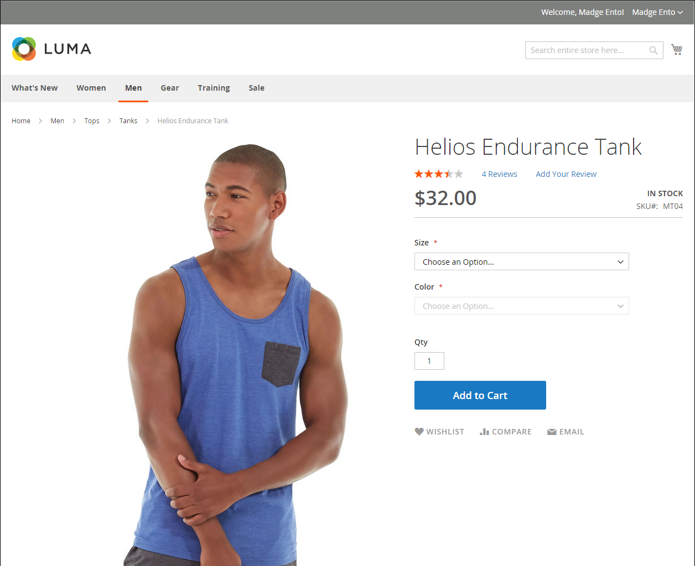

# Création d’un produit

Le choix d’un type de produit est l’une des premières choses à faire pour créer un produit. Si vous commencez à créer votre catalogue de produits, vous pouvez créer quelques exemples de produits à tester pour chaque type de produit. Outre les types de produits de base, le terme _produit complexe_ est parfois utilisé pour faire référence à des produits avec plusieurs options, comme un produit configurable disponible dans différentes couleurs et tailles.

>[!NOTE]
>
>Pour une meilleure compréhension, reportez-vous aux sections Catalogue [navigation](navigation.md), comment configurer [catégories](categories.md) et [attributs](product-attributes.md), ainsi qu’au catalogue [options d’URL](catalog-urls.md) disponibles. Une fois que vous avez compris ces concepts, la méthode la plus efficace pour ajouter de nombreux produits au catalogue consiste à les [importer](../systems/data-import.md) à partir d’un fichier CSV.

{width="700" zoomable="yes"}

## Types de produits

**[Produit simple](product-create-simple.md)** - Un produit simple est un article physique avec un seul SKU. Les produits simples ont des prix divers et des contrôles d&#39;entrée qui permettent de vendre des variantes du produit. Les produits simples peuvent être utilisés en association avec des produits groupés, groupés et configurables.

**[Produit configurable](product-create-configurable.md)** - Un produit configurable semble être un produit unique avec des listes d’options pour chaque variation. Cependant, chaque option représente un produit simple distinct avec un SKU distinct, ce qui permet d’effectuer le suivi de l’inventaire pour chaque variation.

**[Produit groupé](product-create-grouped.md)** - Un produit groupé présente plusieurs produits autonomes en tant que groupe. Vous pouvez proposer des variantes d’un seul produit ou les regrouper pour une promotion. Les produits peuvent être achetés séparément ou en groupe.

**[Produits virtuels](product-create-virtual.md)** - Un produit virtuel n’est pas un produit tangible et est généralement utilisé pour des produits tels que des services, des abonnements, des garanties et des abonnements. Les produits virtuels peuvent être utilisés en association avec des produits groupés et groupés.

**[Produit groupé](product-create-bundle.md)** - Un produit groupé permet aux clients de « construire le leur » à partir d’un assortiment d’options. Le lot peut être un panier cadeau, un ordinateur ou tout autre élément qui peut être personnalisé. Chaque élément du lot est un produit distinct et autonome.

**[Produit téléchargeable](product-create-downloadable.md)** - Un produit téléchargeable numériquement se compose d’un ou de plusieurs fichiers téléchargés. Les fichiers peuvent résider sur votre serveur ou être fournis sous forme d’URL à tout autre serveur.

**[Carte cadeau](product-gift-card-create.md)** - ([Adobe Commerce](../landing/home.md#product-editions) uniquement) Il existe trois types de cartes cadeau. Les cartes-cadeaux _virtuelles_ sont envoyées par courriel. Les cartes-cadeaux _physiques_ sont expédiées au destinataire. _Combinés_ les cartes-cadeaux qui combinent virtuel et physique. Chacun possède un code unique, qui est échangé lors du passage en caisse. Les cartes-cadeaux peuvent également être incluses dans un produit groupé.

## Paramètres du produit

Les paramètres et attributs de produit les plus fréquemment utilisés sont affichés en haut de la page, suivis d’attributs personnalisés. Tous les autres paramètres de produit se trouvent dans des sections extensibles au bas de la page.

{width="600" zoomable="yes"}

| Paramètre | Description |
|--- |--- |
| [[!UICONTROL Sources]](../inventory-management/sources-assign-per-product.md) | (Lorsque [[!DNL Inventory Management]](../inventory-management/introduction.md) est activé) Répertorie les sources à partir desquelles le produit peut être distribué. |
| [[!UICONTROL Content]](product-content.md) | Permet de saisir et de modifier la description principale du produit qui apparaît sur la page du produit storefront. |
| [[!UICONTROL Configurations]](product-configurations.md) | Répertorie toutes les variations existantes du produit et peut être utilisé pour générer des variations à utiliser avec le type de produit configurable. |
| [[!UICONTROL Product Reviews]](settings-advanced-product-reviews.md) | Répertorie toutes les critiques que les clients ont soumises pour le produit. |
| [[!UICONTROL Search Engine Optimization]](product-search-engine-optimization.md) | Indique la clé URL et les champs de métadonnées utilisés par les moteurs de recherche pour indexer le produit. |
| [[!UICONTROL Related Products, Up-Sells, and Cross-Sells]](related-products-up-sells-cross-sells.md) | Permet de configurer des blocs promotionnels simples sur le storefront qui présentent une sélection de produits supplémentaires pouvant intéresser le client. |
| [[!UICONTROL Customizable Options]](settings-advanced-custom-options.md) | Ajoute des options personnalisables à un produit. |
| [[!UICONTROL Product in Websites]](settings-basic-websites.md) | Identifie chaque site web sur lequel le produit est disponible, en fonction de la hiérarchie du magasin. |
| [[!UICONTROL Design]](settings-advanced-design.md) | Permet d’appliquer un thème différent à la page du produit, de modifier la mise en page des colonnes, de déterminer où les options du produit apparaissent et de saisir du code XML personnalisé. |
| [[!UICONTROL Gift options]](product-gift-options.md) | Utilisé pour activer ou désactiver l’option de message cadeau lors du passage en caisse au niveau du produit. |
| [[!UICONTROL Product In Shared Catalogs]](../b2b/catalog-shared.md) |  (disponible avec [Adobe Commerce B2B](../b2b/introduction.md) uniquement) Permet de gérer des catalogues partagés avec des prix personnalisés pour différentes sociétés. |
| [[!UICONTROL Downloadable Information]](product-create-downloadable.md#step-5-complete-the-downloadable-information) | Utilisé pour définir les paramètres de téléchargement de produit. |

{style="table-layout:auto"}

## Tarification avancée et inventaire

Pour accéder aux paramètres avancés de tarification et d&#39;inventaire, cliquez sur le lien ci-dessous **[!UICONTROL Price]** et **[!UICONTROL Quantity]**. Pour plus d’informations, voir [Gestion des prix](pricing-advanced.md) et [Inventory management](../inventory-management/introduction.md).
