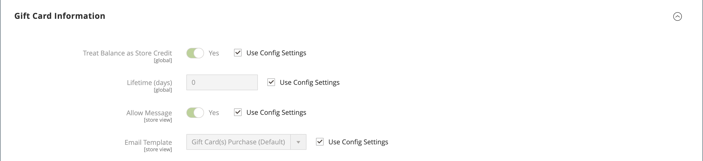

# Produit de carte-cadeau

{{ee-feature}}

Chaque carte-cadeau comporte un code unique, qui ne peut être consommé que par un seul client lors du passage en caisse. Un [pool de code](../stores-purchase/product-gift-card-accounts.md#step-3-establish-the-gift-card-code-pool) doit être établi avant la vente de cartes-cadeaux. Pour plus d’informations sur la façon dont les cartes-cadeaux sont consommées dans le panier, voir [Processus de demande de carte-cadeau](../stores-purchase/product-gift-card-workflow.md) .

{width="700" zoomable="yes"}

Il existe trois types de cadeaux :

- **Virtuel** - Une carte-cadeau virtuelle est envoyée à l’adresse électronique du destinataire, qui est requise lors de l’achat de la carte-cadeau. Une adresse de livraison n’est pas nécessaire.

- **Physique** - Une carte-cadeau physique est envoyée à l’adresse du destinataire, qui est requise lors de l’achat de la carte-cadeau.

- **Combiné** - Une carte-cadeau combinée est envoyée au destinataire par courrier électronique. L’adresse email et l’adresse de livraison du destinataire sont obligatoires lors de l’achat de la carte-cadeau.

## Créer un produit de carte-cadeau

Les instructions suivantes montrent le processus de création d’une carte-cadeau à l’aide d’un [modèle de produit](attribute-sets.md), de champs obligatoires et de paramètres de base. Chaque champ obligatoire est marqué d’un astérisque rouge (`*`). Lorsque vous avez terminé les étapes de base, vous pouvez définir les autres paramètres du produit selon vos besoins.

### Etape 1 : Sélection du type de produit

1. Sur la barre latérale _Admin_, accédez à **[!UICONTROL Catalog]** > **[!UICONTROL Products]**.

1. Dans le coin supérieur droit de _[!UICONTROL Add Product]_( {width="25"}  ), choisissez **[!UICONTROL Gift Card]**.

   {width="700" zoomable="yes"}

### Étape 2 : sélection du jeu d’attributs

Vous pouvez utiliser le jeu d’attributs `Gift Card` par défaut ou en choisir un autre. Pour choisir le jeu d’attributs utilisé comme modèle pour le produit, effectuez l’une des opérations suivantes :

- Cliquez dans le champ **[!UICONTROL Attribute Set]** et saisissez tout ou partie du nom du jeu d’attributs.

- Dans la liste affichée, choisissez le jeu d’attributs à utiliser.

{width="600" zoomable="yes"}

### Étape 3 : Définissez les paramètres requis

1. Saisissez un **[!UICONTROL Product Name]** pour la carte cadeau.

   Vous pouvez également indiquer le type de carte-cadeau dans le nom. Par exemple, _Luma Virtual Gift Card_.

1. Saisissez un **[!UICONTROL SKU]** pour le produit.

   Par défaut, le nom du produit est utilisé comme SKU par défaut.

1. Définissez **[!UICONTROL Card Type]** sur l’une des options suivantes :

   - `Virtual` - Les cartes-cadeaux virtuelles sont diffusées par e-mail au destinataire.
   - `Physical` - Les cartes-cadeaux physiques peuvent être produites en masse à l&#39;avance et accompagnées de codes uniques.
   - `Combined` - Une carte-cadeau combinée possède les caractéristiques d’une carte-cadeau virtuelle et physique.

   {width="600" zoomable="yes"}

1. Pour offrir au client un choix de montants fixes, cliquez sur **[!UICONTROL Add Amount]** et saisissez la première valeur fixe de la carte sous forme de décimale.

   Pour saisir la sélection des montants fixes, répétez cette étape pour chacun d&#39;eux.

1. Pour donner aux clients la possibilité de définir la valeur de la carte-cadeau, procédez comme suit :

   - Définissez **[!UICONTROL Open Amount]** sur `Yes`.

   - Pour définir la plage de valeurs minimales et maximales acceptables, saisissez les valeurs **[!UICONTROL Open Amount From]** et **[!UICONTROL To]** .

   Vous pouvez créer des cartes-cadeaux avec prix fixe, prix d’ouverture ou les deux.

   >[!NOTE]
   >
   >Un produit de carte-cadeau n’a pas son propre prix dans le catalogue. Le prix de la carte-cadeau est dérivé du montant de la carte-cadeau sélectionnée lors de l’achat.

   {width="600" zoomable="yes"}

### Étape 4 : définition des paramètres de base

1. Pour une carte-cadeau physique ou combinée, saisissez le **[!UICONTROL Quantity]** en stock.

1. Si la carte-cadeau doit être expédiée, saisissez le **[!UICONTROL Weight]** du package.

1. Dans le champ **[!UICONTROL Categories]**, choisissez `Gift Card`.

Il peut y avoir d’autres attributs individuels qui décrivent le produit. La sélection varie le jeu d’attributs et vous pouvez les terminer ultérieurement.

### Étape 5 : renseigner les informations sur la carte-cadeau

La section _[!UICONTROL Gift Card Information]_des paramètres du produit peut être utilisée pour remplacer les paramètres de [configuration de carte-cadeau](../configuration-reference/sales/gift-cards.md) qui déterminent la manière dont la carte est gérée.

1. Faites défiler l’écran jusqu’à la section _[!UICONTROL Gift Card Information]_.

   Les paramètres par défaut de cette section sont déterminés par la configuration du système.

   {width="600" zoomable="yes"}

1. Modifiez les champs supplémentaires en fonction du mode de fonctionnement de la carte-cadeau :

   - **[!UICONTROL Treat Balance as Store Credit]** - Détermine si le détenteur de la carte-cadeau peut échanger le solde comme un crédit de magasin.

   - **[!UICONTROL Lifetime (days)]** - Détermine le nombre de jours après l’achat jusqu’à l’expiration de la carte-cadeau. Si vous ne souhaitez pas définir de limite de durée de vie de la carte, laissez ce champ vide.

   - **[!UICONTROL Allow Message]** - Détermine si l’acheteur de la carte-cadeau peut saisir un message pour le destinataire. Un message cadeau peut être inclus pour les cartes-cadeaux virtuelles (envoyées par courrier électronique) et physiques (envoyées).

   - **[!UICONTROL Email Template]** - Détermine le modèle de courrier électronique utilisé pour la notification envoyée au destinataire d’une carte-cadeau.

### Étape 6 : renseigner les informations sur le produit

Renseignez les informations des sections suivantes si nécessaire :

- [Contenu](product-content.md)
- [Images et vidéos](product-images-and-video.md)
- [Produits associés, ventes consécutives et ventes croisées](related-products-up-sells-cross-sells.md)
- [Optimisation du moteur de recherche](product-search-engine-optimization.md)
- [Options personnalisables](settings-advanced-custom-options.md)
- [Produits sur les sites web](settings-basic-websites.md)
- [Conception](settings-advanced-design.md)
- [Options de cadeau](product-gift-options.md)

### Étape 7 : Publish du produit

1. Si vous êtes prêt à publier le produit dans le catalogue, définissez le commutateur **Activer le produit** sur `Yes`.

1. Effectuez l’une des opérations suivantes :

   **Méthode 1 :** Enregistrer et prévisualiser

   - Dans le coin supérieur droit, cliquez sur **[!UICONTROL Save]**.

   - Pour afficher le produit dans votre boutique, sélectionnez **[!UICONTROL Customer View]** dans le menu _Admin_ (  ),

   {width="600" zoomable="yes"}

   **Méthode 2 :** Enregistrer et fermer

   Dans le menu _[!UICONTROL Save]_( {width="25"} ), choisissez **[!UICONTROL Save & Close]**.

## Les choses à retenir

- Un _pool de code_ de numéros uniques doit être généré avant qu’une carte-cadeau puisse être proposée en vente.

- Les cartes cadeau peuvent être définies sur `Redeemable` ou `Non-Redeemable`.

- Les taxes ne sont **_pas appliquées_** aux cartes-cadeaux lors de l’achat de la carte-cadeau. Les taxes ne sont appliquées aux produits que lorsqu’une carte-cadeau achetée est utilisée pour acheter des produits.

- La durée de vie d’une carte-cadeau peut être illimitée ou définie sur un nombre spécifié de jours.

- La valeur d’une carte-cadeau peut être définie sur un montant fixe ou sur un montant ouvert avec une valeur minimale et maximale.

- Un produit de carte-cadeau n’a pas son propre prix dans le catalogue. Le prix de la carte-cadeau est dérivé du montant de la carte-cadeau sélectionnée lors de l’achat.

- Un compte de carte-cadeau pour le client peut être créé lorsque la commande est passée ou au moment de la facture.
