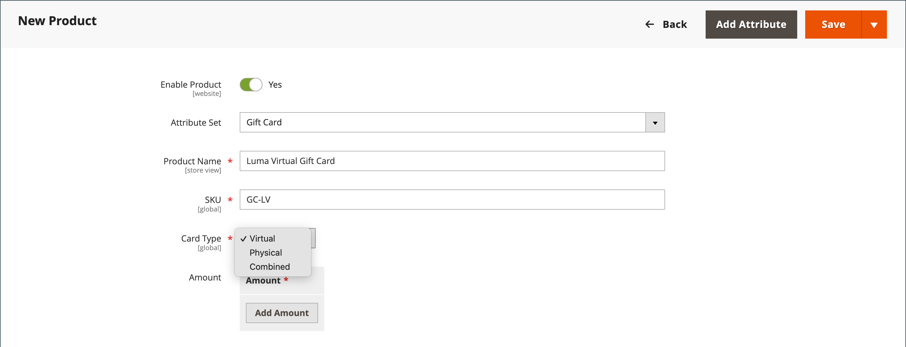
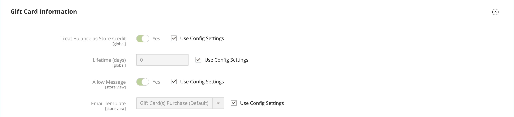

# Produit de carte cadeau

{{ee-feature}}

Chaque carte cadeau comporte un code unique, qui ne peut être utilisé que par un seul client lors du passage en caisse. Un [pool de codes](../stores-purchase/product-gift-card-accounts.md#step-3-establish-the-gift-card-code-pool) doit être établi avant que les cartes-cadeaux puissent être vendues. Pour plus d’informations sur le mode d’échange des cartes cadeaux dans le panier](../stores-purchase/product-gift-card-workflow.md) reportez-vous à la section [Workflow des cartes cadeau.

{width="700" zoomable="yes"}

Il existe trois types de cartes-cadeaux :

- **Virtuel** - Une carte cadeau virtuelle est envoyée à l&#39;adresse électronique du destinataire, qui est requise lors de l&#39;achat de la carte cadeau. Une adresse de livraison n&#39;est pas nécessaire.

- **Physique** - Une carte cadeau physique est envoyée à l&#39;adresse du destinataire, qui est requise lors de l&#39;achat de la carte cadeau.

- **Combiné** - Une carte-cadeau combinée est expédiée et envoyée par courriel au destinataire. L&#39;adresse e-mail et l&#39;adresse de livraison du destinataire sont requises lors de l&#39;achat de la carte cadeau.

## Créer un produit de carte cadeau

Les instructions suivantes illustrent le processus de création d’une carte cadeau à l’aide d’un [modèle de produit](attribute-sets.md), de champs obligatoires et de paramètres de base. Chaque champ obligatoire est signalé par un astérisque rouge (`*`). Lorsque vous avez terminé les principes de base, vous pouvez définir les autres paramètres du produit selon vos besoins.

### Étape 1 : sélection du type de produit

1. Dans la barre latérale _Admin_, accédez à **[!UICONTROL Catalog]** > **[!UICONTROL Products]**.

1. Dans l’angle supérieur droit du menu _[!UICONTROL Add Product]_( {width="25"} ), choisissez **[!UICONTROL Gift Card]**.

   {width="700" zoomable="yes"}

### Étape 2 : sélection du jeu d’attributs

Vous pouvez utiliser le jeu d’attributs de `Gift Card` par défaut ou en choisir un autre. Pour choisir le jeu d’attributs utilisé comme modèle pour le produit, effectuez l’une des opérations suivantes :

- Cliquez dans le champ **[!UICONTROL Attribute Set]** et saisissez tout ou partie du nom du jeu d’attributs.

- Dans la liste qui s’affiche, choisissez le jeu d’attributs à utiliser.

{width="600" zoomable="yes"}

### Étape 3 : effectuez les paramètres requis

1. Saisissez un **[!UICONTROL Product Name]** pour la carte cadeau.

   Vous pouvez également indiquer le type de carte cadeau dans le nom. Par exemple, _Carte cadeau virtuelle Luma_.

1. Saisissez un **[!UICONTROL SKU]** pour le produit.

   Par défaut, le Nom du produit est utilisé comme SKU par défaut.

1. Définissez **[!UICONTROL Card Type]** sur l’une des options suivantes :

   - `Virtual` - Les cartes-cadeaux virtuelles sont remises par e-mail au destinataire.
   - `Physical` - Les cartes-cadeaux physiques peuvent être produites en masse à l&#39;avance et embossées avec des codes uniques.
   - `Combined` - Une carte-cadeau combinée a les caractéristiques d&#39;une carte-cadeau virtuelle et physique.

   {width="600" zoomable="yes"}

1. Pour proposer au client un choix de montants fixes, cliquez sur **[!UICONTROL Add Amount]** et saisissez la première valeur fixe de la carte sous forme de décimale.

   Pour saisir la sélection des montants fixes, répétez cette étape pour chacun d&#39;eux.

1. Pour permettre aux clients de définir la valeur de la carte cadeau, procédez comme suit :

   - Définissez **[!UICONTROL Open Amount]** sur `Yes`.

   - Pour définir la plage de valeurs minimales et maximales acceptables, saisissez les valeurs **[!UICONTROL Open Amount From]** et **[!UICONTROL To]**.

   Vous pouvez créer des cartes-cadeaux à prix fixe, à prix ouvert ou les deux.

   >[!NOTE]
   >
   >Un produit de carte cadeau n&#39;a pas son propre prix dans le catalogue. Le prix de la carte cadeau est dérivé du montant de la carte cadeau sélectionnée lors de l&#39;achat.

   {width="600" zoomable="yes"}

### Étape 4 : définition des paramètres de base

1. Pour une carte-cadeau physique ou combinée, entrez le **[!UICONTROL Quantity]** en stock.

1. Si la carte-cadeau qui doit être expédiée, entrez le **[!UICONTROL Weight]** du colis.

1. Dans le champ **[!UICONTROL Categories]** , choisissez `Gift Card`.

D’autres attributs individuels peuvent décrire le produit. La sélection varie l’ensemble d’attributs et vous pouvez les terminer ultérieurement.

### Étape 5 : Complétez les informations de la carte cadeau

La section _[!UICONTROL Gift Card Information]_des paramètres du produit peut être utilisée pour remplacer les paramètres [configuration de la carte cadeau](../configuration-reference/sales/gift-cards.md) qui déterminent la manière dont la carte est gérée.

1. Faites défiler l’écran jusqu’à la section _[!UICONTROL Gift Card Information]_.

   Les paramètres par défaut de cette section sont déterminés par la configuration du système.

   {width="600" zoomable="yes"}

1. Modifiez les champs supplémentaires en fonction du fonctionnement souhaité de la carte cadeau :

   - **[!UICONTROL Treat Balance as Store Credit]** - Détermine si le titulaire de la carte cadeau peut utiliser le solde comme crédit en magasin.

   - **[!UICONTROL Lifetime (days)]** - Détermine le nombre de jours suivant l&#39;achat jusqu&#39;à l&#39;expiration de la carte cadeau. Si vous ne souhaitez pas définir de limite pour la durée de vie de la carte, laissez ce champ vide.

   - **[!UICONTROL Allow Message]** - Détermine si l’acheteur de la carte cadeau peut saisir un message pour au destinataire. Un message cadeau peut être inclus pour les cartes cadeaux virtuelles (par e-mail) et physiques (expédiées).

   - **[!UICONTROL Email Template]** - Détermine le modèle d’e-mail utilisé pour la notification envoyée au destinataire d’une carte cadeau.

### Étape 6 : compléter les informations sur le produit

Renseignez les informations des sections suivantes selon vos besoins :

- [Contenu](product-content.md)
- [Images et vidéos](product-images-and-video.md)
- [Produits associés, ventes incitatives et ventes croisées](related-products-up-sells-cross-sells.md)
- [Optimisation du moteur de recherche](product-search-engine-optimization.md)
- [Options personnalisables](settings-advanced-custom-options.md)
- [Produits dans les sites web](settings-basic-websites.md)
- [Conception](settings-advanced-design.md)
- [Options de cadeau](product-gift-options.md)

### Étape 7 : publier le produit

1. Si vous êtes prêt à publier le produit dans le catalogue, définissez le commutateur **Activer le produit** sur `Yes`.

1. Effectuez l’une des opérations suivantes :

   **Méthode 1 :** Enregistrer et prévisualiser

   - Dans le coin supérieur droit, cliquez sur **[!UICONTROL Save]**.

   - Pour afficher le produit dans votre boutique, choisissez **[!UICONTROL Customer View]** dans le menu _Admin_ (  ),

   {width="600" zoomable="yes"}

   **Méthode 2 :** Enregistrer et fermer

   Dans le menu _[!UICONTROL Save]_( {width="25"} ), choisissez **[!UICONTROL Save & Close]**.

## Éléments à retenir

- Un _pool de codes_ de numéros uniques doit être généré avant qu&#39;une carte-cadeau puisse être proposée à la vente.

- Les cartes-cadeaux peuvent être définies sur `Redeemable` ou `Non-Redeemable`.

- Les taxes ne sont **_pas appliquées_** aux cartes-cadeaux lors de l&#39;achat de la carte-cadeau. Les taxes ne sont appliquées aux produits que lorsqu’une carte-cadeau achetée est utilisée pour acheter des produits.

- La durée de vie d&#39;une carte cadeau peut être illimitée ou définie sur un nombre de jours spécifié.

- La valeur d&#39;une carte cadeau peut être fixée à un montant fixe ou à un montant ouvert avec une valeur minimale et maximale.

- Un produit de carte cadeau n&#39;a pas son propre prix dans le catalogue. Le prix de la carte cadeau est dérivé du montant de la carte cadeau sélectionnée lors de l&#39;achat.

- Un compte de carte cadeau pour le client peut être créé lors de la commande ou au moment de la facturation.
