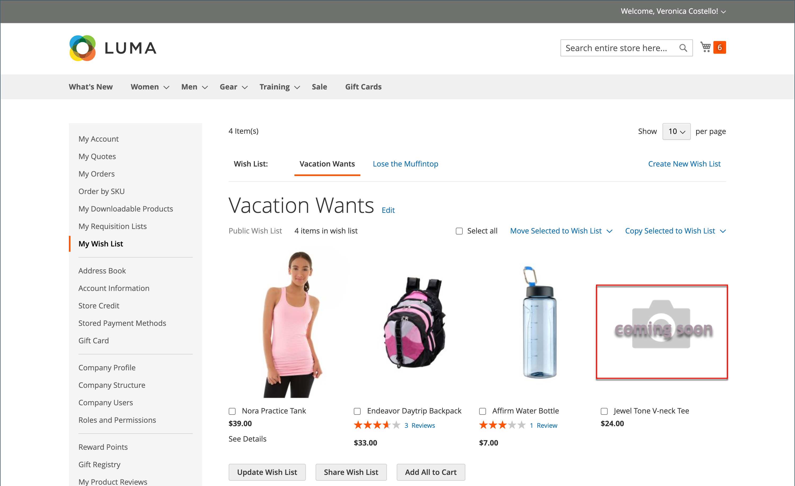

# Configuration de l’image du produit

Si vous envisagez de charger des images volumineuses pour les afficher sur la page _[!UICONTROL Product Details]_, vous pouvez envisager de définir une taille maximale en pixels (largeur et hauteur) et de redimensionner automatiquement les fichiers lors du chargement. Pour prendre en charge ce type de chargement d’images de produit, vous avez la possibilité d’activer le redimensionnement automatique des fichiers image plus volumineux au fur et à mesure du chargement. Pour les produits que vous souhaitez ajouter à votre catalogue, mais pour lesquels vous ne disposez pas encore d’une ressource d’image à afficher, vous pouvez configurer une image d’espace réservé.

## Redimensionnement de l’image du produit

Lors du chargement des images du produit, vous pouvez ajouter des images plus grandes et de tailles variables afin de fournir des zooms détaillés et de haute qualité sur la page _[!UICONTROL Product Details]_. Pour vous assurer que toutes les images ont une taille et un aspect similaires, il existe une option de redimensionnement de l’image permettant de s’assurer que toutes les images correspondent à une taille en pixels spécifique. Cette option redimensionne automatiquement toutes les images du produit à l’aide des paramètres de configuration, ce qui peut contribuer aux performances du zoom, à un chargement plus rapide des images et à un aspect uniforme des images de votre produit.

>[!NOTE]
>
>Pour une meilleure compatibilité, il est recommandé de charger toutes les images du produit avec le profil colorimétrique `sRGB`. Tous les autres profils de couleurs sont automatiquement convertis en profil de couleurs `sRGB` lors du chargement de l’image du produit, ce qui peut entraîner une incohérence des couleurs dans l’image chargée.

La définition d’une largeur et d’une hauteur maximales en pixels redimensionne l’image aux dimensions physiques par pixel. Commerce redimensionne l’image en fonction de la valeur la plus élevée (largeur ou hauteur) tout en conservant les proportions. La réduction de la quantité de qualité des images JPG réduit la taille du fichier.

Par exemple, un JPG de 3 000 x 2 100 pixels à 100 % peut être un fichier image de 5 Mo ou plus. Le redimensionnement de cette image réduirait la largeur à 1 920 pixels, en conservant les proportions et la qualité à 80 % afin de fournir une taille de fichier beaucoup plus petite avec une qualité élevée.

### Activer le redimensionnement de l’image

1. Dans la barre latérale _Admin_, accédez à **[!UICONTROL Stores]** > _[!UICONTROL Settings]_>**[!UICONTROL Configuration]**.

1. Dans le panneau de gauche, développez **[!UICONTROL Advanced]** et choisissez **[!UICONTROL System]**.

1. Développez  la section _Configuration du chargement d’images_.

   Pour modifier les paramètres par défaut, désélectionnez la case **[!UICONTROL Use system value]** si nécessaire.

   {width="600" zoomable="yes"}

   Pour obtenir la liste détaillée de ces paramètres de configuration, voir [_Configuration du téléchargement d’images_](../configuration-reference/advanced/system.md#image-upload-configuration) dans le _Guide de référence de configuration_.

1. Pour l’activer, assurez-vous que **[!UICONTROL Enable Frontend Resize]** est défini sur `Yes`.

1. Saisissez un paramètre de **[!UICONTROL Quality]** compris entre `1` et `100` %.

   Un paramètre compris entre 80 et 90 % est recommandé pour une taille de fichier réduite et une qualité élevée.

1. Définissez la **[!UICONTROL Maximum Width]** en pixels pour l’image.

   Lorsque l&#39;image est redimensionnée, elle ne dépasse pas cette largeur et conserve les proportions.

1. Définissez la **[!UICONTROL Maximum Height]** en pixels pour l’image.

   Lorsque l&#39;image est redimensionnée, elle ne dépasse pas cette hauteur et conserve les proportions.

1. Cliquez ensuite sur **[!UICONTROL Save Config]**.

### Descriptions des champs

| Champ | [Portée](../getting-started/websites-stores-views.md#scope-settings) | Description |
|--- |--- |--- |
| [!UICONTROL Quality] | Global | Détermine la qualité JPG de l’image redimensionnée. Une qualité inférieure réduit la taille du fichier. 80 à 90 % est recommandé pour réduire la taille du fichier avec une qualité élevée. Valeur par défaut : 80 |
| [!UICONTROL Enable Frontend Resize] | Global | Permet à Commerce de redimensionner les images volumineuses et surdimensionnées que vous pouvez charger pour la page _[!UICONTROL Product Details]_. Commerce redimensionne les fichiers image à l’aide de JavaScript lors du chargement du fichier. Lorsque l’image est redimensionnée, elle conserve les proportions exactes afin de respecter et de ne pas dépasser la plus grande taille pour la Largeur maximale ou la Hauteur maximale. Valeur par défaut : `Yes` |
| [!UICONTROL Maximum Width] | Global | Détermine la largeur maximale en pixels de l’image. Lorsque l’image est redimensionnée, elle ne dépasse pas cette largeur. Valeur par défaut : `1920` |
| [!UICONTROL Maximum Height] | Global | Détermine la hauteur maximale en pixels de l’image. Lorsque l’image est redimensionnée, elle ne dépasse pas cette hauteur. Valeur par défaut : `1200` |

{style="table-layout:auto"}

## Espaces réservés d’image

Adobe Commerce et Magento Open Source utilisent des images temporaires comme espaces réservés jusqu’à ce que les images de produit permanentes soient disponibles. Un espace réservé différent peut être chargé pour chaque rôle. L’image d’espace réservé initiale est un exemple de logo, que vous pouvez remplacer par l’image de votre choix.

{width="600" zoomable="yes"}

**_Pour charger des images d’espace réservé:_**

1. Dans la barre latérale _Admin_, accédez à **[!UICONTROL Stores]** > _[!UICONTROL Settings]_>**[!UICONTROL Configuration]**.

1. Dans le panneau de gauche, développez **[!UICONTROL Catalog]** et choisissez **[!UICONTROL Catalog]** en dessous.

1. Développez  dans la section **[!UICONTROL Product Image Placeholders]** .

   {width="600" zoomable="yes"}

   Pour obtenir la liste détaillée de ces paramètres de configuration, voir [_espaces réservés d’image de produit_](../configuration-reference/catalog/catalog.md#product-image-placeholders) dans le _Guide de référence de configuration_.

1. Pour chaque rôle d’image, cliquez sur **[!UICONTROL Choose File]**, recherchez l’image sur votre ordinateur et chargez le fichier.

   Vous pouvez utiliser la même image pour les trois rôles, ou vous pouvez charger une image d’espace réservé différente pour chaque rôle.

1. Cliquez ensuite sur **[!UICONTROL Save]**.

Pour plus d’informations sur les rôles d’image et les tailles recommandées, voir [Charger une image](product-image.md#upload-an-image).
