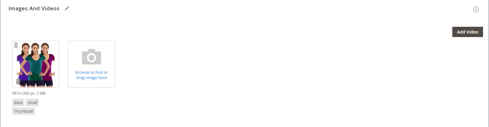

# Gestion des images et des vidéos du produit

Pour chaque produit, vous pouvez charger plusieurs images et vidéos, réorganiser leur ordre et contrôler leur utilisation. Si vous devez gérer une grande quantité d’images, il est préférable de les importer par lot, plutôt que de les charger individuellement. Pour plus d’informations, voir [Importer des images de produit](../systems/data-import-product-images.md).

Si vous envisagez de charger des images volumineuses pour les afficher sur la page _[!UICONTROL Product Details]_, vous pouvez envisager de définir une taille maximale en pixels (largeur et hauteur) et de redimensionner automatiquement les fichiers lors du chargement. Il existe une option pour activer le redimensionnement automatique des fichiers image plus volumineux au fur et à mesure du chargement. Pour plus d’informations, voir [Redimensionnement de l’image du produit](product-image-config.md#product-image-resizing).

## Mise à jour des images du produit

1. Ouvrez le produit en mode d’édition.

1. Pour utiliser une vue de magasin spécifique, définissez le sélecteur de **[!UICONTROL Store View]** dans le coin supérieur gauche sur la vue applicable.

   >[!NOTE]
   >
   >Les nouvelles images du produit sont **_toujours_** chargées et visibles dans **_toutes_** les vues du magasin, même si la portée du `All Store Views` n’est pas utilisée pour le chargement.   Pour masquer une image de produit d’une vue de magasin spécifique, vous devez basculer vers cette vue de magasin , cocher la case **[!UICONTROL Hide from Product Page]** de l’image, puis cliquer sur **[!UICONTROL Save]**.

1. Faites défiler vers le bas et développez la section _[!UICONTROL Images and Videos]_.

### Charger une image

Pour une meilleure compatibilité, il est recommandé de charger toutes les images du produit avec le profil colorimétrique `sRGB`. Tous les autres profils de couleurs sont automatiquement convertis en profil de couleurs `sRGB` lors du chargement de l’image du produit, ce qui peut entraîner une incohérence des couleurs dans l’image chargée.

La longueur du nom du fichier image, extension incluse, ne peut pas dépasser 90 caractères.

Pour charger une image, effectuez l’une des opérations suivantes :

- Faites glisser une image à partir du bureau et déposez-la sur la mosaïque _Appareil photo_ (  ) de la zone de _[!UICONTROL Images And Videos]_.

- Dans la zone de _[!UICONTROL Images And Videos]_, cliquez sur la mosaïque_ Appareil photo _(  ), sélectionnez le fichier image sur votre ordinateur, puis cliquez sur **[!UICONTROL Open]**.

  {width="600" zoomable="yes"}

### Réorganiser les images

Pour modifier l’ordre des images dans la galerie, cliquez sur l’icône _[!UICONTROL Sort]_(  ) au bas de la mosaïque de l’image et faites glisser l’image à un autre emplacement dans la zone de&#x200B;_[!UICONTROL Images And Videos]_.

{width="600" zoomable="yes"}

### Suppression d’une image

Pour supprimer une image de la galerie, cliquez sur l’icône **[!UICONTROL Delete]** (  ) dans le coin supérieur droit de la mosaïque de l’image, puis cliquez sur **[!UICONTROL Save]**.

### Définition des détails de l’image

Cliquez sur l’image à ouvrir dans la vue détaillée et effectuez l’une des opérations suivantes :

{width="600" zoomable="yes"}

Pour fermer la vue détaillée, cliquez sur l’icône _Fermer_ (  ) dans le coin supérieur droit.

Cliquez ensuite sur **[!UICONTROL Save]**.

#### Saisir le texte de remplacement

Le texte de remplacement de l’image est référencé par les lecteurs d’écran pour améliorer l’accessibilité web et par les moteurs de recherche lors de l’indexation du site. Certains navigateurs affichent le texte de remplacement lorsque le curseur de la souris survole la page. Le texte secondaire peut comporter plusieurs mots et inclure des mots clés soigneusement sélectionnés.

Dans la zone de _[!UICONTROL Alt Text]_, saisissez une brève description de l’image.

#### Attribuer des rôles

Par défaut, tous les rôles sont affectés à la première image téléchargée sur le produit. Pour réaffecter un rôle à une autre image, procédez comme suit :

Dans la zone de _[!UICONTROL Role]_, choisissez le rôle que vous souhaitez affecter à l’image.

Lorsque vous revenez à la section _Images et vidéos_, les rôles actuellement attribués s’affichent sous chaque image.

{width="600" zoomable="yes"}

#### Masquage d’une image

Pour exclure une image de la galerie de miniatures, cochez la case **[!UICONTROL Hidden]** et cliquez sur **[!UICONTROL Save]**.

{width="600" zoomable="yes"}

## Gestion des images et des vidéos au niveau de l’affichage du magasin

Lorsque vous basculez le sélecteur de **[!UICONTROL Store View]** vers une vue de magasin spécifique (non **[!UICONTROL All Store Views]**), la section _[!UICONTROL Images and Videos]_&#x200B;fournit des commandes supplémentaires pour gérer l’affichage des images pour cette vue de magasin sans affecter la portée par défaut.

### Réorganiser les images pour une vue de magasin

Lorsque vous travaillez dans une portée d’affichage de magasin, une case à cocher de **[!UICONTROL Use Default Order]** s’affiche sous la zone de _[!UICONTROL Images and Videos]_. Cochez cette case pour rétablir l’ordre d’affichage de l’image dans la séquence définie dans la portée par défaut.

{width="600" zoomable="yes"}

### Définition des détails de l’image pour une vue de magasin

Lorsque vous ouvrez l’affichage Détails de l’image à la portée de l’affichage du magasin, chaque champ, y compris **[!UICONTROL Alt Text]**, les affectations de **[!UICONTROL Role]** d’image (Base, Petit, Miniature, Échantillon) et **[!UICONTROL Hide from Product Page]**, affiche une case à cocher **[!UICONTROL Use Default Value]**. Cochez cette case pour hériter de la valeur configurée dans la portée par défaut de ce champ.

{width="600" zoomable="yes"}

## Rôles d’image

| Rôle de l’image | Description |
|--- |--- |
| [!UICONTROL Thumbnail] | Les miniatures apparaissent dans la galerie de miniatures, dans le panier et dans certains blocs tels que les articles associés. Exemple de taille : 50 x 50 pixels |
| [!UICONTROL Small Image] | La petite image est utilisée pour les images du produit dans les listes des pages de catégories et de résultats de recherche, et pour afficher les images du produit nécessaires aux sections telles que les ventes incitatives, les ventes croisées et la liste des nouveaux produits. Exemple de taille : 470 x 470 pixels |
| [!UICONTROL Base Image] | L’image de base est l’image principale de la page des détails du produit. Le zoom de l’image est activé si vous téléchargez une image plus grande que le conteneur d’images. Selon le niveau de zoom que vous souhaitez atteindre, l’image de base doit avoir une taille deux à trois fois supérieure à celle du conteneur. Exemples de tailles : 470 x 470 pixels (sans Zoom), 1 100 x 1 100 pixels (avec Zoom) |
| [!UICONTROL Swatch] | Un [échantillon](swatches.md) peut être utilisé pour illustrer la couleur, le motif ou la texture. Exemple de taille : 50 x 50 pixels |

{style="table-layout:auto"}

## Filigranes

Si vous faites les frais de la création de vos propres images de produits originaux, il n&#39;y a pas grand-chose que vous puissiez faire pour empêcher des concurrents sans scrupules de les voler d&#39;un simple clic de souris. Cependant, vous pouvez en faire une cible moins attrayante en plaçant un filigrane sur chaque image pour les identifier comme votre propriété. Un fichier de filigrane peut être une image JPG (JPEG), GIF ou PNG. Les types de fichiers GIF et PNG prennent en charge les calques transparents, qui peuvent être utilisés pour donner au filigrane un arrière-plan transparent.

Le filigrane utilisé pour l’image _small_ dans l’exemple suivant est un logo noir avec un arrière-plan transparent et enregistré en tant que fichier PNG avec les paramètres suivants :

- Taille : 50x50
- Opacité : 5
- Position : mosaïque

{width="700" zoomable="yes"}

### Ajout de filigranes aux images du produit

1. Dans la barre latérale _Admin_, accédez à **[!UICONTROL Content]** > _[!UICONTROL Design]_>**[!UICONTROL Configuration]**.

   Pour plus d’informations sur les configurations de conception, voir [Configuration de conception](../content-design/configuration.md).

1. Recherchez la vue de magasin que vous souhaitez configurer, puis cliquez sur **[!UICONTROL Edit]** dans la colonne _[!UICONTROL Action]_.

1. Sous _[!UICONTROL Other Settings]_, développez  la section **[!UICONTROL Product Image Watermarks]**.

   {width="600" zoomable="yes"}

   Les paramètres d’image **[!UICONTROL Base]**, **[!UICONTROL Thumbnail]**, **[!UICONTROL Small]** et **[!UICONTROL Swatch Image]** sont identiques.

1. Utilisez l’une des méthodes suivantes pour ajouter la ressource image de filigrane :

   - Cliquez sur **[!UICONTROL Upload]** et sélectionnez le fichier image de votre système que vous souhaitez charger pour l’utiliser comme filigrane.
   - Cliquez sur **[!UICONTROL Select from Gallery]** et sélectionnez une ressource image dans la [&#x200B; Galerie de médias &#x200B;](../content-design/media-gallery.md).

1. Définissez les paramètres d’affichage du filigrane :

   - Saisissez le **[!UICONTROL Image Opacity]** en pourcentage. Par exemple : `40`

   - Saisissez le **[!UICONTROL Image Size]** en pixels. Par exemple : `200 x 200`

   - Définissez **[!UICONTROL Image Position]** pour déterminer où apparaît le filigrane.

1. Cliquez ensuite sur **[!UICONTROL Save Config]**.

1. Lorsque vous êtes invité à actualiser le cache, cliquez sur **[!UICONTROL Cache Management]** dans le message système et actualisez le cache non valide.

   {width="600" zoomable="yes"}

>[!TIP]
>
>Vous pouvez cliquer sur **[!UICONTROL Use Default Value]**  pour restaurer la valeur par défaut.

### Supprimer un filigrane

1. Dans le coin inférieur gauche de l’image, cliquez sur l’icône **[!UICONTROL Delete]** (  ).

   {width="300"}

1. Cliquez sur **[!UICONTROL Save Config]**.

1. Lorsque vous êtes invité à actualiser le cache, cliquez sur **[!UICONTROL Cache Management]** dans le message système et actualisez le cache non valide.

   Si l’image du filigrane persiste dans le storefront, revenez à la gestion du cache et cliquez sur **[!UICONTROL Flush Magento Cache]**.
