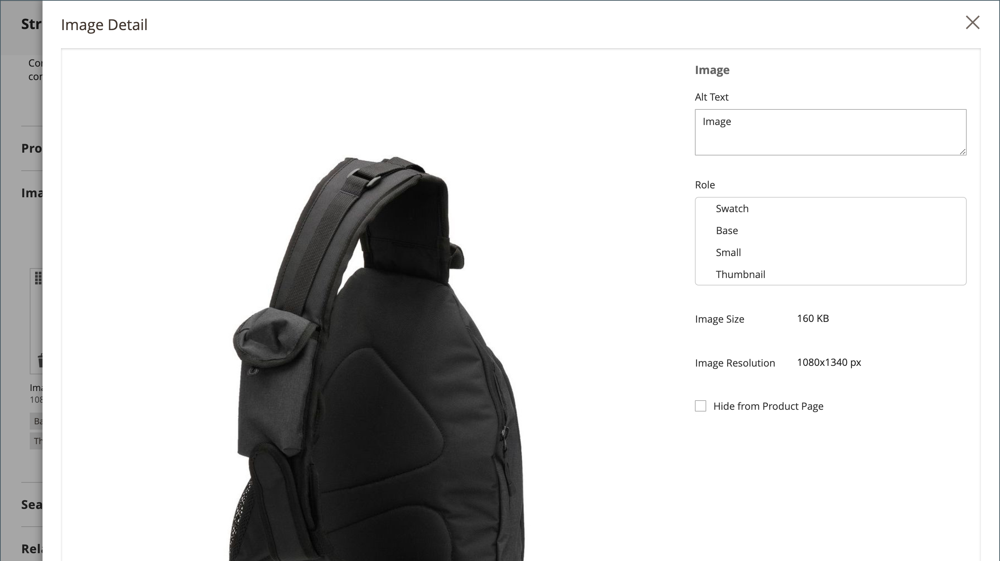

# Paramètres du produit - [!UICONTROL Images and Videos]

Dans la _[!UICONTROL Images and Videos]_, vous pouvez exécuter des tâches de gestion des images de base, telles que télécharger plusieurs images, réorganiser les images et contrôler l’utilisation de chaque image. Pour mieux contrôler les images individuelles, vous pouvez ouvrir chaque image dans_ vue détaillée _. Pour plus d’informations, voir [Images et vidéos du catalogue](catalog-images-video.md).

## Charger une nouvelle image

1. Ouvrez le produit en mode d’édition.

1. Faire défiler vers le bas et développer  la valeur _[!UICONTROL Images and Videos]_.

   {width="600" zoomable="yes"}

1. Si vous êtes prêt à ajouter une image de produit, effectuez l’une des opérations suivantes :

   - Faites glisser une image depuis votre bureau et déposez-la sur le _Appareil photo_ ().

   - Cliquez sur le bouton _Appareil photo_ (), sélectionnez le fichier image, puis cliquez sur **[!UICONTROL Open]**.

A [espace réservé](product-image-config.md#image-placeholders) L’image apparaît dans le catalogue jusqu’à ce qu’une image de produit soit disponible.

## Détails de l’image

À mesure que vous ajoutez des images de produit, vous pouvez personnaliser l’affichage de l’image dans le _[!UICONTROL Image Detail]_fenêtre.

{width="600" zoomable="yes"}

Pour définir les options d’affichage d’image d’un produit :

1. Cliquez sur l’image du produit.

1. Saisissez le **[!UICONTROL Alt text]**.

1. Choisissez une **[!UICONTROL Role]** pour afficher l’image (tous les rôles peuvent être sélectionnés pour une image) :

   - `Swatch`
   - `Base`
   - `Small`
   - `Thumbnail`

   Tous ces rôles sont sélectionnés par défaut pour la première image ajoutée.

   {width="600" zoomable="yes"}

Pour masquer l’image du produit de la page du produit, sélectionnez l’option **[!UICONTROL Hide from Product Page]** .
