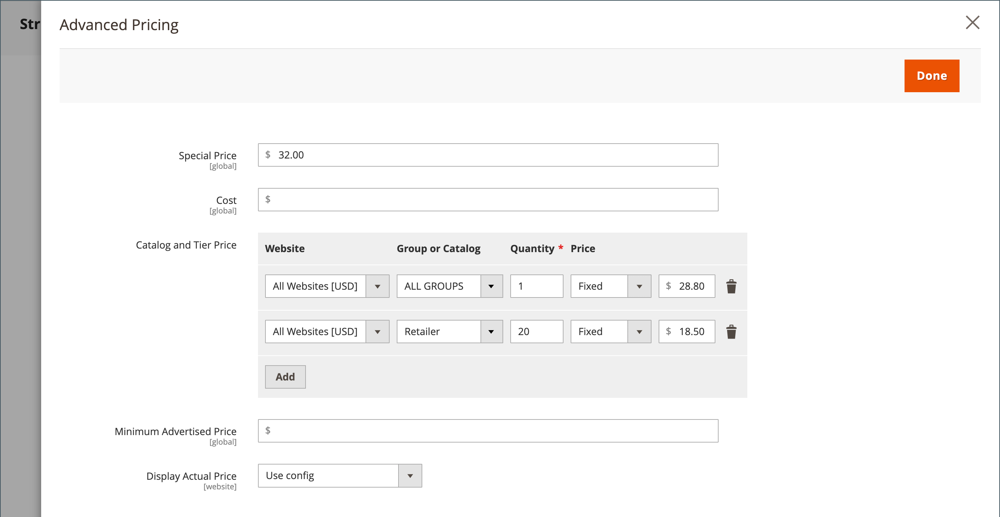

# Tarifs des groupes

Vous pouvez utiliser les paramètres de configuration de produit dans l’Admin pour définir les prix des articles à prix réduit en fonction des groupes de clients de votre boutique. Ce modèle de tarification stratégique est appelé _prix de groupe_.

Le prix réduit de n’importe quel produit peut être offert aux membres d’un groupe de clients spécifique lorsque l’acheteur est connecté à son compte. Le prix du groupe de clients s’affiche sur la page du produit avec le prix normal afin qu’un acheteur puisse facilement comparer les prix et agir en conséquence. Après avoir ajouté le produit dans le panier, le prix normal est remplacé par le prix du groupe en fonction de leur groupe de clients.

La tarification pour les groupes de clients est un composant de la [tarification à plusieurs niveaux](product-price-tier.md) et est définie de la même manière. La seule différence est que les prix des groupes de clients ont une quantité de 1.

{width="600" zoomable="yes"}

## Avantages du prix de groupe

- Convient aux acheteurs en gros

- Incitez les clients à mettre à niveau leur groupe de clients pour bénéficier de remises

- Campagnes marketing ciblées

- Renforcer la confiance et la crédibilité en récompensant les clients fidèles

## Configurer un prix de groupe

1. Ouvrez le produit en mode d’édition.

1. Sous le champ _[!UICONTROL Price]_, cliquez sur **[!UICONTROL Advanced Pricing]**.

1. Dans la section _[!UICONTROL Customer Group Price]_, cliquez sur **[!UICONTROL Add]**.

   Si votre boutique comprend [Adobe Commerce B2B](../b2b/introduction.md) et que [&#x200B; catalogues partagés](../b2b/catalog-shared.md) est activé, cette section est intitulée _[!UICONTROL Catalog and Tier Price]_.

   {width="600" zoomable="yes"}

1. Configurez le prix du groupe :

   - Pour une installation multi-site, choisissez le **[!UICONTROL Website]** où s&#39;applique le prix du groupe.

   - Sélectionnez le **[!UICONTROL Customer Group]** qui doit recevoir la remise.

   - Saisissez un **[!UICONTROL Quantity]** de `1`.

   - Pour **[!UICONTROL Price]**, définissez le type de prix et le montant :

      - `Fixed` - Saisissez le prix du produit escompté.

      - `Discount` - Saisissez le prix escompté en pourcentage du prix du produit.

     {width="600" zoomable="yes"}

1. Pour ajouter un autre prix de groupe, cliquez sur **[!UICONTROL Add]** et répétez l’étape précédente.

1. Une fois l’opération terminée, cliquez sur **[!UICONTROL Done]**, puis sur **[!UICONTROL Save]**.

>[!NOTE]
>
>Le prix du produit **_final_** est calculé comme le prix **_minimum_** approprié, à l’aide de la formule suivante :  `Final Price=Min(Regular(Base) Price, Group(Tier) Price, Special Price, Catalog Price Rule) + Sum(Min Price per each required custom option)`

>[!NOTE]
>
>Les options personnalisables du produit **_Prix fixe_** sont _non_ affectées par les règles de prix de groupe, de niveau, de prix spécial ou de catalogue.
