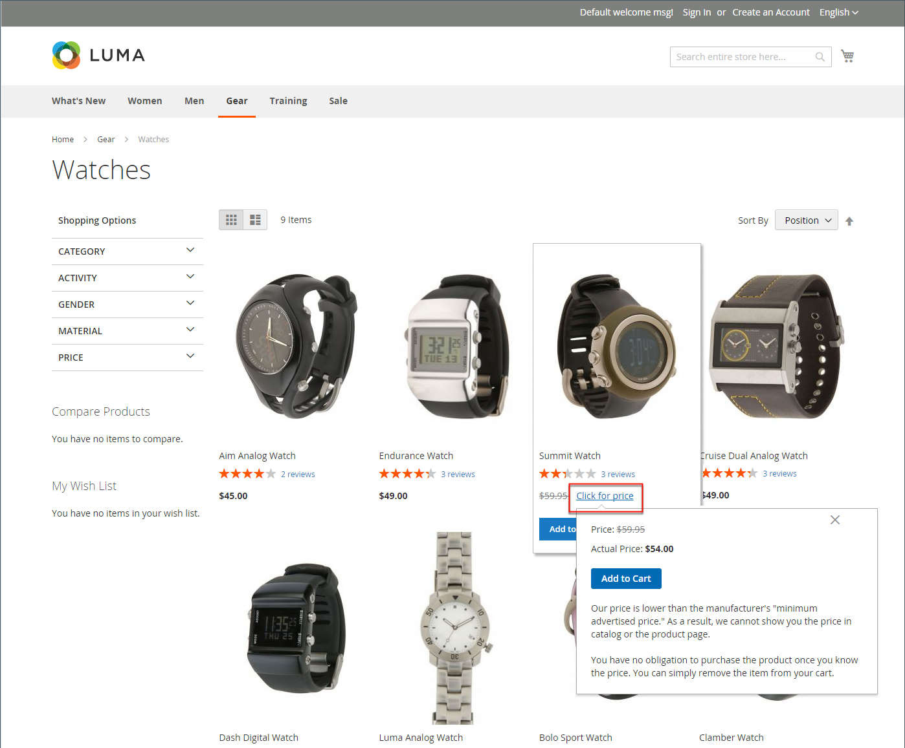

# Prix minimum publicitaire

Il est parfois interdit aux commerçants d&#39;afficher un prix inférieur au prix de détail suggéré par le fabricant (MSRP). Le prix publicitaire minimum (MAP) vous permet de rester en conformité avec les exigences du fabricant tout en offrant à vos clients un meilleur prix. Comme les exigences varient d’un fabricant à l’autre, vous pouvez configurer votre boutique afin d’empêcher l’affichage de votre prix réel sur les pages où il n’est pas autorisé.

La fonction MAP ajoute un lien _Cliquez pour le prix_ dédié au lieu du prix normal du produit. Si le prix de votre boutique est inférieur au prix minimum fixé pour ce produit, il existe deux manières de gérer les informations de prix sur le storefront. La première est que le prix ne s&#39;affiche pas. Si l’acheteur clique sur le bouton _Cliquer pour le prix_, le prix réel auquel vous vendez le produit ne sera visible que si le prix réel. La deuxième méthode consiste à afficher le prix de la liste ou du marché avec une marque pour souligner que votre prix est inférieur.

En outre, la fonction MAP vous permet de suggérer des améliorations. Par exemple, lorsqu’un client ajoute un produit de ce type dans son panier, il n’est pas redirigé vers ce dernier, mais des offres s’affichent, ce qui permet à l’acheteur :

- Supprimez un article du panier (cela peut être fait si l’acheteur souhaite simplement clarifier le prix et n’a pas encore pris de décision d’achat).

- Laissez-le dans leur panier et continuez à faire vos achats.

- Passez à la caisse.

## Logique MAP

Certains produits ont des prix qui dépendent d’une option sélectionnée, comme des options personnalisées ou des produits simples avec leurs propres SKU et gestion des stocks. Pour ces produits, la logique suivante est appliquée, selon le type de produit et le paramètre de prix. Le prix réel est utilisé par la gestion des commandes, les outils de gestion des clients et les rapports.

## Utilisation de MAP avec des types de produits

| Type de produit | Description |
|--- |--- |
| [Simple](product-create-simple.md), [Virtuel](product-create-virtual.md) | Le prix réel n’apparaît pas automatiquement sur la liste des catalogues et les pages de produits, mais est inclus uniquement en fonction du paramètre [!UICONTROL Display Actual Price] . Les prix des options personnalisées apparaissent normalement. |
| [Regroupé](product-create-grouped.md) | Les prix des produits simples associés n’apparaissent pas automatiquement sur la liste des catalogues et les pages des produits, mais sont inclus uniquement en fonction du paramètre [!UICONTROL Display Actual Price] . |
| [Configurable](product-create-configurable.md) | Le prix réel n’apparaît pas automatiquement sur la liste des catalogues et les pages de produits, mais est inclus uniquement en fonction du paramètre [!UICONTROL Display Actual Price] . Les prix des options apparaissent normalement. |
| [Bundle](product-create-bundle.md) (avec prix fixe) | Le prix réel n’apparaît pas automatiquement sur les pages du catalogue, mais est inclus uniquement en fonction du paramètre [!UICONTROL Display Actual Price] . Les prix des éléments de lot apparaissent normalement. MAP n’est pas disponible pour les produits groupés avec une tarification dynamique. |
| [Téléchargeable](product-create-downloadable.md) | Le prix réel n’apparaît pas automatiquement sur la liste des catalogues et les pages de produits, mais est inclus uniquement en fonction du paramètre [!UICONTROL Display Actual Price] . Le prix associé à chaque lien de téléchargement s’affiche normalement. |

{style="table-layout:auto"}

## Utilisation de MAP avec des paramètres de prix

| Paramètre de prix | Description |
|--- |--- |
| Prix principal | Lorsque le MAP est appliqué au prix principal, les prix des options, des articles de bundle et des produits associés (qui ajoutent ou soustraient du prix principal) apparaissent normalement. |
| Prix du produit associé | Si un produit n’a pas de prix principal et que son prix est dérivé des prix de produit associés (par exemple, dans un produit groupé), les paramètres MAP des produits associés sont appliqués. |
| [MSRP](product-price-minimum-advertised.md) | Si le prix de vente au détail suggéré (MSRP) du fabricant est spécifié pour un produit du panier, le prix n’est pas dépassé. |
| [Prix de niveau](product-price-tier.md) | Si le niveau de prix est défini, le message du niveau de prix ne s’affiche pas dans le catalogue. Sur la page du produit, une notification s’affiche indiquant que le prix peut être inférieur lors de la commande de plus d’une certaine quantité, mais que la remise est affichée en pourcentages uniquement. Pour les produits associés d’un produit groupé, les remises ne s’affichent pas sur la page produit. Le prix du niveau s’affiche en fonction du paramètre Afficher le prix réel . |
| [Prix spécial](product-price-special.md) | Si le Prix spécial est spécifié, le prix spécial est affiché selon le paramètre Afficher le Prix réel . |

## Configuration de MAP

La fonction Prix minimal annoncé (MAP) n’est pas activée par défaut. Si vous souhaitez ajouter cette fonctionnalité à votre boutique, vous devez l’activer et configurer les paramètres MAP de vos produits. Les paramètres MAP peuvent être appliqués à tous les produits de votre catalogue ou configurés pour des produits spécifiques. Lorsque le MAP est activé globalement, tous les prix des produits sur le storefront sont masqués. Il existe différentes options de configuration que vous pouvez utiliser pour rester conforme aux dispositions de votre contrat avec le fabricant, tout en offrant à vos clients un meilleur prix.

{width="700" zoomable="yes"}

Au niveau global, vous pouvez activer ou désactiver MAP, l’appliquer à tous les produits, définir comment le prix réel s’affiche. Vous pouvez également modifier le texte des messages associés et des conseils d’information qui apparaissent dans le magasin.

Lorsque MAP est activé, les paramètres de MAP au niveau du produit deviennent disponibles. Vous pouvez appliquer MAP à un produit individuel en saisissant le MSRP et en choisissant la manière dont vous souhaitez que le prix réel apparaisse dans le magasin. Les paramètres MAP au niveau du produit remplacent les paramètres globaux MAP.

{width="700" zoomable="yes"}

### Étape 1 : activation de MAP pour la vue de magasin

1. Sur la barre latérale _Admin_, accédez à **[!UICONTROL Stores]** > _[!UICONTROL Settings]_>**[!UICONTROL Configuration]**.

1. Le cas échéant, définissez **[!UICONTROL Store View]** dans le coin supérieur droit sur la vue où s’applique la configuration.

1. Dans le panneau de gauche, développez **[!UICONTROL Sales]** et sélectionnez **[!UICONTROL Sales]** sous .

1. Développez la section  sur _[!UICONTROL Minimum Advertised Price]_.

1. Si nécessaire, définissez **Activer MAP** sur `Yes`.

   {width="600" zoomable="yes"}

   Pour obtenir la liste détaillée de ces options de configuration, voir [_Prix minimal annoncé_](../configuration-reference/sales/sales.md#minimum-advertised-price) dans la _Référence de configuration_.

### Étape 2 : configuration des paramètres de MAP

Utilisez l’une des méthodes suivantes pour configurer les paramètres de MAP :

#### Méthode 1 : configurer MAP pour tous les produits

1. Pour déterminer quand et où vous souhaitez que le prix réel soit visible pour les clients, procédez comme suit :

   - Pour modifier la valeur par défaut, décochez la case **[!UICONTROL Use system value]** .

   - Définissez le **Prix d’affichage réel** sur l’un des paramètres suivants :
      - `In Cart`
      - `Before Order Confirmation`
      - `On Gesture (on click)`

1. Saisissez le texte que vous souhaitez afficher dans le **[!UICONTROL Default Popup Text Message]**.

1. Entrez toute explication supplémentaire que vous souhaitez afficher dans le **[!UICONTROL Default "What's This" Text Message]**.

1. Une fois l’opération terminée, cliquez sur **[!UICONTROL Save Config]**.

#### Méthode 2 : configuration de MAP pour un seul produit

1. Sur la barre latérale _Admin_, accédez à **[!UICONTROL Catalog]** > **[!UICONTROL Inventory]** > **[!UICONTROL Products]**.

1. Ouvrez le produit en mode **[!UICONTROL Edit]**.

1. Dans le panneau de gauche, développez **[!UICONTROL Advanced Settings]** et choisissez **[!UICONTROL Advanced Pricing]**.

   >[!NOTE]
   >
   >Les champs [!UICONTROL Manufacturer's Suggested Retail Price] et [!UICONTROL Display Actual Price] s’affichent uniquement lorsque [Prix publicitaire minimal](../configuration-reference/sales/sales.md#minimum-advertised-price) est activé dans la configuration.

1. Saisissez le **[!UICONTROL Manufacturer's Suggested Retail Price]** (MSRP).

   Dans cet exemple, le prix du produit est de 54,00 $ et le MSRP de 59,95 $.

   {width="600" zoomable="yes"}

1. Définissez **[!UICONTROL Display Actual Price]** sur l’une des options suivantes :

   - `Use config` - (Par défaut) Applique les paramètres d’affichage au [configuré](../configuration-reference/sales/sales.md#minimum-advertised-price) pour le magasin. |
   - `On Gesture` - Affiche le prix réel du produit dans une fenêtre contextuelle lorsque le client clique sur le bouton _Cliquer pour le prix_ ou _Qu’est-ce que c’est ?Lien_.
   - `In Cart` - Affiche le prix réel du produit dans le panier.
   - `Before Order Confirmation` - Affiche le prix réel du produit à la fin du processus de passage en caisse, juste avant que la commande ne soit confirmée.

1. Une fois l’opération terminée, cliquez sur **[!UICONTROL Done]**, puis sur **[!UICONTROL Save]**.
