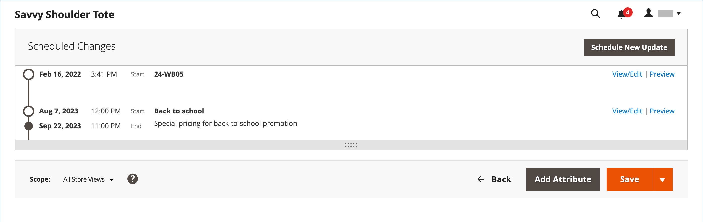

# Prix spéciaux

Un prix spécial peut être proposé pour une période donnée. Pendant une période spécifiée, le prix spécial apparaît à la place du prix normal, suivi d’une notation indiquant le prix normal.

{width="700" zoomable="yes"}

## Appliquer un prix spécial à un produit individuel

Vous pouvez facilement définir un prix spécial pour un seul produit du catalogue.

### Utiliser une mise à jour planifiée

{{ee-feature}}

Adobe Commerce prend en charge les [mises à jour planifiées](../content-design/content-staging-scheduled-update.md). Utilisez ces outils promotionnels pour appliquer un prix spécial à un produit spécifique pendant une période donnée.

1. Ouvrez le produit en mode d’édition.

1. Cliquez sur **[!UICONTROL Scheduled Update]**.

   {width="600" zoomable="yes"}

1. Pour **Mettre à jour le nom**, saisissez un nom pour la promotion de prix spécial.

1. Saisissez un résumé **[!UICONTROL Description]**.

1. Utilisez l’icône _Calendrier_ (  ) pour choisir les **[!UICONTROL Start Date]** et **[!UICONTROL End Date]** pour la promotion de prix spécial.

   Vous pouvez également utiliser les curseurs **[!UICONTROL Hour]** et **[!UICONTROL Minute]** pour choisir l’heure de début et l’heure de fin. Cliquez sur **[!UICONTROL Close]** lorsque le début et la fin sont définis.

   {width="600" zoomable="yes"}

1. Faites défiler l&#39;écran jusqu&#39;au champ _Price_, cliquez sur **[!UICONTROL Advanced Pricing]**, puis saisissez le montant de **[!UICONTROL Special Price]** à appliquer selon la mise à jour planifiée.

   {width="600" zoomable="yes"}

1. Une fois l’opération terminée, cliquez sur **[!UICONTROL Done]**, puis sur **[!DNL Save]**.

   Dans le storefront, le prix spécial doit apparaître à la fois dans la liste des catalogues et sur la page des produits.

   _[!UICONTROL Scheduled Change]_apparaît en haut de la page.

   {width="600" zoomable="yes"}

### Utilisation d’une date de début et de fin simple

{{ce-feature}}

Magento Open Source comprend des options simples de date de début et de fin dans les options de tarification avancée.

1. Ouvrez le produit en mode d’édition.

1. Faites défiler l’écran jusqu’au champ _[!UICONTROL Price]_, cliquez sur **[!UICONTROL Advanced Pricing]**, puis saisissez la valeur **[!UICONTROL Special Price]**.

1. Utilisez l’icône _Calendrier_ (  ) pour choisir les **[!UICONTROL Start Date]** et **[!UICONTROL End Date]** pour la promotion de prix spécial.

   Le prix spécial entrera en vigueur immédiatement après minuit au début de la date de début (00:01) et sera maintenu jusqu&#39;à minuit (23:59) le jour précédant la date de fin.

   {width="600" zoomable="yes"}

1. Une fois l’opération terminée, cliquez sur **[!UICONTROL Done]**, puis sur **[!UICONTROL Save]**.

   Dans le storefront, le prix spécial doit apparaître à la fois dans la liste des catalogues et sur la page des produits.

## Appliquer un prix spécial à plusieurs produits

Vous pouvez également attribuer un prix spécial à plusieurs produits, par exemple plusieurs variantes d’un [produit configurable](product-create-configurable.md).

### Définition d’un prix spécial pour les produits sélectionnés

{{ee-feature}}

L’exemple suivant montre comment attribuer le même prix spécial à plusieurs variantes de produits d’un produit configurable dans Adobe Commerce.

1. Sur la page _[!UICONTROL Products]_, cliquez sur **[!UICONTROL Filters]**et saisissez le **[!UICONTROL Name]**du produit configurable.

1. Définissez **[!UICONTROL Type]** sur `Configurable Product` et cliquez sur **[!UICONTROL Apply Filters]**.

1. Si vous souhaitez attribuer le même prix spécial à tous les produits, définissez le contrôle dans l’en-tête de la première colonne sur `Select All`.

   Vous pouvez également cocher la case de chaque produit que vous souhaitez inclure.

1. Définissez le contrôle **[!UICONTROL Actions]** sur `Update attributes`.

1. Faites défiler l’écran jusqu’au champ _[!UICONTROL Special Price]_et cochez la case **[!UICONTROL Change]**située sous le champ_[!UICONTROL Special Price]_ et saisissez le prix spécial que vous souhaitez proposer.

   {width="600" zoomable="yes"}

1. Une fois l’opération terminée, cliquez sur **[!UICONTROL Save]**.

Le prix spécial disponible dans le magasin apparaît dans les listes de catalogues et sur la page du produit. Pour un produit configurable, le prix normal apparaît également sur la page du produit lorsque les options sont sélectionnées.

### Définition d’un prix spécial et d’une période pour les produits sélectionnés

{{ce-feature}}

L’exemple suivant montre comment attribuer le même prix spécial à plusieurs variantes de produits d’un produit configurable en Magento Open Source.

1. Sur la barre latérale _Admin_, accédez à **[!UICONTROL Catalog]** > **[!UICONTROL Products]**.

1. Cliquez sur **[!UICONTROL Filters]**.

1. Saisissez le **[!UICONTROL Name]** du produit configurable.

1. Définissez **[!UICONTROL Type]** sur `Simple Product`.

   {width="600" zoomable="yes"}

1. Cliquez sur **[!UICONTROL Apply Filters]**.

   La grille répertorie tous les produits simples associés en tant que variantes du produit configurable.

1. Si vous souhaitez attribuer le même prix spécial à tous les produits, définissez le contrôle dans l’en-tête de la première colonne sur `Select All`.

   Vous pouvez également cocher la case de chaque produit que vous souhaitez inclure.

1. Définissez le contrôle **[!UICONTROL Actions]** sur `Update attributes`.

   {width="600" zoomable="yes"}

1. Faites défiler l’écran jusqu’au champ _[!UICONTROL Special Price]** et procédez comme suit :

   - Cochez la case **[!UICONTROL Change]** sous le champ _[!UICONTROL Special Price]** et saisissez le prix spécial que vous souhaitez proposer.

   - Cochez la case **[!UICONTROL Change]** sous le champ _Prix spécial à partir de la date_, cliquez sur le _Calendrier_ (  ), puis sélectionnez la première date de la promotion prix spécial.

     Le prix spécial entrera en vigueur immédiatement après minuit au début de la date de début (00:01) et sera maintenu jusqu&#39;à minuit (23:59) le jour précédant la date de fin.

   - Cochez la case **[!UICONTROL Change]** sous le champ _Prix spécial à date_, cliquez sur le _Calendrier_ (  ), puis choisissez la dernière date de la promotion prix spécial.

   {width="600" zoomable="yes"}

1. Une fois l’opération terminée, cliquez sur **[!UICONTROL Save]**.

   Un message indique le nombre d&#39;enregistrements mis à jour avec le prix spécial.

   Le prix spécial est disponible dans le magasin à la date indiquée et apparaît dans les listes de catalogues et sur la page du produit. Pour un produit configurable, le prix normal apparaît également sur la page du produit lorsque les options sont sélectionnées.

   {width="600" zoomable="yes"}

## Tests

Si le prix spécial n’apparaît pas correctement dans le storefront à la fois sur la liste des catalogues et les pages de produits, effacez le cache de votre navigateur :

1. Sur la barre latérale _Admin_, accédez à **[!UICONTROL System]** > **[!UICONTROL Cache Management]**.

1. Cliquez sur **[!UICONTROL Flush Magento Cache]**.

>[!NOTE]
>
>Le prix du produit **_final_** est calculé comme le prix **_minimum_** approprié, à l’aide de la formule suivante :  `Final Price=Min(Regular(Base) Price, Group(Tier) Price, Special Price, Catalog Price Rule) + Sum(Min Price per each required custom option)`

>[!NOTE]
>
>Les options personnalisables du produit **_Prix fixe_** sont _non_ affectées par les règles de prix de groupe, de niveau, de prix spécial ou de catalogue.
