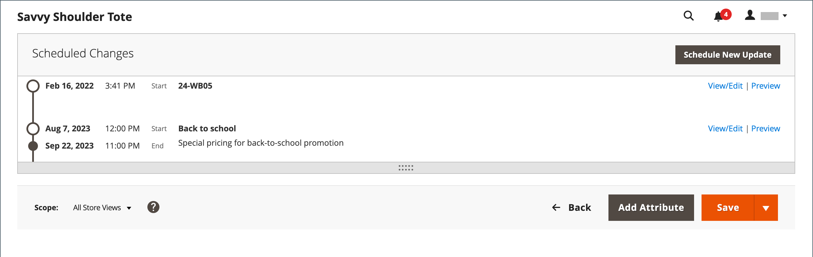
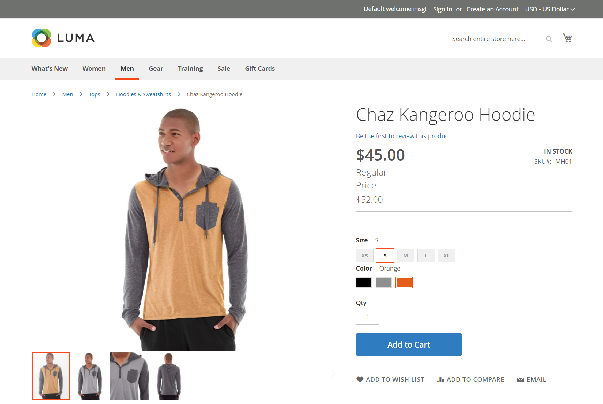

# Tarifs spéciaux

Un prix spécial peut être offert pour une période déterminée. Pendant la période spécifiée, le prix spécial apparaît au lieu du prix normal, suivi d&#39;une notation qui affiche le prix normal.

{width="700" zoomable="yes"}

## Appliquer un prix spécial à un produit individuel

Vous pouvez facilement définir un prix spécial pour un seul produit du catalogue.

### Utiliser une mise à jour planifiée

{{ee-feature}}

Adobe Commerce prend en charge les [&#x200B; mises à jour planifiées &#x200B;](../content-design/content-staging-scheduled-update.md). Utilisez ces outils promotionnels pour appliquer un prix spécial à un produit spécifique pendant une période spécifiée.

1. Ouvrez le produit en mode d’édition.

1. Cliquez sur **[!UICONTROL Scheduled Update]**.

   {width="600" zoomable="yes"}

1. Pour **Mettre à jour le nom**, saisissez un nom pour la promotion de prix spéciaux.

1. Saisissez un bref **[!UICONTROL Description]**.

1. Utilisez l’icône _Calendrier_ (  ) pour choisir les **[!UICONTROL Start Date]** et **[!UICONTROL End Date]** de la promotion de prix spéciaux.

   Vous pouvez également utiliser les curseurs **[!UICONTROL Hour]** et **[!UICONTROL Minute]** pour choisir l’heure de début et de fin. Cliquez sur **[!UICONTROL Close]** lorsque le début et la fin sont définis.

   {width="600" zoomable="yes"}

1. Faites défiler l’écran jusqu’au champ _Prix_, cliquez sur **[!UICONTROL Advanced Pricing]**, puis saisissez le montant du **[!UICONTROL Special Price]** à appliquer en fonction de la mise à jour planifiée.

   {width="600" zoomable="yes"}

1. Une fois l’opération terminée, cliquez sur **[!UICONTROL Done]** puis sur **[!DNL Save]**.

   En vitrine, le prix spécial doit apparaître à la fois dans la liste du catalogue et sur la page produit.

   La _[!UICONTROL Scheduled Change]_&#x200B;s’affiche en haut de la page.

   {width="600" zoomable="yes"}

### Utiliser une date de début et de fin simple

{{ce-feature}}

Magento Open Source inclut des options de date de début et de fin simples dans les options de Tarification avancée.

1. Ouvrez le produit en mode d’édition.

1. Faites défiler jusqu’au champ _[!UICONTROL Price]_, cliquez sur **[!UICONTROL Advanced Pricing]**, puis saisissez le montant de la **[!UICONTROL Special Price]**.

1. Utilisez l’icône _Calendrier_ (  ) pour choisir les **[!UICONTROL Start Date]** et les **[!UICONTROL End Date]** de la promotion de prix spéciaux.

   Le prix spécial entre en vigueur immédiatement après minuit au début de la date de début (00:01) et se poursuit jusqu’à juste avant minuit (23:59) le jour précédant la date de fin.

   {width="600" zoomable="yes"}

1. Une fois l’opération terminée, cliquez sur **[!UICONTROL Done]** puis sur **[!UICONTROL Save]**.

   En vitrine, le prix spécial doit apparaître à la fois dans la liste du catalogue et sur la page produit.

## Appliquer un prix spécial à plusieurs produits

Vous pouvez également attribuer un prix spécial à plusieurs produits, par exemple plusieurs variations d’un [produit configurable](product-create-configurable.md).

### Fixer un prix spécial pour les produits sélectionnés

{{ee-feature}}

L’exemple suivant montre comment attribuer le même prix spécial à plusieurs variations de produit d’un produit configurable dans Adobe Commerce.

1. Sur la page _[!UICONTROL Products]_, cliquez sur **[!UICONTROL Filters]**&#x200B;et saisissez le **[!UICONTROL Name]**&#x200B;du produit configurable.

1. Définissez **[!UICONTROL Type]** sur `Configurable Product`, puis cliquez sur **[!UICONTROL Apply Filters]**.

1. Si vous souhaitez attribuer le même prix spécial à tous les produits, définissez le contrôle dans l&#39;en-tête de la première colonne sur `Select All`.

   Vous pouvez également cocher la case de chaque produit que vous souhaitez inclure.

1. Définissez la commande **[!UICONTROL Actions]** sur `Update attributes`.

1. Faites défiler jusqu’au champ _[!UICONTROL Special Price]_, cochez la case **[!UICONTROL Change]**&#x200B;située sous le champ&#x200B;_[!UICONTROL Special Price]_ et saisissez le prix spécial que vous souhaitez proposer.

   {width="600" zoomable="yes"}

1. Cliquez ensuite sur **[!UICONTROL Save]**.

Le prix spécial disponible dans la boutique apparaît dans les annonces du catalogue et sur la page produit. Pour un produit configurable, le prix normal s’affiche également sur la page produit lorsque les options sont sélectionnées.

### Définir un prix spécial et une période pour les produits sélectionnés

{{ce-feature}}

L’exemple suivant montre comment attribuer le même prix spécial à plusieurs variations de produit d’un produit configurable dans Magento Open Source.

1. Dans la barre latérale _Admin_, accédez à **[!UICONTROL Catalog]** > **[!UICONTROL Products]**.

1. Cliquez sur **[!UICONTROL Filters]**.

1. Saisissez le **[!UICONTROL Name]** du produit configurable.

1. Définissez **[!UICONTROL Type]** sur `Simple Product`.

   {width="600" zoomable="yes"}

1. Cliquez sur **[!UICONTROL Apply Filters]**.

   La grille répertorie tous les produits simples qui sont associés en tant que variations du produit configurable.

1. Si vous souhaitez attribuer le même prix spécial à tous les produits, définissez le contrôle dans l&#39;en-tête de la première colonne sur `Select All`.

   Vous pouvez également cocher la case de chaque produit que vous souhaitez inclure.

1. Définissez la commande **[!UICONTROL Actions]** sur `Update attributes`.

   {width="600" zoomable="yes"}

1. Faites défiler jusqu’au champ _** et procédez comme suit :[!UICONTROL Special Price]

   - Cochez la case **[!UICONTROL Change]** sous le champ _[!UICONTROL Special Price]** et saisissez le prix spécial que vous souhaitez proposer.

   - Cochez la case **[!UICONTROL Change]** située sous le champ _Date de début du prix spécial_, cliquez sur le _Calendrier_ (  ), puis choisissez la première date de la promotion du prix spécial.

     Le prix spécial entre en vigueur immédiatement après minuit au début de la date de début (00:01) et se poursuit jusqu’à juste avant minuit (23:59) le jour précédant la date de fin.

   - Cochez la case **[!UICONTROL Change]** située sous le champ _Date de fin du prix spécial_, cliquez sur le _Calendrier_ (  ), puis choisissez la dernière date de la promotion du prix spécial.

   {width="600" zoomable="yes"}

1. Cliquez ensuite sur **[!UICONTROL Save]**.

   Un message indique le nombre d&#39;enregistrements mis à jour avec le prix spécial.

   Le prix spécial est disponible dans le magasin à la date spécifiée et apparaît dans les annonces de catalogue et sur la page produit. Pour un produit configurable, le prix normal s’affiche également sur la page produit lorsque les options sont sélectionnées.

   {width="600" zoomable="yes"}

## Test

Si le prix spécial n’apparaît pas correctement dans le storefront sur les pages de liste de catalogue et de produits, videz le cache de votre navigateur :

1. Dans la barre latérale _Admin_, accédez à **[!UICONTROL System]** > **[!UICONTROL Cache Management]**.

1. Cliquez sur **[!UICONTROL Flush Magento Cache]**.

>[!NOTE]
>
>Le prix du produit **_final_** est calculé comme étant le prix pertinent **_minimum_** selon la formule suivante :  `Final Price=Min(Regular(Base) Price, Group(Tier) Price, Special Price, Catalog Price Rule) + Sum(Min Price per each required custom option)`

>[!NOTE]
>
>**_Prix fixe_** les options personnalisables du produit ne sont _pas_ affectées par les règles Prix du groupe, Prix de niveau, Prix spécial ou Prix catalogue.
