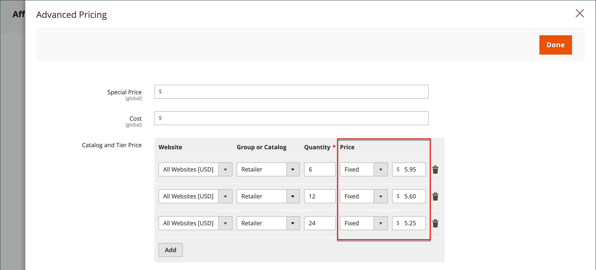

# Prix de niveau

Le prix de niveau vous permet d’offrir une remise quantitative sur une liste de produits ou une page de produits dans le storefront. La remise peut être appliquée à une vue de magasin spécifique, à un groupe de clients ou à un catalogue partagé.

Si vous avez de nombreux produits à mettre à jour, il est plus efficace d’importer les modifications de prix du niveau, plutôt que de les saisir individuellement. Pour plus d’informations, voir [Prix du niveau d’importation](../systems/data-import-price-tier.md).

{width="700" zoomable="yes"}

La page produit calcule la remise sur la quantité et affiche un message tel que :

`Buy 6 for $5.95 each and save 15%`

Les prix dans la vitrine sont prioritaires de la quantité la plus élevée à la quantité la plus faible. Si vous disposez d’un prix de niveau pour la quantité `5` et d’un prix pour `10`, et qu’un client ajoute cinq, six, sept, huit ou neuf articles au panier, le client reçoit le prix de réduction pour le niveau de quantité `5`. Lorsque le client ajoute le dixième élément, le prix réduit spécifié pour le niveau de quantité `10` remplace le niveau pour une quantité de `5` et le prix réduit pour `10` s’applique.

## Ajout d’un niveau de prix pour un produit

1. Ouvrez le produit en mode d’édition.

1. Sous le champ _[!UICONTROL Price]_, cliquez sur **[!UICONTROL Advanced Pricing]**.

1. Dans la section _[!UICONTROL Tier Price]_, cliquez sur **[!UICONTROL Add]**.

   Si vous créez un niveau de plusieurs prix, cliquez sur **[!UICONTROL Add]** pour chaque niveau supplémentaire afin que vous puissiez travailler tous les niveaux en même temps. Chaque niveau du groupe possède le même site web et groupe de clients ou une affectation de catalogue partagée, mais une quantité et un prix différents.

## Configuration du niveau de prix

1. Si votre boutique comporte plusieurs sites web, choisissez le **[!UICONTROL Website]** auquel s’applique le niveau de prix.

1. Si nécessaire, limitez la disponibilité du niveau de tarification en sélectionnant **[!UICONTROL Customer Group]** ou **[!UICONTROL Shared Catalog]** ( Disponible avec [Adobe Commerce B2B](./b2b/../introduction.md) uniquement).

1. Pour **[!UICONTROL Qty]**, saisissez la quantité qui doit être commandée pour recevoir la remise.

   - **Méthode 1 :** Saisissez le prix en tant que valeur fixe

     Définissez **[!UICONTROL Price]** sur `Fixed` et saisissez le prix ajusté d’une unité à ce niveau.

     {width="600" zoomable="yes"}

   - **Méthode 2 :** Saisissez le prix en pourcentage

     Définissez **[!UICONTROL Price]** sur `Discount` et saisissez le prix réduit en pourcentage du prix de base du produit.

     Par exemple, pour une remise de 15 %, saisissez le nombre `15`. (Le prix est enregistré avec deux décimales, telles que `15.00`.)

     >[!NOTE]
     >
     >Pour obtenir le prix escompté, le pourcentage défini est calculé par rapport à la valeur définie dans le champ _[!UICONTROL Price]_, et non par rapport au champ_[!UICONTROL Special Price]_.

     {width="600" zoomable="yes"}

## Effectuer le paramétrage des prix

1. Pour ajouter un autre ensemble de tarifs de niveau pour un autre site web ou groupe de clients, répétez les étapes précédentes.

1. Une fois l’opération terminée, cliquez sur **[!UICONTROL Done]**, puis sur **[!UICONTROL Save]**.

>[!NOTE]
>
>Le prix du produit **_final_** est calculé comme le prix **_minimum_** approprié, à l’aide de la formule suivante :  `Final Price=Min(Regular(Base) Price, Group(Tier) Price, Special Price, Catalog Price Rule) + Sum(Min Price per each required custom option)`

>[!NOTE]
>
>Les options personnalisables du produit **_Prix fixe_** sont _non_ affectées par les règles de prix de groupe, de niveau, de prix spécial ou de catalogue.
