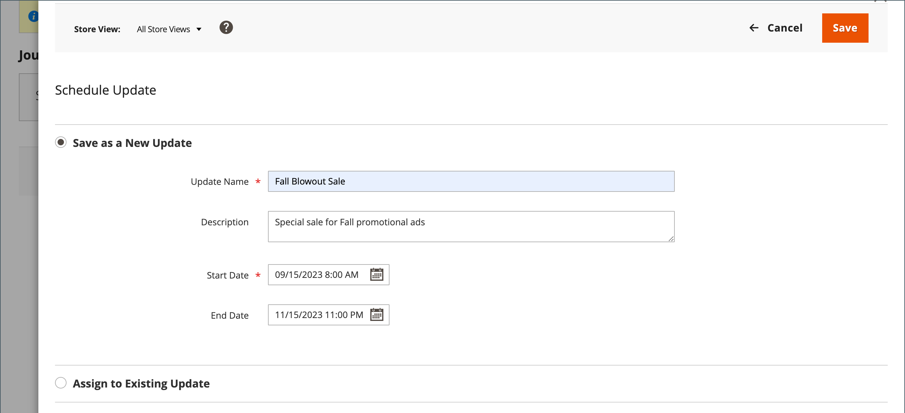
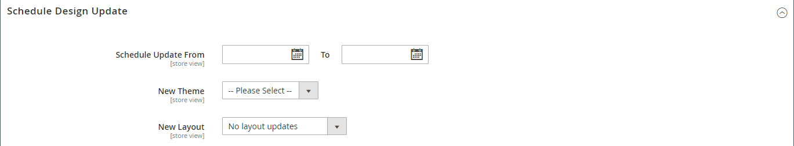

# Planifier les mises à jour des produits

{{ee-feature}}

Les mises à jour de produit peuvent être appliquées selon le calendrier et regroupées avec d’autres modifications de contenu. Vous pouvez utiliser [évaluation du contenu](../content-design/content-staging.md) pour créer une campagne en fonction des modifications planifiées du produit ou appliquer les modifications à une campagne existante.

>[!NOTE]
>
>La variable [!UICONTROL Set Product as New From] et [!UICONTROL To] champs et [!UICONTROL Schedule Design Update] ont été supprimés dans  Adobe Commerce et ne peuvent pas être modifiés directement sur le produit. Vous devez créer une mise à jour planifiée pour ces activations.

>[!NOTE]
>
>Toutes les mises à jour planifiées sont appliquées consécutivement, ce qui signifie que toute entité ne peut avoir qu’une seule mise à jour planifiée à la fois. Toute mise à jour planifiée est appliquée à toutes les vues de magasin au cours de sa période. Par conséquent, une entité ne peut pas avoir simultanément différentes mises à jour planifiées pour différentes vues de magasin. Toutes les valeurs d’attribut d’entité dans toutes les vues de magasin, qui ne sont pas affectées par la mise à jour planifiée actuelle, sont extraites des valeurs par défaut et non de la mise à jour planifiée précédente.

>[!NOTE]
>
>Un aperçu intermédiaire d’une mise à jour planifiée commence toujours à partir du **default** vue de magasin, qui reproduit l’expérience du client de navigation dans la campagne de mise à jour intermédiaire.

## Créer une mise à jour planifiée

1. Sur le _Administration_ barre latérale, accédez à **[!UICONTROL Catalog]** > **[!UICONTROL Products]**.

1. Sélectionnez un produit existant et cliquez sur **[!UICONTROL Edit]**.

1. Cliquez sur **[!UICONTROL Schedule New Update]**.

1. Sélectionner **[!UICONTROL Save as a New Update]**.

1. Pour **[!UICONTROL Update Name]**, saisissez le nom de la nouvelle campagne d’évaluation de contenu.

1. Entrez un résumé **[!UICONTROL Description]** de la mise à jour et de son utilisation.

1. Utilisez le calendrier () pour choisir la méthode **[!UICONTROL Start Date]** et **[!UICONTROL End Date]** pour la campagne.

   >[!NOTE]
   >
   >Campagne **[!UICONTROL Start Date]** et **[!UICONTROL End Date]** doit être défini à l’aide de la variable **_default_** Fuseau horaire de l’administrateur, converti à partir du fuseau horaire local pour chaque site web. Par exemple, avec plusieurs sites web dans différents fuseaux horaires où vous souhaitez lancer une campagne selon un fuseau horaire des États-Unis, vous devez planifier une mise à jour distincte pour chaque fuseau horaire local. Définir **[!UICONTROL Start Date]** et **[!UICONTROL End Date]** pour chacune d’elles, et il est converti du fuseau horaire local du site web en fuseau horaire d’administration par défaut.

   {width="600" zoomable="yes"}

1. Faites défiler jusqu’à _[!UICONTROL Price]_et cliquez sur **[!UICONTROL Advanced Pricing]**.

1. Saisissez un **[!UICONTROL Special Price]** pour le produit pendant la campagne planifiée et cliquez sur **[!UICONTROL Done]**.

1. Lorsque vous avez terminé, cliquez sur **[!UICONTROL Save]**.

## Attribuer à la mise à jour existante

1. Sur le _Administration_ barre latérale, accédez à **[!UICONTROL Catalog]** > **[!UICONTROL Products]**.

1. Sélectionnez un produit existant et cliquez sur **[!UICONTROL Edit]**.

1. Cliquez sur **[!UICONTROL Schedule New Update]**.

1. Sélectionner **[!UICONTROL Assign to Existing Campaign]**.

1. Dans la liste, sélectionnez l&#39;opération à modifier.

   {width="600" zoomable="yes"}

1. Développer  **[!UICONTROL Content]**.

1. Lorsque vous avez terminé, cliquez sur **[!UICONTROL Save]**.

## Afficher la modification planifiée

La modification planifiée s’affiche en haut de la page du produit, avec les dates de début et de fin de la campagne.

{width="600" zoomable="yes"}

## Modifier la modification planifiée

1. Dans le _[!UICONTROL Scheduled Changes]_en haut de la page, cliquez sur **[!UICONTROL View/Edit]**.

1. Apportez les modifications nécessaires à la mise à jour planifiée.

1. Cliquez sur **[!UICONTROL Save]**.

## Supprimer la modification planifiée

1. Dans le _[!UICONTROL Scheduled Changes]_en haut de la page, cliquez sur **[!UICONTROL View/Edit]**.

1. Dans la barre supérieure, cliquez sur **[!UICONTROL Remove from Update]**.

   {width="600" zoomable="yes"}

1. Dans la boîte de dialogue, sélectionnez **[!UICONTROL Delete the Update]** et cliquez sur **[!UICONTROL Done]**.

   >[!NOTE]
   >
   >Le produit est supprimé de la mise à jour et toutes les modifications planifiées sont perdues.

## Planification d’une mise à jour de conception

{{ce-feature}}

La variable _[!UICONTROL Schedule Design Update]_vous permet d’apporter des modifications temporaires à l’aspect de la page du produit. Vous pouvez planifier des modifications de conception pour une saison, une promotion ou simplement pour actualiser les éléments. Les modifications de conception peuvent être planifiées à l’avance afin qu’elles entrent en vigueur, ou_ goutte _, selon le planning défini.

{width="600" zoomable="yes"}

| Champ | Description |
|--- |--- |
| [!UICONTROL Schedule Update From/To] | Détermine la plage de dates lorsqu’une disposition personnalisée est appliquée au produit. |
| [!UICONTROL New Theme] | Applique un thème personnalisé au produit. |
| [!UICONTROL New Layout] | Applique une mise en page différente à la page du produit. Options :  **[!UICONTROL No layout updates]**- Par défaut, les mises à jour de mise en page ne sont pas disponibles pour la page du produit. **[!UICONTROL Empty]** - Permet de définir votre propre mise en page, par exemple une page de 4 colonnes. (Nécessite une compréhension du langage XML.)  **[!UICONTROL 1 column]**- Applique une mise en page à une colonne à la page du produit. **[!UICONTROL 2 columns with left bar]** - Applique une mise en page à deux colonnes avec une barre latérale gauche à la page du produit.  **[!UICONTROL 2 columns with right bar]**- Applique une mise en page à deux colonnes avec une barre latérale droite à la page du produit. **[!UICONTROL 3 columns]** : applique une mise en page à trois colonnes à la page du produit. |

{style="table-layout:auto"}
