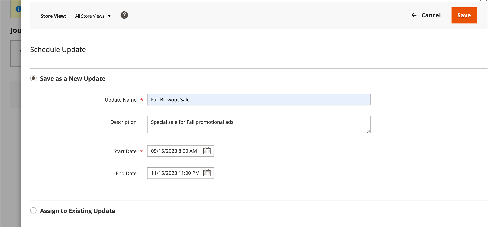
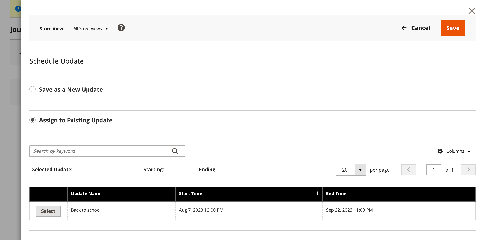
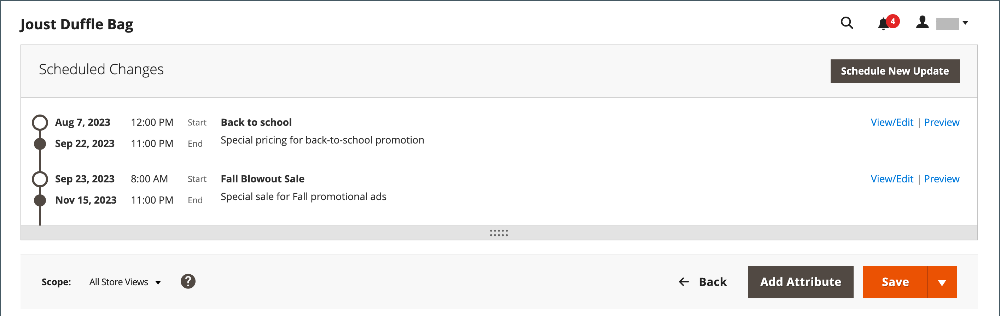
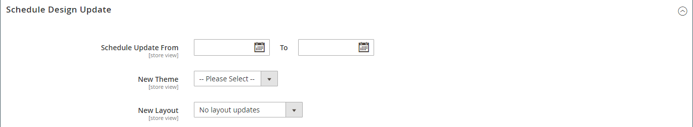

# Planifier des mises à jour de produit

{{ee-feature}}

Les mises à jour des produits peuvent être appliquées selon le calendrier et regroupées avec d’autres modifications de contenu. Vous pouvez utiliser [l’évaluation du contenu](../content-design/content-staging.md) pour créer une campagne basée sur les modifications planifiées du produit ou appliquer les modifications à une campagne existante.

Lors de la configuration des plannings pour les mises à jour de produit et de la modification des campagnes, tenez compte des points suivants :

- Toutes les mises à jour planifiées sont appliquées de manière consécutive, ce qui signifie que toute entité ne peut avoir qu’une seule mise à jour planifiée à la fois. Toute mise à jour planifiée est appliquée à toutes les vues de magasin au cours de sa période. Par conséquent, une entité ne peut pas avoir différentes mises à jour planifiées pour différentes vues de magasin en même temps. Toutes les valeurs d’attribut d’entité dans toutes les vues de magasin, qui ne sont pas affectées par la mise à jour planifiée actuelle, sont extraites des valeurs par défaut, et non de la mise à jour planifiée précédente.

- L’aperçu de l’évaluation d’une mise à jour planifiée commence toujours à partir de la vue du magasin **par défaut**, qui émule l’expérience de navigation du client dans la campagne de mise à jour de l’évaluation.

- Si une campagne est liée à plusieurs produits, elle ne peut être modifiée qu’à partir du [Tableau de bord d’évaluation de contenu](../content-design/content-staging-dashboard.md).

- Si une campagne active est initialement créée sans date de fin, la campagne ne peut pas être modifiée ultérieurement pour inclure une date de fin. Dans ce cas, il est nécessaire de créer une campagne en double et de saisir la date de fin nécessaire.

>[!NOTE]
>
>Les champs [!UICONTROL Set Product as New From] et [!UICONTROL To] et l’onglet [!UICONTROL Schedule Design Update] ont été supprimés dans  Adobe Commerce et ne peuvent pas être modifiés directement sur le produit. Vous devez créer une mise à jour planifiée pour ces activations.

## Créer une mise à jour planifiée

1. Dans la barre latérale _Admin_, accédez à **[!UICONTROL Catalog]** > **[!UICONTROL Products]**.

1. Sélectionnez un produit existant, puis cliquez sur **[!UICONTROL Edit]**.

1. Cliquez sur **[!UICONTROL Schedule New Update]**.

1. Sélectionnez **[!UICONTROL Save as a New Update]**.

1. Par **[!UICONTROL Update Name]**, saisissez un nom pour la nouvelle campagne d’évaluation de contenu.

1. Saisissez un bref **[!UICONTROL Description]** de la mise à jour et de son utilisation.

1. Utilisez l’outil Calendrier () pour choisir les **[!UICONTROL Start Date]** et **[!UICONTROL End Date]** de la campagne.

   >[!NOTE]
   >
   >Les **[!UICONTROL Start Date]** et **[!UICONTROL End Date]** de Campaign doivent être définis à l’aide du fuseau horaire **_par défaut_** Admin , converti à partir du fuseau horaire local pour chaque site web. Par exemple, si plusieurs sites web se trouvent dans des fuseaux horaires différents et que vous souhaitez démarrer une campagne en fonction d’un fuseau horaire des États-Unis, vous devez planifier une mise à jour distincte pour chaque fuseau horaire local. Définissez les **[!UICONTROL Start Date]** et **[!UICONTROL End Date]** pour chacun d’eux. Ils seront convertis du fuseau horaire du site web local en fuseau horaire d’administration par défaut.

   {width="600" zoomable="yes"}

1. Faites défiler jusqu’à _[!UICONTROL Price]_&#x200B;et cliquez sur **[!UICONTROL Advanced Pricing]**.

1. Saisissez un **[!UICONTROL Special Price]** pour le produit pendant la campagne planifiée et cliquez sur **[!UICONTROL Done]**.

1. Cliquez ensuite sur **[!UICONTROL Save]**.

## Affecter à une mise à jour existante

1. Dans la barre latérale _Admin_, accédez à **[!UICONTROL Catalog]** > **[!UICONTROL Products]**.

1. Sélectionnez un produit existant, puis cliquez sur **[!UICONTROL Edit]**.

1. Cliquez sur **[!UICONTROL Schedule New Update]**.

1. Sélectionnez **[!UICONTROL Assign to Existing Campaign]**.

1. Dans la liste, sélectionnez la campagne à modifier.

   {width="600" zoomable="yes"}

1. Développez  **[!UICONTROL Content]**.

1. Cliquez ensuite sur **[!UICONTROL Save]**.

## Afficher la modification planifiée

La modification planifiée s’affiche en haut de la page des produits, avec les dates de début et de fin de la campagne.

{width="600" zoomable="yes"}

## Modifier la modification planifiée

1. Dans la zone _[!UICONTROL Scheduled Changes]_&#x200B;en haut de la page, cliquez sur **[!UICONTROL View/Edit]**.

1. Apportez les modifications nécessaires à la mise à jour planifiée.

1. Cliquez sur **[!UICONTROL Save]**.

## Supprimer la modification planifiée

1. Dans la zone _[!UICONTROL Scheduled Changes]_&#x200B;en haut de la page, cliquez sur **[!UICONTROL View/Edit]**.

1. Dans la barre supérieure, cliquez sur **[!UICONTROL Remove from Update]**.

   {width="600" zoomable="yes"}

1. Dans la boîte de dialogue, sélectionnez **[!UICONTROL Delete the Update]** et cliquez sur **[!UICONTROL Done]**.

   Le produit est supprimé de la mise à jour et toutes les modifications planifiées sont perdues.

## Planifier une mise à jour de conception

{{ce-feature}}

La section _[!UICONTROL Schedule Design Update]_&#x200B;vous permet d’apporter des modifications temporaires à l’aspect de la page du produit. Vous pouvez planifier des modifications de conception pour une saison, une promotion ou simplement pour rafraîchir les choses. Les modifications de conception peuvent être planifiées à l’avance afin qu’elles soient prises en compte, ou_ goutte à goutte _, selon la planification que vous avez définie.

{width="600" zoomable="yes"}

| Champ | Description |
|--- |--- |
| [!UICONTROL Schedule Update From/To] | Détermine la plage de dates lorsqu’une mise en page personnalisée est appliquée au produit. |
| [!UICONTROL New Theme] | Applique un thème personnalisé au produit. |
| [!UICONTROL New Layout] | Applique une disposition différente à la page produit. Options :  **[!UICONTROL No layout updates]**- Par défaut, les mises à jour de disposition ne sont pas disponibles pour la page du produit. **[!UICONTROL Empty]** - Permet de définir votre propre mise en page, par exemple une page à 4 colonnes. (Nécessite une compréhension du langage XML.)  **[!UICONTROL 1 column]**- Applique une mise en page d’une colonne à la page du produit. **[!UICONTROL 2 columns with left bar]** - Applique une disposition à deux colonnes avec une barre latérale gauche à la page produit.  **[!UICONTROL 2 columns with right bar]**- Applique une disposition à deux colonnes avec une barre latérale droite à la page de produit. **[!UICONTROL 3 columns]** - Applique une disposition à trois colonnes à la page produit. |

{style="table-layout:auto"}
