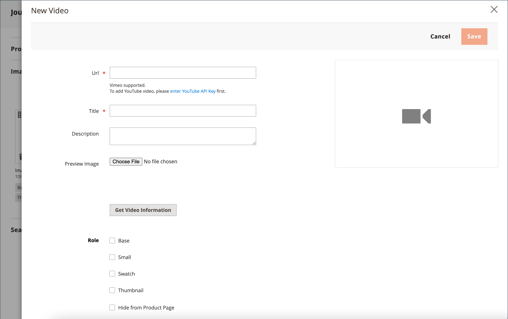

# Ajout de vidéos de produit

Pour ajouter une vidéo de produit, vous devez d’abord obtenir une clé API auprès de votre compte Google et la saisir dans la configuration de votre boutique. Vous pouvez ensuite créer un lien vers la vidéo à partir du produit .

## Étape 1 : obtenir votre clé API YouTube

1. Connectez-vous à votre compte Google et rendez-vous sur la [Developers Console de Google](https://console.developers.google.com/).

1. Dans le champ de recherche en haut, saisissez `YouTube Data API v3` et cliquez sur l’icône de recherche.

1. Lorsque la page d’API s’affiche, assurez-vous qu’elle est activée.

1. Dans le panneau de gauche, choisissez **[!UICONTROL Credentials]**.

1. Selon que vous disposez des informations d’identification ou non, effectuez l’une des opérations suivantes :

   - Si vous disposez déjà des informations d’identification nécessaires, copiez la clé dans la table _clés API_.

   - Si vous ne disposez pas déjà des informations d’identification pour cette API, cliquez sur **[!UICONTROL Create Credentials]** dans la partie supérieure et suivez les invites pour créer les informations d’identification nécessaires. Sous _Obtenir vos informations d’identification_, copiez la clé API et cliquez sur **[!UICONTROL Done]**.

1. Copiez la clé API dans le presse-papiers.

1. Cliquez sur l’icône Modifier à droite et définissez les restrictions pour vous assurer que la clé API est limitée aux référents corrects.

1. Patientez quelques instants le temps que la clé soit générée, puis copiez-la dans le presse-papiers.

   À l’étape suivante, vous allez coller la clé dans la configuration de votre magasin.

## Étape 2 : configurer la clé dans Commerce

1. Dans la barre latérale _Admin_, accédez à **[!UICONTROL Stores]** > _[!UICONTROL Settings]_>**[!UICONTROL Configuration]**.

1. Dans le panneau de gauche, développez **[!UICONTROL Catalog]** et choisissez **[!UICONTROL Catalog]** en dessous.

1. Développez  la section _[!UICONTROL Product Video]_&#x200B;et collez votre **[!UICONTROL YouTube API key]**.

   {width="600" zoomable="yes"}

1. Cliquez ensuite sur **[!UICONTROL Save Config]**.

1. Lorsque vous y êtes invité, actualisez le cache.

## Étape 3 : Lien vers la vidéo

1. Ouvrez un produit en mode d’édition.

1. Faites défiler jusqu’à et développez la section _[!UICONTROL Images and Videos]_.

   {width="600" zoomable="yes"}

1. cliquez sur **[!UICONTROL Add Video]**.

   Si vous n’avez pas encore configuré votre clé API YouTube, cliquez sur **[!UICONTROL OK]** pour continuer. Vous ne pouvez pas créer de lien vers une vidéo YouTube, mais vous pouvez suivre le processus.

1. Par **[!UICONTROL Url]**, saisissez l’URL de la vidéo YouTube ou Vimeo.

   {width="600" zoomable="yes"}

1. Cliquez en dehors du champ et attendez les commentaires sur la clé API ou la vidéo.

   Si tout est vérifié, YouTube fournit des informations de base sur la vidéo

1. Saisissez le **[!UICONTROL Title]** et la **[!UICONTROL Description]** de la vidéo.

1. Pour charger un **[!UICONTROL Preview Image]**, accédez à l’image et sélectionnez le fichier.

   >[!NOTE]
   >
   >Après le chargement, l’image d’aperçu qui s’affiche est automatiquement générée par un fournisseur de services vidéo externe. Vous ne pouvez pas modifier l’image à partir de l’administration Adobe Commerce.

1. Si vous préférez utiliser les métadonnées vidéo, cliquez sur **[!UICONTROL Get Video Information]**.

1. Pour déterminer comment la vidéo est utilisée dans le magasin, cochez la case de chaque **[!UICONTROL Role]** qui s’applique :

   - `Base Image`
   - `Small Image`
   - `Swatch Image`
   - `Thumbnail`
   - `Hide from Product Page`

1. Cliquez ensuite sur **[!UICONTROL Save]**.

   >[!NOTE]
   >
   >Si l’option de configuration _[!UICONTROL Autostart base video]_&#x200B;est définie sur `Yes` mais que la lecture de la vidéo ne commence pas automatiquement, cela peut être dû aux politiques de lecture automatique appliquées par le navigateur et qui ne peuvent pas être contrôlées par Adobe Commerce. Chaque navigateur pris en charge possède ses propres politiques de lecture automatique qui peuvent changer au fil du temps et il se peut que votre vidéo ne soit pas lue automatiquement à l’avenir. Il est recommandé de ne pas vous fier à la lecture automatique pour les fonctionnalités critiques de l’entreprise et de tester le comportement de lecture automatique de la vidéo dans votre boutique avec chaque navigateur pris en charge.

## Tenir à jour l’accès à l’API

Selon les [conditions générales](https://developers.google.com/youtube/terms/developer-policies#d.-accessing-youtube-api-services) du développeur de Google, YouTube peut désactiver l’accès aux API pour les comptes inactifs depuis plus de 90 jours. Cette occurrence peut entraîner l’affichage de vos vidéos. Pour que l’accès à l’API reste à jour, utilisez une tâche cron pour envoyer une requête ping à l’API à intervalles réguliers :

```code
30 10 1 * * curl -i -G -e https://yourdomain.com/ -d "part=snippet&maxResults=1&q=test&key=YOUTUBEAPIKEY" https://www.googleapis.com/youtube/v3/search >/dev/null 2>&1
```

## Référence du champ

| Champ | Description |
|--- |--- |
| [!UICONTROL URL] | URL de la vidéo associée. |
| [!UICONTROL Title] | Titre de la vidéo. |
| [!UICONTROL Description] | Vidéo de description. |
| [!UICONTROL Preview Image] | Image chargée utilisée comme aperçu de la vidéo dans votre boutique. |
| [!UICONTROL Get Video Information] | Récupère les métadonnées vidéo stockées sur le serveur hôte. Vous pouvez utiliser les données d’origine ou les mettre à jour si nécessaire. |
| [!UICONTROL Role] | Détermine comment l’image d’aperçu est utilisée dans votre magasin. Vous pouvez choisir n’importe quelle combinaison d’options : `Base Image`, `Small Image`, `Thumbnail`, `Swatch Image`, `Hide from Product Page` |

{style="table-layout:auto"}
