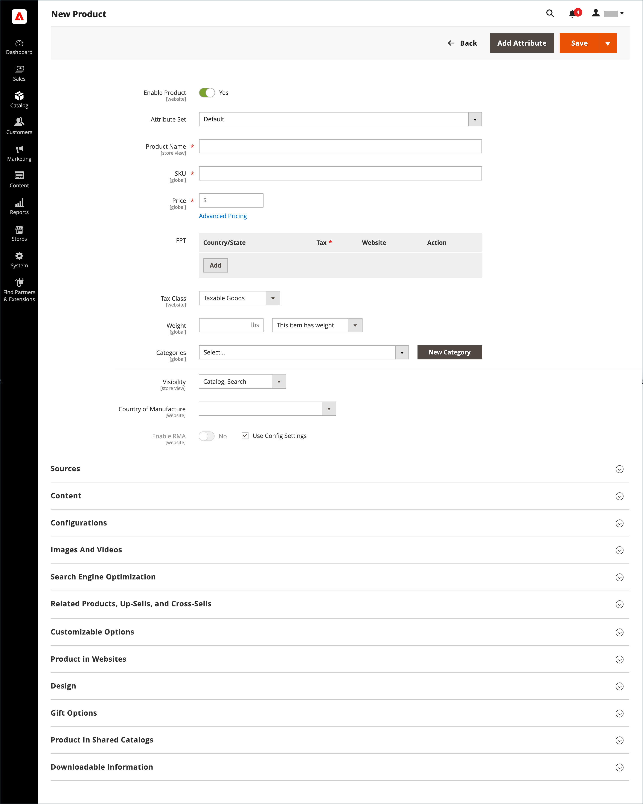

# Espace de travail du produit

L’espace de travail du produit est pratiquement le même pour tous les types de produit, bien que la sélection des champs varie en fonction de l’ensemble d’attributs utilisé. Les attributs de produit se trouvent en haut du formulaire, suivis par des sections extensibles des informations sur les produits. Lorsqu’un nouveau produit est enregistré pour la première fois, la variable _[!UICONTROL Store View]_s’affiche en haut à gauche du formulaire.

{width="700" zoomable="yes"}

## [!UICONTROL Enable Product] paramètre

L’état en ligne du produit est indiqué par le commutateur en haut du formulaire. Pour modifier l’état en ligne, définissez la variable **[!UICONTROL Enable Product]** passer à `Yes` ou `No`.

| Contrôle | Description |
|-------- | ----------- |
|  | Indique que le produit est en ligne. |
|  | Indique que le produit est hors ligne. |

{style="table-layout:auto"}

## Jeu d’attributs

Nom de la variable [jeu d’attributs](attribute-sets.md) apparaît dans le coin supérieur gauche et détermine les champs qui apparaissent dans l’enregistrement du produit. Pour choisir un autre jeu d’attributs, cliquez sur la flèche vers le bas située en regard du nom du jeu d’attributs par défaut.

{width="600" zoomable="yes"}

## Développer/réduire

Pour développer ou réduire une section, cliquez sur l’icône développer  ou effondrement  Icône

## [!UICONTROL Save] menu

La variable _[!UICONTROL Save]_menu comprend plusieurs options qui vous permettent d’enregistrer et de continuer, d’enregistrer et de créer un produit, d’enregistrer et de dupliquer le produit ou encore d’enregistrer et de fermer.

{width="600" zoomable="yes"}

| Commande | Description |
|--- |--- |
| [!UICONTROL Save] | Enregistrez le produit actuel et continuez à travailler. |
| [!UICONTROL Save & New] | Enregistrez et fermez le produit actuel, puis commencez un nouveau produit en fonction du même type et du même modèle de produit. |
| [!UICONTROL Save & Duplicate] | Enregistrez et fermez le produit actuel, puis ouvrez une nouvelle copie en double. |
| [!UICONTROL Save & Close] | Enregistrez le produit actuel et revenez à la _[!UICONTROL Products]_workspace. |

{style="table-layout:auto"}

## Valeurs de champ par défaut

Pour gagner du temps lors de la création de produits, la valeur par défaut de plusieurs champs de produit référence les valeurs d’un autre champ. Vous pouvez accepter la valeur par défaut ou en saisir une autre. Les champs suivants génèrent automatiquement des valeurs par défaut :

| Champ | Par défaut |
|----- |------- |
| [!UICONTROL SKU] | En fonction du nom du produit. |
| [!UICONTROL Meta Title] | En fonction du nom du produit. |
| [!UICONTROL Meta Keywords] | En fonction du nom du produit. |
| [!UICONTROL Meta Description] | En fonction du nom et de la description du produit. |

{style="table-layout:auto"}

Les espaces réservés représentant la valeur d’un autre champ sont entourés d’accolades doubles. Tout code d’attribut inclus dans le produit [jeu d’attributs](attribute-sets.md) peut être utilisé comme espace réservé.

{width="600" zoomable="yes"}

Pour obtenir la liste détaillée de ces paramètres, voir [Génération automatique des champs de produit](../configuration-reference/catalog/catalog.md#product-fields-auto-generation) dans le _Référence de configuration_.

### Modifier la valeur de l’espace réservé

1. Sur le _Administration_ barre latérale, accédez à **[!UICONTROL Stores]** > _[!UICONTROL Settings]_>**[!UICONTROL Configuration]**.

1. Dans le panneau de gauche, développez **[!UICONTROL Catalog]** et choisissez **[!UICONTROL Catalog]** en-dessous.

1. Développer  la valeur **[!UICONTROL Product Fields Auto-Generation]** et apportez les modifications nécessaires aux valeurs d’espace réservé.

   Par exemple, si vous souhaitez inclure un mot-clé spécifique pour chaque produit ou expression que vous souhaitez inclure dans chaque méta-description, saisissez la valeur directement dans le champ approprié.

   >[!NOTE]
   >
   >Si vous souhaitez conserver les valeurs d’espace réservé existantes, conservez les accolades doubles qui encadrent chaque balise de balisage.

1. Lorsque vous avez terminé, cliquez sur **[!UICONTROL Save Config]**.

### Espaces réservés courants

- `{{color}}`
- `{{country_of_manufacture}}`
- `{{description}}`
- `{{gender}}`
- `{{material}}`
- `{{name}}`
- `{{short_description}}`
- `{{size}}`
- `{{sku}}`
