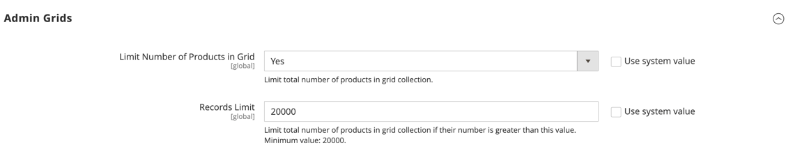

# Liste de produits

Tous les produits du catalogue sont accessibles à partir de la page _[!UICONTROL Products]_&#x200B;de l’Administration, où vous pouvez créer des produits et modifier des produits existants. Pour une installation multi-site, chaque site web peut proposer une sélection différente de produits à vendre à partir du même catalogue.

La liste _[!UICONTROL Products]_&#x200B;inclut tous les produits du catalogue, indique les sites web où ils sont disponibles et s’ils sont actuellement disponibles à la vente. Dans les installations B2B d’Adobe Commerce avec l’option [catalogues partagés](../b2b/catalog-shared.md) activée, la grille inclut une colonne qui indique quels produits bénéficient d’une autre tarification de remise dans un catalogue partagé.

Vous pouvez parcourir la liste page par page ou rechercher des produits spécifiques. Utilisez les [contrôles](../getting-started/admin-grid-controls.md) standard pour trier et filtrer la liste et appliquer des [actions](../getting-started/admin-actions-control.md) aux produits sélectionnés.

{width="700" zoomable="yes"}

## Limiter l’affichage du produit

Pour améliorer les performances des catalogues volumineux, il est recommandé de limiter le nombre de produits affichés dans la grille. Vous pouvez limiter les grilles de produits affichées pour :

- Page Produits
- Ajouter des produits connexes/de vente incitative/de vente croisée
- Ajouter des produits à l’offre groupée
- Ajouter des produits au groupe de produits
- Créer une commande (administrateur)

Ce paramètre de configuration de la limitation de l’affichage du produit est désactivé par défaut. En l’activant, vous pouvez limiter le nombre de produits dans la grille à une valeur spécifique. Si elle est activée et que le nombre de produits correspondants pour l’affichage de la grille est supérieur à la limite d’enregistrements, une collection limitée d’enregistrements est renvoyée. Lorsque la limite est atteinte, le nombre total d’enregistrements trouvés, le nombre d’enregistrements sélectionnés et les éléments de pagination n’apparaissent pas dans l’en-tête de grille.

>[!NOTE]
>
>Si vous ne souhaitez pas que votre grille de produits soit limitée, utilisez les filtres de manière plus précise pour produire une collection comportant moins d’éléments que le nombre spécifié dans le champ _[!UICONTROL Records Limit]_.

**_Pour configurer la limitation de l’affichage du produit:_**

1. Dans la barre latérale _Admin_, accédez à **[!UICONTROL Stores]** > _[!UICONTROL Settings]_>**[!UICONTROL Configuration]**.

1. Développez **[!UICONTROL Advanced]** et choisissez **[!UICONTROL Admin]**.

1. Développez  la section **[!UICONTROL Admin Grids]** et procédez comme suit :

   - Définissez **[!UICONTROL Limit Number of Products in Grid]** sur `Yes`.

   - (Facultatif) Saisissez une valeur dans le champ **[!UICONTROL Records Limit]** pour limiter le nombre de produits dans la grille à une valeur spécifique. La valeur minimale par défaut est `20000`.

   {width="600" zoomable="yes"}

1. Cliquez ensuite sur **[!UICONTROL Save Config]**.

## Contrôles de page

| Contrôle | Description |
|--- |--- |
| [!UICONTROL Add Product] | Lance le processus de création d’un produit simple. Pour choisir un type de produit spécifique, cliquez sur la flèche vers le bas. Options : [[!UICONTROL Simple Product]](product-create-simple.md) / [[!UICONTROL Configurable Product]](product-create-configurable.md) / [[!UICONTROL Grouped Product]](product-create-grouped.md) / [[!UICONTROL Virtual Product]](product-create-virtual.md) / [[!UICONTROL Bundle Product]](product-create-bundle.md) / [[!UICONTROL Downloadable Product]](product-create-downloadable.md) / [[!UICONTROL Gift Card]](product-gift-card-create.md) |
| [!UICONTROL Actions] | Répertorie toutes les actions qui peuvent être appliquées à des produits sélectionnés dans la liste. Pour appliquer une action à un produit ou à un groupe de produits, cochez la case située dans la première colonne de chaque produit. Options : `Delete` / `Change Status` / `Update Attributes` / `Assign Inventory Source` / `Unassign Inventory Source` / `Transfer Inventory To Source` |
| [!UICONTROL Filters] | Lance une recherche catalogue en fonction des filtres actuels. |
| [!UICONTROL Default View] | Indique la disposition actuelle des colonnes de la grille. Si des vues de colonnes de grille sont enregistrées, vous pouvez en choisir une autre. |
| [!UICONTROL Columns] | Répertorie toutes les actions qui peuvent être appliquées à des produits sélectionnés dans la liste. Pour appliquer une action à un produit ou à un groupe de produits, cochez la case située dans la première colonne de chaque produit. |
| [!UICONTROL Search by keyword] | La zone de recherche, dans le coin supérieur gauche, permet de rechercher des produits par mot-clé. |
| [!UICONTROL Edit] | Ouvre le produit en mode d&#39;édition. Vous pouvez accomplir la même chose en cliquant n’importe où sur la ligne. |

{style="table-layout:auto"}

## Colonnes par défaut

| Colonne | Description |
|--- |--- |
| (Case à cocher) | Sélectionne plusieurs enregistrements qui feront l’objet d’une action. La case à cocher située dans la première colonne de chaque enregistrement sélectionné est activée. Options :  **[!UICONTROL Select All]**- Sélectionne tous les enregistrements trouvés qui correspondent aux paramètres de filtre actuels. **[!UICONTROL Select All on This Page]** - Sélectionne uniquement les enregistrements de la page en cours correspondant aux paramètres du filtre. |
| [!UICONTROL ID] | Numéro séquentiel unique attribué lors du premier enregistrement d’un nouveau produit. |
| [!UICONTROL Thumbnail] | Affiche une miniature de l’image principale du produit. |
| [!UICONTROL Name] | Nom du produit. |
| [!UICONTROL Type] | Type de produit. |
| [!UICONTROL Attribute Set] | Nom du jeu d’attributs utilisé comme modèle pour le produit. |
| [!UICONTROL SKU] | Unité de gestion des stocks unique affectée au produit. |
| [!UICONTROL Price] | Prix unitaire du produit. |
| [!UICONTROL Quantity] | Quantité en stock. |
| [!UICONTROL Salable Quantity] | Somme de toutes les unités disponibles pour ce produit. |
| [!UICONTROL Visibility] | Indique où le produit est visible dans le catalogue. Options : `Not Visible Individually` / `Catalog` / `Search` / `Catalog, Search` |
| [!UICONTROL Status] | Indique le statut du produit. Options : `Enabled` et `Disabled` |
| [!UICONTROL Websites] | Indique les sites web sur lesquels le produit est disponible. |
| [!UICONTROL Action] | Ouvre le produit en mode Édition. |
| [!UICONTROL Shared Catalog] |  (disponible avec [Adobe Commerce B2B](./b2b/../introduction.md) uniquement) Indique les catalogues partagés qui contiennent une tarification personnalisée pour le produit. |

{style="table-layout:auto"}

## Autres colonnes

| Colonne | Description |
|--- |--- |
| [!UICONTROL Short Description] | Brève description du produit. |
| [!UICONTROL Special Price From Date] | Première date de la promotion des prix spéciaux. |
| [!UICONTROL Special Price To Date] | Date de fin de la promotion spéciale. |
| [!UICONTROL Cost] | Coût réel de l’article. |
| [!UICONTROL Manufacturer] | Fabricant du produit. |
| [!UICONTROL Meta Keywords] | Mots-clés Meta pour le produit. |
| [!UICONTROL Color] | Couleur du produit. |
| [!UICONTROL Set Product as New from Date] | Première date de la définition du produit comme nouvelle promotion. |
| [!UICONTROL Set Product as New to Date] | Dernière date de la nouvelle promotion définie pour le produit. |
| [!UICONTROL Active From / To] | Date de début et de fin du produit. |
| [!UICONTROL Layout] | Mise en page du produit. |
| [!UICONTROL Minimum Advertised Price] | Prix minimum annoncé du produit. |
| [!UICONTROL Allow Gift Message] | Message cadeau aux clients et clientes qui achètent une carte cadeau. |
| [!UICONTROL Special Price] | Prix spécial pour le produit. |
| [!UICONTROL Weight] | Poids du produit. |
| [!UICONTROL Meta Title] | Titre Meta du produit. |
| [!UICONTROL Meta Description] | Description des métadonnées du produit. |
| [!UICONTROL Country of Manufacture] | Pays de fabrication. |
| [!UICONTROL New Theme] | Application d’un thème personnalisé au produit. |
| [!UICONTROL URL Key] | Clé URL du produit. |
| [!UICONTROL Tax Class] | Classe de taxe du produit. |
| [!UICONTROL Allow Gift Message] | Affiche la disponibilité de l’option de message cadeau pour le produit. |

{style="table-layout:auto"}
