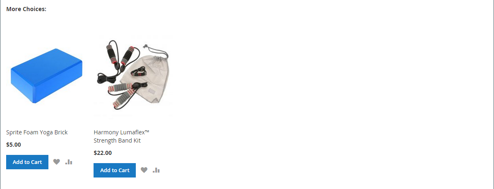

# Paramètres du produit - [!UICONTROL Related Products, Up-Sells, and Cross-Sells]

Utilisez la section _[!UICONTROL Related Products, Up-Sells, and Cross-Sells]_&#x200B;pour configurer des blocs promotionnels simples qui présentent une sélection de produits supplémentaires susceptibles d’intéresser le client. Pour plus d’informations, voir [Relations produit](../merchandising-promotions/product-relationships.md).

{width="600" zoomable="yes"}

Chaque bloc est constitué d’une liste de produits appartenant à une option spécifique.

| Champ | Description |
|--- |--- |
| [!UICONTROL ID] | Identifiant numérique unique attribué à l’entité de produit. |
| [!UICONTROL Thumbnail] | Image miniature du produit. |
| [!UICONTROL Name] | Nom du produit. |
| [!UICONTROL Status] | Indique le statut du produit. Options : `Enabled` / `Disabled`. Les produits désactivés ne s’affichent pas dans les blocs sur le front-end. |
| [!UICONTROL Attribute Set] | Nom du jeu d’attributs utilisé comme modèle pour le produit. |
| [!UICONTROL SKU] | Unité de gestion des stocks unique affectée au produit. |
| [!UICONTROL Price] | Prix unitaire du produit. |
| [!UICONTROL Action] | Options : `Remove`. Supprime un produit du bloc. |

{style="table-layout:auto"}

>[!TIP]
>
> (Adobe Commerce uniquement) **Recommandations de produits optimisées par l’IA dédiée à Adobe** simplifie le processus de définition des relations de produit en utilisant l’intelligence artificielle et des algorithmes de machine learning pour effectuer une analyse approfondie des données agrégées du visiteur. Ces données, lorsqu’elles sont combinées à votre catalogue Adobe Commerce, génèrent des expériences très attrayantes, pertinentes et personnalisées pour l’acheteur.
> 
>Pour plus d’informations sur l’utilisation de cette extension développée par Adobe comme alternative aux recommandations de produits et aux ventes incitatives configurées manuellement, consultez le _[Guide de recommandations de produits &#x200B;](https://experienceleague.adobe.com/docs/commerce/product-recommendations/guide-overview.html?lang=fr)_.

## Produits connexes

Les produits associés sont destinés à être achetés en plus de l’article que le client consulte. Le client peut placer l’article dans son panier en cochant simplement la case. L’emplacement du bloc _Produits associés_ varie en fonction du thème et de la mise en page définis. Dans l’exemple ci-dessous, le bloc _Produits associés_ s’affiche au bas de la page _Vue des produits_. Avec une disposition à deux colonnes, le bloc _Produits associés_ apparaît souvent dans la barre latérale droite.

{width="600" zoomable="yes"}

Pour configurer des produits associés :

1. Ouvrez le produit en mode d’édition.

1. Faites défiler vers le bas et développez  la section **[!UICONTROL Related Products, Up-Sells, and Cross-Sells]** .

1. Cliquez sur **[!UICONTROL Add Related Products]**.

1. Utilisez les [contrôles de filtre](../getting-started/admin-grid-controls.md) pour rechercher les produits de votre choix.

1. Dans la liste, cochez la case de tout produit que vous souhaitez mettre en avant en tant que produit associé.

   {width="600" zoomable="yes"}

1. Cliquez ensuite sur **[!UICONTROL Add Selected Products]**.

## Ventes incitatives

Les produits de montée en gamme sont des articles que votre client pourrait préférer au produit actuellement pris en compte. Un article proposé en tant que produit de mise en vente incitative peut être de meilleure qualité, plus populaire ou présenter une meilleure marge bénéficiaire. Les produits de montée en gamme apparaissent sur la page produit sous une en-tête telle que _Vous pouvez également être intéressé par les produits suivants_.

{width="600" zoomable="yes"}

Pour sélectionner des produits de mise à niveau :

1. Ouvrez le produit en mode d’édition.

1. Faites défiler vers le bas et développez  la section **[!UICONTROL Related Products, Up-Sells, and Cross-Sells]** .

1. Cliquez sur **[!UICONTROL Add Up-Sell Products]**.

1. Utilisez les [contrôles de filtre](../getting-started/admin-grid-controls.md) pour rechercher les produits de votre choix.

1. Dans la liste, cochez la case de tout produit que vous souhaitez proposer comme produit de mise à niveau.

   {width="600" zoomable="yes"}

1. Cliquez ensuite sur **[!UICONTROL Add Selected Products]**.

>[!NOTE]
>
>Le produit parent groupé est toujours affiché automatiquement comme produit de mise à niveau pour tous ses produits enfants.

## Ventes croisées

Les articles de vente croisée sont similaires aux achats impulsifs placés près de la caisse dans la ligne de passage en caisse. Les produits proposés en tant que vente croisée apparaissent sur la page du panier, juste avant que le client ne commence le processus de passage en caisse.

>[!NOTE]
>
>Pour afficher ou masquer les articles de ventes croisées par affichage de magasin, reportez-vous à l’option [Passer en caisse > Panier](../configuration-reference/sales/checkout.md) appelée _[!UICONTROL Show Cross-sell Items]_&#x200B;dans le panier. Vous pouvez masquer les ventes croisées lors de ventes spécifiques ou pour les tests A/B dans une vue de magasin.

{width="600" zoomable="yes"}

**_Pour sélectionner des produits de vente croisée:_**

1. Ouvrez le produit en mode d’édition.

1. Faites défiler vers le bas et développez  la section **[!UICONTROL Related Products, Up-Sells, and Cross-Sells]** .

1. Cliquez sur **[!UICONTROL Add Cross-Sell Products]**.

1. Utilisez les [contrôles de filtre](../getting-started/admin-grid-controls.md) pour rechercher les produits de votre choix.

1. Dans la liste, cochez la case de tout produit que vous souhaitez proposer comme produit de vente croisée.

   {width="600" zoomable="yes"}

1. Cliquez ensuite sur **[!UICONTROL Add Selected Products]**.
