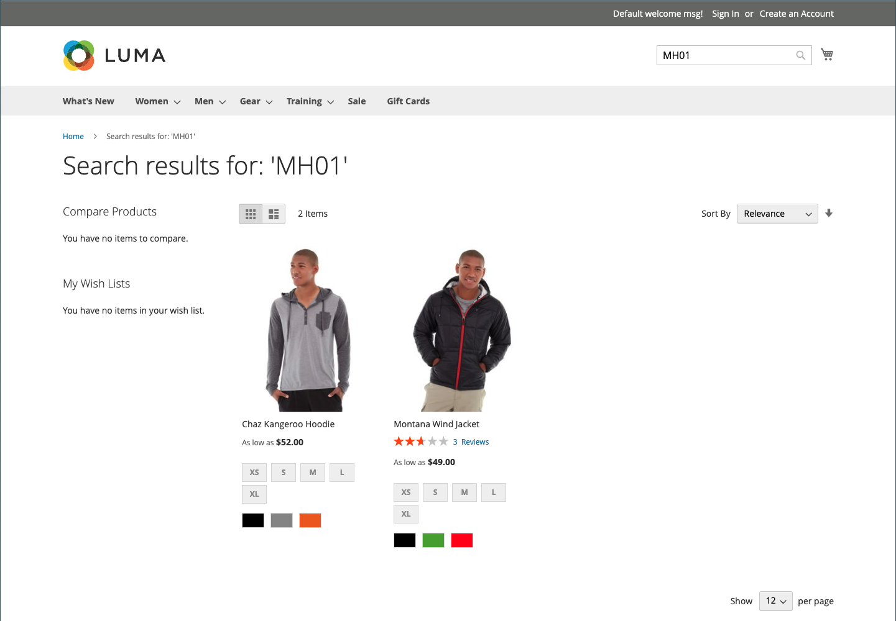

# Résultats de la recherche

>[!NOTE]
>
>Cette page décrit les fonctionnalités de recherche standard qui peuvent différer de [Recherche en direct](https://experienceleague.adobe.com/docs/commerce-merchant-services/live-search/overview.html).

La variable _Résultats de la recherche_ La liste comprend tous les produits qui correspondent aux critères de recherche saisis dans la zone Recherche rapide ou dans le formulaire Recherche avancée. Chaque liste de produits du catalogue possède essentiellement les mêmes contrôles. La seule différence est que l’une est le résultat d’une requête de recherche, et l’autre est le résultat de [navigation](navigation.md).

Les résultats peuvent être formatés sous la forme d’une grille ou d’une liste et triés selon une sélection d’attributs. Les contrôles de pagination s’affichent s’il existe plus de produits que de produits adaptés sur la page. Utilisez ces commandes pour passer d’une page à l’autre. Le nombre d’enregistrements par page est déterminé par la configuration du champ de catalogue frontal. Pour plus d’informations, voir [Listes de produits](navigation-product-listings.md).

Avec **Elasticsearch**:

- Il n’existe pas de prise en charge prête à l’emploi de la recherche par le suffixe. Par exemple, la recherche par SKU peut ne pas renvoyer le résultat attendu si le mot-clé contient uniquement la partie de fin de la SKU.
- La recherche par préfixe (recherche par mot-clé partielle) est prise en charge par défaut pour `name` et `sku` attributs de produit uniquement. Tous les autres attributs de produit sont recherchés par l’ensemble du mot-clé, avec la correspondance exacte.
- Résultats de la recherche pour `name` et `sku` les attributs de produit sont basés sur la pertinence, et non sur une correspondance exacte. Les correspondances les plus pertinentes, telles qu’une correspondance exacte _Nom du produit_ ou _SKU_, sont répertoriés en premier. Pour rechercher une correspondance exacte, le client peut utiliser des guillemets doubles dans la requête de recherche. Par exemple, un `WSH12-32-Red` la requête de recherche peut renvoyer plusieurs produits, triés selon leur pertinence. Mais une `"WSH12-32-Red"` la requête de recherche renvoie un seul produit avec la variable **_what_** correspond à `sku`.

{width="700" zoomable="yes"}

>[!IMPORTANT]
>
>En raison de l’annonce de fin de prise en charge de 7 Elasticsearch pour août 2023, il est recommandé à tous les clients Adobe Commerce de migrer vers le moteur de recherche OpenSearch 2.x. Pour plus d’informations sur la migration de votre moteur de recherche lors de la mise à niveau du produit, voir [Migration vers OpenSearch](https://experienceleague.adobe.com/docs/commerce-operations/upgrade-guide/prepare/opensearch-migration.html) dans le _Guide de mise à niveau_.

## Mappage de mots-clés pour étendre les résultats de recherche

Cette technique utilise un attribut pour créer une association basée sur des mots-clés entre deux produits, de sorte qu’une recherche de l’un ou l’autre des produits renvoie des résultats pour les deux produits. Vous pouvez utiliser le mappage de mots-clés pour promouvoir un produit dans les résultats de recherche où il n’apparaîtrait pas autrement.

{width="700" zoomable="yes"}

L’exemple suivant utilise le mappage des mots-clés en fonction du SKU. Lorsque l’une ou l’autre des SKU est saisie dans la zone de recherche, les deux produits apparaissent dans les résultats. Les SKU des produits configurables suivants sont mappés, plutôt que les SKU des variantes de produits :

- Vent de Montana (MJ03)
- Chaz Kangaroo Hoodie (MH01)

### Étape 1 : création d’un attribut

1. Dans le _[!UICONTROL Products]_, ouvrez la liste `Montana Wind Jacket` (MJ03) en mode édition.
1. Dans le coin supérieur droit, cliquez sur **[!UICONTROL Add Attribute]**.
1. Sur le _Sélectionner un attribut_ page, cliquez sur **[!UICONTROL Create New Attribute]**.
1. Renseignez les propriétés d’attribut comme suit :

   **[!UICONTROL Attribute Properties]**

   - [!UICONTROL Attribute Label]  - `Search Keywords`
   - [!UICONTROL Catalog Input Type for Store Owner] - `Text Field`

   **[!UICONTROL Advanced Attribute Properties]**

   - [!UICONTROL Add to Column Options] - `Yes` (par défaut)
   - [!UICONTROL Use in Filter Options] - `Yes` (par défaut)

   **[!UICONTROL Storefront Properties]**

   - [!UICONTROL Use in Search] - `Yes`
   - [!UICONTROL Visible on Catalog Pages in the Storefront] - `No`
   - [!UICONTROL Used in Product Listings] - `No`

1. Lorsque vous avez terminé, cliquez sur **[!UICONTROL Save Attribute]**.

   L’attribut est ajouté au jeu d’attributs du produit.

### Étape 2 : mapper le premier produit

1. Sur la page des paramètres du produit, faites défiler la page vers le bas et développez l’objet _[!UICONTROL Attributes]_.
1. Dans le **[!UICONTROL Search Keywords]** , saisissez le SKU `MH01` qui doit être mappé à ce produit.

   Vous pouvez saisir plusieurs SKU séparés par un espace dans le champ Mots-clés de recherche . Dans cet exemple, un seul est renseigné.

   {width="600" zoomable="yes"}

1. Lorsque vous avez terminé, cliquez sur **[!UICONTROL Save]**.
1. Accédez à **[!UICONTROL System]** > _[!UICONTROL Tools]_>**[!UICONTROL Cache Management]**et actualisez la variable **[!UICONTROL Page Cache]**.

### Étape 3 : mapper le deuxième produit

1. Dans le _[!UICONTROL Products]_, ouvrez la liste `Chaz Kangaroo Hoodie` (MH01) en mode édition.
1. Faites défiler l’écran vers le bas et développez **[!UICONTROL Attributes]** .
1. Dans le **[!UICONTROL Search Keywords]** , saisissez le SKU de l’autre produit, `MJ03`.
1. Cliquez sur **[!UICONTROL Save]**.
1. Accédez à **[!UICONTROL System]** > _[!UICONTROL Tools]_>**[!UICONTROL Cache Management]**et actualisez la variable **[!UICONTROL Page Cache]**.

### Étape 4 : testez-la dans le storefront

1. Accédez au storefront et entrez `MJ03` dans le _Recherche rapide_ de la boîte.
1. Vérifiez que les deux produits sont renvoyés dans la liste des résultats de recherche.

## Recherche pondérée

Les attributs de produit activés pour la recherche catalogue peuvent se voir attribuer un poids afin de leur donner une valeur plus élevée dans les résultats de recherche. Les attributs ayant un poids supérieur sont renvoyés avant les attributs ayant un poids inférieur. Par exemple, s’il existe deux attributs dans le système, _color_ avec un poids de recherche de 3 et _description_ avec un poids de recherche de 1. Recherche du mot _red_ renvoie une liste de produits avec une valeur d’attribut de couleur de `red` dans la partie supérieure des résultats de recherche et renvoie des produits avec des descriptions contenant le mot _red_ au bas des résultats de la recherche. Dans cet exemple, la variable `color` a un poids défini supérieur à celui de l’attribut `description` attribut.

>[!IMPORTANT]
>
>Le tri par pertinence est affecté par **_multiple_** critères et relations entre eux **_simultanément_**. [!UICONTROL Search Weight] n’est qu’un de ces critères. Cela signifie que parfois les attributs ayant un poids de recherche inférieur peuvent toujours avoir plus de pertinence que les attributs ayant un poids de recherche supérieur. D’autres critères peuvent inclure le nombre de correspondances dans un attribut donné, la position du terme recherché et la structure de texte globale avant et après un terme recherché.

**_Pour définir les propriétés du poids de recherche d’un attribut :_**

1. Sur le _Administration_ barre latérale, accédez à **[!UICONTROL Stores]** > _[!UICONTROL Attributes]_>**[!UICONTROL Product]**.

1. Recherchez l’attribut dans la liste et ouvrez-le en mode d’édition.

1. Dans le panneau de gauche, choisissez **[!UICONTROL Storefront Properties]** et procédez comme suit :

   - Pour inclure l’attribut dans les requêtes de recherche, définissez **[!UICONTROL Use in Search]** to `Yes`.

   - Pour établir la valeur de recherche de l’attribut, définissez **[!UICONTROL Search Weight]** à un nombre compris entre 1 et 10, où `10` a la priorité la plus élevée. Si aucune valeur n’est saisie, tous les attributs correspondent à un poids de recherche de `1`.

   {width="600" zoomable="yes"}

1. Lorsque vous avez terminé, cliquez sur **[!UICONTROL Save Attribute]**.
