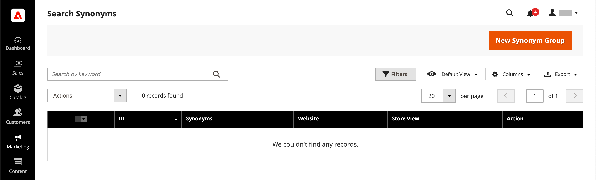
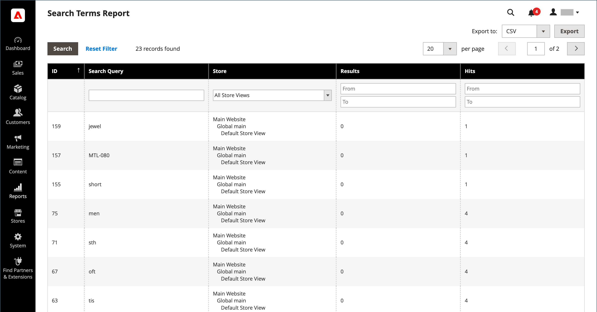

# Gestion des termes de recherche

La [page d’entrée](../content-design/pages.md) d’un terme de recherche peut être une page de contenu, une page de catégorie, une page de détails de produit ou même une page sur un autre site.

Utilisez les termes de recherche pour capturer les fautes d’orthographe courantes et les rediriger vers la page appropriée. Par exemple, si vous vendez des meubles de terrasse en fer forgé, vous savez que de nombreuses personnes confondent le terme avec le terme _fer à repasser_, ou même avec le terme _fer à repasser_. Vous pouvez saisir chaque mot mal orthographié comme terme de recherche et en faire des synonymes pour _fer forgé_. Même si le mot est mal orthographié, la recherche est dirigée vers la page pour le fer forgé.

Vous pouvez également découvrir ce que recherchent vos clients en examinant les termes de recherche qu’ils utilisent pour trouver des produits dans votre boutique. Si suffisamment de personnes recherchent un produit qui ne figure pas dans votre catalogue, cela peut indiquer une opportunité de vente. Pendant ce temps, plutôt que de les laisser vides, vous pouvez les rediriger vers un autre produit de votre catalogue.

## Ajout de termes de recherche

À mesure que vous découvrez les nouveaux mots que les visiteurs utilisent pour effectuer des recherches dans votre boutique, vous pouvez les ajouter à votre liste de termes de recherche afin d’orienter les personnes vers les produits qui correspondent le mieux à votre catalogue.

{width="700" zoomable="yes"}

| Colonne | Description |
|--- |--- |
| [!UICONTROL Search Query] | Requête utilisée pour effectuer la recherche. |
| [!UICONTROL Store] | Magasin dans lequel la requête de recherche a été appliquée. |
| [!UICONTROL Results] | Nombre de résultats trouvés par requête. |
| [!UICONTROL Uses] | Nombre d’utilisations. |
| [!UICONTROL Redirect URL] | URL de la page cible vers laquelle l’utilisateur a été redirigé après avoir effectué la recherche. |
| [!UICONTROL Suggested Terms] | Détermine si le résultat de la requête affiche les termes suggérés. |
| [!UICONTROL Actions] | Ouvre le produit en mode d’édition. |

{style="table-layout:auto"}

>[!NOTE]
>
>Le nombre de résultats est mis à jour chaque fois qu’un acheteur exécute une recherche à l’aide de cette requête de recherche. Elle n’est pas mise à jour si l’un des produits est modifié ou supprimé.

### Ajout d’un terme de recherche

1. Sur la barre latérale _Admin_, accédez à **[!UICONTROL Marketing]** > _[!UICONTROL SEO & Search]_>**[!UICONTROL Search Terms]**.

1. Cliquez sur **[!UICONTROL Add New Search Term]**.

   {width="600" zoomable="yes"}

1. Sous _[!UICONTROL General Information]_dans la zone **[!UICONTROL Search Query]**, saisissez le mot ou l’expression à ajouter comme nouveau terme de recherche.

1. Si votre boutique est disponible en plusieurs langues, choisissez la vue **[!UICONTROL Store]** applicable.

1. Pour rediriger les résultats de la recherche vers une autre page de votre magasin ou vers un autre site web, saisissez l’URL complète de la page cible dans le champ **[!UICONTROL Redirect URL]** .

1. Si vous souhaitez que ce terme puisse être utilisé comme suggestion chaque fois qu’une recherche ne renvoie aucun résultat, définissez **[!UICONTROL Display in Suggested Terms]** sur `Yes`.

1. Une fois l’opération terminée, cliquez sur **[!UICONTROL Save Search]**.

## Modification d’un terme de recherche

1. Dans la grille _[!UICONTROL Search Terms]_, cliquez sur la ligne d’un enregistrement pour ouvrir le terme de recherche en mode d’édition.

1. Effectuez les modifications nécessaires.

1. Une fois l’opération terminée, cliquez sur **[!UICONTROL Save Search]**.

## Suppression d’un terme de recherche

Il existe deux méthodes pour supprimer un terme de recherche : la grille et la page d’édition.

**Méthode 1 :** Dans la grille _[!UICONTROL Search Terms]_

1. Dans la liste, cochez la case du terme à supprimer.

1. Dans le coin supérieur gauche de la liste, définissez **[!UICONTROL Actions]** sur `Delete`.

1. Une fois l’opération terminée, cliquez sur **[!UICONTROL Submit]**.

**Méthode 2 :** Sur la page _[!UICONTROL Edit a Search Term]_

1. Sur la barre latérale _Admin_, accédez à **[!UICONTROL Marketing]** > _[!UICONTROL SEO & Search]_>**[!UICONTROL Search Terms]**.

1. Recherchez le terme de recherche à supprimer et ouvrez-le en mode d’édition.

1. Cliquez sur **[!UICONTROL Delete Search]**.

1. Pour confirmer l’action, cliquez sur **[!UICONTROL OK]**.

## Termes de recherche populaires

Le lien _Termes de recherche_ dans le pied de page de votre boutique affiche les termes de recherche utilisés par les visiteurs de votre boutique, classés par popularité. Les termes de recherche apparaissent au format _nuage de balises_, où la taille du texte indique la popularité du terme.

Par défaut, les termes de recherche populaire sont activés en tant qu’outil d’optimisation du moteur de recherche, mais n’ont aucune connexion directe au processus de recherche catalogue. La page Termes de recherche étant indexée par les moteurs de recherche, tous les termes de la page peuvent améliorer le classement de votre moteur de recherche et la visibilité de votre boutique. L’URL de la page Termes de recherche populaires est : `mystore.com/search/term/popular/`

{width="600" zoomable="yes"}

**_Pour configurer les termes de recherche populaires :_**

1. Sur la barre latérale _Admin_, accédez à **[!UICONTROL Stores]** > _[!UICONTROL Settings]_>**[!UICONTROL Configuration]**.

1. Dans le panneau de gauche, développez **[!UICONTROL Catalog]** et sélectionnez **[!UICONTROL Catalog]** sous .

1. Développez la section  sur **[!UICONTROL Search Engine Optimization]** .

   {width="600" zoomable="yes"}

   Pour obtenir une liste détaillée de ces options, voir [Optimisation du moteur de recherche](../configuration-reference/catalog/catalog.md#search-engine-optimization) dans la _référence de configuration_.

1. Définissez **[!UICONTROL Popular Search Terms]** selon vos besoins.

   Si nécessaire, décochez la case **[!UICONTROL Use system value]** pour modifier ce paramètre.

1. Une fois l’opération terminée, cliquez sur **[!UICONTROL Save Config]**.

>[!NOTE]
>
>Vous pouvez configurer la mise en cache des [recherches de catalogue](search-configuration.md) populaires.

## Recherche de synonymes

Une façon d&#39;améliorer l&#39;efficacité de la [recherche catalogue](search-configuration.md) consiste à inclure différents termes que les personnes peuvent utiliser pour décrire le même élément. Vous ne souhaitez pas perdre une vente uniquement parce que quelqu&#39;un cherche un _sofa_, et votre produit est répertorié comme _canapé_. Vous pouvez capturer un plus large éventail de termes de recherche en saisissant _sofa_, _davenport_ et _loveseat_ comme synonymes de _couch_, puis en les redirigeant vers la même page d’entrée.

Adobe Commerce prend en charge deux solutions de gestion des synonymes différentes :

- La fonction de recherche en direct [Synonymes](https://experienceleague.adobe.com/docs/commerce-merchant-services/live-search/live-search-admin/synonyms/synonyms.html) est disponible pour les installations Adobe Commerce où la recherche en direct est installée.
- La fonctionnalité Synonymes de recherche standard (décrite dans cette page) est disponible en standard pour toutes les installations Adobe Commerce.

>[!NOTE]
>
>La fonctionnalité de synchronisation de recherche standard prête à l’emploi prend en charge les attributs de produit `name` et `sku` **_uniquement_**.

>[!IMPORTANT]
>
>La fonction de synonymes de recherche utilise uniquement une méthode de recherche de correspondance de texte intégral.

{width="700" zoomable="yes"}

### Créer un groupe de synonymes

1. Sur la barre latérale _Admin_, accédez à **[!UICONTROL Marketing]** > _[!UICONTROL SEO & Search]_>**[!UICONTROL Search Synonyms]**.

   La grille _[!UICONTROL Search Synonyms]_s’affiche. Si c’est la première fois que vous utilisez des synonymes de recherche, la grille est vide.

   {width="700" zoomable="yes"}

1. Cliquez sur **[!UICONTROL New Synonym Group]**.

   {width="700" zoomable="yes"}

1. Définissez **[!UICONTROL Scope]** sur les vues de magasin auxquelles s’appliquent les synonymes.

1. Saisissez chaque synonyme dans le groupe, séparé par une virgule. Choisissez des mots que les utilisateurs peuvent utiliser comme critères de recherche. Par exemple :

   - `sweatshirt, sweat shirt, hoodie, fleece`
   - `cell phone, mobile phone, smart phone`
   - `couch, sofa, davenport`
   - `wrought iron, rot iron, rod iron`

1. Pour fusionner ces synonymes en un groupe avec d’autres qui ont la même portée, cochez la case **[!UICONTROL Merge existing synonyms]** .

1. Une fois l’opération terminée, cliquez sur **[!UICONTROL Save Synonym Group]**.

### Modification d’un groupe de synonymes

1. Dans la grille _[!UICONTROL Search Synonyms]_, cliquez sur la ligne d’un enregistrement pour ouvrir le groupe de synonymes en mode d’édition.

1. Effectuez les modifications nécessaires.

1. Une fois l’opération terminée, cliquez sur **[!UICONTROL Save Synonym Group]**.

### Suppression d’un groupe de synonymes

Il existe deux méthodes pour supprimer un groupe de synonymes : à partir de la grille et sur la page d’édition.

**Méthode 1 :** dans la grille Synonymes de recherche

1. Dans la grille _[!UICONTROL Search Synonyms]_, cochez la case du groupe à supprimer.

1. Dans le coin supérieur gauche de la liste, définissez **[!UICONTROL Actions]** sur `Delete`.

1. Une fois l’opération terminée, cliquez sur **[!UICONTROL Submit]**.

**Méthode 2 :** Sur la page Modifier un groupe de synchronisation

1. Dans la grille Search Synonymes , cliquez sur la ligne d’un enregistrement pour ouvrir le groupe de synonymes en mode d’édition.

1. Cliquez sur **[!UICONTROL Delete Synonym Group]**.

1. Lorsque vous y êtes invité, confirmez la suppression du groupe.

## Rapport Termes de recherche

Le rapport Termes de recherche indique le nombre de résultats pour chaque terme et le nombre de fois (accès) où le terme a été utilisé. Les données du rapport peuvent être filtrées par terme, par magasin, par résultats et par accès, puis exportées pour une analyse plus approfondie.

### Afficher le rapport

1. Sur la barre latérale _Admin_, accédez à **[!UICONTROL Reports]** > _[!UICONTROL Marketing]_>**[!UICONTROL Search Terms]**.

1. Utilisez les contrôles pour filtrer le rapport selon vos besoins.

   {width="700" zoomable="yes"}

## Exporter le rapport

1. Pour **[!UICONTROL Export to]**, choisissez un format d’exportation :

   - `CSV` - Fichier de valeur séparé par des virgules contenant des données de texte brut
   - `Excel XML` - Format de données de feuille de calcul XML

1. Cliquez sur **[!UICONTROL Export]**.

   Le fichier généré est automatiquement enregistré dans le dossier désigné pour les téléchargements.

### Colonnes de rapport

| Colonne | Description |
|--- |--- |
| [!UICONTROL ID] | Identifiant numérique unique généré pour la saisie de terme de recherche. |
| [!UICONTROL Search Query] | Requête utilisée pour effectuer la recherche |
| [!UICONTROL Store] | Magasin dans lequel la requête de recherche a été appliquée |
| [!UICONTROL Results] | Nombre de résultats |
| [!UICONTROL Hits] | Nombre d’utilisations |

{style="table-layout:auto"}
