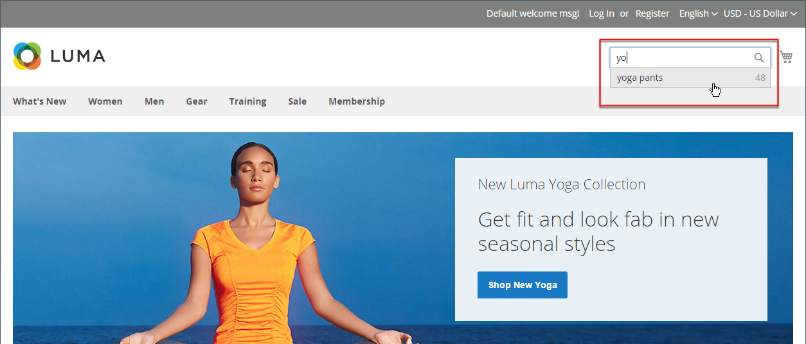

# Présentation de la recherche catalogue

>[!TIP]
>
>[[!DNL Live Search]](https://experienceleague.adobe.com/docs/commerce/live-search/overview.html?lang=fr) offre une expérience de recherche rapide, très pertinente et intuitive et est disponible gratuitement pour Adobe Commerce. Cette section décrit les fonctionnalités de recherche standard qui peuvent être différentes de [!DNL Live Search].

Les recherches montrent que les personnes qui utilisent la recherche sont plus susceptibles de faire un achat que les clients qui dépendent uniquement de la navigation. En fait, selon certaines études, les gens qui utilisent le référencement sont près de deux fois plus susceptibles de faire un achat.

Les sections suivantes décrivent les fonctionnalités de base de la recherche catalogue. Pour plus d’informations sur la configuration et la personnalisation des fonctionnalités de recherche catalogue native, voir :

- [Configuration de la recherche catalogue](search-configuration.md)
- [Résultats de la recherche](search-results.md)
- [Gestion des termes de recherche](search-terms.md)

>[!NOTE]
>
>La fonctionnalité de recherche native de Commerce fournit des résultats de recherche correspondant exactement. Bien que [!DNL Live Search], un module facultatif disponible pour l’installation et l’activation dans Adobe Commerce, soit implémenté différemment et que le résultat ne se limite pas à la chaîne de recherche exacte. Par exemple, lorsque vous avez dix produits étiquetés numériquement pour _Omega_ : une recherche de `Omega 1` donne une correspondance unique pour _Omega 1_ avec la fonctionnalité de recherche native. Mais la même chaîne de recherche optimisée par Live Search génère une correspondance pour plusieurs éléments, _Omega 1_ et _Omega 10_.

## Recherche rapide

>[!NOTE]
>
>Lorsque [[!DNL Live Search]](https://experienceleague.adobe.com/fr/docs/commerce/live-search/overview) est installé et que le widget [[!DNL Storefront Popover]](https://experienceleague.adobe.com/fr/docs/commerce/live-search/live-search-storefront/storefront-popover) est activé, la zone de recherche renvoie « rechercher au fur et à mesure que vous tapez » dans une fenêtre contextuelle.

La zone de recherche située dans l’en-tête du magasin permet aux visiteurs de trouver les produits de votre catalogue. Le texte de recherche peut être le nom complet ou partiel du produit ou tout autre mot ou expression qui décrit le produit. Les termes de recherche que les personnes utilisent pour trouver des produits peuvent être gérés à partir de l’administrateur.

1. Par **[!UICONTROL Search]**, le client saisit les premières lettres de ce qu’il souhaite trouver.

   Toutes les correspondances du catalogue s’affichent ci-dessous, avec le nombre de résultats trouvés.

1. Le client appuie sur la touche Entrée ou clique sur un résultat dans la liste des produits correspondants.

   {width="700" zoomable="yes"}

## Recherche avancée

>[!NOTE]
>
>La fonctionnalité de recherche avancée de formulaires décrite ici ne s’applique pas aux [[!DNL Live Search]](https://experienceleague.adobe.com/docs/commerce/live-search/overview.html?lang=fr).

La recherche avancée permet aux acheteurs de rechercher dans le catalogue en fonction des valeurs saisies dans un formulaire. Comme le formulaire contient plusieurs champs, une seule recherche peut inclure plusieurs paramètres. Le résultat est une liste de tous les produits du catalogue qui correspondent aux critères. Un lien vers la Recherche avancée se trouve dans le pied de page de votre boutique.

{width="700" zoomable="yes"}

Chaque champ du formulaire correspond à un attribut de votre catalogue de produits. Pour ajouter un champ, définissez les propriétés frontend de l’attribut sur `Include in Advanced Search`. Il est recommandé d’inclure uniquement les champs que les clients sont les plus susceptibles d’utiliser pour trouver un produit, car un nombre trop élevé ralentit la recherche.

1. Dans le pied de page du magasin, le client clique sur **[!UICONTROL Advanced Search]**.

1. Dans le formulaire _Recherche avancée_, ajoute des valeurs complètes ou partielles dans autant de champs que nécessaire.

1. Clique sur **[!UICONTROL Search]** pour afficher les résultats.

   {width="700" zoomable="yes"}

1. S’il ne voit pas ce qu’il recherche dans les résultats de la recherche, le client clique sur **[!UICONTROL Modify your search]** et tente une autre combinaison de critères.
