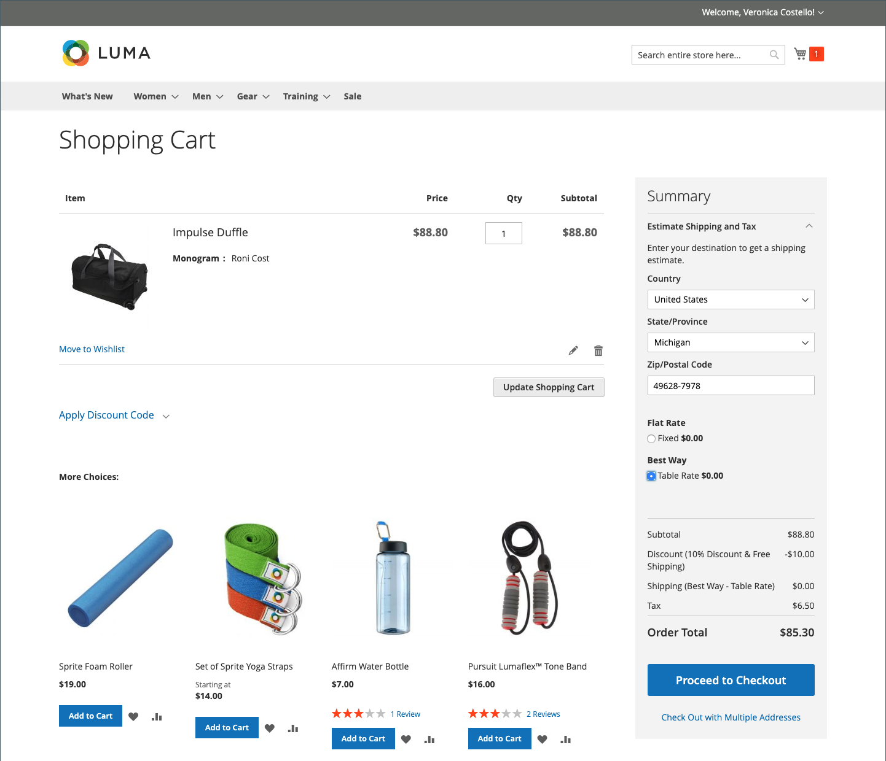
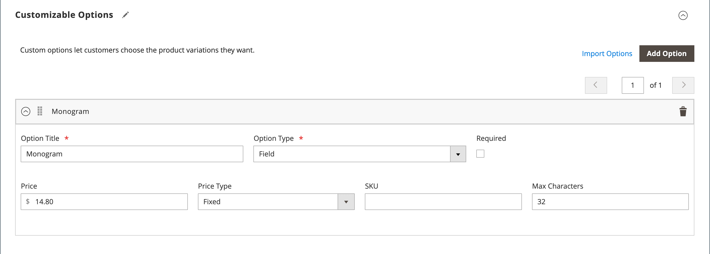

# Paramètres du produit - [!UICONTROL Customizable Options]

L’ajout d’options personnalisables à un produit est un moyen facile d’offrir une sélection d’options avec des types d’entrée de texte, de sélection et de date. Les options personnalisables sont une bonne solution si vos besoins en matière d&#39;inventaire sont simples. Cependant, étant donné qu’elles sont basées sur des variations d’un seul SKU, elles ne peuvent pas être utilisées pour gérer les stocks ou comme base des conditions de règle de prix. Si plusieurs produits comportent les mêmes options, vous pouvez configurer un produit et importer les options dans les autres produits.

Lorsqu’un client achète un produit avec une option personnalisable, une description de chaque option sélectionnée s’affiche sous la description du produit et toute balise (ou markdown) associée est automatiquement appliquée au prix de l’article.

{width="700" zoomable="yes"}

Si une règle de prix de panier est déclenchée par l’achat, le calcul initial s’applique d’abord au prix du produit et ensuite au prix de la ligne, avec tout ajustement pour les options personnalisables applicables. Dans l’exemple suivant, le client achète un sac de voyage pour 74 $, ainsi qu’une option personnalisable pour un monogramme. Une majoration de 14,80 $ est appliquée au prix de base du produit, et le prix rajusté est indiqué comme 88,80 $. Dans ce cas, l’achat du sac de voyage déclenche une règle de prix du panier basée sur le SKU du produit et applique une remise à l’achat, ainsi qu’une livraison gratuite. Bien que la règle de prix du panier ne soit pas déclenchée par l’option personnalisable , elle applique la remise au contenu du panier, qui inclut le balisage de l’option personnalisable.

{width="700" zoomable="yes"}

>[!NOTE]
>
>Une remise de règle de prix catalogue n&#39;est pas appliquée aux options personnalisables de prix fixe.

## Création d’options personnalisables

1. Ouvrez le produit en mode d’édition.

1. Faites défiler vers le bas et développez  la section _[!UICONTROL Customizable Options]_.

1. Cliquez sur **[!UICONTROL Add Option]**.

   {width="600" zoomable="yes"}

1. Définissez les nouveaux paramètres d’option :

   - Par **[!UICONTROL Option Title]**, saisissez un nom pour l’option.

   - Définissez la **[!UICONTROL Option Type]** pour le type de saisie de données.

   - Si l’option n’est pas obligatoire pour acheter le produit, décochez la case **[!UICONTROL Required]** .

1. Renseignez les champs en fonction du type de saisie :

   - Par **[!UICONTROL Title]**, saisissez un nom pour cette option.

   - (Facultatif) Par **[!UICONTROL Price]**, saisissez une majoration ou un markdown du prix de base du produit qui s’applique à cette option.

   - Définissez **[!UICONTROL Price Type]** sur l’une des options suivantes :

      - `Fixed` - Le prix de la variation diffère du prix du produit de base d’un montant monétaire fixe, tel que 1 $.
      - `Percentage` - Le prix de la variation diffère du prix du produit de base d’un pourcentage, tel que 10 %.

   - (Facultatif) Saisissez un **[!UICONTROL SKU]** pour l’option. Le SKU d’option est un suffixe ajouté au SKU du produit.

   - Si le _[!UICONTROL Option Type]_est `File`, définissez les paramètres du fichier . Par **[!UICONTROL Compatible File Extensions]**, saisissez les extensions valides sous la forme de valeurs séparées par des virgules (telles que `png, jpg, gif`). Par **[!UICONTROL Maximum Image Size]**, saisissez la taille maximale de l’image en pixels. S’il s’agit d’une entrée de texte, saisissez la valeur maximale de **[!UICONTROL Maximum Characters]**.

   {width="600" zoomable="yes"}

1. (Facultatif) Si vous souhaitez ajouter une autre option personnalisable, cliquez sur **[!UICONTROL Add Option]**.

   - Renseignez les paramètres comme précédemment.

   - Pour modifier l’ordre des options, cliquez sur l’icône _[!UICONTROL Order]_ et faites glisser l’option vers un nouvel emplacement dans la liste.

   Répétez cette étape pour chaque option à ajouter.

1. Cliquez ensuite sur **[!UICONTROL Save]**.

## Importer des options personnalisables

1. Dans la section _Options personnalisables_, cliquez sur **[!UICONTROL Import Options]**.

1. Tous les produits dotés d’options personnalisables s’affichent dans la grille.

1. Dans la liste, cochez la case du produit avec les options que vous souhaitez importer.

1. Cliquez sur **[!UICONTROL Import]**.

1. Une fois l’opération terminée, vous pouvez continuer à ajouter d’autres options personnalisées ou cliquer sur **[!UICONTROL Save and Close]**.

## Types d’entrée

| Type | Description |
|---------------------|---------------|
| [!UICONTROL Text] | Une ligne de saisie ou une zone de texte dans laquelle le client peut saisir les informations requises. Options : **[!UICONTROL Field]**- Champ de saisie d’une seule ligne pour le texte. **[!UICONTROL Area]** - Champ de saisie multiligne. Ce type ne prend pas en charge la mise en forme avancée comme HTML. Utilisez Caractères max. pour limiter la longueur du texte pouvant être saisi et garantir une représentation correcte du texte saisi dans l’administration. |
| [!UICONTROL File] | Permet au client de charger un fichier. |
| [!UICONTROL Select] | Permet au client de sélectionner une ou plusieurs options, selon le type d’entrée utilisé. Options :  **[!UICONTROL Drop-down]**- Une liste déroulante d’options qui n’autorise qu’une seule sélection. **[!UICONTROL Radio Buttons]** - Ensemble d’options qui n’autorise qu’une seule sélection. **[!UICONTROL Checkbox]**- Une case à cocher est une variante d’une option oui/non. Si le produit comporte plusieurs cases à cocher, plusieurs sélections peuvent être effectuées. **[!UICONTROL Multiple Select]** : une zone de liste déroulante d’options qui accepte plusieurs sélections. Pour choisir plusieurs options, maintenez la touche Ctrl (PC) ou Commande (Mac) enfoncée et cliquez sur chaque option. |
| [!UICONTROL Date] | Permet au client de saisir une date ou une heure ou de choisir la valeur dans un calendrier. Options :  **[!UICONTROL Date]**- Champ de saisie d’une valeur de date. La date peut être saisie directement dans le champ ou sélectionnée dans une liste ou un calendrier. La méthode et le format d’entrée sont déterminés par la configuration [options de date et d’heure](attributes-input-types.md#date-and-time-options). **[!UICONTROL Date & Time]** - Champ de saisie d’une valeur de date et d’heure. **[!UICONTROL Time]**- Champ de saisie d’une valeur temporelle. |

{style="table-layout:auto"}
